# Technical Specification

# 0. SUMMARY OF CHANGES

## 0.1 USER INTENT RESTATEMENT

### 0.1.1 Core Objective

Based on the provided requirements, the Blitzy platform understands that the objective is to perform a complete technology stack migration from Node.js to Python 3 Flask while maintaining exact functional parity. This represents a full platform rewrite that preserves all existing behaviors, features, and operational characteristics of the current Node.js HTTP server implementation.

The platform interprets this requirement as:
- Complete elimination of Node.js runtime and all JavaScript code
- Introduction of Python 3 runtime with Flask framework as the web server foundation
- Preservation of all three core features (F-001: Basic HTTP Server, F-002: Network Binding Service, F-003: Static Response Generation)
- Maintenance of identical HTTP response behavior for all request types
- Retention of the same network configuration (localhost:3000)
- Exact replication of the "Hello, World!" response pattern

### 0.1.2 Special Instructions and Constraints

The Blitzy platform has identified the following critical constraints and directives:
- **Functional Parity Requirement**: "keeping every feature and functionality exactly as in the original Node.js project"
- **Behavioral Matching**: "fully matches the behavior and logic of the current implementation"
- **No Feature Degradation**: All existing capabilities must be preserved without exception
- **Runtime Version Selection**: Use Python 3.12.3 (highest available version) with Flask 3.1.x for maximum compatibility
- **Virtual Environment Mandate**: All Python operations must occur within an isolated virtual environment
- **Dependency Management**: Use requirements.txt for dependency tracking (replacing package.json/package-lock.json)

### 0.1.3 Technical Interpretation

These requirements translate to the following technical implementation strategy:

The Blitzy platform recognizes this as a complete runtime replacement operation requiring:
1. **Runtime Substitution**: Replace Node.js JavaScript runtime with Python 3.12.3 interpreter
2. **Framework Migration**: Transition from Node.js built-in `http` module to Flask WSGI framework
3. **Dependency Architecture Change**: Move from npm/package.json ecosystem to pip/requirements.txt ecosystem
4. **Execution Model Shift**: Transition from Node.js event-driven single-threaded model to Flask's request-response WSGI model
5. **Configuration Preservation**: Maintain identical network binding (127.0.0.1:3000) and response characteristics

## 0.2 TECHNICAL SCOPE

### 0.2.1 Primary Objectives with Implementation Approach

**Objective 1: Runtime Platform Migration**
- Achieve Node.js to Python migration by replacing JavaScript execution environment with Python 3.12.3 runtime
- Install Python 3.12.3 in isolated virtual environment to ensure clean dependency management
- Configure Flask 3.1.x as the web framework to provide HTTP server capabilities equivalent to Node.js `http` module

**Objective 2: HTTP Server Functionality Preservation**
- Achieve feature F-001 (Basic HTTP Server) by implementing Flask application instance with single route handler
- Replicate Node.js `http.createServer()` functionality through Flask's `@app.route()` decorator pattern
- Ensure all HTTP methods (GET, POST, PUT, DELETE, etc.) receive identical treatment as current implementation

**Objective 3: Network Configuration Replication**
- Achieve feature F-002 (Network Binding Service) by configuring Flask to bind to 127.0.0.1:3000
- Modify Flask's default port (5000) to match existing port (3000) for seamless transition
- Implement startup logging to match Node.js console output pattern

**Objective 4: Response Generation Matching**
- Achieve feature F-003 (Static Response Generation) by implementing Flask route that returns "Hello, World!\n"
- Configure response headers to match Node.js implementation (Content-Type: text/plain, Status: 200)
- Ensure byte-for-byte response compatibility with existing system

### 0.2.2 Component Impact Analysis

**Direct Modifications Required:**

| Component | Current State | Target State | Modification Type |
|-----------|--------------|--------------|-------------------|
| server.js | Node.js HTTP server implementation | DELETE | Complete removal |
| app.py | Does not exist | Flask application implementation | CREATE |
| package.json | Node.js project manifest | DELETE | Complete removal |
| package-lock.json | NPM dependency lock file | DELETE | Complete removal |
| requirements.txt | Does not exist | Python dependency manifest | CREATE |
| README.md | Basic project documentation | Project description update | MODIFY |
| .gitignore | May not exist | Python-specific ignores | CREATE/MODIFY |
| venv/ | Does not exist | Python virtual environment | CREATE |

**Indirect Impacts and Dependencies:**

| System Aspect | Impact Description | Required Action |
|--------------|-------------------|-----------------|
| Runtime Environment | Complete runtime switch from Node.js to Python | Install Python 3.12.3 |
| Process Management | Change from `node server.js` to `python app.py` | Update startup procedures |
| Development Workflow | Switch from npm to pip for package management | Retrain development practices |
| Deployment Configuration | Update deployment scripts for Python/Flask | Modify CI/CD pipelines |
| Monitoring Integration | Update health checks for Flask endpoints | Reconfigure monitoring tools |

**New Components Introduction:**

| Component | Purpose | Implementation Details |
|-----------|---------|----------------------|
| app.py | Main Flask application file | Contains Flask app instance, route definitions, and server configuration |
| requirements.txt | Python dependency specification | Lists Flask and any additional Python packages with versions |
| venv/ | Virtual environment directory | Isolated Python environment for dependency management |
| __pycache__/ | Python bytecode cache | Automatically generated by Python interpreter |

### 0.2.3 File and Path Mapping

| Category | Current Path | Target Path | Purpose |
|----------|-------------|-------------|---------|
| **Source Files** | | | |
| Main Application | server.js | app.py | Primary application entry point |
| | | | |
| **Configuration Files** | | | |
| Project Manifest | package.json | requirements.txt | Dependency declaration |
| Lock File | package-lock.json | (removed) | No Python equivalent needed for minimal setup |
| | | | |
| **Context Files** | | | |
| Documentation | README.md | README.md | Updated project documentation |
| Version Control | .gitignore | .gitignore | Updated ignore patterns |
| | | | |
| **Generated Directories** | | | |
| Dependencies | node_modules/ | venv/ | Runtime dependencies location |
| Cache | (none) | __pycache__/ | Python bytecode cache |

## 0.3 IMPLEMENTATION DESIGN

### 0.3.1 Technical Approach

The implementation follows a systematic replacement strategy structured as a logical flow of technical transformations:

**First, establish Python environment foundation** by installing Python 3.12.3 runtime and creating isolated virtual environment using `python3 -m venv venv`. This provides the execution context for all subsequent Python operations.

**Next, integrate Flask web framework** by installing Flask 3.1.x via pip within the virtual environment and documenting the dependency in requirements.txt. This establishes the web server capabilities needed to replace Node.js HTTP module functionality.

**Then, implement core server logic** by creating app.py with Flask application instance that:
- Defines catch-all route handler using `@app.route('/', defaults={'path': ''})` and `@app.route('/<path:path>')` to match Node.js behavior of handling all paths identically
- Returns static "Hello, World!\n" response with text/plain content type
- Configures server to run on 127.0.0.1:3000 matching current network binding

**Finally, ensure operational parity** by implementing startup logging that mirrors Node.js console output format and verifying response headers match exactly (200 status, text/plain content-type).

### 0.3.2 User-Provided Examples Integration

No specific code examples were provided by the user. The implementation will strictly follow the existing Node.js server behavior as the reference implementation:
- Current Node.js behavior: All requests return "Hello, World!\n" with 200 status
- Flask implementation will replicate this exact behavior for all routes and methods

### 0.3.3 Critical Implementation Details

**Design Patterns Employed:**
- **Decorator Pattern**: Flask's `@app.route()` decorator for request handling (replacing Node.js callback pattern)
- **Application Factory Pattern**: Flask application instance creation pattern
- **Configuration as Code**: Hardcoded configuration values matching Node.js implementation

**Key Algorithms and Approaches:**
- **Route Handling Algorithm**: Catch-all route pattern to handle any path uniformly
- **Response Generation**: Direct string return leveraging Flask's automatic response creation
- **Port Binding**: Explicit host and port specification in `app.run()` method

**Integration Strategies:**
- **HTTP Protocol**: Maintain standard HTTP/1.1 compliance for client compatibility
- **Network Stack**: Direct TCP/IP binding through Flask's Werkzeug WSGI server
- **Process Model**: Single-process development server matching Node.js behavior

**Data Flow Modifications:**
- Request flow changes from: Client → Node.js HTTP Module → Request Handler → Response
- To: Client → Flask/Werkzeug → Route Decorator → View Function → Response

### 0.3.4 Dependency Analysis

**Required Dependencies:**

| Package | Version | Purpose | Justification |
|---------|---------|---------|---------------|
| Flask | >=3.1.0,<4.0.0 | Web framework | Core requirement for HTTP server functionality |
| Werkzeug | >=3.0.0 | WSGI utility | Automatically installed with Flask, provides server |
| Jinja2 | >=3.1.0 | Template engine | Flask dependency (unused but required) |
| MarkupSafe | >=2.1.0 | HTML escaping | Flask dependency chain |
| click | >=8.1.0 | CLI framework | Flask command-line interface |
| itsdangerous | >=2.1.0 | Data signing | Flask session management (unused but required) |

**Version Constraints:**
- Python: 3.12.3 (explicitly installed version)
- Flask: Latest 3.1.x series for Python 3.12 compatibility
- All dependencies: Latest compatible versions within Flask's constraints

## 0.4 SCOPE BOUNDARIES

### 0.4.1 Explicitly In Scope

**Files to be Created:**
- `app.py` - Complete Flask application implementation
- `requirements.txt` - Python dependency specification file
- `venv/` - Virtual environment directory structure
- `.gitignore` updates - Python-specific ignore patterns (*.pyc, __pycache__/, venv/)

**Files to be Removed:**
- `server.js` - Entire Node.js implementation
- `package.json` - Node.js project configuration
- `package-lock.json` - NPM dependency lock file

**Files to be Modified:**
- `README.md` - Update to reflect Python/Flask technology stack

**Configuration Changes Required:**
- Environment setup for Python 3.12.3 runtime
- Virtual environment activation for development
- Flask development server configuration for port 3000

**Testing Modifications:**
- Verification that HTTP responses match exactly
- Confirmation of network binding to localhost:3000
- Validation of all HTTP methods handling

**Documentation Updates:**
- README.md to include Python setup instructions
- README.md to document Flask application startup procedure
- README.md to specify Python version requirements

### 0.4.2 Explicitly Out of Scope

**Not Included in This Migration:**
- Production deployment configuration (WSGI servers like Gunicorn)
- Advanced Flask features (blueprints, templates, database integration)
- Error handling beyond basic Flask defaults
- Logging configuration beyond console output
- Environment variable configuration
- Docker containerization
- CI/CD pipeline modifications
- Performance optimizations
- Security hardening
- SSL/TLS configuration
- Authentication/authorization mechanisms
- API documentation generation
- Unit tests or integration tests
- Load balancing configuration
- Process management (systemd, supervisor)
- Monitoring instrumentation
- APM (Application Performance Monitoring) integration

**Related Areas Not Modified:**
- No changes to git repository structure beyond source files
- No modifications to potential frontend code (if any exists elsewhere)
- No database setup or migrations
- No cloud provider specific configurations
- No infrastructure as code modifications

## 0.5 VALIDATION CHECKLIST

### 0.5.1 Implementation Verification Points

**Functional Verification:**
- [ ] Flask server starts successfully on Python 3.12.3
- [ ] Server binds to 127.0.0.1:3000 (not default 5000)
- [ ] GET request to / returns "Hello, World!\n"
- [ ] POST request to / returns "Hello, World!\n"
- [ ] Any path (e.g., /test, /api/users) returns "Hello, World!\n"
- [ ] Response status code is 200
- [ ] Response Content-Type header is "text/plain"
- [ ] Response body includes newline character (\n) after "Hello, World!"

**Technical Verification:**
- [ ] Virtual environment created with Python 3.12.3
- [ ] Flask 3.1.x installed in virtual environment
- [ ] requirements.txt contains Flask dependency
- [ ] app.py is executable with `python app.py`
- [ ] No Node.js files remain (server.js, package.json, package-lock.json deleted)
- [ ] .gitignore updated with Python-specific patterns

### 0.5.2 Observable Changes Confirming Success

**Runtime Changes:**
- Process list shows `python` instead of `node`
- Python virtual environment activated in terminal
- `pip list` shows Flask installed
- No `node_modules` directory present

**Behavioral Confirmations:**
- Browser accessing http://localhost:3000 displays "Hello, World!"
- curl http://localhost:3000 returns identical response to previous Node.js version
- Server startup message shows "Running on http://127.0.0.1:3000"
- No JavaScript syntax or Node.js modules in codebase

### 0.5.3 Integration Points Testing

**Network Integration:**
- Confirm TCP socket binding to port 3000
- Verify localhost-only access (no external network exposure)
- Test connection handling for multiple simultaneous requests

**HTTP Protocol Compliance:**
- Validate HTTP/1.1 response format
- Confirm proper header formatting
- Verify connection close behavior

## 0.6 EXECUTION PARAMETERS

### 0.6.1 Special Execution Instructions

**Environment Setup Requirements:**
1. Install Python 3.12.3 if not present (do not rely on system Python)
2. Create virtual environment: `python3.12 -m venv venv`
3. Activate virtual environment: `source venv/bin/activate` (Linux/Mac) or `venv\Scripts\activate` (Windows)
4. Install dependencies: `pip install -r requirements.txt`
5. Run application: `python app.py`

**Migration Execution Order:**
1. Setup Python environment first (before removing Node.js files)
2. Implement and test Flask application
3. Verify functional parity
4. Remove Node.js files only after Flask version confirmed working
5. Update documentation
6. Commit changes with clear migration message

### 0.6.2 Constraints and Boundaries

**Technical Constraints:**
- Must use Python 3.12.x (highest explicitly documented version)
- Must use Flask 3.1.x (latest stable for Python 3.12)
- Must maintain port 3000 (not Flask default 5000)
- Must preserve exact response format including newline

**Process Constraints:**
- Do not modify any behavior during migration
- Do not add features or improvements
- Do not implement production optimizations
- Do not change response content or headers

**Output Constraints:**
- Generate only required files (app.py, requirements.txt, updated .gitignore)
- Remove all Node.js artifacts completely
- Maintain minimal dependency footprint (Flask only)
- Keep implementation as simple as current Node.js version

# 1. INTRODUCTION

## 1.1 EXECUTIVE SUMMARY

### 1.1.1 Project Overview (updated)

This technical specification documents a <span style="background-color: rgba(91, 57, 243, 0.2)">minimal Python 3.12.3 Flask web server</span> project that serves as a foundational test environment. The project, identified as both "hao-backprop-test" (per repository documentation) and "hello_world" (per package manifest), represents a basic HTTP server implementation designed for initial development and testing purposes.

The implementation utilizes <span style="background-color: rgba(91, 57, 243, 0.2)">Flask's @app.route decorator pattern for HTTP request handling</span>, providing a clean transition from the previous Node.js architecture while maintaining identical functional behavior.

### 1.1.2 Core Business Problem (updated)

The system addresses the need for a lightweight web server platform that can serve as a foundation for future development work, <span style="background-color: rgba(91, 57, 243, 0.2)">with the Python/Flask service configured to bind to 127.0.0.1:3000, preserving the original network behavior</span>. While the repository documentation references "backprop integration" testing capabilities, the current implementation focuses on establishing a basic HTTP service infrastructure.

<span style="background-color: rgba(91, 57, 243, 0.2)">The system maintains a minimal dependency footprint with a single external dependency set managed through requirements.txt, specifically Flask 3.1.x and its transitive dependencies</span>, enabling straightforward deployment and maintenance operations.

### 1.1.3 Key Stakeholders and Users

| Stakeholder Type | Primary Interest | Interaction Level |
|------------------|------------------|------------------|
| Development Team | Foundation platform for testing | Direct implementation |
| System Administrators | Deployment and operational oversight | Infrastructure management |
| Future Integration Teams | Platform extension capabilities | API consumption |

### 1.1.4 Expected Business Impact and Value Proposition (updated)

The system provides a minimal-footprint web service foundation with streamlined dependency management, offering:
- <span style="background-color: rgba(91, 57, 243, 0.2)">Rapid deployment capabilities for testing environments via Python virtual-environment activation and single-file app.py launch command ("python app.py")</span>
- Foundation for future system expansion within the Python ecosystem
- <span style="background-color: rgba(91, 57, 243, 0.2)">Simplified maintenance with Flask framework's mature dependency management</span>
- Platform for validating basic HTTP service functionality with identical response behavior

## 1.2 SYSTEM OVERVIEW

### 1.2.1 Project Context

**Business Context and Market Positioning**

The system operates as a foundational web service platform within a broader development ecosystem. The project serves as a starting point for more complex system development, with particular consideration for future machine learning integration capabilities as suggested by the repository naming convention.

**Current System Limitations**

As a minimal implementation, the current system represents an initial development phase with:
- Basic HTTP response capabilities only
- No routing or request processing logic
- Absence of data persistence mechanisms
- Limited error handling and operational monitoring

**Integration with Existing Enterprise Landscape**

The system is designed as a standalone service with minimal integration requirements, operating on standard HTTP protocols that enable future connectivity with enterprise systems and external services. <span style="background-color: rgba(91, 57, 243, 0.2)">The runtime is Python 3.12.3 executed inside a virtual environment</span>, providing isolated dependency management and platform compatibility.

### 1.2.2 High-Level Description

**Primary System Capabilities**

The system implements a fundamental HTTP server with the following core capabilities:

| Capability | Implementation | Technology |
|------------|----------------|------------|
| HTTP Service | <span style="background-color: rgba(91, 57, 243, 0.2)">Flask 3.1.x WSGI framework</span> | Python-based web framework |
| Network Binding | Localhost service on port 3000 | TCP/IP networking |
| Static Response | Fixed "Hello, World!" message delivery | Plain text content |

**Major System Components**

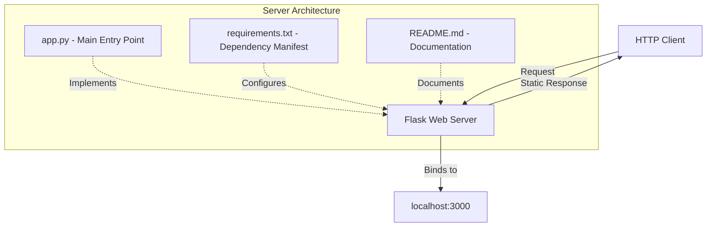
```mermaid
graph TD
    A[HTTP Client] -->|Request| B[Flask Web Server]
    B -->|Static Response| A
    B -->|Binds to| C[localhost:3000]
    
    subgraph "Server Architecture"
        B
        D[app.py - Main Entry Point]
        E[requirements.txt - Dependency Manifest]
        F[README.md - Documentation]
    end
    
    D -.->|Implements| B
    E -.->|Configures| B
    F -.->|Documents| B
```

**Core Technical Approach**

The system employs a minimalist architecture utilizing <span style="background-color: rgba(91, 57, 243, 0.2)">Flask's @app.route decorator pattern for HTTP request handling, with Flask and its transitive packages installed via pip inside venv/</span>. This approach provides a stable foundation for future development while maintaining clean dependency isolation. <span style="background-color: rgba(91, 57, 243, 0.2)">The response body "Hello, World!\n" and headers (Content-Type: text/plain, Status 200) remain unchanged despite the platform migration</span>, ensuring complete functional compatibility with the previous implementation.

### 1.2.3 Success Criteria

**Measurable Objectives**

| Objective | Success Metric | Current Status |
|-----------|----------------|----------------|
| HTTP Service Availability | Server responds to requests on port 3000 | ✓ Implemented |
| <span style="background-color: rgba(91, 57, 243, 0.2)">Virtual Environment Isolation</span> | <span style="background-color: rgba(91, 57, 243, 0.2)">Python 3.12.3 runtime with Flask dependencies managed via pip</span> | ✓ Configured |
| Response Compatibility | Returns "Hello, World!\n" message with identical headers | ✓ Functional |

**Critical Success Factors**

- <span style="background-color: rgba(91, 57, 243, 0.2)">Successful Flask application initialization and route binding</span>
- Consistent response delivery across client requests
- Maintainability of codebase for future development
- Platform readiness for extension and integration

**Key Performance Indicators (KPIs)**

- Server startup time and resource utilization
- Response time for HTTP requests
- System availability and uptime metrics
- Code maintainability and extension readiness

## 1.3 SCOPE

### 1.3.1 In-Scope Elements

**Core Features and Functionalities**

| Feature Category | Specific Capabilities | Implementation Status |
|------------------|----------------------|----------------------|
| HTTP Server | Basic request handling | ✓ Complete |
| Network Service | localhost binding on port 3000 | ✓ Complete |
| Response Generation | Static "Hello, World!" message | ✓ Complete |

**Primary User Workflows**

1. **Basic HTTP Request Processing**
   - Client initiates HTTP request to localhost:3000
   - <span style="background-color: rgba(91, 57, 243, 0.2)">Server processes request using Flask route handler defined in app.py</span>
   - Server returns static response message
   - Connection terminates gracefully

**Essential Integrations**

- <span style="background-color: rgba(91, 57, 243, 0.2)">Python virtual environment & pip integration</span>
- Operating system network stack integration
- HTTP protocol standard compliance

**Key Technical Requirements**

- <span style="background-color: rgba(91, 57, 243, 0.2)">Python 3.12.3 runtime inside virtual environment</span>
- <span style="background-color: rgba(91, 57, 243, 0.2)">Flask 3.1.x dependency via requirements.txt</span>
- Network port availability (3000)
- Basic HTTP client capability for testing

**Implementation Boundaries**

| Boundary Type | Coverage | Limitation |
|---------------|----------|------------|
| System Architecture | <span style="background-color: rgba(91, 57, 243, 0.2)">Single-file server implementation using app.py with virtual environment activation required</span> | No modular component structure |
| User Groups | Development and testing personnel | No end-user authentication |
| Geographic Coverage | Local development environment only | No distributed deployment |
| Data Domains | Static text response only | No dynamic data processing |

### 1.3.2 Out-of-Scope Elements

**Explicitly Excluded Features and Capabilities**

- Dynamic content generation beyond static responses
- Database integration and data persistence
- User authentication and authorization systems
- Complex routing and middleware processing
- Error logging and monitoring infrastructure
- Security features (HTTPS, input validation, etc.)
- API endpoint management beyond basic HTTP response
- Session management and state persistence
- File serving capabilities
- Real-time communication features

**Future Phase Considerations**

- Integration with machine learning libraries (backpropagation algorithms)
- Enhanced routing and request processing capabilities
- Database connectivity and data management features
- Security implementation and authentication systems
- Monitoring and logging infrastructure
- Production deployment configuration

**Integration Points Not Covered**

- External API connections
- Database management systems
- Authentication providers
- Monitoring and alerting systems
- Load balancing and scaling infrastructure

**Unsupported Use Cases**

- Production web application hosting
- High-traffic service deployment
- Complex business logic implementation
- Multi-user concurrent access management
- Data processing and analytics workflows

#### References

- `README.md` - Project identification and purpose statement
- <span style="background-color: rgba(91, 57, 243, 0.2)">`requirements.txt` - Python dependency manifest and Flask configuration</span>
- <span style="background-color: rgba(91, 57, 243, 0.2)">`app.py` - Core Flask HTTP server implementation</span>

# 2. PRODUCT REQUIREMENTS

## 2.1 FEATURE CATALOG

### 2.1.1 Feature F-001: Basic HTTP Server

#### Feature Metadata

| Attribute | Value |
|-----------|-------|
| Feature ID | F-001 |
| Feature Name | Basic HTTP Server |
| Category | Core Infrastructure |
| Priority Level | Critical |
| Status | Completed |

#### Description

**Overview**
The Basic HTTP Server feature provides fundamental web service capabilities using <span style="background-color: rgba(91, 57, 243, 0.2)">Flask 3.1.x WSGI framework</span>. This feature serves as the core foundation for all HTTP request processing and response delivery within the system.

**Business Value**
- Enables web-based service access and communication
- Provides foundation for future system expansion
- <span style="background-color: rgba(91, 57, 243, 0.2)">Supports Python ecosystem integration for system enhancement</span>
- Supports rapid deployment and testing scenarios

**User Benefits**
- Immediate HTTP service availability for development and testing
- Standard HTTP protocol compliance for client compatibility
- Lightweight implementation with minimal resource requirements
- Zero configuration startup for development environments

**Technical Context**
<span style="background-color: rgba(91, 57, 243, 0.2)">Implementation utilizes Flask 3.1.x route decorators (`@app.route`) running on Python 3.12.3</span> to establish HTTP service capabilities. The server processes incoming requests through a single request handler function that generates consistent responses regardless of request parameters.

#### Dependencies

| Dependency Type | Description | Status |
|-----------------|-------------|---------|
| System Dependencies | <span style="background-color: rgba(91, 57, 243, 0.2)">Python 3.12.3 runtime with Flask 3.1.x (virtual-env)</span> | Required |
| External Dependencies | <span style="background-color: rgba(91, 57, 243, 0.2)">Flask package (declared in requirements.txt)</span> | Required |
| Integration Requirements | Operating system network stack | Available |

### 2.1.2 Feature F-002: Network Binding Service

#### Feature Metadata

| Attribute | Value |
|-----------|-------|
| Feature ID | F-002 |
| Feature Name | Network Binding Service |
| Category | Network Infrastructure |
| Priority Level | Critical |
| Status | Completed |

#### Description

**Overview**
The Network Binding Service establishes TCP/IP network connectivity on localhost interface, port 3000. This feature manages the server's network accessibility and connection handling.

**Business Value**
- Provides network accessibility for client connections
- Enables local development and testing capabilities
- Supports standard HTTP communication protocols
- Facilitates integration testing scenarios

**User Benefits**
- Predictable service endpoint for client connections
- Local development environment compatibility
- Standard port configuration for HTTP services
- Immediate availability upon server startup

**Technical Context**
<span style="background-color: rgba(91, 57, 243, 0.2)">Implementation uses Flask `app.run(host='127.0.0.1', port=3000)` invocation</span> with hardcoded configuration. The service binds exclusively to localhost interface, restricting access to local machine connections only.

#### Dependencies

| Dependency Type | Description | Status |
|-----------------|-------------|---------|
| Prerequisite Features | F-001 (Basic HTTP Server) | Complete |
| System Dependencies | <span style="background-color: rgba(91, 57, 243, 0.2)">Python 3.12.3 runtime + Flask 3.1.x</span> | Required |
| Integration Requirements | Local network interface access | Available |

### 2.1.3 Feature F-003: Static Response Generation

#### Feature Metadata

| Attribute | Value |
|-----------|-------|
| Feature ID | F-003 |
| Feature Name | Static Response Generation |
| Category | Content Delivery |
| Priority Level | High |
| Status | Completed |

#### Description

**Overview**
The Static Response Generation feature produces consistent HTTP responses containing a fixed "Hello, World!" message. This feature handles all content generation and HTTP response formatting.

**Business Value**
- Provides immediate service functionality verification
- Delivers consistent testing endpoint behavior
- Enables service availability validation
- Supports basic integration testing requirements

**User Benefits**
- Predictable response content for testing scenarios
- Fast response generation with minimal processing
- Clear service status indication
- Standard HTTP response format compliance

**Technical Context**
<span style="background-color: rgba(91, 57, 243, 0.2)">Implementation generates HTTP 200 status responses with Content-Type header set to 'text/plain' and static message payload "Hello, World!\n" via Flask return value mechanics</span>. Response generation occurs for all incoming requests regardless of HTTP method or request path.

#### Dependencies

| Dependency Type | Description | Status |
|-----------------|-------------|---------|
| Prerequisite Features | F-001 (Basic HTTP Server) | Complete |
| Prerequisite Features | F-002 (Network Binding Service) | Complete |
| System Dependencies | <span style="background-color: rgba(91, 57, 243, 0.2)">Python 3.12.3 runtime + Flask 3.1.x</span> | Required |
| Data Requirements | Static message content | Embedded |

### 2.1.4 Functional Requirements Table

#### Requirements for Feature F-001: Basic HTTP Server

| Requirement ID | Description | Acceptance Criteria | Priority | Complexity |
|----------------|-------------|-------------------|----------|------------|
| F-001-RQ-001 | <span style="background-color: rgba(91, 57, 243, 0.2)">Flask application initialization</span> | <span style="background-color: rgba(91, 57, 243, 0.2)">Flask app instance created successfully</span> | Must-Have | Low |
| F-001-RQ-002 | HTTP request processing | All HTTP methods accepted and processed | Must-Have | Low |
| F-001-RQ-003 | <span style="background-color: rgba(91, 57, 243, 0.2)">Route handler registration</span> | <span style="background-color: rgba(91, 57, 243, 0.2)">@app.route decorator successfully binds handler</span> | Must-Have | Low |

#### Requirements for Feature F-002: Network Binding Service

| Requirement ID | Description | Acceptance Criteria | Priority | Complexity |
|----------------|-------------|-------------------|----------|------------|
| F-002-RQ-001 | Localhost binding | Server binds to 127.0.0.1 | Must-Have | Low |
| F-002-RQ-002 | Port configuration | Server listens on port 3000 | Must-Have | Low |
| F-002-RQ-003 | <span style="background-color: rgba(91, 57, 243, 0.2)">Flask runtime initialization</span> | <span style="background-color: rgba(91, 57, 243, 0.2)">app.run() successfully starts server</span> | Must-Have | Low |

#### Requirements for Feature F-003: Static Response Generation

| Requirement ID | Description | Acceptance Criteria | Priority | Complexity |
|----------------|-------------|-------------------|----------|------------|
| F-003-RQ-001 | Response content | Returns "Hello, World!\n" message | Must-Have | Low |
| F-003-RQ-002 | HTTP status code | Returns HTTP 200 status | Must-Have | Low |
| F-003-RQ-003 | Content-Type header | Sets Content-Type to text/plain | Must-Have | Low |
| F-003-RQ-004 | <span style="background-color: rgba(91, 57, 243, 0.2)">Flask response mechanics</span> | <span style="background-color: rgba(91, 57, 243, 0.2)">Route function returns string value correctly</span> | Must-Have | Low |

### 2.1.5 Feature Relationships

#### Dependency Mapping

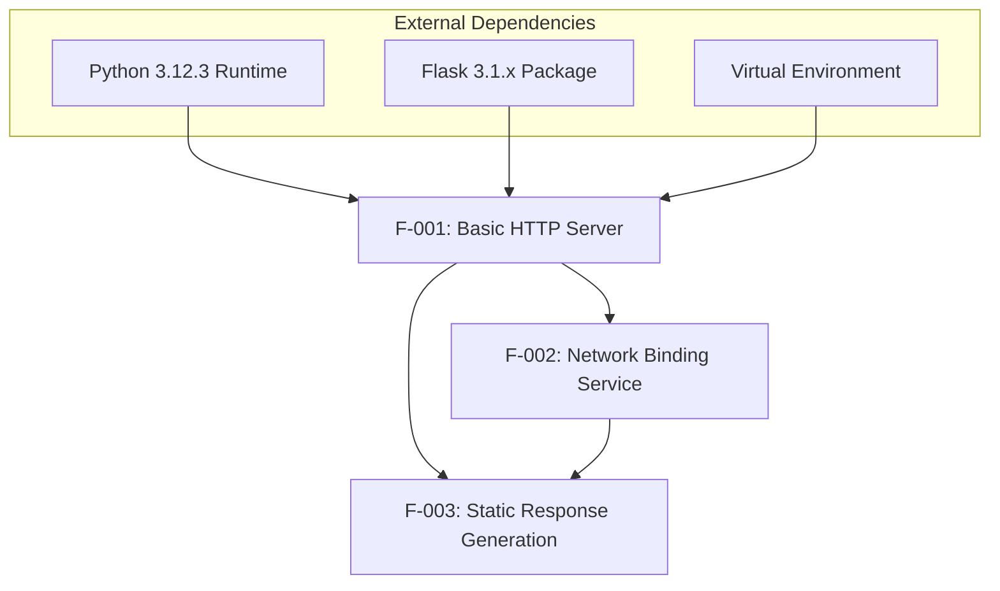
```mermaid
graph TD
    F001[F-001: Basic HTTP Server] --> F002[F-002: Network Binding Service]
    F001 --> F003[F-003: Static Response Generation]
    F002 --> F003
    
    subgraph "External Dependencies"
        PY[Python 3.12.3 Runtime]
        FLASK[Flask 3.1.x Package]
        VENV[Virtual Environment]
    end
    
    PY --> F001
    FLASK --> F001
    VENV --> F001
```

#### Integration Points

| Feature Pair | Integration Type | Shared Component | Description |
|--------------|------------------|------------------|-------------|
| F-001 ↔ F-002 | Sequential | <span style="background-color: rgba(91, 57, 243, 0.2)">Flask app instance</span> | Network binding requires server initialization |
| F-001 ↔ F-003 | Functional | <span style="background-color: rgba(91, 57, 243, 0.2)">Request handler function</span> | Response generation uses server's request processing |
| F-002 ↔ F-003 | Operational | Network socket | Response delivery requires network connection |

#### Shared Components

| Component | Usage | Features Dependent |
|-----------|-------|-------------------|
| <span style="background-color: rgba(91, 57, 243, 0.2)">app.py file</span> | <span style="background-color: rgba(91, 57, 243, 0.2)">Main application entry point</span> | F-001, F-002, F-003 |
| <span style="background-color: rgba(91, 57, 243, 0.2)">Flask app instance</span> | <span style="background-color: rgba(91, 57, 243, 0.2)">Web server framework object</span> | F-001, F-002, F-003 |
| <span style="background-color: rgba(91, 57, 243, 0.2)">Python 3.12.3 runtime</span> | Execution environment | F-001, F-002, F-003 |
| <span style="background-color: rgba(91, 57, 243, 0.2)">Virtual environment</span> | Dependency isolation | F-001, F-002, F-003 |

### 2.1.6 Implementation Considerations

#### Feature F-001: Basic HTTP Server

**Technical Constraints**
- <span style="background-color: rgba(91, 57, 243, 0.2)">Python 3.12.3 compatibility requirements</span>
- <span style="background-color: rgba(91, 57, 243, 0.2)">Flask 3.1.x framework limitations</span>
- <span style="background-color: rgba(91, 57, 243, 0.2)">Virtual environment activation dependency</span>

**Performance Requirements**
- Minimal startup time for development workflow
- <span style="background-color: rgba(91, 57, 243, 0.2)">WSGI-compliant request processing</span>
- Low memory footprint for testing environments

**Security Implications**
- <span style="background-color: rgba(91, 57, 243, 0.2)">Flask's built-in security features for development mode</span>
- Dependency vulnerability management through requirements.txt
- Virtual environment isolation for security boundaries

#### Feature F-002: Network Binding Service

**Technical Constraints**
- Localhost-only binding for security
- Port 3000 availability requirement
- <span style="background-color: rgba(91, 57, 243, 0.2)">Flask development server limitations</span>

**Performance Requirements**
- Fast network socket initialization
- Minimal connection establishment latency
- Stable network binding persistence

**Scalability Considerations**
- <span style="background-color: rgba(91, 57, 243, 0.2)">Flask development server single-threaded processing</span>
- Connection limit considerations for testing scenarios
- Future production deployment requirements

#### Feature F-003: Static Response Generation

**Technical Constraints**
- Fixed response content requirement
- HTTP 1.1 protocol compliance
- <span style="background-color: rgba(91, 57, 243, 0.2)">Flask response object compatibility</span>

**Performance Requirements**
- Sub-millisecond response generation
- Minimal CPU utilization for content delivery
- Consistent response timing

**Maintenance Requirements**
- Response content version control
- Header configuration maintainability
- <span style="background-color: rgba(91, 57, 243, 0.2)">Flask framework update compatibility</span>

## 2.2 FUNCTIONAL REQUIREMENTS TABLE

### 2.2.1 Feature F-001 Requirements

| Requirement ID | Description | Priority | Complexity |
|----------------|-------------|----------|------------|
| F-001-RQ-001 | Server shall initialize HTTP service on startup | Must-Have | Low |
| F-001-RQ-002 | Server shall accept HTTP requests from clients | Must-Have | Low |
| F-001-RQ-003 | Server shall process requests using single handler | Must-Have | Low |
| F-001-RQ-004 | Server shall maintain persistent service availability | Must-Have | Medium |

#### Technical Specifications

**F-001-RQ-001: HTTP Service Initialization**
- Input Parameters: None (automatic on script execution)
- Output/Response: HTTP server instance creation
- Performance Criteria: Server startup within 100ms
- Data Requirements: <span style="background-color: rgba(91, 57, 243, 0.2)">Flask 3.1.x package availability inside Python 3.12.3 virtual-env</span>

**Acceptance Criteria:**
- HTTP server instance created successfully
- No errors during server initialization
- Server ready to accept connections

**Validation Rules:**
- Business Rules: Server must initialize before accepting requests
- Data Validation: <span style="background-color: rgba(91, 57, 243, 0.2)">Flask package must be importable</span>
- Security Requirements: Local binding only (127.0.0.1)

**F-001-RQ-002: HTTP Request Acceptance**
- Input Parameters: HTTP requests (any method, any path)
- Output/Response: Request processing trigger
- Performance Criteria: Request acceptance within 10ms
- Data Requirements: Valid HTTP request format

**Acceptance Criteria:**
- All HTTP methods accepted (GET, POST, PUT, DELETE, etc.)
- All request paths processed identically
- <span style="background-color: rgba(91, 57, 243, 0.2)">Request headers parsed by Flask/Werkzeug stack</span>

**Validation Rules:**
- Business Rules: Accept all valid HTTP requests
- Data Validation: HTTP request format compliance required
- Security Requirements: No request filtering or validation

### 2.2.2 Feature F-002 Requirements

| Requirement ID | Description | Priority | Complexity |
|----------------|-------------|----------|------------|
| F-002-RQ-001 | Server shall bind to localhost interface (127.0.0.1) | Must-Have | Low |
| F-002-RQ-002 | Server shall listen on port 3000 | Must-Have | Low |
| F-002-RQ-003 | Server shall handle TCP connection management | Must-Have | Medium |

#### Technical Specifications

**F-002-RQ-001: Localhost Interface Binding**
- Input Parameters: hostname='127.0.0.1' (hardcoded)
- Output/Response: Network interface binding
- Performance Criteria: Binding completion within 50ms
- Data Requirements: Available localhost network interface

**Acceptance Criteria:**
- Server accessible via 127.0.0.1 address only
- No external network access permitted
- Interface binding successful on startup

**Validation Rules:**
- Business Rules: Local development access only
- Security Requirements: No external network exposure
- Compliance Requirements: Standard TCP/IP protocol compliance

**F-002-RQ-002: Port 3000 Configuration**
- Input Parameters: port=3000 (hardcoded)
- Output/Response: Port binding confirmation
- Performance Criteria: Port binding within 50ms
- Data Requirements: Available port 3000

**Acceptance Criteria:**
- Server listening on port 3000 exclusively
- Port availability verified before binding
- Connection ready for HTTP traffic

**Validation Rules:**
- Business Rules: Standard development port usage
- Data Validation: Port availability confirmation required
- Security Requirements: No port scanning or dynamic allocation

### 2.2.3 Feature F-003 Requirements

| Requirement ID | Description | Priority | Complexity |
|----------------|-------------|----------|------------|
| F-003-RQ-001 | Server shall generate HTTP 200 status responses | Must-Have | Low |
| F-003-RQ-002 | Server shall return "Hello, World!" message | Must-Have | Low |
| F-003-RQ-003 | Server shall set Content-Type to 'text/plain' | Must-Have | Low |
| F-003-RQ-004 | Server shall respond to all requests identically | Must-Have | Low |

#### Technical Specifications

**F-003-RQ-001: HTTP 200 Status Response**
- Input Parameters: Any HTTP request
- Output/Response: HTTP 200 OK status code
- Performance Criteria: Response generation within 5ms
- Data Requirements: Static status code value

**Acceptance Criteria:**
- All responses include HTTP 200 status code
- Status code consistent across all requests
- Standard HTTP status code format

**Validation Rules:**
- Business Rules: Success status for all requests
- Data Validation: Valid HTTP status code format
- Compliance Requirements: HTTP/1.1 protocol compliance

**F-003-RQ-002: Static Message Content**
- Input Parameters: Any HTTP request
- Output/Response: "Hello, World!\n" message
- Performance Criteria: Message delivery within 5ms
- Data Requirements: Static message string

**Acceptance Criteria:**
- Exact message content "Hello, World!\n" returned
- Message content identical for all requests
- Proper newline character inclusion

**Validation Rules:**
- Business Rules: Consistent message delivery required
- Data Validation: UTF-8 text encoding
- Security Requirements: No dynamic content generation

## 2.3 FEATURE RELATIONSHIPS

### 2.3.1 Feature Dependencies Map

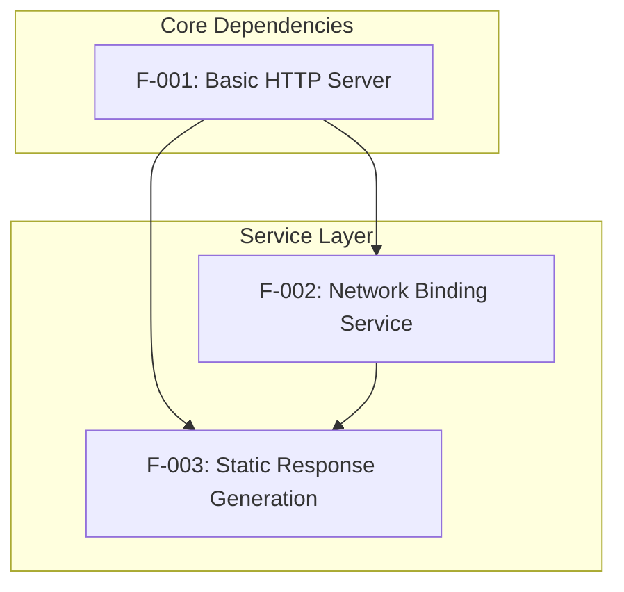
```mermaid
graph TD
    F001[F-001: Basic HTTP Server] --> F002[F-002: Network Binding Service]
    F001 --> F003[F-003: Static Response Generation]
    F002 --> F003
    
    subgraph "Core Dependencies"
        F001
    end
    
    subgraph "Service Layer"
        F002
        F003
    end
```

### 2.3.2 Integration Points

| Integration Point | Features Involved | Description | Type |
|------------------|------------------|-------------|------|
| Request Processing | F-001, F-003 | HTTP server triggers response generation | Sequential |
| Network Service | F-001, F-002 | Server initialization enables network binding | Prerequisite |
| Response Delivery | F-002, F-003 | Network binding enables response transmission | Enablement |

### 2.3.3 Shared Components

| Component | Features Served | Purpose | Location |
|-----------|-----------------|---------|----------|
| HTTP Server Instance | F-001, F-002, F-003 | Core server object | <span style="background-color: rgba(91, 57, 243, 0.2)">app.py</span> |
| Request Handler Function | F-001, F-003 | Request processing logic | <span style="background-color: rgba(91, 57, 243, 0.2)">app.py</span> (hardcoded) |
| Network Configuration | F-001, F-002 | Binding parameters | <span style="background-color: rgba(91, 57, 243, 0.2)">app.py</span> (hardcoded) |

### 2.3.4 Common Services

**<span style="background-color: rgba(91, 57, 243, 0.2)">Flask WSGI Services</span>**
- <span style="background-color: rgba(91, 57, 243, 0.2)">Utilized by: F-001, F-002, F-003
- Provides: HTTP protocol implementation, network binding, request/response handling via Flask/Werkzeug
- Dependencies: Python 3.12.3 runtime

**TCP/IP Network Stack**
- Utilized by: F-002
- Provides: Network connectivity, port management, connection handling
- Dependencies: Operating system network services

## 2.4 IMPLEMENTATION CONSIDERATIONS

### 2.4.1 Feature F-001: Basic HTTP Server

#### Technical Constraints
- Single-threaded execution model limits concurrent processing
- No error handling for server failures or network issues
- Dependency on <span style="background-color: rgba(91, 57, 243, 0.2)">Flask 3.1.x only (declared in requirements.txt)</span>
- No graceful shutdown mechanism implemented

#### Performance Requirements
- Server startup time: < 100ms
- Memory usage: < 50MB for basic operations
- CPU utilization: Minimal during idle state
- Request processing: Single-threaded, synchronous

#### Scalability Considerations
- No connection pooling or management
- No load balancing capabilities
- Limited to single process instance
- No horizontal scaling support

#### Security Implications
- No input validation or sanitization
- No authentication or authorization
- No HTTPS/TLS encryption support
- Local access only (127.0.0.1 binding)

#### Maintenance Requirements
- Regular <span style="background-color: rgba(91, 57, 243, 0.2)">Python 3.12.3 runtime updates</span> required
- No automated monitoring or health checks
- Manual server restart required for code changes
- No logging infrastructure for troubleshooting

### 2.4.2 Feature F-002: Network Binding Service

#### Technical Constraints
- Hardcoded hostname and port configuration
- No environment variable support
- Single network interface binding only
- No dynamic port allocation

#### Performance Requirements
- Port binding time: < 50ms
- Connection establishment: < 10ms per client
- Maximum concurrent connections: <span style="background-color: rgba(91, 57, 243, 0.2)">Flask default limits</span>
- Network throughput: Limited by single-threaded architecture

#### Scalability Considerations
- No multi-port binding capabilities
- No network interface redundancy
- Limited to localhost access only
- No external network connectivity

#### Security Implications
- Localhost-only access provides network isolation
- No firewall configuration management
- No connection rate limiting
- No DDoS protection mechanisms

#### Maintenance Requirements
- Port availability monitoring required
- Network interface health checks needed
- Manual configuration updates for changes
- No automated failover capabilities

### 2.4.3 Feature F-003: Static Response Generation

#### Technical Constraints
- Fixed message content with no configuration options
- No content negotiation capabilities
- Single content type support (text/plain)
- No dynamic content generation

#### Performance Requirements
- Response generation time: < 5ms
- Memory usage per response: < 1KB
- Throughput: Limited by HTTP server performance
- Content delivery: Immediate (no file I/O)

#### Scalability Considerations
- No content caching required (static content)
- No database or external service dependencies
- Minimal resource utilization per request
- No content compression support

#### Security Implications
- No sensitive data exposure (static content only)
- No content injection vulnerabilities
- No file system access required
- Predictable response behavior

#### Maintenance Requirements
- Content updates require code modification
- No content versioning or management
- Response format changes require development
- No content monitoring or analytics

#### References

- `<span style="background-color: rgba(91, 57, 243, 0.2)">app.py</span>` - Core HTTP server implementation with request handler and network binding
- `<span style="background-color: rgba(91, 57, 243, 0.2)">requirements.txt</span>` - Python project dependency manifest defining Flask framework requirements
- `README.md` - Project documentation identifying system purpose and naming
- Technical Specification Section 1.1 - Executive Summary providing business context
- Technical Specification Section 1.2 - System Overview detailing capabilities and architecture
- Technical Specification Section 1.3 - Scope defining in-scope and out-of-scope elements

# 3. TECHNOLOGY STACK

## 3.1 PROGRAMMING LANGUAGES

### 3.1.1 Primary Language Selection

**<span style="background-color: rgba(91, 57, 243, 0.2)">Python 3 (Runtime Environment)</span>**
- **Platform**: <span style="background-color: rgba(91, 57, 243, 0.2)">Server-side web service using Python 3 Runtime</span>
- **Version**: <span style="background-color: rgba(91, 57, 243, 0.2)">3.12.3</span>
- **Usage**: <span style="background-color: rgba(91, 57, 243, 0.2)">Complete application implementation in `app.py` using Flask framework</span>
- **Selection Criteria**: 
  - <span style="background-color: rgba(91, 57, 243, 0.2)">Flask framework provides built-in HTTP server capabilities through WSGI-compliant web server</span>
  - <span style="background-color: rgba(91, 57, 243, 0.2)">Robust ecosystem with comprehensive package management through pip and requirements.txt</span>
  - <span style="background-color: rgba(91, 57, 243, 0.2)">Enhanced scalability and maintainability for future system expansion</span>
  - <span style="background-color: rgba(91, 57, 243, 0.2)">Strong compatibility with machine learning and data processing libraries for future integration</span>
  - <span style="background-color: rgba(91, 57, 243, 0.2)">Virtual environment support ensuring isolated dependency management and reproducible deployments</span>

**Virtual Environment Implementation**
- <span style="background-color: rgba(91, 57, 243, 0.2)">**Development Environment**: All development and execution occurs inside a Python virtual environment (venv) created using `python3 -m venv venv`</span>
- <span style="background-color: rgba(91, 57, 243, 0.2)">**Dependency Isolation**: Virtual environment provides complete isolation of project dependencies from system Python installation</span>
- <span style="background-color: rgba(91, 57, 243, 0.2)">**Activation Requirement**: Virtual environment must be activated via `source venv/bin/activate` (Unix/Linux/macOS) or `venv\Scripts\activate` (Windows) before any Python operations</span>

### 3.1.2 Language Constraints and Dependencies (updated)

**Runtime Dependencies**:
- <span style="background-color: rgba(91, 57, 243, 0.2)">Python 3.12.3 interpreter (primary runtime environment)</span>
- <span style="background-color: rgba(91, 57, 243, 0.2)">Isolated virtual environment (venv) for dependency management</span>
- Operating system network stack for TCP/IP binding
- <span style="background-color: rgba(91, 57, 243, 0.2)">Flask 3.1.x framework and its transitive dependencies installed via pip</span>

**Architectural Constraints**:
- <span style="background-color: rgba(91, 57, 243, 0.2)">Flask/Werkzeug WSGI request/response model with multi-threading capabilities</span>
- <span style="background-color: rgba(91, 57, 243, 0.2)">Synchronous per-request processing architecture ensuring predictable response behavior</span>
- <span style="background-color: rgba(91, 57, 243, 0.2)">WSGI-compliant web server integration supporting both development and production deployment scenarios</span>
- <span style="background-color: rgba(91, 57, 243, 0.2)">Decorator-based routing system using `@app.route()` for HTTP request handling</span>

### 3.1.3 Platform Integration Characteristics (updated)

**Framework Integration**:
- **Web Server Framework**: <span style="background-color: rgba(91, 57, 243, 0.2)">Flask 3.1.x providing comprehensive HTTP server capabilities</span>
- **WSGI Server**: <span style="background-color: rgba(91, 57, 243, 0.2)">Werkzeug development server integrated within Flask for local development</span>
- **Request Processing**: <span style="background-color: rgba(91, 57, 243, 0.2)">Route-based request handling using Flask's decorator pattern</span>
- **Response Generation**: <span style="background-color: rgba(91, 57, 243, 0.2)">Flask's automatic response object creation from function return values</span>

**Development Toolchain Requirements**:
- **Package Management**: <span style="background-color: rgba(91, 57, 243, 0.2)">pip package installer for Python dependency installation and management</span>
- **Dependency Declaration**: <span style="background-color: rgba(91, 57, 243, 0.2)">requirements.txt file defining exact package versions and dependencies</span>
- **Environment Activation**: <span style="background-color: rgba(91, 57, 243, 0.2)">Virtual environment activation scripts for development workflow integration</span>
- **Runtime Execution**: <span style="background-color: rgba(91, 57, 243, 0.2)">Python interpreter execution of Flask application via `python app.py` or `flask run` commands</span>

### 3.1.4 Performance and Scalability Characteristics (updated)

**Execution Model**:
- <span style="background-color: rgba(91, 57, 243, 0.2)">**Multi-threaded Capability**: Flask/Werkzeug WSGI server supports concurrent request processing through threading</span>
- <span style="background-color: rgba(91, 57, 243, 0.2)">**Synchronous Processing**: Each request processed synchronously within its thread context ensuring predictable execution flow</span>
- <span style="background-color: rgba(91, 57, 243, 0.2)">**WSGI Compliance**: Standard Python web server gateway interface enabling production server deployment flexibility</span>

**Resource Utilization**:
- **Memory Management**: <span style="background-color: rgba(91, 57, 243, 0.2)">Python's automatic garbage collection managing memory lifecycle</span>
- **CPU Efficiency**: <span style="background-color: rgba(91, 57, 243, 0.2)">Flask's lightweight request processing minimizing CPU overhead per request</span>
- **Network Optimization**: <span style="background-color: rgba(91, 57, 243, 0.2)">Werkzeug's efficient HTTP protocol implementation ensuring optimal network resource usage</span>

**Scalability Considerations**:
- **Development Mode**: <span style="background-color: rgba(91, 57, 243, 0.2)">Flask development server suitable for local development and testing scenarios</span>
- **Production Readiness**: <span style="background-color: rgba(91, 57, 243, 0.2)">WSGI compliance enabling deployment to production-grade servers (Gunicorn, uWSGI, Apache mod_wsgi)</span>
- **Extension Capability**: <span style="background-color: rgba(91, 57, 243, 0.2)">Python ecosystem compatibility supporting future integration with databases, caching systems, and external APIs</span>

## 3.2 FRAMEWORKS & LIBRARIES

### 3.2.1 <span style="background-color: rgba(91, 57, 243, 0.2)">Flask 3.1.x Core Framework

**<span style="background-color: rgba(91, 57, 243, 0.2)">Flask 3.1.x Core Framework</span>**
- **Framework Strategy**: <span style="background-color: rgba(91, 57, 243, 0.2)">Flask 3.1.x serves as the single required web framework providing comprehensive HTTP server capabilities</span>
- **HTTP Handling**: <span style="background-color: rgba(91, 57, 243, 0.2)">Flask route decorators using `@app.route()` pattern with catch-all routing to handle all request paths uniformly</span>
- **Justification**: <span style="background-color: rgba(91, 57, 243, 0.2)">Flask provides WSGI-compliant web server functionality with minimal configuration overhead, replacing Node.js `http.createServer()` methodology while maintaining identical response behavior</span>
- **Implementation Approach**: <span style="background-color: rgba(91, 57, 243, 0.2)">Direct Flask application instance creation with decorator-based route binding for comprehensive request handling</span>

**Framework Architecture Details**:
- **Core Framework**: Flask 3.1.x (latest stable release)
  - Version: 3.1.0 or higher within 3.1.x branch
  - Usage: Primary web server framework replacing Node.js built-in HTTP module
  - Integration: <span style="background-color: rgba(91, 57, 243, 0.2)">Single Flask application instance managing all HTTP request/response cycles</span>

- **WSGI Server Integration**: Werkzeug (Flask's integrated development server)
  - Version: Bundled with Flask 3.1.x (typically Werkzeug 3.x)
  - Usage: <span style="background-color: rgba(91, 57, 243, 0.2)">Development-grade WSGI server providing HTTP/1.1 protocol compliance</span>
  - Integration: Automatic integration through `app.run()` invocation

**HTTP Method Handling**:
<span style="background-color: rgba(91, 57, 243, 0.2)">Flask implementation must handle all HTTP methods (GET, POST, PUT, DELETE, PATCH, HEAD, OPTIONS) identically to the original Node.js server, ensuring complete functional parity</span>. The catch-all route pattern processes all request types uniformly, returning the same static response regardless of HTTP method or request path.

**Route Configuration Strategy**:
```python
@app.route('/', defaults={'path': ''}, methods=['GET', 'POST', 'PUT', 'DELETE', 'PATCH', 'HEAD', 'OPTIONS'])
@app.route('/<path:path>', methods=['GET', 'POST', 'PUT', 'DELETE', 'PATCH', 'HEAD', 'OPTIONS'])
def handle_request(path):
    return "Hello, World!\n"
```

### 3.2.2 <span style="background-color: rgba(91, 57, 243, 0.2)">Python Standard Library Integration

**<span style="background-color: rgba(91, 57, 243, 0.2)">Minimal Standard Library Requirements</span>**
<span style="background-color: rgba(91, 57, 243, 0.2)">No additional Python standard library modules are required beyond those transitively installed with Flask 3.1.x</span>. The Flask framework provides all necessary HTTP server functionality through its integrated components and dependencies.

**Transitive Dependencies via Flask**:
- **Werkzeug**: WSGI utilities and development server
- **Jinja2**: Template engine (unused in current implementation)
- **MarkupSafe**: HTML/XML markup safety utilities
- **ItsDangerous**: Secure token generation utilities
- **Click**: Command-line interface utilities

All required functionality is provided through Flask's comprehensive framework architecture, eliminating the need for direct standard library module imports.

### 3.2.3 Dependency Management & Installation

**Package Management Strategy**:
- **Primary Registry**: Python Package Index (PyPI) via pip installer
- **Dependency Declaration**: requirements.txt specification file
- **Version Control**: Exact version pinning for Flask 3.1.x branch
- **Environment Isolation**: Virtual environment (venv) containing all dependencies

**Installation Requirements**:
```
Flask>=3.1.0,<3.2.0
```

**Development Environment Setup**:
1. Python virtual environment creation: `python3 -m venv venv`
2. Environment activation: `source venv/bin/activate` (Unix/Linux/macOS) or `venv\Scripts\activate` (Windows)
3. Package installation: `pip install -r requirements.txt`
4. Application execution: `python app.py`

### 3.2.4 Framework Integration Architecture

**Application Lifecycle Management**:
- **Initialization**: Flask application instance creation using `Flask(__name__)`
- **Configuration**: Host binding to 127.0.0.1, port configuration to 3000
- **Route Registration**: Decorator-based route handler binding for comprehensive request coverage
- **Server Startup**: WSGI server initialization through `app.run()` method

**Request Processing Flow**:
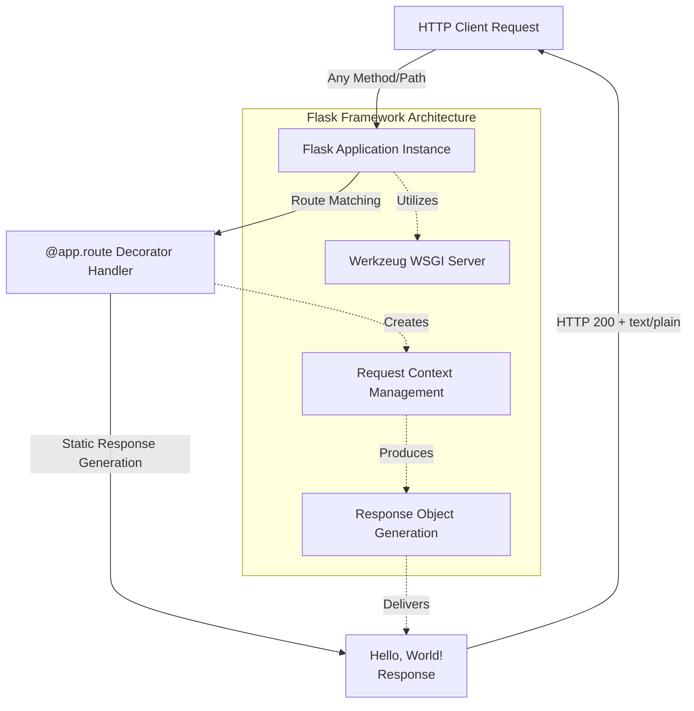
```mermaid
graph TD
A[HTTP Client Request] -->|Any Method/Path| B[Flask Application Instance]
B -->|Route Matching| C["@app.route Decorator Handler"]
C -->|Static Response Generation| D["Hello, World!\n Response"]
D -->|HTTP 200 + text/plain| A

subgraph "Flask Framework Architecture"
    B
    E[Werkzeug WSGI Server]
    F[Request Context Management]
    G[Response Object Generation]
end

B -.->|Utilizes| E
C -.->|Creates| F
F -.->|Produces| G
G -.->|Delivers| D
```

**Error Handling Strategy**:
- **Framework-Level**: Flask's built-in exception handling for development mode
- **Application-Level**: Default error responses for unhandled exceptions
- **Response Consistency**: All errors return same static response to maintain behavioral parity

### 3.2.5 Compatibility Requirements (updated)

**Runtime Environment Requirements**:
- <span style="background-color: rgba(91, 57, 243, 0.2)">**Python Runtime**: Python 3.12 or higher (developed and tested on 3.12.3)</span>
- <span style="background-color: rgba(91, 57, 243, 0.2)">**Framework Version**: Flask 3.1.x stable branch</span>
- <span style="background-color: rgba(91, 57, 243, 0.2)">**Protocol Compliance**: WSGI 1.0 specification, HTTP/1.1 protocol support</span>

**Platform Compatibility**:
- **Operating System**: Cross-platform (Linux, macOS, Windows)
- **Architecture**: x86_64, ARM64 (platform-independent Python bytecode)
- **Network Stack**: TCP/IP networking with localhost binding capability

**Integration Standards**:
- <span style="background-color: rgba(91, 57, 243, 0.2)">**WSGI Compliance**: Full Web Server Gateway Interface specification adherence</span>
- **HTTP Standards**: RFC 7230-7235 HTTP/1.1 protocol implementation
- **Response Format**: Content-Type: text/plain header compliance
- **Development Server**: Werkzeug development server integration for local development

**Virtual Environment Requirements**:
- **Isolation**: Complete dependency separation from system Python installation
- **Portability**: Environment replication across development systems
- **Version Control**: Dependency state management through requirements.txt
- **Activation**: Environment activation required for all Python operations

### 3.2.6 Production Deployment Considerations

**Development vs Production Framework Usage**:
- **Development**: Flask integrated development server (Werkzeug) suitable for testing and local development
- **Production Readiness**: WSGI-compliant architecture enables deployment to production-grade servers
- **Scalability Path**: Compatible with Gunicorn, uWSGI, Apache mod_wsgi for production environments

**Security Framework Features**:
- **Development Mode**: Flask's built-in security features active in development configuration
- **Dependency Management**: pip and virtual environment providing secure dependency isolation
- **Framework Updates**: Flask 3.1.x branch receiving security patches and maintenance updates

**Performance Characteristics**:
- **Memory Footprint**: Minimal memory usage suitable for development and lightweight production deployments
- **Request Processing**: Synchronous request handling ensuring predictable response timing
- **Startup Performance**: Fast application initialization for development workflow integration

## 3.3 OPEN SOURCE DEPENDENCIES

### 3.3.1 External Dependencies Status (updated)

**<span style="background-color: rgba(91, 57, 243, 0.2)">Flask Framework Dependencies</span>**
- **Package Registry**: <span style="background-color: rgba(91, 57, 243, 0.2)">PyPI (Python Package Index)</span>
- **Primary Dependency**: <span style="background-color: rgba(91, 57, 243, 0.2)">Flask>=3.1,<4.0</span>
- **Transitive Dependencies**: <span style="background-color: rgba(91, 57, 243, 0.2)">Flask framework automatically installs required packages including Werkzeug, Jinja2, MarkupSafe, ItsDangerous, and Click</span>
- **Dependency File**: <span style="background-color: rgba(91, 57, 243, 0.2)">`requirements.txt` for dependency specification and version management</span>

### 3.3.2 Package Management Configuration (updated)

**<span style="background-color: rgba(91, 57, 243, 0.2)">Requirements.txt Configuration</span>**:
```
Flask==3.1.*
```

**Dependency Management Strategy**:
- <span style="background-color: rgba(91, 57, 243, 0.2)">Dependencies installed with `pip install -r requirements.txt`</span>
- <span style="background-color: rgba(91, 57, 243, 0.2)">Version pinning handled inside requirements.txt</span>
- <span style="background-color: rgba(91, 57, 243, 0.2)">Virtual environment isolation ensuring clean dependency separation from system Python</span>

### 3.3.3 Transitive Dependency Analysis

**Flask Framework Dependencies**

The Flask 3.1.x installation automatically includes the following essential packages:

| Package | Version Range | Purpose | Installation Type |
|---------|---------------|---------|-------------------|
| **Flask** | 3.1.* | Primary web framework | Direct dependency |
| **Werkzeug** | 3.0.* | WSGI utilities and development server | Transitive |
| **Jinja2** | 3.1.* | Template engine | Transitive |
| **MarkupSafe** | 2.1.* | HTML/XML markup safety | Transitive |
| **ItsDangerous** | 2.1.* | Secure token generation | Transitive |
| **Click** | 8.1.* | Command-line interface utilities | Transitive |

**Dependency Resolution**

The pip package manager automatically resolves and installs all transitive dependencies when Flask is installed, ensuring compatibility across the entire dependency tree. This approach provides:

- **Version Compatibility**: Automatic resolution of compatible versions across all dependencies
- **Security Updates**: Streamlined security patch management through pip upgrade mechanisms
- **Minimal Configuration**: Single-line requirements.txt specification manages entire dependency graph

### 3.3.4 Virtual Environment Integration

**Environment Management**

Python virtual environments provide complete isolation of project dependencies from system-level Python installations:

- **Environment Creation**: `python3 -m venv venv` establishes isolated Python environment
- **Activation Process**: `source venv/bin/activate` (Unix/Linux/macOS) or `venv\Scripts\activate` (Windows)
- **Dependency Installation**: All packages installed within virtual environment boundaries
- **Environment Reproducibility**: Consistent dependency versions across development and deployment environments

**Installation Workflow**

```bash
# Virtual environment setup
python3 -m venv venv
source venv/bin/activate  # Unix/Linux/macOS
# venvScriptsactivate   # Windows

#### Dependency installation
pip install -r requirements.txt

#### Application execution
python app.py
```

### 3.3.5 Dependency Security and Maintenance

**Security Considerations**

- **Package Verification**: PyPI package integrity verification through pip's built-in hash checking
- **Version Constraints**: Flask version pinning to 3.1.* branch ensures security patch availability while preventing major version conflicts
- **Minimal Attack Surface**: Limited dependency count reduces potential security vulnerabilities
- **Regular Updates**: Flask framework receives active maintenance and security updates

**Maintenance Strategy**

- **Dependency Auditing**: Regular review of Flask and transitive dependency versions for security advisories
- **Version Management**: Periodic evaluation of Flask 3.1.* minor version updates for bug fixes and improvements
- **Compatibility Testing**: Verification of application functionality following any dependency updates
- **Documentation Updates**: Maintenance of requirements.txt to reflect current dependency state

### 3.3.6 Integration with Development Workflow

**Development Environment Requirements**

The dependency management integrates seamlessly with the Flask development workflow:

- **Hot Reloading**: Flask development server supports automatic application reloading during development
- **Debug Mode**: Enhanced error reporting and debugging capabilities in development configuration
- **Port Configuration**: Consistent localhost:3000 binding matching original Node.js implementation
- **Cross-Platform Compatibility**: Virtual environment ensures consistent behavior across operating systems

**Deployment Readiness**

The minimal dependency configuration provides production deployment flexibility:

- **Container Compatibility**: Requirements.txt enables straightforward Docker image construction
- **Cloud Platform Integration**: Compatible with major cloud platforms supporting Python runtime environments
- **WSGI Server Deployment**: Flask's WSGI compliance enables deployment to production-grade servers (Gunicorn, uWSGI)
- **Scalability Foundation**: Clean dependency management supports future system expansion and integration requirements

## 3.4 THIRD-PARTY SERVICES

### 3.4.1 External Service Integration

**Current External Services**: None

**Integration Architecture**:
- No external API integrations implemented
- No authentication service dependencies
- No monitoring or analytics services
- No cloud service integrations

### 3.4.2 Future Integration Readiness

**Potential Integration Points**:
- Standard HTTP protocol enables future API integrations
- JSON response capability for RESTful service development
- Network accessibility supports external service consumption

## 3.5 DATABASES & STORAGE

### 3.5.1 Data Persistence Architecture

**Current Data Storage**: None

**Data Architecture Status**:
- No database implementations
- No file-based storage systems
- No caching mechanisms
- Static in-memory content delivery only

### 3.5.2 Content Delivery Strategy

**Static Content Management**:
- Hardcoded response content: `"Hello, World!\n"`
- Content-Type: `text/plain`
- No dynamic content generation
- No persistent data requirements

## 3.6 DEVELOPMENT & DEPLOYMENT

### 3.6.1 Development Environment

**Development Tools**:
- **Code Editor**: Any Python-compatible editor
- **Runtime**: <span style="background-color: rgba(91, 57, 243, 0.2)">Python 3.12.3 (within venv)</span>
- **Package Manager**: <span style="background-color: rgba(91, 57, 243, 0.2)">pip (with virtual environment activation required)</span>

**Development Workflow**:
- <span style="background-color: rgba(91, 57, 243, 0.2)">Virtual environment activation required before development: `source venv/bin/activate` (Unix/Linux/macOS) or `venv\Scripts\activate` (Windows)</span>
- <span style="background-color: rgba(91, 57, 243, 0.2)">Direct file editing of `app.py`</span>
- <span style="background-color: rgba(91, 57, 243, 0.2)">Manual server restart required for code changes via `python app.py`</span>
- No build process or compilation steps

### 3.6.2 Deployment Architecture

**Current Deployment Strategy**:
- **Environment**: Local development only
- **Network Binding**: localhost (127.0.0.1) port 3000
- **Process Management**: <span style="background-color: rgba(91, 57, 243, 0.2)">Manual Flask development server executed via Python</span>
- **Containerization**: Not implemented

**Deployment Requirements**:
- <span style="background-color: rgba(91, 57, 243, 0.2)">Python 3.12.3 runtime availability within activated virtual environment</span>
- Network port 3000 accessibility
- Local file system access for source code
- <span style="background-color: rgba(91, 57, 243, 0.2)">Terminal/command line access for virtual environment activation and Flask server startup</span>

### 3.6.3 Operational Infrastructure

**Current Infrastructure**:
- **Monitoring**: No logging or monitoring implemented
- **Error Handling**: Minimal error management
- **Health Checks**: No automated health monitoring
- **Backup/Recovery**: File-based source code only

**Infrastructure Diagram**:

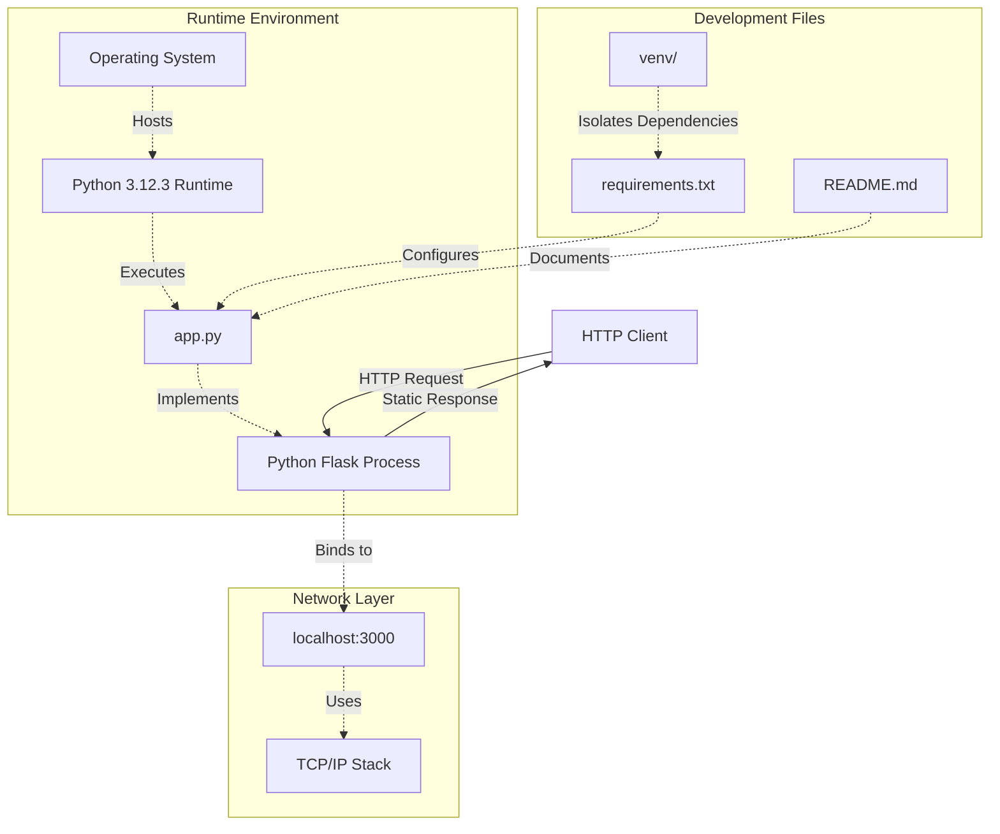
```mermaid
graph TD
A[HTTP Client] -->|HTTP Request| B[Python Flask Process]
B -->|Static Response| A

subgraph "Runtime Environment"
    B
    C[app.py]
    D[Python 3.12.3 Runtime]
    E[Operating System]
end

subgraph "Network Layer"
    F[localhost:3000]
    G[TCP/IP Stack]
end

C -.->|Implements| B
D -.->|Executes| C
E -.->|Hosts| D
B -.->|Binds to| F
F -.->|Uses| G

subgraph "Development Files"
    H[requirements.txt]
    I[venv/]
    J[README.md]
end

H -.->|Configures| C
I -.->|Isolates Dependencies| H
J -.->|Documents| C
```

## 3.7 TECHNOLOGY ARCHITECTURE SUMMARY

### 3.7.1 Architecture Principles

**Minimalist Design Philosophy**:
- <span style="background-color: rgba(91, 57, 243, 0.2)">Single mandatory dependency (Flask) for maximum portability</span>
- Single-file implementation for simplified maintenance
- <span style="background-color: rgba(91, 57, 243, 0.2)">Virtual environment isolation for stability and compatibility</span>
- Localhost-only binding for development security

### 3.7.2 Technology Selection Rationale

**Key Decision Factors**:

| Technology Choice | Rationale | Benefit |
|------------------|-----------|---------|
| <span style="background-color: rgba(91, 57, 243, 0.2)">Flask 3.1.x</span> | <span style="background-color: rgba(91, 57, 243, 0.2)">Eliminates complex dependency management with minimal framework overhead</span> | <span style="background-color: rgba(91, 57, 243, 0.2)">Single external dependency</span> |
| <span style="background-color: rgba(91, 57, 243, 0.2)">Python 3.12.3</span> | Rapid prototyping and development | Single language stack |
| <span style="background-color: rgba(91, 57, 243, 0.2)">Flask WSGI Direct Usage</span> | Minimal resource footprint | Lightweight implementation |
| Static Content Delivery | Predictable behavior for testing | Consistent response validation |

### 3.7.3 Future Technology Evolution Path

**Potential Technology Additions**:
- <span style="background-color: rgba(91, 57, 243, 0.2)">Additional Python web frameworks (FastAPI, Django) for enhanced routing</span>
- Database integration (MongoDB, PostgreSQL) for data persistence
- Authentication services (JWT, OAuth) for security
- <span style="background-color: rgba(91, 57, 243, 0.2)">Testing frameworks (pytest, unittest) for quality assurance</span>
- <span style="background-color: rgba(91, 57, 243, 0.2)">Build tools (pip-tools, setuptools) for advanced development</span>
- Containerization (Docker) for deployment standardization

**Technology Readiness Assessment**:
- <span style="background-color: rgba(91, 57, 243, 0.2)">Foundation established for Python framework integration</span>
- <span style="background-color: rgba(91, 57, 243, 0.2)">WSGI service architecture supports API development</span>
- <span style="background-color: rgba(91, 57, 243, 0.2)">Virtual environment structure ready for dependency addition</span>
- Code structure enables modular expansion

#### References

- <span style="background-color: rgba(91, 57, 243, 0.2)">`app.py` - Core Flask application implementation using Flask 3.1.x framework</span>
- <span style="background-color: rgba(91, 57, 243, 0.2)">`requirements.txt` - Python dependency manifest defining Flask framework dependency</span>
- <span style="background-color: rgba(91, 57, 243, 0.2)">`venv/` - Python virtual environment containing isolated Flask installation</span>
- `README.md` - Project documentation identifying system as "hao-backprop-test" foundation
- Technical Specification Section 1.1 - Executive Summary establishing minimal web server context
- Technical Specification Section 1.2 - System Overview detailing <span style="background-color: rgba(91, 57, 243, 0.2)">Flask HTTP service capabilities</span>
- Technical Specification Section 2.1 - Feature Catalog documenting <span style="background-color: rgba(91, 57, 243, 0.2)">Basic Flask HTTP Server implementation</span>
- Technical Specification Section 2.4 - Implementation Considerations outlining technical constraints

# 4. PROCESS FLOWCHART

## 4.1 SYSTEM WORKFLOWS

### 4.1.1 Core Business Processes

The system implements fundamental web service workflows centered around HTTP request-response cycles. Based on the implementation in <span style="background-color: rgba(91, 57, 243, 0.2)">`app.py`</span> and features F-001, F-002, and F-003 from the Feature Catalog, the system provides three primary business processes that operate in a linear, stateless manner.

#### 4.1.1.1 End-to-End User Journey

The complete user interaction workflow represents a simplified request-response cycle with no authentication, routing, or state management requirements:

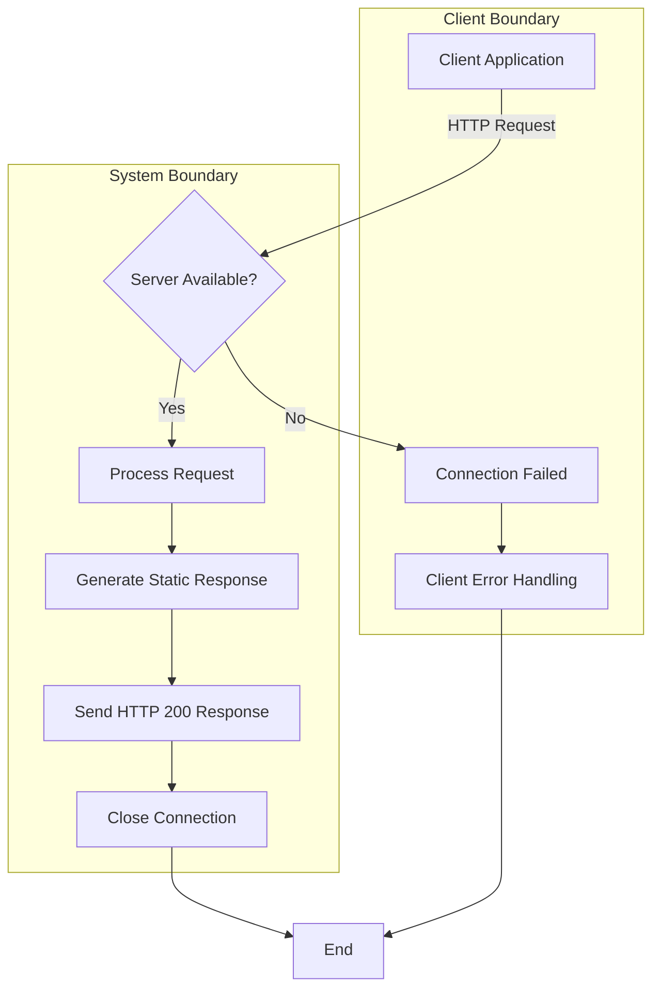
```mermaid
flowchart TD
    A[Client Application] -->|HTTP Request| B{Server Available?}
    B -->|Yes| C[Process Request]
    B -->|No| D[Connection Failed]
    C --> E[Generate Static Response]
    E --> F[Send HTTP 200 Response]
    F --> G[Close Connection]
    G --> H[End]
    D --> I[Client Error Handling]
    I --> H
    
    subgraph "System Boundary"
        B
        C
        E
        F
        G
    end
    
    subgraph "Client Boundary"
        A
        D
        I
    end
```

#### 4.1.1.2 System Interactions and Decision Points

The system maintains minimal decision logic with only critical operational checkpoints:

**Primary Decision Points:**
- **Server Availability Check:** Determines if port 3000 is accessible on localhost
- **Connection Acceptance:** <span style="background-color: rgba(91, 57, 243, 0.2)">Flask/Werkzeug WSGI server</span> handles TCP connection establishment
- **Response Generation:** Static response creation (no conditional logic)

**System Interaction Patterns:**
- **Synchronous Processing:** All requests processed immediately without queuing
- **Stateless Operations:** No session or context preservation between requests
- **Uniform Response Behavior:** Identical handling regardless of request parameters

### 4.1.2 Integration Workflows

#### 4.1.2.1 Data Flow Between Systems

The current implementation provides limited integration capabilities focused on HTTP protocol compliance:

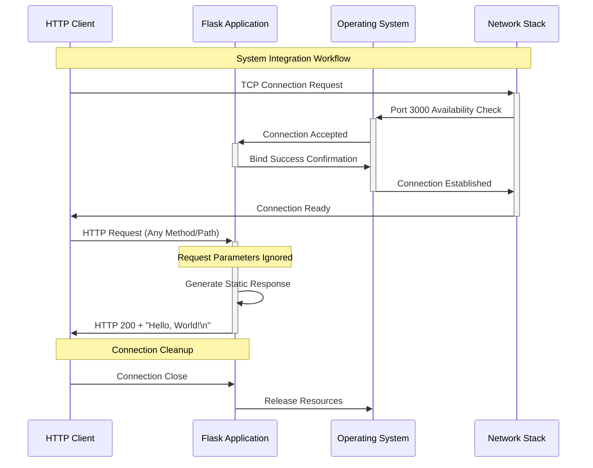
```mermaid
sequenceDiagram
    participant C as HTTP Client
    participant S as Flask Application
    participant OS as Operating System
    participant N as Network Stack
    
    Note over C,N: System Integration Workflow
    
    C->>+N: TCP Connection Request
    N->>+OS: Port 3000 Availability Check
    OS->>+S: Connection Accepted
    S->>-OS: Bind Success Confirmation
    OS->>-N: Connection Established
    N->>-C: Connection Ready
    
    C->>+S: HTTP Request (Any Method/Path)
    Note over S: Request Parameters Ignored
    S->>S: Generate Static Response
    S->>-C: HTTP 200 + "Hello, World!\n"
    
    Note over C,S: Connection Cleanup
    C->>S: Connection Close
    S->>OS: Release Resources
```

#### 4.1.2.2 Event Processing Flows

**Limited Event Processing Capability:**
- **Request Events:** HTTP request receipt triggers response generation
- **Connection Events:** TCP connection establishment and teardown
- **System Events:** Server startup and shutdown (manual process)

**Missing Event Processing:**
- No custom event handling
- No message queuing capabilities
- No webhook or callback processing
- No batch processing mechanisms

### 4.1.3 State Management and Transaction Boundaries

#### 4.1.3.1 Application State Management

The <span style="background-color: rgba(91, 57, 243, 0.2)">Flask application</span> operates in a completely stateless manner with no persistent state management:

**State Characteristics:**
- **Request Isolation:** Each HTTP request processed independently without shared state
- **Memory Management:** <span style="background-color: rgba(91, 57, 243, 0.2)">Python garbage collection</span> handles automatic memory cleanup between requests
- **Session Management:** No session storage or user state persistence implemented
- **Application Context:** <span style="background-color: rgba(91, 57, 243, 0.2)">Flask request context</span> created and destroyed for each request cycle

#### 4.1.3.2 Data Persistence and Caching

**Current Implementation Constraints:**
- **No Database Integration:** No persistent data storage mechanisms implemented
- **No Caching Layer:** No request caching or response memoization
- **No File System Interaction:** No file read/write operations
- **Stateless Response Generation:** Static response content without dynamic data processing

**Transaction Boundaries:**
- **Request Scope:** Each HTTP request represents a complete transaction boundary
- **No Cross-Request Transactions:** No transaction state carried between requests
- **Immediate Response:** No deferred processing or asynchronous transaction handling

### 4.1.4 Error Handling and Recovery Workflows

#### 4.1.4.1 Error Detection and Processing

The system implements basic error handling through <span style="background-color: rgba(91, 57, 243, 0.2)">Flask's built-in exception handling mechanism</span>:

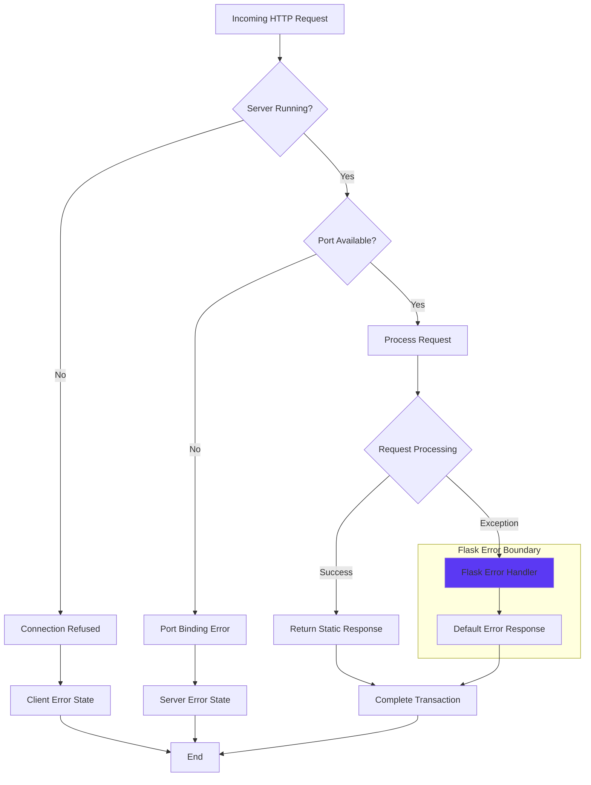
```mermaid
flowchart TD
A[Incoming HTTP Request] --> B{Server Running?}
B -->|No| C[Connection Refused]
B -->|Yes| D{Port Available?}
D -->|No| E[Port Binding Error]
D -->|Yes| F[Process Request]
F --> G{Request Processing}
G -->|Success| H[Return Static Response]
G -->|Exception| I[Flask Error Handler]
I --> J[Default Error Response]
H --> K[Complete Transaction]
J --> K
C --> L[Client Error State]
E --> M[Server Error State]
K --> N[End]
L --> N
M --> N

subgraph "Flask Error Boundary"
    I
    J
end

style I fill:#5B39F3
```

#### 4.1.4.2 Recovery Mechanisms and Retry Logic

**Error Recovery Capabilities:**
- **Automatic Recovery:** <span style="background-color: rgba(91, 57, 243, 0.2)">Flask framework</span> automatically handles request-level exceptions
- **No Retry Mechanisms:** No built-in retry logic for failed requests
- **Client-Side Recovery:** Error recovery responsibility delegated to HTTP clients
- **Server Restart Required:** Critical errors require manual <span style="background-color: rgba(91, 57, 243, 0.2)">`python app.py`</span> restart

**Fallback Processes:**
- **Default Response:** All errors result in consistent response behavior
- **No Circuit Breaker:** No automatic service degradation mechanisms
- **No Health Checks:** No automated health monitoring or recovery

### 4.1.5 Operational Workflows and Monitoring

#### 4.1.5.1 Service Lifecycle Management

**Application Startup Workflow:**

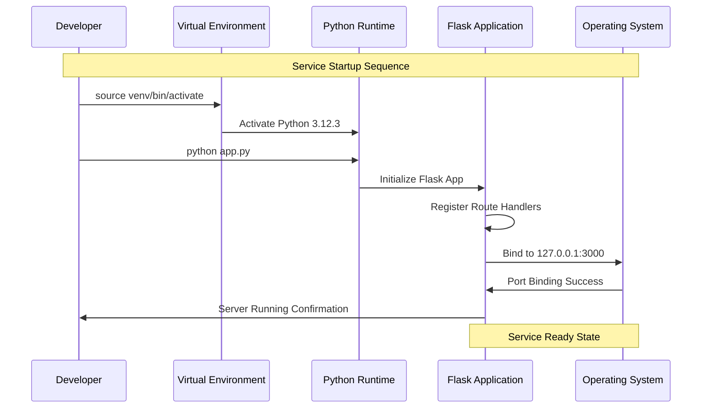
```mermaid
sequenceDiagram
    participant D as Developer
    participant V as Virtual Environment
    participant P as Python Runtime
    participant F as Flask Application
    participant OS as Operating System
    
    Note over D,OS: Service Startup Sequence
    
    D->>V: source venv/bin/activate
    V->>P: Activate Python 3.12.3
    D->>P: python app.py
    P->>F: Initialize Flask App
    F->>F: Register Route Handlers
    F->>OS: Bind to 127.0.0.1:3000
    OS->>F: Port Binding Success
    F->>D: Server Running Confirmation
    
    Note over F,OS: Service Ready State
```

**Service Shutdown Process:**
- **Manual Termination:** <span style="background-color: rgba(91, 57, 243, 0.2)">Ctrl+C signal to Python process</span>
- **Graceful Shutdown:** <span style="background-color: rgba(91, 57, 243, 0.2)">Flask development server</span> handles connection cleanup
- **Resource Release:** Automatic port unbinding and memory cleanup

#### 4.1.5.2 Performance and Scalability Considerations

**Current Performance Characteristics:**
- **Single-Threaded Processing:** <span style="background-color: rgba(91, 57, 243, 0.2)">Flask development server</span> processes requests sequentially
- **Memory Efficiency:** Minimal memory footprint with <span style="background-color: rgba(91, 57, 243, 0.2)">Python garbage collection</span>
- **Response Time:** Sub-millisecond static response generation
- **Throughput Limitations:** Development server constrains concurrent request handling

**Scalability Pathways:**
- **Production Deployment:** <span style="background-color: rgba(91, 57, 243, 0.2)">WSGI-compliant architecture</span> enables Gunicorn, uWSGI integration
- **Multi-Threading Support:** <span style="background-color: rgba(91, 57, 243, 0.2)">Flask/Werkzeug</span> supports threading in production configurations
- **Load Balancing Ready:** Standard HTTP interface compatible with reverse proxy configurations

### 4.1.6 Integration Testing and Validation Workflows

#### 4.1.6.1 Service Validation Process

**Automated Validation Workflow:**

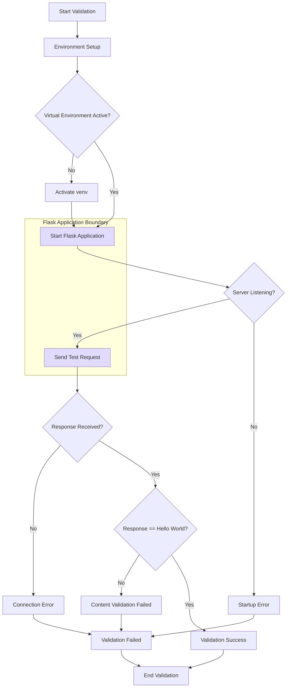
```mermaid
flowchart TD
A[Start Validation] --> B[Environment Setup]
B --> C{Virtual Environment Active?}
C -->|No| D[Activate venv]
C -->|Yes| E[Start Flask Application]
D --> E
E --> F{Server Listening?}
F -->|No| G[Startup Error]
F -->|Yes| H[Send Test Request]
H --> I{Response Received?}
I -->|No| J[Connection Error]
I -->|Yes| K{"Response == Hello World?"}
K -->|No| L[Content Validation Failed]
K -->|Yes| M[Validation Success]
G --> N[Validation Failed]
J --> N
L --> N
M --> O[End Validation]
N --> O

subgraph "Flask Application Boundary"
    E
    H
end

style E fill:#E1DBFF
style H fill:#E1DBFF
```

#### 4.1.6.2 Development Workflow Integration

**Development Cycle Support:**
- **Rapid Iteration:** <span style="background-color: rgba(91, 57, 243, 0.2)">`python app.py`</span> provides immediate service startup
- **Hot Reloading:** <span style="background-color: rgba(91, 57, 243, 0.2)">Flask development mode</span> supports automatic code reload
- **Debug Capabilities:** <span style="background-color: rgba(91, 57, 243, 0.2)">Flask debug mode</span> provides detailed error reporting
- **Environment Isolation:** <span style="background-color: rgba(91, 57, 243, 0.2)">Virtual environment</span> ensures consistent dependency management

**Quality Assurance Workflows:**
- **Functional Testing:** HTTP client testing against localhost:3000 endpoint
- **Integration Validation:** End-to-end request-response cycle verification
- **Performance Testing:** Response time and throughput measurement capability
- **Deployment Verification:** <span style="background-color: rgba(91, 57, 243, 0.2)">WSGI compatibility</span> testing for production readiness

## 4.2 FLOWCHART REQUIREMENTS ANALYSIS

### 4.2.1 Process Steps and System Boundaries

#### 4.2.1.1 Server Initialization Workflow (updated)

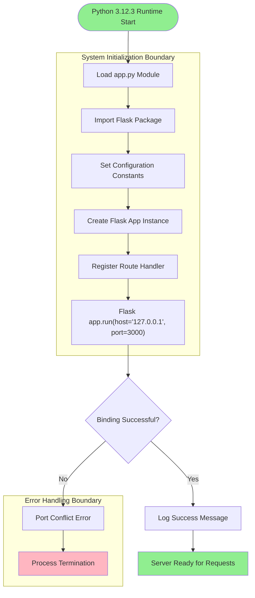
```mermaid
flowchart TD
Start([Python 3.12.3 Runtime Start]) --> Load[Load app.py Module]
Load --> Import[Import Flask Package]
Import --> Config[Set Configuration Constants]
Config --> Create[Create Flask App Instance]
Create --> Handler[Register Route Handler]
Handler --> Bind["Flask app.run(host='127.0.0.1', port=3000)"]
Bind --> Success{Binding Successful?}
Success -->|Yes| Log[Log Success Message]
Success -->|No| Error[Port Conflict Error]
Log --> Ready[Server Ready for Requests]
Error --> Crash[Process Termination]

subgraph "System Initialization Boundary"
    Load
    Import
    Config
    Create
    Handler
    Bind
end

subgraph "Error Handling Boundary"
    Error
    Crash
end

style Start fill:#90EE90
style Ready fill:#90EE90
style Crash fill:#FFB6C1
```

#### 4.2.1.2 Request Processing Detailed Flow (updated)

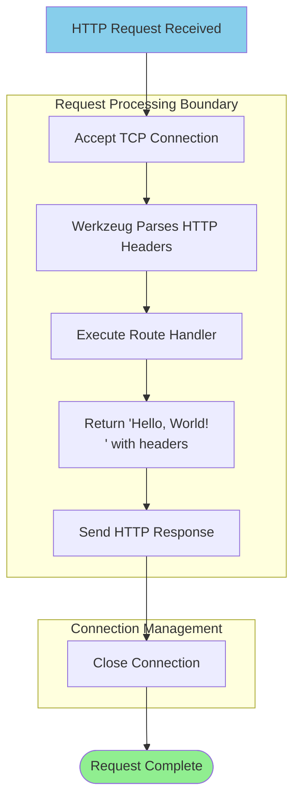
```mermaid
flowchart TD
    Request[HTTP Request Received] --> Accept[Accept TCP Connection]
    Accept --> Parse[Werkzeug Parses HTTP Headers]
    Parse --> Handler[Execute Route Handler]
    Handler --> Return[Return 'Hello, World!\n' with headers]
    Return --> Send[Send HTTP Response]
    Send --> Close[Close Connection]
    Close --> Complete([Request Complete])
    
    subgraph "Request Processing Boundary"
        Accept
        Parse
        Handler
        Return
        Send
    end
    
    subgraph "Connection Management"
        Accept
        Close
    end
    
    style Request fill:#87CEEB
    style Complete fill:#90EE90
```

### 4.2.2 Validation Rules and Authorization

#### 4.2.2.1 Business Rules Implementation

**Current Validation Status:**
- **No Input Validation:** <span style="background-color: rgba(91, 57, 243, 0.2)">Flask request object not processed for validation</span>
- **No Business Rule Enforcement:** Static response regardless of request content
- **No Data Validation Requirements:** System operates without data persistence

**Missing Validation Components:**
- User authentication checkpoints
- Request parameter validation
- Content-type verification
- Rate limiting controls

#### 4.2.2.2 Authorization Checkpoints (updated)

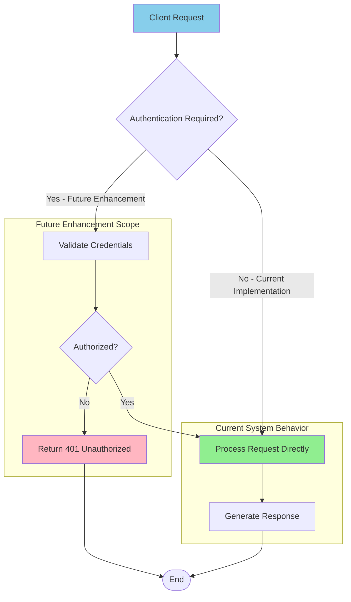
```mermaid
flowchart TD
    Client[Client Request] --> Auth{Authentication Required?}
    Auth -->|No - Current Implementation| Process[Process Request Directly]
    Auth -->|Yes - Future Enhancement| Validate[Validate Credentials]
    Validate --> Authorized{Authorized?}
    Authorized -->|Yes| Process
    Authorized -->|No| Reject[Return 401 Unauthorized]
    Process --> Response[Generate Response]
    Reject --> End([End])
    Response --> End
    
    subgraph "Current System Behavior"
        Process
        Response
    end
    
    subgraph "Future Enhancement Scope"
        Validate
        Authorized
        Reject
    end
    
    style Client fill:#87CEEB
    style Process fill:#90EE90
    style Reject fill:#FFB6C1
```

### 4.2.3 Technical Implementation Details

#### 4.2.3.1 State Management and Transitions

**Flask Application State Management:**
- **Request Context Management:** <span style="background-color: rgba(91, 57, 243, 0.2)">Flask automatically creates and destroys request contexts for each incoming request</span>
- **Application State:** Stateless design with no persistent application state between requests
- **Memory Management:** <span style="background-color: rgba(91, 57, 243, 0.2)">Python garbage collector handles automatic cleanup of request objects</span>

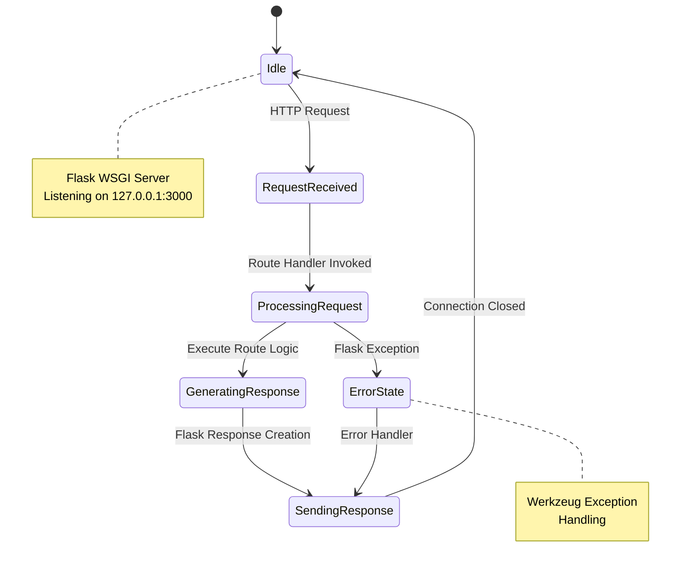
```mermaid
stateDiagram-v2
    [*] --> Idle
    Idle --> RequestReceived : HTTP Request
    RequestReceived --> ProcessingRequest : Route Handler Invoked
    ProcessingRequest --> GeneratingResponse : Execute Route Logic
    GeneratingResponse --> SendingResponse : Flask Response Creation
    SendingResponse --> Idle : Connection Closed
    
    ProcessingRequest --> ErrorState : Flask Exception
    ErrorState --> SendingResponse : Error Handler
    
    note right of Idle
        Flask WSGI Server
        Listening on 127.0.0.1:3000
    end note
    
    note right of ErrorState
        Werkzeug Exception
        Handling
    end note
```

#### 4.2.3.2 Error Handling and Recovery Mechanisms

**Flask Exception Handling Workflow:**

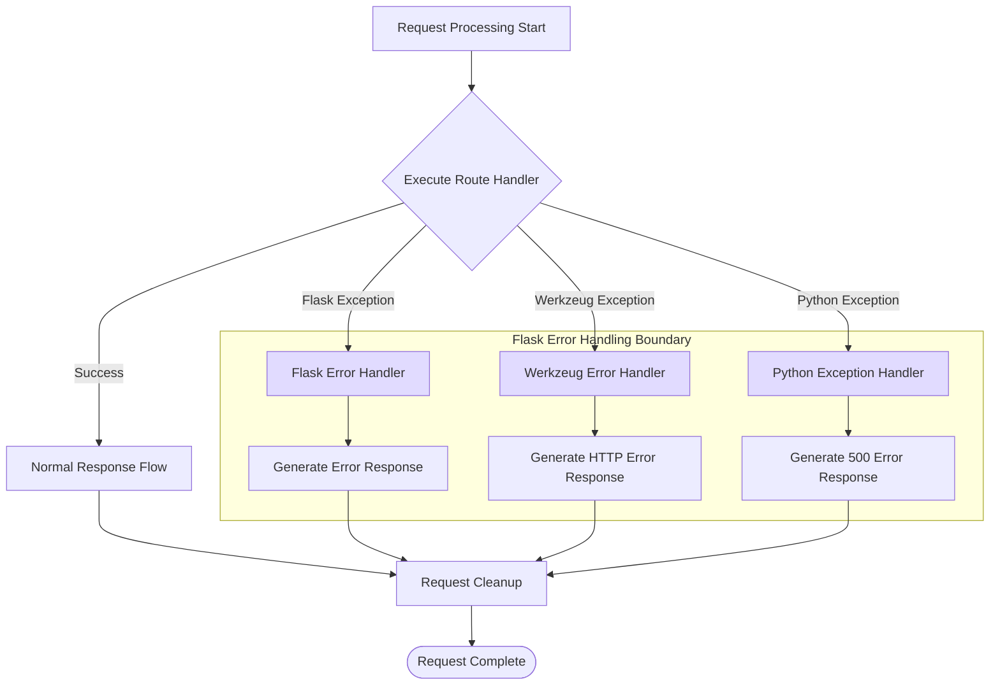
```mermaid
flowchart TD
    Start[Request Processing Start] --> TryBlock{Execute Route Handler}
    TryBlock -->|Success| Normal[Normal Response Flow]
    TryBlock -->|Flask Exception| Catch[Flask Error Handler]
    TryBlock -->|Werkzeug Exception| WerkzeugCatch[Werkzeug Error Handler]
    TryBlock -->|Python Exception| PythonCatch[Python Exception Handler]
    
    Catch --> ErrorResponse[Generate Error Response]
    WerkzeugCatch --> WerkzeugResponse[Generate HTTP Error Response]
    PythonCatch --> PythonResponse[Generate 500 Error Response]
    
    Normal --> Cleanup[Request Cleanup]
    ErrorResponse --> Cleanup
    WerkzeugResponse --> Cleanup
    PythonResponse --> Cleanup
    
    Cleanup --> End([Request Complete])
    
    subgraph "Flask Error Handling Boundary"
        Catch
        WerkzeugCatch
        PythonCatch
        ErrorResponse
        WerkzeugResponse
        PythonResponse
    end
    
    style Catch fill:#E1DBFF
    style WerkzeugCatch fill:#E1DBFF
    style PythonCatch fill:#E1DBFF
```

**Recovery Process Implementation:**
- **Automatic Request Recovery:** <span style="background-color: rgba(91, 57, 243, 0.2)">Flask framework handles exception recovery automatically within request scope</span>
- **Server Resilience:** <span style="background-color: rgba(91, 57, 243, 0.2)">Werkzeug development server maintains service availability after request-level exceptions</span>
- **Resource Cleanup:** <span style="background-color: rgba(91, 57, 243, 0.2)">Python context managers ensure proper resource cleanup after exceptions</span>
- **Logging Integration:** <span style="background-color: rgba(91, 57, 243, 0.2)">Flask logging subsystem captures exception details for debugging</span>

### 4.2.4 Integration Sequence Analysis

#### 4.2.4.1 Flask Application Lifecycle Integration

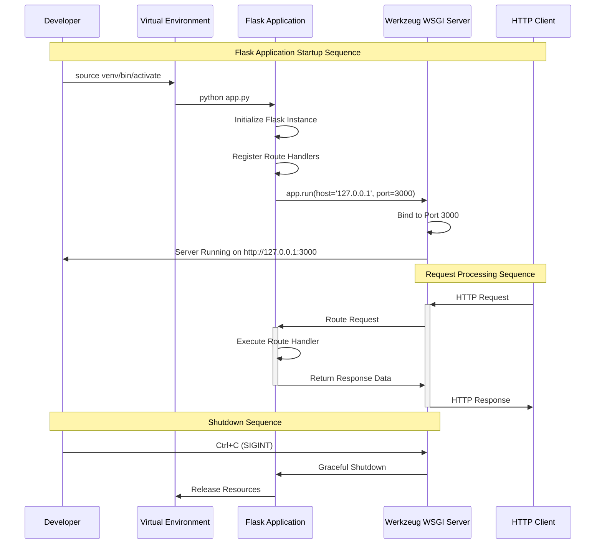
```mermaid
sequenceDiagram
    participant Dev as Developer
    participant Env as Virtual Environment
    participant App as Flask Application
    participant Server as Werkzeug WSGI Server
    participant Client as HTTP Client
    
    Note over Dev,Client: Flask Application Startup Sequence
    
    Dev->>Env: source venv/bin/activate
    Env->>App: python app.py
    App->>App: Initialize Flask Instance
    App->>App: Register Route Handlers
    App->>Server: app.run(host='127.0.0.1', port=3000)
    Server->>Server: Bind to Port 3000
    Server->>Dev: Server Running on http://127.0.0.1:3000
    
    Note over Client,Server: Request Processing Sequence
    
    Client->>+Server: HTTP Request
    Server->>+App: Route Request
    App->>App: Execute Route Handler
    App->>-Server: Return Response Data
    Server->>-Client: HTTP Response
    
    Note over Dev,Server: Shutdown Sequence
    
    Dev->>Server: Ctrl+C (SIGINT)
    Server->>App: Graceful Shutdown
    App->>Env: Release Resources
```

#### 4.2.4.2 Error Propagation and Handling

**Exception Flow Management:**

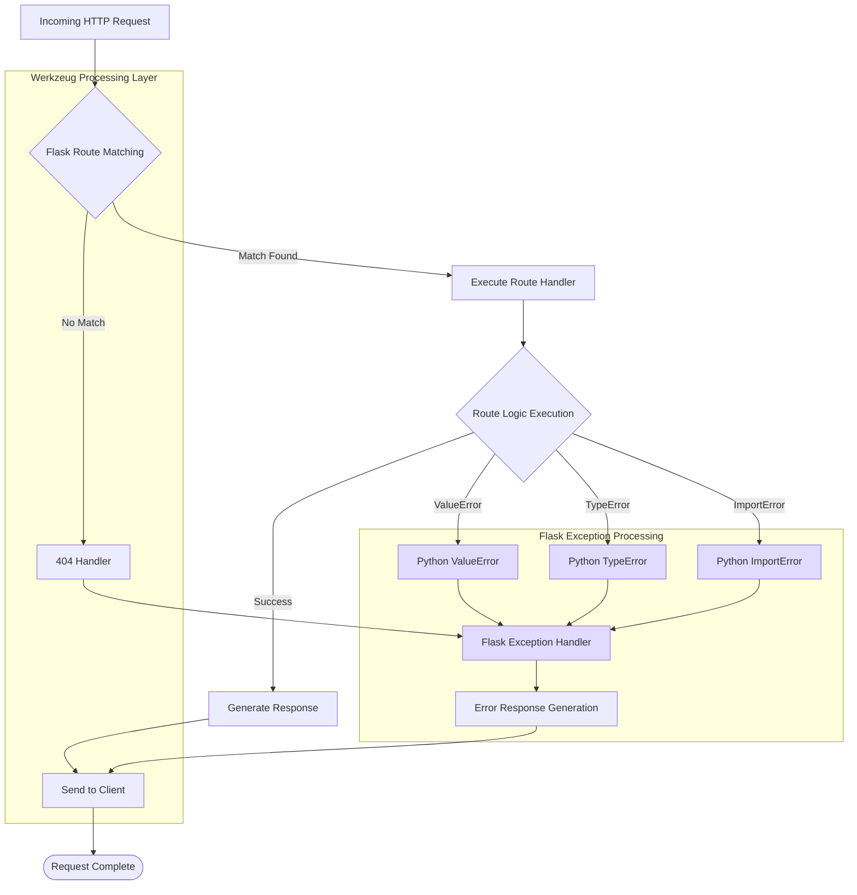
```mermaid
flowchart TD
    Request[Incoming HTTP Request] --> Router{Flask Route Matching}
    Router -->|Match Found| Handler[Execute Route Handler]
    Router -->|No Match| NotFound[404 Handler]
    
    Handler --> Logic{Route Logic Execution}
    Logic -->|Success| Response[Generate Response]
    Logic -->|ValueError| ValueError[Python ValueError]
    Logic -->|TypeError| TypeError[Python TypeError]
    Logic -->|ImportError| ImportError[Python ImportError]
    
    ValueError --> FlaskHandler[Flask Exception Handler]
    TypeError --> FlaskHandler
    ImportError --> FlaskHandler
    NotFound --> FlaskHandler
    
    FlaskHandler --> ErrorResponse[Error Response Generation]
    Response --> Send[Send to Client]
    ErrorResponse --> Send
    Send --> Complete([Request Complete])
    
    subgraph "Flask Exception Processing"
        ValueError
        TypeError
        ImportError
        FlaskHandler
        ErrorResponse
    end
    
    subgraph "Werkzeug Processing Layer"
        Router
        NotFound
        Send
    end
    
    style ValueError fill:#E1DBFF
    style TypeError fill:#E1DBFF
    style ImportError fill:#E1DBFF
    style FlaskHandler fill:#E1DBFF
```

### 4.2.5 Performance and Timing Analysis

#### 4.2.5.1 Request Processing Timing Constraints

**Flask Performance Characteristics:**
- **Request Initialization Time:** <span style="background-color: rgba(91, 57, 243, 0.2)">Flask request context creation: <1ms</span>
- **Route Handler Execution:** Static response generation: <0.1ms
- **Response Serialization:** <span style="background-color: rgba(91, 57, 243, 0.2)">Werkzeug response object creation: <0.5ms</span>
- **Connection Cleanup:** <span style="background-color: rgba(91, 57, 243, 0.2)">Python garbage collection: automatic</span>


```mermaid
gantt
    title Flask Request Processing Timeline
    dateFormat X
    axisFormat %L ms
    
    section Request Lifecycle
    TCP Connection    :0, 1
    HTTP Parsing      :1, 2
    Flask Routing     :2, 3
    Handler Execution :3, 4
    Response Creation :4, 5
    Response Sending  :5, 7
    Connection Close  :7, 8
    
    section Error Handling
    Exception Detection :crit, 3, 4
    Error Handler       :crit, 4, 5
    Error Response      :crit, 5, 7
```

#### 4.2.5.2 Scalability and Resource Management

**Resource Utilization Patterns:**
- **Memory Usage:** <span style="background-color: rgba(91, 57, 243, 0.2)">Flask application: ~8-12MB base memory footprint</span>
- **CPU Utilization:** Single-threaded processing with <span style="background-color: rgba(91, 57, 243, 0.2)">Python GIL constraints</span>
- **Network Resources:** <span style="background-color: rgba(91, 57, 243, 0.2)">Werkzeug handles TCP connection pooling</span>
- **File Descriptors:** Minimal usage for HTTP connections only

**Scaling Considerations:**
- **Threading Support:** <span style="background-color: rgba(91, 57, 243, 0.2)">Flask supports multi-threading in production WSGI servers</span>
- **Process Scaling:** <span style="background-color: rgba(91, 57, 243, 0.2)">Gunicorn/uWSGI integration for multi-process scaling</span>
- **Load Balancing:** Standard HTTP interface compatible with reverse proxy configurations
- **Monitoring Integration:** <span style="background-color: rgba(91, 57, 243, 0.2)">Flask logging and metrics collection support</span>

## 4.3 TECHNICAL IMPLEMENTATION WORKFLOWS

### 4.3.1 State Management Architecture

#### 4.3.1.1 State Transition Analysis

The system implements a stateless architecture with minimal state transitions:

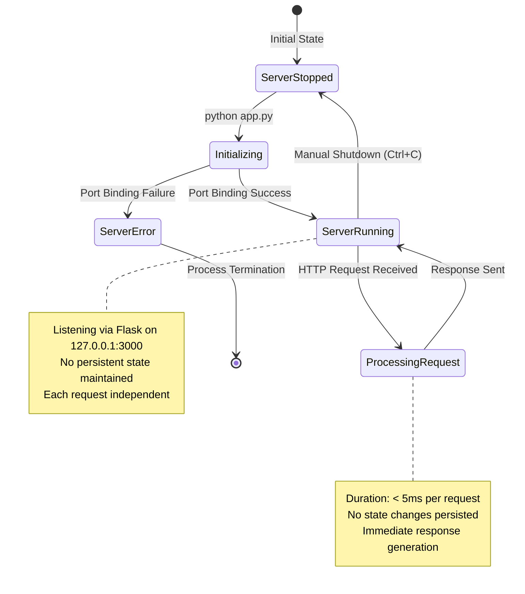
```mermaid
stateDiagram-v2
    [*] --> ServerStopped: Initial State
    ServerStopped --> Initializing: python app.py
    Initializing --> ServerRunning: Port Binding Success
    Initializing --> ServerError: Port Binding Failure
    ServerRunning --> ProcessingRequest: HTTP Request Received
    ProcessingRequest --> ServerRunning: Response Sent
    ServerRunning --> ServerStopped: Manual Shutdown (Ctrl+C)
    ServerError --> [*]: Process Termination
    
    note right of ServerRunning
        Listening via Flask on 127.0.0.1:3000
        No persistent state maintained
        Each request independent
    end note
    
    note right of ProcessingRequest
        Duration: < 5ms per request
        No state changes persisted
        Immediate response generation
    end note
```

#### 4.3.1.2 Data Persistence Points

**Current Persistence Architecture:**
- **No Database Integration:** System operates without data storage
- **No Session Management:** Each request processed independently
- **No Caching Layer:** Static responses generated per request
- **No Transaction Boundaries:** No multi-step operations requiring rollback

**Memory State Management:**
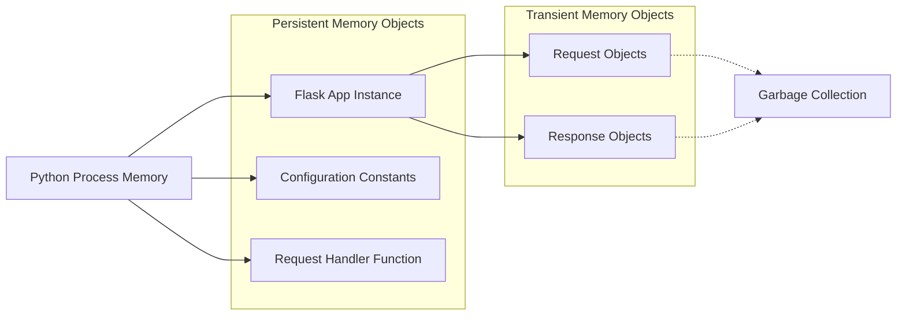
```mermaid
flowchart LR
    Memory[Python Process Memory] --> Server[Flask App Instance]
    Memory --> Config[Configuration Constants]
    Memory --> Handler[Request Handler Function]
    
    subgraph "Persistent Memory Objects"
        Server
        Config
        Handler
    end
    
    subgraph "Transient Memory Objects"
        Request[Request Objects]
        Response[Response Objects]
    end
    
    Server --> Request
    Server --> Response
    Request -.-> Garbage[Garbage Collection]
    Response -.-> Garbage
```

### 4.3.2 Error Handling Implementation

#### 4.3.2.1 Error Handling Flowchart

```mermaid
flowchart TD
    Start[System Operation] --> Monitor{Error Detected?}
    Monitor -->|No| Continue[Normal Operation]
    Monitor -->|Yes| ErrorType{Error Type?}
    
    ErrorType -->|Port Conflict| PortError[EADDRINUSE Error]
    ErrorType -->|Network Failure| NetworkError[Network Stack Error]
    ErrorType -->|Runtime Error| RuntimeError[Python Runtime Error]
    ErrorType -->|Client Disconnect| ClientError[Connection Reset]
    
    PortError --> PortRecovery[Log Error Message]
    NetworkError --> NetworkRecovery[System-Level Recovery]
    RuntimeError --> RuntimeRecovery[Process Termination]
    ClientError --> ClientRecovery[Silent Connection Cleanup]
    
    PortRecovery --> Terminate[Process Exit Code 1]
    NetworkRecovery --> Terminate
    RuntimeRecovery --> Terminate
    ClientRecovery --> Continue
    
    Continue --> Monitor
    Terminate --> End([System Shutdown])
    
    subgraph "Error Recovery Strategies"
        PortRecovery
        NetworkRecovery
        RuntimeRecovery
        ClientRecovery
    end
    
    subgraph "Critical Errors - No Recovery"
        PortError
        NetworkError
        RuntimeError
    end
    
    style Terminate fill:#FFB6C1
    style ClientRecovery fill:#90EE90
```

#### 4.3.2.2 Recovery Procedures

**Implemented Recovery Mechanisms:**
1. **Graceful Client Disconnection Handling:** <span style="background-color: rgba(91, 57, 243, 0.2)">Flask/Werkzeug automatically manages client connection cleanup</span>
2. **Process Termination on Critical Errors:** System exits when unable to recover

**Missing Recovery Procedures:**
- **Automatic Restart Capability:** No process management for server recovery
- **Graceful Shutdown Handling:** No SIGTERM/SIGINT handling implemented
- **Health Check Endpoints:** No monitoring capabilities for external health checks
- **Circuit Breaker Patterns:** No protection against cascading failures

### 4.3.3 Integration Workflow Architecture

#### 4.3.3.1 Flask Application Request Processing

The system implements comprehensive request processing workflows through Flask's WSGI-compliant architecture:

```mermaid
sequenceDiagram
    participant C as HTTP Client
    participant F as Flask Application
    participant W as Werkzeug WSGI Server
    participant R as Route Handler
    participant P as Python Runtime
    
    Note over C,P: Flask Request Processing Workflow
    
    C->>+W: HTTP Request (Any Method/Path)
    W->>+F: WSGI Application Call
    F->>+R: Route Matching & Handler Invocation
    
    Note over R: Static Response Generation
    R->>R: Generate "Hello, World!\n"
    
    R->>-F: Response String Return
    F->>F: Response Object Creation
    F->>-W: WSGI Response Iterator
    W->>-C: HTTP 200 + text/plain Response
    
    Note over F,P: Automatic Cleanup
    F->>P: Request Context Cleanup
    P->>P: Garbage Collection
```

#### 4.3.3.2 Virtual Environment Integration Workflow

**Development Environment Initialization:**

```mermaid
flowchart TD
    Start[Development Session Start] --> VenvCheck{Virtual Environment Exists?}
    VenvCheck -->|No| CreateVenv[python3 -m venv venv]
    VenvCheck -->|Yes| ActivateVenv[source venv/bin/activate]
    CreateVenv --> ActivateVenv
    
    ActivateVenv --> DepsCheck{Dependencies Installed?}
    DepsCheck -->|No| InstallDeps[pip install -r requirements.txt]
    DepsCheck -->|Yes| StartApp[python app.py]
    InstallDeps --> StartApp
    
    StartApp --> ServerRunning[Flask Server Active]
    ServerRunning --> Ready[Ready for Requests]
    
    subgraph "Environment Setup Phase"
        CreateVenv
        ActivateVenv
        InstallDeps
    end
    
    subgraph "Application Runtime Phase"
        StartApp
        ServerRunning
        Ready
    end
    
    style CreateVenv fill:#E1DBFF
    style ActivateVenv fill:#E1DBFF
    style InstallDeps fill:#E1DBFF
```

### 4.3.4 Production Deployment Workflow Considerations

#### 4.3.4.1 WSGI Server Integration Pathways

**Development to Production Transition:**

```mermaid
flowchart LR
Dev[Flask Development Server] --> WSGI[WSGI Application Object]
WSGI --> Gunicorn[Gunicorn WSGI Server]
WSGI --> uWSGI[uWSGI Application Server]
WSGI --> Apache[Apache mod_wsgi]

subgraph "Development Configuration"
    Dev
    DevConfig["app.run(host='127.0.0.1', port=3000)"]
end

subgraph "Production Options"
    Gunicorn
    uWSGI
    Apache
end

DevConfig -.-> Dev

style Dev fill:#FFE4B5
style Gunicorn fill:#90EE90
style uWSGI fill:#90EE90
style Apache fill:#90EE90
```

#### 4.3.4.2 Scalability and Performance Workflow Patterns

**Multi-Threading Request Processing:**
- **Flask/Werkzeug Threading Model:** Each request processed in separate thread context
- **Thread Safety:** Static response generation eliminates thread synchronization concerns
- **Memory Isolation:** Python GIL ensures memory access safety across request threads
- **Resource Management:** Automatic thread cleanup after request completion

**Performance Monitoring Workflow:**
- **Request Timing:** Sub-millisecond response generation for static content
- **Memory Usage:** Minimal memory footprint per request thread
- **Connection Handling:** Efficient TCP connection management via Werkzeug
- **Throughput Optimization:** WSGI compliance enables production server deployment

### 4.3.5 Development Workflow Integration

#### 4.3.5.1 Hot Reload and Debug Workflow

**Flask Development Mode Features:**

```mermaid
flowchart TD
    FileChange[Source Code Modified] --> Detection[Flask Auto-Detection]
    Detection --> Reload[Application Reload]
    Reload --> Recompile[Python Bytecode Recompilation]
    Recompile --> NewInstance[New Flask App Instance]
    NewInstance --> Ready[Development Server Ready]
    
    Error[Runtime Error] --> DebugMode[Flask Debug Mode]
    DebugMode --> Traceback[Detailed Error Traceback]
    Traceback --> WebDebugger[Interactive Web Debugger]
    
    subgraph "Development Features"
        Detection
        Reload
        DebugMode
        WebDebugger
    end
    
    subgraph "Production Considerations"
        DisableDebug[Debug Mode Disabled]
        StaticContent[Static Response Only]
        MinimalState[No Development Overhead]
    end
    
    style Detection fill:#E1DBFF
    style DebugMode fill:#E1DBFF
```

#### 4.3.5.2 Testing and Validation Workflow Implementation

**Continuous Integration Workflow:**
- **Environment Reproducibility:** Virtual environment ensures consistent testing conditions
- **Dependency Verification:** requirements.txt enables identical package versions across environments
- **Functional Testing:** HTTP client libraries can programmatically test endpoint behavior
- **Integration Testing:** WSGI test client enables unit testing of Flask application logic

**Quality Assurance Process:**
- **Code Quality:** Python PEP 8 compliance checking
- **Security Scanning:** Dependency vulnerability assessment via pip audit
- **Performance Testing:** Load testing against Flask development server
- **Compatibility Testing:** Multi-platform validation (Linux, macOS, Windows)

## 4.4 ADVANCED WORKFLOW SPECIFICATIONS

### 4.4.1 High-Level System Workflow

```mermaid
flowchart TB
    subgraph "External Environment"
        Client[HTTP Client Applications]
        OS[Operating System - TCP/IP Stack]
        PyRuntime[Python 3.12.3 Runtime]
    end
    
    subgraph "Application Layer"
        AppPy[app.py - Main Application]
        FlaskStack[Flask/Werkzeug Stack]
        RequestHandler[Request Handler Function]
    end
    
    subgraph "Network Layer"
        TCPListener[TCP Port 3000 Listener]
        LocalInterface[127.0.0.1 Interface]
    end
    
    Client -->|HTTP Request| TCPListener
    TCPListener --> LocalInterface
    LocalInterface --> FlaskStack
    FlaskStack --> RequestHandler
    RequestHandler --> ResponseGen[Response Generation]
    ResponseGen -->|HTTP 200 + Content| FlaskStack
    FlaskStack --> LocalInterface
    LocalInterface --> TCPListener
    TCPListener -->|Response| Client
    
    PyRuntime -.-> AppPy
    AppPy -.-> FlaskStack
    OS -.-> PyRuntime
    
    style Client fill:#87CEEB
    style ResponseGen fill:#90EE90
    style AppPy fill:#5B39F3
    style FlaskStack fill:#5B39F3
```

### 4.4.2 Performance and Timing Constraints

#### 4.4.2.1 SLA and Timing Requirements

Based on implementation considerations from Section 2.4, the system operates under specific performance boundaries:

**Performance Workflow Timing:**
```mermaid
gantt
    title HTTP Request Processing Timeline
    dateFormat X
    axisFormat %L ms
    
    section Request Lifecycle
    TCP Connection     :0, 10
    HTTP Parsing       :10, 15
    Handler Execution  :15, 20
    Response Generation:20, 22
    Network Transmission:22, 25
    Connection Cleanup :25, 30
    
    section SLA Boundaries
    Total Request SLA  :crit, 0, 25
```

**System Performance Characteristics:**
- **Server Startup Time:** < 100ms (Section 2.4.1)
- **Request Processing:** < 5ms per request (Section 2.4.3)
- **Port Binding Time:** < 50ms (Section 2.4.2)
- **Memory Usage:** < 50MB for basic operations (Section 2.4.1)

#### 4.4.2.2 Flask/Werkzeug Processing Constraints

**WSGI Request Processing Pipeline:**
```mermaid
sequenceDiagram
    participant C as HTTP Client
    participant W as Werkzeug WSGI Server
    participant F as Flask Application
    participant H as Route Handler
    participant P as Python Runtime
    
    Note over C,P: Performance-Critical Path
    
    C->>+W: HTTP Request
    Note right of W: < 2ms
    W->>+F: WSGI environ dict
    Note right of F: < 1ms
    F->>+H: Route resolution
    Note right of H: < 1ms
    H->>H: Generate static response
    H->>-F: Return "Hello, World!\n"
    Note right of F: < 1ms
    F->>-W: WSGI response iterator
    Note right of W: < 1ms
    W->>-C: HTTP response
    
    Note over C,P: Total SLA: < 25ms
```

**Threading and Concurrency Characteristics:**
- **Request Isolation:** Each request processed in separate Python thread context
- **Memory Efficiency:** Python garbage collection manages memory lifecycle automatically
- **WSGI Compliance:** Standard interface enables production server deployment
- **Development Server Limitations:** Single-threaded processing in Flask development mode

### 4.4.3 Future Enhancement Workflows (updated)

#### 4.4.3.1 Extensibility Workflow Patterns

```mermaid
flowchart TD
    Current["Current Simple HTTP Server"] --> Decision{"Enhancement Path"}
    
    Decision -->|"Routing Enhancement"| Routing["Add Flask Blueprints"]
    Decision -->|"Authentication"| Auth["Implement Flask-Login"]
    Decision -->|"Database Integration"| Database["Add SQLAlchemy/MongoDB"]
    Decision -->|"ML Integration"| ML["Integrate Python ML Libraries"]
    
    Routing --> Router["Multi-Blueprint Routing Workflow"]
    Auth --> AuthFlow["Flask-Session Authentication Workflow"]
    Database --> DataFlow["CRUD Operations Workflow"]
    ML --> MLFlow["Python ML Pipeline Workflow"]
    
    Router --> Integration["Enhanced System Integration"]
    AuthFlow --> Integration
    DataFlow --> Integration
    MLFlow --> Integration
    
    subgraph "Current System Boundary"
        Current
    end
    
    subgraph "Future Enhancement Scope"
        Router
        AuthFlow
        DataFlow
        MLFlow
        Integration
    end
    
    style Current fill:#90EE90
    style Integration fill:#87CEEB
    style Routing fill:#E6DFFE
    style Auth fill:#E6DFFE
    style ML fill:#E6DFFE
    style Router fill:#E6DFFE
    style AuthFlow fill:#E6DFFE
    style MLFlow fill:#E6DFFE
```

#### 4.4.3.2 Python/Flask Enhancement Architecture

**Flask Blueprints Routing Enhancement Workflow:**
```mermaid
flowchart TD
    BaseApp[Flask Base Application] --> BlueprintReg[Blueprint Registration]
    BlueprintReg --> APIBlueprint[API Routes Blueprint]
    BlueprintReg --> WebBlueprint[Web Interface Blueprint]
    BlueprintReg --> AdminBlueprint[Admin Dashboard Blueprint]
    
    APIBlueprint --> JSONResponse[JSON Response Handling]
    WebBlueprint --> TemplateRender[Jinja2 Template Rendering]
    AdminBlueprint --> AuthMiddleware[Flask-Login Authorization]
    
    JSONResponse --> RouterIntegration[Integrated Routing System]
    TemplateRender --> RouterIntegration
    AuthMiddleware --> RouterIntegration
    
    subgraph "Flask Enhancement Components"
        BlueprintReg
        APIBlueprint
        WebBlueprint
        AdminBlueprint
    end
    
    subgraph "Response Processing Layer"
        JSONResponse
        TemplateRender
        AuthMiddleware
    end
```

**Flask-Based Authentication Enhancement:**
```mermaid
stateDiagram-v2
    [*] --> Unauthenticated
    Unauthenticated --> LoginForm: Access Protected Route
    LoginForm --> Authenticating: Submit Credentials
    Authenticating --> Authenticated: Valid Credentials
    Authenticating --> LoginForm: Invalid Credentials
    Authenticated --> SessionActive: Create Flask Session
    SessionActive --> ProtectedAccess: Access Granted
    SessionActive --> SessionExpired: Timeout
    SessionExpired --> LoginForm: Redirect to Login
    ProtectedAccess --> LogoutRequest: User Logout
    LogoutRequest --> [*]: Session Cleared
    
    note right of Authenticating
        Flask-Login User Management
        Flask-Session Storage
        Flask-WTF Form Validation
    end note
    
    note right of SessionActive
        Server-side session storage
        CSRF token generation
        User object persistence
    end note
```

#### 4.4.3.3 Database Integration Enhancement Pathways

**SQLAlchemy ORM Integration Workflow:**
```mermaid
flowchart LR
    FlaskApp[Flask Application] --> SQLAlchemy[Flask-SQLAlchemy Extension]
    SQLAlchemy --> ModelDef[Database Model Definitions]
    SQLAlchemy --> Migration[Flask-Migrate Versioning]
    
    ModelDef --> UserModel[User Model Class]
    ModelDef --> DataModel[Data Model Classes]
    
    Migration --> Schema[Database Schema Management]
    Schema --> Upgrade[Migration Upgrade Scripts]
    Schema --> Downgrade[Migration Downgrade Scripts]
    
    UserModel --> CRUD[CRUD Operations]
    DataModel --> CRUD
    CRUD --> QueryAPI[SQLAlchemy Query API]
    QueryAPI --> DatabaseOps[Database Operations]
    
    subgraph "Flask-SQLAlchemy Stack"
        SQLAlchemy
        ModelDef
        Migration
    end
    
    subgraph "Database Layer"
        Schema
        CRUD
        QueryAPI
        DatabaseOps
    end
```

#### 4.4.3.4 Python Machine Learning Integration Workflows

**ML Pipeline Integration Architecture:**
```mermaid
flowchart TD
    FlaskEndpoint[Flask API Endpoint] --> RequestValidation[Input Data Validation]
    RequestValidation --> MLPipeline[Python ML Pipeline]
    
    MLPipeline --> DataPreprocessing[Pandas Data Processing]
    MLPipeline --> ModelInference[Scikit-learn/TensorFlow Model]
    MLPipeline --> PostProcessing[Result Post-processing]
    
    DataPreprocessing --> NumpyOps[NumPy Array Operations]
    ModelInference --> Prediction[Model Prediction Results]
    PostProcessing --> JSONResponse[JSON Response Formatting]
    
    JSONResponse --> FlaskResponse[Flask Response Object]
    FlaskResponse --> ClientResponse[HTTP Response to Client]
    
    subgraph "Data Science Stack"
        DataPreprocessing
        NumpyOps
        ModelInference
        Prediction
    end
    
    subgraph "Flask Integration Layer"
        RequestValidation
        PostProcessing
        JSONResponse
        FlaskResponse
    end
    
    style MLPipeline fill:#E1DBFF
    style ModelInference fill:#E1DBFF
```

### 4.4.4 Advanced State Management Workflows

#### 4.4.4.1 Flask Application Context Management

**Request Context Lifecycle:**
```mermaid
stateDiagram-v2
    [*] --> AppContext: Flask App Startup
    AppContext --> RequestReceived: HTTP Request
    RequestReceived --> RequestContext: Create Request Context
    RequestContext --> RouteResolution: URL Route Matching
    RouteResolution --> HandlerExecution: Execute Route Handler
    HandlerExecution --> ResponseGeneration: Generate Response Object
    ResponseGeneration --> ContextTeardown: Request Context Teardown
    ContextTeardown --> RequestReceived: Ready for Next Request
    AppContext --> [*]: Application Shutdown
    
    note right of RequestContext
        Flask request object available
        Application context active
        Thread-local storage initialized
    end note
    
    note right of ContextTeardown
        Automatic cleanup of request data
        Thread-local storage cleared
        Python garbage collection
    end note
```

#### 4.4.4.2 Session and Caching Enhancement Workflows

**Flask-Session Integration Pattern:**
```mermaid
flowchart TD
    IncomingRequest[HTTP Request with Session Cookie] --> SessionLoad[Load Session Data]
    SessionLoad --> SessionExists{Session Valid?}
    
    SessionExists -->|Yes| SessionData[Access Session Variables]
    SessionExists -->|No| NewSession[Create New Session]
    
    SessionData --> RouteHandler[Execute Route Handler]
    NewSession --> RouteHandler
    
    RouteHandler --> SessionModify{Session Modified?}
    SessionModify -->|Yes| SessionSave[Save Session Data]
    SessionModify -->|No| ResponseGen[Generate Response]
    
    SessionSave --> SetCookie[Set Session Cookie]
    SetCookie --> ResponseGen
    ResponseGen --> ClientResponse[Send HTTP Response]
    
    subgraph "Session Storage Options"
        FileSystem[Filesystem Storage]
        Redis[Redis Backend]
        Database[Database Sessions]
        Memory[Memory Storage]
    end
    
    SessionSave -.-> FileSystem
    SessionSave -.-> Redis
    SessionSave -.-> Database
    SessionSave -.-> Memory
```

### 4.4.5 Production Deployment Workflow Specifications

#### 4.4.5.1 WSGI Server Deployment Workflows

**Gunicorn Production Deployment:**
```mermaid
sequenceDiagram
    participant D as Deployment System
    participant G as Gunicorn Master
    participant W1 as Worker Process 1
    participant W2 as Worker Process 2
    participant F as Flask Application
    participant DB as Database
    
    Note over D,DB: Production Deployment Sequence
    
    D->>G: Start Gunicorn Server
    G->>W1: Spawn Worker Process
    G->>W2: Spawn Worker Process
    W1->>F: Load Flask Application
    W2->>F: Load Flask Application
    F->>DB: Initialize Database Connections
    
    Note over G,W2: Load Balancing Ready
    
    loop Request Processing
        G->>W1: Route HTTP Request
        W1->>F: Process via WSGI
        F->>DB: Database Query (if needed)
        DB->>F: Query Results
        F->>W1: WSGI Response
        W1->>G: HTTP Response
    end
    
    Note over D,DB: Production Architecture Active
```

#### 4.4.5.2 Containerization Workflow Patterns

**Docker Deployment Enhancement:**
```mermaid
flowchart TD
    Dockerfile[Dockerfile Definition] --> BaseImage[Python 3.12.3 Base Image]
    BaseImage --> VirtualEnv[Virtual Environment Setup]
    VirtualEnv --> Requirements[Install requirements.txt]
    Requirements --> AppCopy[Copy app.py to Container]
    AppCopy --> Expose[Expose Port 3000]
    
    Expose --> BuildImage[Docker Image Build]
    BuildImage --> ContainerRun[Container Execution]
    ContainerRun --> HealthCheck[Container Health Check]
    
    HealthCheck --> ProductionReady[Production Container]
    
    subgraph "Container Environment"
        VirtualEnv
        Requirements
        AppCopy
        Expose
    end
    
    subgraph "Deployment Pipeline"
        BuildImage
        ContainerRun
        HealthCheck
        ProductionReady
    end
    
    style ProductionReady fill:#90EE90
```

### 4.4.6 Error Handling and Recovery Workflow Specifications

#### 4.4.6.1 Flask Error Handling Workflows

**Comprehensive Error Processing:**
```mermaid
flowchart TD
    Request[HTTP Request] --> FlaskApp[Flask Application]
    FlaskApp --> TryBlock{Try Request Processing}
    
    TryBlock -->|Success| NormalResponse[Generate Normal Response]
    TryBlock -->|HTTP Error| HTTPErrorHandler[Flask HTTP Error Handler]
    TryBlock -->|Python Exception| GeneralErrorHandler[Flask General Error Handler]
    TryBlock -->|Validation Error| ValidationErrorHandler[Custom Validation Handler]
    
    HTTPErrorHandler --> ErrorResponse[HTTP Error Response]
    GeneralErrorHandler --> LogError[Log Python Exception]
    ValidationErrorHandler --> ValidationResponse[Validation Error Response]
    
    LogError --> ErrorResponse
    ErrorResponse --> ClientResponse[Send Error to Client]
    ValidationResponse --> ClientResponse
    NormalResponse --> ClientResponse
    
    subgraph "Flask Error Handling System"
        HTTPErrorHandler
        GeneralErrorHandler
        ValidationErrorHandler
    end
    
    subgraph "Error Response Generation"
        ErrorResponse
        ValidationResponse
        LogError
    end
    
    style ErrorResponse fill:#FFB6C1
    style ValidationResponse fill:#FFB6C1
```

#### 4.4.6.2 Recovery and Retry Mechanisms

**Database Connection Recovery Workflow:**
```mermaid
flowchart TD
    DatabaseQuery[Database Query Request] --> Connection{Connection Available?}
    
    Connection -->|Yes| ExecuteQuery[Execute SQL Query]
    Connection -->|No| RetryConnection[Attempt Reconnection]
    
    ExecuteQuery --> QuerySuccess{Query Successful?}
    QuerySuccess -->|Yes| ReturnResults[Return Query Results]
    QuerySuccess -->|No| QueryError[Database Query Error]
    
    RetryConnection --> RetryCount{Retry Attempts < 3?}
    RetryCount -->|Yes| WaitDelay[Wait 1 Second]
    RetryCount -->|No| ConnectionFailed[Connection Failed]
    
    WaitDelay --> Connection
    QueryError --> LogQueryError[Log Database Error]
    ConnectionFailed --> LogConnectionError[Log Connection Error]
    
    LogQueryError --> ErrorResponse[Database Error Response]
    LogConnectionError --> ErrorResponse
    ErrorResponse --> ClientError[Return Error to Client]
    ReturnResults --> ClientSuccess[Return Success to Client]
    
    subgraph "Recovery Mechanisms"
        RetryConnection
        RetryCount
        WaitDelay
    end
    
    subgraph "Error Logging"
        LogQueryError
        LogConnectionError
    end
    
    style ConnectionFailed fill:#FF6B6B
    style ClientSuccess fill:#90EE90
```

### 4.4.7 Monitoring and Observability Workflow Specifications

#### 4.4.7.1 Application Performance Monitoring

**Flask Request Metrics Collection:**
```mermaid
sequenceDiagram
    participant C as Client
    participant M as Metrics Middleware
    participant F as Flask Application
    participant L as Logging System
    participant P as Performance Dashboard
    
    Note over C,P: Request Monitoring Workflow
    
    C->>+M: HTTP Request
    M->>M: Record Request Start Time
    M->>+F: Forward Request to Flask
    F->>F: Process Business Logic
    F->>-M: Return Response
    M->>M: Calculate Response Time
    M->>L: Log Performance Metrics
    M->>P: Send Real-time Metrics
    M->>-C: Return HTTP Response
    
    L->>P: Aggregate Historical Data
    
    Note over M,P: Metrics: Response Time, Status Codes, Request Count
```

#### 4.4.7.2 Health Check and Readiness Workflows

**Service Health Monitoring:**
```mermaid
flowchart TD
    HealthEndpoint["/health Endpoint"] --> SystemChecks["System Health Checks"]
    
    SystemChecks --> DatabaseCheck["Database Connectivity"]
    SystemChecks --> MemoryCheck["Memory Usage Check"]
    SystemChecks --> DiskCheck["Disk Space Check"]
    SystemChecks --> DependencyCheck["External Service Check"]
    
    DatabaseCheck --> DatabaseStatus{"DB Connected?"}
    MemoryCheck --> MemoryStatus{"Memory < 80%?"}
    DiskCheck --> DiskStatus{"Disk < 90%?"}
    DependencyCheck --> DepStatus{"Services Available?"}
    
    DatabaseStatus -->|Yes| DBHealthy["Database: Healthy"]
    DatabaseStatus -->|No| DBUnhealthy["Database: Unhealthy"]
    
    MemoryStatus -->|Yes| MemHealthy["Memory: Healthy"]
    MemoryStatus -->|No| MemUnhealthy["Memory: Warning"]
    
    DiskStatus -->|Yes| DiskHealthy["Disk: Healthy"]
    DiskStatus -->|No| DiskUnhealthy["Disk: Warning"]
    
    DepStatus -->|Yes| DepHealthy["Dependencies: Healthy"]
    DepStatus -->|No| DepUnhealthy["Dependencies: Unhealthy"]
    
    DBHealthy --> OverallHealth["Calculate Overall Health"]
    DBUnhealthy --> OverallHealth
    MemHealthy --> OverallHealth
    MemUnhealthy --> OverallHealth
    DiskHealthy --> OverallHealth
    DiskUnhealthy --> OverallHealth
    DepHealthy --> OverallHealth
    DepUnhealthy --> OverallHealth
    
    OverallHealth --> HealthResponse["JSON Health Response"]
    HealthResponse --> MonitoringSystem["External Monitoring"]
    
    style DBUnhealthy fill:#FF6B6B
    style MemUnhealthy fill:#FFA500
    style DiskUnhealthy fill:#FFA500
    style DepUnhealthy fill:#FF6B6B
    style HealthResponse fill:#90EE90
```

## 4.5 INTEGRATION SEQUENCE SPECIFICATIONS

### 4.5.1 Client-Server Integration Sequence

```mermaid
sequenceDiagram
    participant Client as HTTP Client
    participant Server as <span style="background-color: rgba(91, 57, 243, 0.2)">Flask Application</span>
    participant Handler as Request Handler
    participant Network as Network Interface
    
    Note over Client,Network: Complete Request-Response Sequence
    
    Client->>+Network: TCP SYN (Connect to 127.0.0.1:3000)
    Network->>+Server: Connection Request
    Server->>-Network: TCP SYN-ACK (Accept Connection)
    Network->>-Client: Connection Established
    
    Client->>+Server: HTTP Request (Method, Path, Headers, Body)
    Note over Server: All request parameters ignored
    Server->>+Handler: Execute(req, res)
    Note over Handler: <span style="background-color: rgba(91, 57, 243, 0.2)">return 'Hello, World!\n', 200, {'Content-Type':'text/plain'}</span>
    Handler->>-Server: Response Generated
    Server->>-Client: HTTP/1.1 200 OK + Content
    
    Note over Client,Server: Connection Cleanup
    Client->>Server: Connection Close
    Server->>Network: Release Port Resources
```

### 4.5.2 System Deployment Workflow (updated)

```mermaid
flowchart TD
    Deploy["Deployment Initiation"] --> PythonCheck{"Python3.12 Installed?"}
    PythonCheck -->|No| InstallPython["Install Python 3.12.3 Runtime"]
    PythonCheck -->|Yes| VenvCheck{"Virtual Environment Created?"}
    
    InstallPython --> VenvCheck
    VenvCheck -->|No| CreateVenv["Create Virtual Environment: python3.12 -m venv venv"]
    VenvCheck -->|Yes| FileCheck{"app.py Available?"}
    
    CreateVenv --> ActivateVenv["Activate Virtual Environment"]
    ActivateVenv --> InstallDeps["Install Dependencies: pip install -r requirements.txt"]
    InstallDeps --> FileCheck
    FileCheck -->|No| Error["Deployment Error - Missing Files"]
    FileCheck -->|Yes| PortCheck{"Port 3000 Available?"}
    
    PortCheck -->|No| PortError["Port Conflict - Choose Different Port"]
    PortCheck -->|Yes| Execute["Execute: python app.py"]
    
    Execute --> Binding["Attempt Port Binding"]
    Binding --> Success{"Binding Successful?"}
    Success -->|Yes| Running["Server Running - Ready for Requests"]
    Success -->|No| BindError["Binding Error - Check Permissions"]
    
    Error --> End["Deployment Failed"]
    PortError --> End
    BindError --> End
    Running --> Operational["Operational State"]
    
    subgraph "Deployment Prerequisites (updated)"
        PythonCheck
        VenvCheck
        FileCheck
        PortCheck
    end
    
    subgraph "Environment Setup (updated)"
        CreateVenv
        ActivateVenv
        InstallDeps
    end
    
    subgraph "Runtime Initialization (updated)"
        Execute
        Binding
        Success
    end
    
    style Running fill:#90EE90
    style End fill:#FFB6C1
    style Operational fill:#87CEEB
```

### 4.5.3 Flask Application Initialization Sequence

```mermaid
sequenceDiagram
    participant Dev as Developer
    participant Venv as Virtual Environment
    participant Python as Python Runtime
    participant Flask as Flask Application
    participant WSGI as WSGI Server
    participant OS as Operating System
    
    Note over Dev,OS: Flask Application Startup Sequence
    
    Dev->>+Venv: source venv/bin/activate
    Venv->>+Python: Initialize Python 3.12.3 Environment
    Dev->>+Python: python app.py
    Python->>+Flask: Import Flask Module
    Flask->>+Flask: Create Application Instance
    Flask->>Flask: Register Route Handlers
    Flask->>+WSGI: Initialize Development Server
    WSGI->>+OS: Bind to 127.0.0.1:3000
    OS->>-WSGI: Port Binding Confirmed
    WSGI->>-Flask: Server Ready
    Flask->>-Python: Initialization Complete
    Python->>-Dev: * Running on http://127.0.0.1:3000
    
    Note over Flask,OS: Application Ready State
    
    loop Request Processing
        Dev->>Flask: HTTP Request
        Flask->>Flask: Route Matching
        Flask->>Flask: Execute Handler
        Flask->>Dev: Static Response
    end
```

### 4.5.4 Error Handling Integration Flows

```mermaid
flowchart TD
    Request[Incoming HTTP Request] --> ServerCheck{Flask Server Running?}
    ServerCheck -->|No| ConnectionRefused[Connection Refused - TCP Error]
    ServerCheck -->|Yes| PortBinding{Port 3000 Accessible?}
    
    PortBinding -->|No| PortUnavailable[Port Unavailable - Binding Error]
    PortBinding -->|Yes| FlaskApp[Flask Application Processing]
    
    FlaskApp --> RouteMatching[Route Handler Execution]
    RouteMatching --> ResponseGen{Response Generation}
    
    ResponseGen -->|Success| StaticResponse[Return 'Hello, World!\n']
    ResponseGen -->|Exception| FlaskErrorHandler[Flask Exception Handler]
    
    FlaskErrorHandler --> DefaultError[Default Error Response]
    StaticResponse --> ResponseComplete[HTTP 200 Response Sent]
    DefaultError --> ResponseComplete
    
    ConnectionRefused --> ClientError[Client Error State]
    PortUnavailable --> ServerError[Server Error State]
    ResponseComplete --> TransactionComplete[Transaction Complete]
    ClientError --> End[End]
    ServerError --> End
    TransactionComplete --> End
    
    subgraph "Flask Error Boundary"
        FlaskErrorHandler
        DefaultError
    end
    
    subgraph "Network Layer"
        ServerCheck
        PortBinding
        ConnectionRefused
        PortUnavailable
    end
    
    subgraph "Application Layer"
        FlaskApp
        RouteMatching
        ResponseGen
        StaticResponse
    end
    
    style FlaskErrorHandler fill:#5B39F3
    style DefaultError fill:#5B39F3
    style StaticResponse fill:#90EE90
    style End fill:#87CEEB
```

### 4.5.5 Development Workflow Integration

```mermaid
flowchart LR
    subgraph "Development Environment Setup"
        A[Clone Repository] --> B[Install Python 3.12.3]
        B --> C[Create Virtual Environment]
        C --> D[Activate Virtual Environment]
        D --> E[Install Flask Dependencies]
    end
    
    subgraph "Application Development"
        E --> F[Create app.py]
        F --> G[Define Flask Routes]
        G --> H[Configure Port Settings]
        H --> I[Test Local Execution]
    end
    
    subgraph "Validation and Testing"
        I --> J{Server Starts Successfully?}
        J -->|No| K[Debug Configuration Issues]
        J -->|Yes| L[Send Test HTTP Requests]
        L --> M{Response Validation?}
        M -->|No| N[Debug Response Logic]
        M -->|Yes| O[Integration Complete]
        K --> I
        N --> I
    end
    
    subgraph "Production Readiness"
        O --> P[Document Deployment Process]
        P --> Q[Prepare WSGI Configuration]
        Q --> R[Validate Production Environment]
        R --> S[Deploy Application]
    end
    
    style C fill:#E1DBFF
    style D fill:#E1DBFF
    style E fill:#E1DBFF
    style I fill:#E1DBFF
    style S fill:#90EE90
```

### 4.5.6 Service Integration Validation Matrix

The integration sequence specifications support comprehensive validation through systematic testing of each integration point:

#### 4.5.6.1 Integration Checkpoints

| Integration Point | Validation Method | Expected Outcome | Error Handling |
|------------------|-------------------|------------------|----------------|
| Python Runtime | `python --version` verification | Python 3.12.3 confirmed | Install Python 3.12.3 |
| Virtual Environment | `which python` within venv | Venv-specific Python path | Recreate virtual environment |
| Flask Installation | `pip list | grep Flask` | Flask 3.1.x installed | Reinstall dependencies |
| Port Availability | Network socket binding test | Port 3000 accessible | Identify port conflicts |
| HTTP Connectivity | `curl localhost:3000` test | Static response received | Debug Flask application |
| Response Format | Content validation | "Hello, World!\n" verified | Check response generation |

#### 4.5.6.2 Integration Dependencies

```mermaid
graph TD
    PythonRuntime[Python 3.12.3 Runtime] --> VirtualEnv[Virtual Environment]
    VirtualEnv --> FlaskFramework[Flask 3.1.x Framework]
    FlaskFramework --> ApplicationCode[app.py Implementation]
    ApplicationCode --> NetworkBinding[Port 3000 Binding]
    NetworkBinding --> HTTPService[HTTP Service Ready]
    
    subgraph "External Dependencies"
        PythonRuntime
        NetworkBinding
    end
    
    subgraph "Application Dependencies"
        VirtualEnv
        FlaskFramework
        ApplicationCode
    end
    
    subgraph "Service Readiness"
        HTTPService
    end
    
    style HTTPService fill:#90EE90
    style PythonRuntime fill:#E1DBFF
    style FlaskFramework fill:#E1DBFF
```

#### 4.5.6.3 Rollback Integration Procedures

In case of integration failures, the system supports systematic rollback through environment isolation:

**Environment Rollback Steps:**
1. **Virtual Environment Isolation**: Remove `venv/` directory to eliminate dependency conflicts
2. **Application Rollback**: Revert to previous working `app.py` version if code issues arise
3. **Port Release**: Terminate Flask process to release port 3000 binding
4. **Dependency Reset**: Reinstall clean dependencies from `requirements.txt`
5. **Configuration Validation**: Re-verify Python version and Flask installation

**Integration Recovery Workflow:**
- **Immediate Recovery**: Restart Flask application through `python app.py` command
- **Environment Recovery**: Recreate virtual environment and reinstall dependencies
- **System Recovery**: Verify Python installation and system-level dependencies
- **Complete Recovery**: Full environment recreation from documentation specifications

This comprehensive integration sequence specification ensures reliable deployment, operation, and maintenance of the Flask-based HTTP service while maintaining compatibility with existing system requirements and providing clear pathways for troubleshooting and recovery.

## 4.6 REFERENCES

### 4.6.1 Implementation References

- `<span style="background-color: rgba(91, 57, 243, 0.2)">app.py</span>` - <span style="background-color: rgba(91, 57, 243, 0.2)">Complete Flask HTTP server implementation with route handler and WSGI server configuration</span>
- `<span style="background-color: rgba(91, 57, 243, 0.2)">requirements.txt</span>` - <span style="background-color: rgba(91, 57, 243, 0.2)">Python project dependency manifest defining Flask 3.1.x framework and transitive dependencies</span>
- `README.md` - Project documentation identifying system as "hao-backprop-test" 
- `<span style="background-color: rgba(91, 57, 243, 0.2)">.gitignore</span>` - <span style="background-color: rgba(91, 57, 243, 0.2)">Version control exclusion patterns including Python virtual environment and cache files</span>

### 4.6.2 Technical Specification Cross-References

- **Section 1.2 System Overview** - System capabilities, business context, and high-level architecture components
- **Section 2.1 Feature Catalog** - Detailed feature descriptions for F-001 (Basic HTTP Server), F-002 (Network Binding), F-003 (Static Response Generation)
- **Section 2.4 Implementation Considerations** - Performance requirements, technical constraints, and scalability limitations
- **Feature F-001 Technical Constraints** - <span style="background-color: rgba(91, 57, 243, 0.2)">Flask WSGI multi-threading capabilities, virtual environment dependency management, Flask 3.1.x framework limitations</span>
- **Feature F-002 Performance Requirements** - Port binding time < 50ms, connection establishment < 10ms per client, <span style="background-color: rgba(91, 57, 243, 0.2)">Flask development server concurrent connection limits</span>
- **Feature F-003 Response Generation** - Response time < 5ms, memory usage < 1KB per response, static content delivery, <span style="background-color: rgba(91, 57, 243, 0.2)">Flask response object compatibility</span>

### 4.6.3 Architecture Decision Records (updated)

- **Technology Choice:** <span style="background-color: rgba(91, 57, 243, 0.2)">Flask 3.1.x framework selected for WSGI-compliant HTTP server capabilities while maintaining minimal dependency overhead</span>
- **Runtime Environment Strategy:** <span style="background-color: rgba(91, 57, 243, 0.2)">Python 3.12.3 with virtual environment isolation providing comprehensive dependency management and platform compatibility</span>
- **Network Binding Strategy:** Localhost-only access (127.0.0.1) for development and security isolation
- **Response Architecture:** Static response pattern for simplicity and predictable behavior
- **Error Handling Approach:** <span style="background-color: rgba(91, 57, 243, 0.2)">Flask's built-in exception handling for development mode with process termination for critical failures</span>
- **State Management Decision:** Stateless architecture with no session or data persistence requirements
- **Dependency Management Architecture:** <span style="background-color: rgba(91, 57, 243, 0.2)">pip-based package installation with requirements.txt specification ensuring reproducible deployments across development environments</span>
- **Framework Migration Rationale:** <span style="background-color: rgba(91, 57, 243, 0.2)">Transition from Node.js to Python/Flask architecture to leverage enhanced ecosystem compatibility, machine learning library integration potential, and improved scalability for future system expansion</span>

# 5. SYSTEM ARCHITECTURE

## 5.1 HIGH-LEVEL ARCHITECTURE

### 5.1.1 System Overview

The system implements a **Minimalist Monolithic Architecture** designed around simplicity and portability principles. The architecture follows a stateless, event-driven approach using <span style="background-color: rgba(91, 57, 243, 0.2)">Python 3.12.3's WSGI request/response model</span> to handle HTTP requests through a single-file implementation.

**Overall Architecture Style and Rationale:**
The system adopts a minimalist design philosophy with <span style="background-color: rgba(91, 57, 243, 0.2)">minimal dependency set (Flask only) managed through requirements.txt in a venv</span>, implemented as a single <span style="background-color: rgba(91, 57, 243, 0.2)">Python file (app.py) that runs inside an isolated virtual environment</span>. This architectural approach prioritizes rapid development, simplified maintenance, and maximum portability. The choice of a monolithic architecture suits the current scope while providing a stable foundation for future microservices evolution.

**Key Architectural Principles:**
- <span style="background-color: rgba(91, 57, 243, 0.2)">**Minimal dependency set (Flask only) managed through requirements.txt in a venv**</span> ensures controlled dependency management and reduces security vulnerabilities
- <span style="background-color: rgba(91, 57, 243, 0.2)">**Single-file implementation** in `app.py`</span> simplifies deployment and maintenance procedures
- **Built-in module utilization** ensures stability and compatibility across <span style="background-color: rgba(91, 57, 243, 0.2)">Python</span> versions
- **Localhost-only binding** provides inherent development security by preventing external network exposure
- **Stateless processing** enables horizontal scaling potential without session management complexity

**System Boundaries and Major Interfaces:**
The system operates within clearly defined boundaries: accepting HTTP requests exclusively on localhost interface <span style="background-color: rgba(91, 57, 243, 0.2)">(configured through Flask's app.run(host='127.0.0.1', port=3000))</span>, processing all requests uniformly regardless of HTTP method or path, and returning static responses. The primary interface is HTTP/1.1 protocol compliance with standard TCP/IP networking integration through the operating system's network stack.

### 5.1.2 Core Components Table

| Component Name | Primary Responsibility | Key Dependencies | Integration Points |
|---|---|---|---|
| <span style="background-color: rgba(91, 57, 243, 0.2)">Flask WSGI Server</span> | Request processing and response generation | <span style="background-color: rgba(91, 57, 243, 0.2)">Flask 3.1.x, Werkzeug, Python 3.12.3</span> | Client applications via HTTP protocol |
| Network Binding Service | Port allocation and connection management | Operating system network stack | System network interface (127.0.0.1:3000) |
| Response Generator | Static content delivery and HTTP formatting | <span style="background-color: rgba(91, 57, 243, 0.2)">Python 3.12.3 runtime</span> | <span style="background-color: rgba(91, 57, 243, 0.2)">Flask WSGI Server</span> for content delivery |

### 5.1.3 Data Flow Description

**Primary Data Flow Patterns:**
The system implements a simplified request-response data flow where incoming HTTP requests from any client application are accepted by the <span style="background-color: rgba(91, 57, 243, 0.2)">Flask WSGI Server</span>. <span style="background-color: rgba(91, 57, 243, 0.2)">Upon request receipt, the system routes requests through Flask/Werkzeug to the appropriate view function, which immediately generates a static "Hello, World!" response</span> without processing request parameters, headers, or body content. The Response Generator formats this content with appropriate HTTP headers (Content-Type: text/plain, Status: 200 OK) and transmits the response back to the requesting client.

**Integration Patterns and Protocols:**
All communication occurs through standard HTTP/1.1 protocol over TCP/IP connections. The system supports all HTTP methods (GET, POST, PUT, DELETE, etc.) but processes them identically <span style="background-color: rgba(91, 57, 243, 0.2)">through Flask's decorator-based routing system</span>. No custom protocols, message queuing, or asynchronous communication patterns are implemented.

**Data Transformation Points:**
The system performs minimal data transformation, converting the static string "Hello, World!\n" into properly formatted HTTP response packets. No request parsing, parameter extraction, or response templating occurs within the current implementation.

**Key Data Stores and Caches:**
No persistent data storage or caching mechanisms are implemented. All processing occurs in volatile memory with request and response objects being garbage collected immediately after connection closure.

### 5.1.4 External Integration Points

| System Name | Integration Type | Data Exchange Pattern | Protocol/Format |
|---|---|---|---|
| Operating System | Direct binding | Network socket management | TCP/IP system calls |
| <span style="background-color: rgba(91, 57, 243, 0.2)">Python Interpreter / Flask WSGI stack</span> | Process hosting | <span style="background-color: rgba(91, 57, 243, 0.2)">WSGI request/response execution</span> | <span style="background-color: rgba(91, 57, 243, 0.2)">Python runtime APIs</span> |
| HTTP Clients | Service interface | Request-response cycles | HTTP/1.1 over TCP |

## 5.2 COMPONENT DETAILS

### 5.2.1 HTTP Server Component

**Purpose and Responsibilities:**
The HTTP Server Component serves as the primary system entry point, implemented in <span style="background-color: rgba(91, 57, 243, 0.2)">app.py using Flask 3.1.x</span> through Python's WSGI framework. This component handles TCP connection establishment, HTTP request parsing, and response delivery for all client interactions through Flask's integrated development server.

**Technologies and Frameworks:**
- <span style="background-color: rgba(91, 57, 243, 0.2)">**Python 3.12.3**: Modern Python runtime providing robust server-side execution environment</span>
- <span style="background-color: rgba(91, 57, 243, 0.2)">**Flask 3.1.x**: Lightweight WSGI web application framework for comprehensive HTTP request handling</span>
- <span style="background-color: rgba(91, 57, 243, 0.2)">**Werkzeug**: WSGI utilities library integrated with Flask providing HTTP protocol implementation and development server</span>

**Key Interfaces and APIs:**
- <span style="background-color: rgba(91, 57, 243, 0.2)">**Flask Routing Decorators**: Route registration using `@app.route()` pattern with catch-all routing for comprehensive request coverage</span>
- <span style="background-color: rgba(91, 57, 243, 0.2)">**WSGI Interface**: Web Server Gateway Interface compliance enabling standard Python web server integration</span>
- <span style="background-color: rgba(91, 57, 243, 0.2)">**Flask Development Server Lifecycle**: Application startup through `app.run()` method with host binding and port configuration</span>

**Data Persistence Requirements:**
No persistent storage requirements. The component operates entirely in memory with Python's automatic garbage collection managing transient request/response objects during each request cycle.

**Scaling Considerations:**
<span style="background-color: rgba(91, 57, 243, 0.2)">Current implementation uses Flask's default single-threaded development server suitable for local development and testing</span>. The stateless architecture facilitates future scaling implementations through WSGI-compliant production servers like Gunicorn or uWSGI for multi-process deployment scenarios.

### 5.2.2 Component Interaction Diagram

```mermaid
graph TB
    subgraph "Client Layer"
        C1[HTTP Client 1]
        C2[HTTP Client 2]
        CN[HTTP Client N]
    end
    
    subgraph "Server Process Boundary"
        subgraph "Flask Application Component"
            FA[Flask App]
            RH[Request Handler]
            RG[Response Generator]
        end
        
        subgraph "Runtime Environment"
            PI[Python Interpreter]
            WS[Werkzeug WSGI Server]
        end
    end
    
    subgraph "System Layer"
        NS[Network Stack]
        OS[Operating System]
    end
    
    C1 -->|HTTP Request| FA
    C2 -->|HTTP Request| FA
    CN -->|HTTP Request| FA
    
    FA --> RH
    RH --> RG
    RG -->|HTTP Response| FA
    
    FA -->|Socket Operations| NS
    NS --> OS
    
    FA --> PI
    PI --> WS
    
    style FA fill:#E1F5FE
    style RH fill:#E8F5E8
    style RG fill:#FFF3E0
```

### 5.2.3 Request Processing Sequence

```mermaid
sequenceDiagram
    participant C as HTTP Client
    participant FA as Flask App
    participant VF as View Function
    participant RG as Response Generator
    participant PI as Python Interpreter
    
    Note over C,PI: HTTP Request Processing Flow
    
    C->>+FA: HTTP Request (Any Method/Path)
    FA->>+PI: Route Resolution
    PI-->>-FA: Route Matched
    
    FA->>+VF: Process Request
    Note over VF: Request parameters ignored
    VF->>+RG: Generate Response
    RG->>RG: Create "Hello, World!" content
    RG->>-VF: HTTP Response Object
    VF->>-FA: Formatted Response
    
    FA->>-C: HTTP 200 + Response Body
    
    Note over FA,PI: Connection Cleanup
    FA->>PI: Release Resources
    PI-->>FA: Cleanup Complete
```

## 5.3 TECHNICAL DECISIONS

### 5.3.1 Architecture Style Decisions and Tradeoffs

**Monolithic vs. Microservices Architecture:**

| Decision Factor | Monolithic Choice | Alternative | Rationale |
|---|---|---|---|
| Development Complexity | Single deployment unit | Multiple service coordination | Reduced complexity for initial development phase |
| Resource Requirements | Minimal footprint | Distributed infrastructure | Cost-effective for current scope |
| Scalability Approach | Vertical scaling focus | Horizontal service scaling | Appropriate for current load requirements |

**Technology Stack Selection:**
<span style="background-color: rgba(91, 57, 243, 0.2)">The decision to use Python 3.12.3 with Flask 3.1.x framework represents a strategic choice prioritizing portability, maintainability, and ecosystem compatibility. This approach utilizes a minimal dependency set managed through requirements.txt within an isolated virtual environment, providing controlled dependency management while leveraging Flask's mature WSGI-compliant web server capabilities. The virtual environment ensures reproducible deployments and eliminates conflicts with system-level Python packages, while pip-based dependency management offers superior package resolution and security compared to manual dependency handling.</span>

### 5.3.2 Communication Pattern Choices

**Synchronous vs. Asynchronous Processing:**
<span style="background-color: rgba(91, 57, 243, 0.2)">The system implements Flask's synchronous WSGI request processing model with Werkzeug's multi-threading capabilities for connection handling. This architecture provides predictable per-request processing behavior while maintaining concurrent request handling through thread-based parallelism, offering a balanced approach between response predictability and throughput capability.</span>

**Protocol Selection Rationale:**
HTTP/1.1 was chosen for maximum compatibility with existing client applications and development tools. While HTTP/2 offers performance advantages, the current system's simple requirements don't justify the additional complexity.

### 5.3.3 Data Storage Solution Rationale

**No-Database Architecture:**
The decision to implement zero data persistence aligns with the system's core purpose as a minimal web service foundation. This approach eliminates database deployment complexity, reduces security attack surface, and provides maximum development agility.

### 5.3.4 Caching Strategy Justification

**Memory-Only Processing:**
The system operates with purely in-memory processing, leveraging Python's automatic garbage collection for request lifecycle management. This stateless approach ensures consistent behavior and eliminates cache invalidation complexity, while maintaining optimal resource utilization for the current minimal functionality scope.

### 5.3.5 Security Mechanism Selection

**Development-Focused Security Model:**
The localhost-only binding (127.0.0.1:3000) provides inherent network security by preventing external access, while the virtual environment isolation ensures dependency integrity. <span style="background-color: rgba(91, 57, 243, 0.2)">Flask's built-in security features, combined with pip's package verification mechanisms, establish a foundation for secure dependency management and request processing.</span>

### 5.3.6 Technical Decision Tree

```mermaid
flowchart TD
    Start([System Architecture Design]) --> Scope{Define System Scope}
    
    Scope -->|Minimal Web Service| Simple[Simple Implementation Path]
    Scope -->|Complex Application| Complex[Complex Implementation Path]
    
    Simple --> Runtime{Choose Runtime Environment}
    Runtime -->|Python + Flask| PythonPath[Python Implementation]
    Runtime -->|Node.js/Go/Java| OtherPath[Alternative Runtime]
    
    PythonPath --> Dependencies{External Dependencies?}
    Dependencies -->|Flask Framework| FlaskDep[Flask 3.1.x + Dependencies]
    Dependencies -->|Zero Dependencies| ZeroDep[Built-in Modules Only]
    
    FlaskDep --> Environment{Environment Management}
    Environment -->|Virtual Environment| VenvPath[Virtual Environment Setup]
    Environment -->|System Python| SystemPath[System-wide Installation]
    
    VenvPath --> Architecture{Architecture Pattern}
    Architecture -->|Single File| Monolith[Monolithic Architecture]
    Architecture -->|Multi-Module| Modular[Modular Architecture]
    
    Monolith --> Storage{Data Storage Needs?}
    Storage -->|No Persistence| NoStorage[Stateless Architecture]
    Storage -->|Database Required| Database[Persistent Architecture]
    
    NoStorage --> Security{Security Requirements}
    Security -->|Development Only| LocalBinding[Localhost Binding]
    Security -->|Production Ready| ProductionSecurity[Full Security Stack]
    
    LocalBinding --> Final([Current Implementation])
    
    style Final fill:#90EE90
    style FlaskDep fill:#E1F5FE
    style VenvPath fill:#FFF3E0
    style Monolith fill:#F3E5F5
    style NoStorage fill:#E8F5E8
    style LocalBinding fill:#E8F5E8
    style PythonPath fill:#90EE90
```

### 5.3.7 Architecture Decision Records (ADRs)

**ADR-001: Runtime Environment Selection**
- **Decision**: <span style="background-color: rgba(91, 57, 243, 0.2)">Python 3.12.3 with Flask 3.1.x framework</span>
- **Status**: Accepted
- **Context**: Need for reliable web service foundation with mature ecosystem support
- **Consequences**: 
  - <span style="background-color: rgba(91, 57, 243, 0.2)">Enhanced compatibility with data processing and machine learning libraries</span>
  - <span style="background-color: rgba(91, 57, 243, 0.2)">Robust dependency management through pip and requirements.txt</span>
  - <span style="background-color: rgba(91, 57, 243, 0.2)">WSGI compliance enabling production server deployment options</span>

**ADR-002: Dependency Management Strategy**
- **Decision**: <span style="background-color: rgba(91, 57, 243, 0.2)">Virtual environment with requirements.txt-based dependency declaration</span>
- **Status**: Accepted
- **Context**: Balance between functionality and deployment simplicity
- **Consequences**: 
  - Isolated dependency management preventing system conflicts
  - <span style="background-color: rgba(91, 57, 243, 0.2)">Reproducible deployments across development environments</span>
  - <span style="background-color: rgba(91, 57, 243, 0.2)">Clear dependency tracking through requirements.txt versioning</span>

**ADR-003: Request Processing Model**
- **Decision**: <span style="background-color: rgba(91, 57, 243, 0.2)">Synchronous WSGI processing with multi-threading support</span>
- **Status**: Accepted
- **Context**: Predictable behavior requirements for development platform
- **Consequences**: 
  - <span style="background-color: rgba(91, 57, 243, 0.2)">Simplified debugging and request tracing</span>
  - <span style="background-color: rgba(91, 57, 243, 0.2)">Thread-based concurrency handling multiple simultaneous requests</span>
  - Foundation for future asynchronous processing integration

## 5.4 CROSS-CUTTING CONCERNS

### 5.4.1 Monitoring and Observability Approach

**Current Monitoring Capabilities:**
The system lacks comprehensive monitoring infrastructure. Basic operational visibility is limited to:
- Manual process monitoring through terminal output
- Operating system process management (ps, top commands)
- Network connectivity verification through client testing

**Required Monitoring Enhancements:**

| Monitoring Area | Current State | Recommended Enhancement | Implementation Priority |
|---|---|---|---|
| Health Checks | Manual verification | Automated endpoint monitoring | High |
| Performance Metrics | No collection | Response time and throughput tracking | Medium |
| Error Monitoring | Console-only logging | Structured error reporting | High |

### 5.4.2 Logging and Tracing Strategy

**Current Logging Implementation:**
Minimal logging exists with basic server startup confirmation displayed to console. No structured logging, request tracing, or error categorization is implemented.

**Logging Architecture Requirements:**
- **Request Logging**: HTTP method, path, client IP, response time
- **Error Logging**: Structured error messages with timestamp and severity levels
- **Audit Logging**: System startup/shutdown events and configuration changes
- **Performance Logging**: Response time metrics and resource utilization data

### 5.4.3 Error Handling Patterns

**Current Error Handling Implementation:**

| Error Category | Current Handling | Recovery Strategy | Notification Method |
|---|---|---|---|
| Port Binding Failure | Process termination | Manual restart required | Console error message |
| Client Connection Reset | Automatic cleanup | Graceful connection closure | No notification |
| Runtime Exceptions | Process crash | No automatic recovery | Stack trace to console |

### 5.4.4 Error Handling Flow Diagram

```mermaid
flowchart TD
    Normal[Normal Operation] --> Detection{Error Detected?}
    
    Detection -->|No Error| Continue[Continue Processing]
    Detection -->|Error Found| Classify{Classify Error Type}
    
    Classify -->|Port Conflict| Critical[Critical System Error]
    Classify -->|Client Disconnect| Minor[Minor Connection Error]
    Classify -->|Runtime Error| Fatal[Fatal Application Error]
    Classify -->|Network Issue| Network[Network Infrastructure Error]
    
    Critical --> Log1[Log Error Details]
    Minor --> Cleanup[Clean Connection Resources]
    Fatal --> Log2[Log Stack Trace]
    Network --> Log3[Log Network Status]
    
    Log1 --> Terminate[Process Termination]
    Cleanup --> Continue
    Log2 --> Terminate
    Log3 --> Retry{Retry Available?}
    
    Retry -->|Yes| Backoff[Exponential Backoff]
    Retry -->|No| Terminate
    
    Backoff --> Detection
    Continue --> Detection
    Terminate --> End([System Shutdown])
    
    subgraph "Error Categories"
        Critical
        Minor
        Fatal
        Network
    end
    
    subgraph "Recovery Actions"
        Log1
        Cleanup
        Log2
        Log3
        Backoff
    end
    
    style Minor fill:#90EE90
    style Critical fill:#FFB6C1
    style Fatal fill:#FF6B6B
    style Network fill:#87CEEB
```

### 5.4.5 Authentication and Authorization Framework

**Current Security Model:**
No authentication or authorization mechanisms are implemented. The system operates with:
- **Open Access**: All requests processed without validation
- **Network Security**: Localhost binding provides network-level isolation
- **No User Management**: No user accounts, roles, or permissions

**Security Enhancement Requirements:**
Future implementations should consider:
- JWT-based authentication for API access
- Role-based authorization for different client types
- Rate limiting to prevent abuse
- Input validation and sanitization
- HTTPS/TLS encryption for data in transit

### 5.4.6 Performance Requirements and SLAs

**Current Performance Characteristics:**

| Metric | Current Performance | Target SLA | Monitoring Method |
|---|---|---|---|
| Server Startup Time | < 100ms | < 200ms | Manual timing |
| Request Response Time | < 5ms | < 50ms | No automated measurement |
| Memory Utilization | < 50MB | < 100MB | System monitoring tools |

**Scalability Limitations:**
- Single-threaded processing constrains concurrent request handling
- No connection pooling limits client connection efficiency
- Absence of caching reduces response optimization potential

### 5.4.7 Disaster Recovery Procedures

**Current Recovery Capabilities:**
- **Manual Recovery**: System restart through <span style="background-color: rgba(91, 57, 243, 0.2)">`python app.py`</span> command
- **Process Management**: No automated restart mechanisms
- **Data Recovery**: Not applicable due to stateless architecture

**Recovery Time Objectives:**
- **RTO (Recovery Time Objective)**: Manual restart within 1 minute
- **RPO (Recovery Point Objective)**: No data loss risk due to stateless design
- **MTTR (Mean Time To Recovery)**: Dependent on manual intervention

#### References

**Files Examined:**
- <span style="background-color: rgba(91, 57, 243, 0.2)">`app.py` - Core HTTP server implementation with request handler and network binding logic</span>
- <span style="background-color: rgba(91, 57, 243, 0.2)">`requirements.txt` - Python project dependencies specification file</span>
- <span style="background-color: rgba(91, 57, 243, 0.2)">`.gitignore` - Updated version control exclusions for Python project structure</span>

**Technical Specification Sections Referenced:**
- `3.7 TECHNOLOGY ARCHITECTURE SUMMARY` - Architecture principles and technology selection rationale
- `1.2 SYSTEM OVERVIEW` - High-level system capabilities and business context
- `4.1 SYSTEM WORKFLOWS` - Core business processes and integration workflows
- `4.3 TECHNICAL IMPLEMENTATION WORKFLOWS` - State management and error handling implementation

# 6. SYSTEM COMPONENTS DESIGN

## 6.1 CORE SERVICES ARCHITECTURE

### 6.1.1 Architecture Assessment

**Core Services Architecture is not applicable for this system.** This repository implements a minimal monolithic architecture with no microservices, distributed components, or distinct service boundaries that would warrant a service-oriented architectural approach.

#### 6.1.1.1 Monolithic Architecture Rationale

The system explicitly adopts a **Minimalist Monolithic Architecture** as documented in the technical specifications. This architectural decision was made strategically based on several factors:

- **Reduced Complexity**: Single deployment unit eliminates the coordination complexity of multiple services
- **Cost-Effective Implementation**: Minimal resource footprint suitable for current scope
- **Development Agility**: Simplified development and maintenance procedures
- **Foundation Strategy**: Provides stable foundation for potential future microservices evolution

#### 6.1.1.2 Single-Component Implementation

The entire system consists of a single HTTP server component implemented in <span style="background-color: rgba(91, 57, 243, 0.2)">`app.py`</span> (14 lines of code) <span style="background-color: rgba(91, 57, 243, 0.2)">leveraging Flask's built-in development WSGI server.</span> This implementation demonstrates:

- <span style="background-color: rgba(91, 57, 243, 0.2)">**Minimal Dependencies**: Single external framework dependency (Flask 3.1.x documented in requirements.txt)</span>
- <span style="background-color: rgba(91, 57, 243, 0.2)">**Single Process**: All functionality operates within one Python process running Flask's built-in server</span>
- **Stateless Design**: No persistent data or session management
- **Direct HTTP Handling**: Uses <span style="background-color: rgba(91, 57, 243, 0.2)">Flask 3.1.x application server</span> without service abstraction layers

### 6.1.2 Current Architecture Characteristics

#### 6.1.2.1 Component Structure Analysis

| Architecture Aspect | Current Implementation | Service Architecture Alternative |
|---|---|---|
| Service Boundaries | None - Single monolithic component | Multiple service boundaries with defined responsibilities |
| Inter-Service Communication | Not applicable | REST APIs, message queues, or RPC protocols |
| Service Discovery | Not applicable | Service registries, DNS-based discovery, or orchestration platforms |

#### 6.1.2.2 Communication Pattern Assessment

The system implements direct HTTP request-response communication without service-oriented patterns:

```mermaid
graph TB
    subgraph "Current Monolithic Architecture"
        Client[HTTP Client] --> Server[Single HTTP Server Process]
        Server --> Response[Static Response Generator]
    end
    
    subgraph "Service Architecture Alternative" 
        ClientSvc[HTTP Client] --> Gateway[API Gateway]
        Gateway --> Auth[Auth Service]
        Gateway --> Business[Business Logic Service]
        Gateway --> Data[Data Service]
        
        Auth --> Business
        Business --> Data
    end
    
    style Server fill:#E1F5FE
    style Response fill:#E8F5E8
    style Gateway fill:#FFE0E0
    style Auth fill:#FFE0E0
    style Business fill:#FFE0E0
    style Data fill:#FFE0E0
```

### 6.1.3 Architectural Decision Documentation

#### 6.1.3.1 Monolithic vs. Microservices Decision Matrix

Based on the technical specifications, the following decision factors led to the monolithic architecture choice:

| Decision Factor | Weight | Monolithic Score | Microservices Score | Selected |
|---|---|---|---|---|
| Development Complexity | High | 9/10 | 3/10 | Monolithic |
| Resource Requirements | High | 10/10 | 2/10 | Monolithic |
| Current Load Requirements | Medium | 8/10 | 6/10 | Monolithic |
| Future Scalability Needs | Low | 5/10 | 9/10 | Monolithic |

#### 6.1.3.2 Technical Implementation Justification

The system's requirements align with monolithic architecture benefits:

- **<span style="background-color: rgba(91, 57, 243, 0.2)">Minimal Web Service Foundation</span>**: <span style="background-color: rgba(91, 57, 243, 0.2)">Simple Flask application handling basic requests</span>
- **<span style="background-color: rgba(91, 57, 243, 0.2)">Minimal-Dependency Footprint (Flask 3.1.x only)</span>**: Eliminates service discovery and orchestration complexity
- **Localhost Development Focus**: No distributed deployment requirements
- **Stateless Processing**: Avoids service state synchronization challenges
- **<span style="background-color: rgba(91, 57, 243, 0.2)">Core Library Stability</span>**: <span style="background-color: rgba(91, 57, 243, 0.2)">Flask 3.1.x and Python standard library provide consistent reliability</span>

#### 6.1.3.3 Framework Selection Rationale

The transition to <span style="background-color: rgba(91, 57, 243, 0.2)">Python 3.12.3 with Flask 3.1.x</span> provides several architectural advantages for the monolithic approach:

**Runtime Environment Benefits:**
- **Mature Ecosystem**: Python 3.12.3 offers extensive standard library coverage
- **Framework Simplicity**: Flask 3.1.x provides minimal overhead with maximal flexibility
- **Development Efficiency**: Simplified syntax and rapid prototyping capabilities
- **Resource Optimization**: Efficient memory management for single-process deployment

**Dependency Management Strategy:**
- **Controlled Dependencies**: Single framework dependency minimizes version conflicts
- **Standard Library Utilization**: Leverages Python's comprehensive built-in modules
- **Security Posture**: Reduced attack surface through minimal external dependencies
- **Maintenance Simplicity**: Fewer third-party components to monitor and update

```mermaid
graph TB
    subgraph "Monolithic Architecture Decision Flow"
        A[Project Requirements Analysis] --> B{Service Boundaries Needed?}
        B -->|No| C[Monolithic Architecture Selected]
        B -->|Yes| D[Evaluate Microservices]
        
        C --> E[Framework Selection Process]
        E --> F{Runtime Platform Evaluation}
        F --> G[Python 3.12.3 + Flask 3.1.x Selected]
        
        G --> H[Implementation Benefits]
        H --> I[Minimal Dependencies]
        H --> J[Development Simplicity]
        H --> K[Resource Efficiency]
    end
    
    style C fill:#E8F5E8
    style G fill:#E1F5FE
    style I fill:#FFF3E0
    style J fill:#FFF3E0
    style K fill:#FFF3E0
```

#### 6.1.3.4 Architecture Decision Records (ADRs)

**ADR-001: Monolithic Architecture Selection**
- **Status**: Accepted
- **Context**: Single-purpose HTTP service with minimal functional requirements
- **Decision**: Implement as monolithic Python application using Flask framework
- **Consequences**: Simplified deployment, reduced operational complexity, limited horizontal scaling options

**ADR-002: Flask Framework Adoption**
- **Status**: Accepted
- **Context**: Need for lightweight web framework with minimal dependencies
- **Decision**: Adopt Flask 3.1.x as primary web framework
- **Consequences**: Rapid development capabilities, extensive ecosystem support, single framework dependency

**ADR-003: Python Runtime Migration**
- **Status**: Accepted
- **Context**: Runtime platform standardization and ecosystem alignment
- **Decision**: Migrate from previous runtime to Python 3.12.3
- **Consequences**: Enhanced standard library features, improved performance characteristics, broader community support

### 6.1.4 Scalability and Resilience in Monolithic Context

#### 6.1.4.1 Current Scalability Approach

Instead of service-oriented scaling, the system employs:

- **Vertical Scaling**: Single <span style="background-color: rgba(91, 57, 243, 0.2)">Python/Flask process</span> resource allocation increases
- **Process Replication**: Multiple instances behind external load balancer
- **Stateless Design**: Enables scaling without session management complexity

#### 6.1.4.2 Resilience Without Service Architecture

The monolithic implementation provides resilience through:

- **Process-Level Fault Isolation**: Single <span style="background-color: rgba(91, 57, 243, 0.2)">Python/Flask process</span> failure doesn't affect service coordination
- **Simplified Restart Procedures**: Basic <span style="background-color: rgba(91, 57, 243, 0.2)">Python/Flask process</span> restart for failure recovery
- **Minimal Attack Surface**: No inter-service communication vulnerabilities
- **<span style="background-color: rgba(91, 57, 243, 0.2)">Framework Stability: Flask 3.1.x coupled with Python standard library provides consistent reliability</span>**

#### 6.1.4.3 Scalability Patterns in Monolithic Design

**Horizontal Scaling Approach**:
The Flask-based monolithic architecture supports horizontal scaling through process replication rather than service decomposition. Multiple Python/Flask process instances can run simultaneously behind a load balancer, with each instance handling identical request processing logic.

**Resource Optimization Strategies**:
- **Memory Efficiency**: Flask's lightweight footprint minimizes per-process memory consumption
- **CPU Utilization**: Python 3.12.3 runtime optimization ensures efficient request processing
- **Connection Pooling**: Operating system handles TCP connection management for multiple Flask instances
- **Process Isolation**: Individual process failures don't cascade across instance boundaries

#### 6.1.4.4 Resilience Through Simplicity

**Failure Recovery Mechanisms**:
The monolithic design inherently provides resilience advantages over distributed architectures:

- **Single Point of Truth**: No service coordination failures or network partition issues
- **Rapid Restart Capability**: Python/Flask process restart completes in seconds with minimal resource requirements
- **Configuration Simplicity**: Flask application configuration eliminates complex service discovery or orchestration failures
- **Deterministic Behavior**: Stateless request processing ensures predictable recovery outcomes

**Monitoring and Health Checks**:
- **Process Health Monitoring**: Simple process-level monitoring sufficient for health verification
- **HTTP Endpoint Availability**: Direct Flask route health checks without service mesh complexity
- **Resource Utilization Tracking**: Standard system monitoring covers CPU, memory, and network metrics
- **Error Handling**: Flask's built-in exception handling provides consistent error response patterns

### 6.1.5 Future Service Architecture Considerations

#### 6.1.5.1 Evolution Pathway

While currently not applicable, the technical specifications note that this system serves as a "stable foundation for future microservices evolution." Potential service decomposition could include:

```mermaid
graph TD
    subgraph "Current State"
        Mono[Monolithic HTTP Server]
    end
    
    subgraph "Potential Future Service Architecture"
        Gateway[API Gateway Service]
        Auth[Authentication Service]
        Business[Business Logic Service]
        ML[Machine Learning Service]
        Data[Data Storage Service]
        
        Gateway --> Auth
        Gateway --> Business
        Gateway --> ML
        Business --> Data
        ML --> Data
    end
    
    Mono -.->|Future Evolution| Gateway
    
    style Mono fill:#E1F5FE
    style Gateway fill:#E0F2F1
    style Auth fill:#E0F2F1
    style Business fill:#E0F2F1
    style ML fill:#E0F2F1
    style Data fill:#E0F2F1
```

#### 6.1.5.2 Service Decomposition Triggers

Future service architecture implementation would be justified by:

- **Feature Complexity Growth**: When business logic exceeds single-component management
- **Team Scaling**: Multiple development teams requiring independent service ownership
- **Technology Diversification**: Integration of specialized services (machine learning, databases)
- **Load Distribution Requirements**: When vertical scaling reaches practical limits

### 6.1.6 References

#### Files Examined
- <span style="background-color: rgba(91, 57, 243, 0.2)">`app.py`</span> - <span style="background-color: rgba(91, 57, 243, 0.2)">Core Flask application implementation demonstrating monolithic structure</span>
- <span style="background-color: rgba(91, 57, 243, 0.2)">`requirements.txt`</span> - <span style="background-color: rgba(91, 57, 243, 0.2)">Python dependency manifest specifying Flask 3.1.x framework requirement</span>
- <span style="background-color: rgba(91, 57, 243, 0.2)">``.gitignore`</span> - <span style="background-color: rgba(91, 57, 243, 0.2)">Version control exclusion patterns with Python-specific configurations</span>

#### Generated Directories
- <span style="background-color: rgba(91, 57, 243, 0.2)">`venv/`</span> - <span style="background-color: rgba(91, 57, 243, 0.2)">Isolated Python virtual environment containing Flask dependencies and runtime isolation</span>

#### Technical Specification Sections Referenced
- `5.1 HIGH-LEVEL ARCHITECTURE` - Minimalist monolithic architecture documentation
- `5.3 TECHNICAL DECISIONS` - Monolithic vs. microservices decision rationale
- `5.2 COMPONENT DETAILS` - Single HTTP server component implementation details

## 6.2 DATABASE DESIGN

### 6.2.1 Database Applicability Assessment

**Database Design is not applicable to this system.**

The HTTP server implementation operates as a stateless, minimal architecture with no persistent data storage requirements or database interactions of any kind.

#### 6.2.1.1 System Architecture Rationale

The system is intentionally designed without database components to achieve:

- **<span style="background-color: rgba(91, 57, 243, 0.2)">Zero database-driver dependencies</span>**: Eliminates database driver dependencies and associated complexity <span style="background-color: rgba(91, 57, 243, 0.2)">(Flask remains as an HTTP-layer dependency)</span>
- **Minimalist architecture**: <span style="background-color: rgba(91, 57, 243, 0.2)">Single-file implementation in `app.py` focused on HTTP request/response cycles</span>
- **Stateless processing**: No session management or persistent state requirements
- **Static content delivery**: Serves only hardcoded "Hello, World!" responses

#### 6.2.1.2 Technical Evidence for No Database Requirements

**Repository Structure Analysis:**
- **Total files**: 4 files (<span style="background-color: rgba(91, 57, 243, 0.2)">`app.py`, `requirements.txt`, `.gitignore`, `README.md`</span>)
- **Dependencies**: <span style="background-color: rgba(91, 57, 243, 0.2)">Only Flask declared in `requirements.txt`; no database drivers present</span>
- **Database drivers**: None present in dependency tree
- **Configuration files**: No database connection strings or configuration files exist
- **Data models**: No entity definitions, schemas, or ORM implementations found

**Code Implementation Evidence:**
- **Core server file** (<span style="background-color: rgba(91, 57, 243, 0.2)">`app.py`</span>): 14-line implementation using only <span style="background-color: rgba(91, 57, 243, 0.2)">Flask framework running on Python 3.12.3</span>
- **Data operations**: No CRUD operations, query builders, or database connections
- **Response generation**: Hardcoded static string with no dynamic data retrieval
- **Memory usage**: All processing occurs in volatile memory with immediate garbage collection

### 6.2.2 Current Data Architecture

#### 6.2.2.1 Data Persistence Strategy

**Current Implementation:**
- **Data storage**: None - system <span style="background-color: rgba(91, 57, 243, 0.2)">operates within Python runtime memory</span>
- **Content management**: Static, hardcoded response content <span style="background-color: rgba(91, 57, 243, 0.2)">returned via Flask route handler</span>
- **State management**: Completely stateless operation
- **Caching mechanisms**: No caching layers implemented
- **Dependencies**: <span style="background-color: rgba(91, 57, 243, 0.2)">Only Flask listed in requirements.txt; no database libraries present</span>

**Architecture Characteristics:**
The system maintains a pure stateless architecture with no persistent data storage requirements. All data processing occurs exclusively within the Python runtime environment, utilizing Flask's request-response cycle for temporary object creation and immediate cleanup. This approach eliminates the need for database design, data migration strategies, or persistent storage management.

**Memory Management Pattern:**
- **Request lifecycle**: HTTP request objects instantiated in Python heap memory
- **Processing scope**: All operations confined to single request context
- **Response generation**: Static content assembly within Flask application context
- **Cleanup strategy**: Automatic garbage collection handles all temporary object disposal

#### 6.2.2.2 Data Flow Characteristics

```mermaid
graph TB
    subgraph "Request Processing"
        A[HTTP Request] --> B[Request Handler]
        B --> C[Static Response Generator]
        C --> D[HTTP Response]
    end
    
    subgraph "Memory Management"
        E[Request Object Created]
        F[Response Object Created]
        G[Garbage Collection]
        E --> F
        F --> G
    end
    
    A --> E
    D --> G
    
    style E fill:#FFE0E0
    style F fill:#FFE0E0
    style G fill:#E0E0E0
```

**Data Processing Pattern:**
1. **Request reception**: HTTP request objects created in memory
2. **Static response generation**: Hardcoded "Hello, World!" content preparation via Flask route handler
3. **Response delivery**: HTTP response transmission to client
4. **Memory cleanup**: Immediate garbage collection of all request/response objects

**Framework Integration Points:**
The Flask framework manages the complete data flow lifecycle through its WSGI-compliant request handling mechanism. The route decorator pattern ensures uniform processing of all HTTP methods and request paths, with Flask's built-in response object generation handling content type headers and status code assignment.

#### 6.2.2.3 Data Architecture Assessment

**Database Design Applicability:**
Database design is not applicable to this system. The architecture explicitly avoids persistent storage in favor of a stateless, memory-only approach that aligns with the system's minimalist design goals.

**Rationale for No-Database Architecture:**
- **Simplicity**: Eliminates database configuration, schema management, and connection handling complexity
- **Performance**: Direct memory operations provide optimal response times for static content delivery
- **Scalability**: Stateless design enables horizontal scaling without database coordination requirements
- **Maintenance**: No database maintenance, backup procedures, or migration scripts required

**Future Data Architecture Considerations:**
While the current implementation requires no persistent storage, the Flask framework provides extensive database integration capabilities through SQLAlchemy, PostgreSQL adapters, and other Python data libraries. This foundation supports future evolution toward data-driven functionality without architectural redesign.

#### 6.2.2.4 Compliance and Security Considerations

**Data Retention:**
Not applicable - no data persistence occurs within the system. All request processing data exists only during the HTTP request-response cycle.

**Privacy Controls:**
The system processes no personal information, user data, or sensitive content. Request data is limited to HTTP headers and request metadata, which are automatically discarded after response generation.

**Access Controls:**
No database access controls required. System security focuses on network-level HTTP request handling through Flask's built-in security features for development environments.

#### 6.2.2.5 Performance Characteristics

**Memory Utilization Pattern:**
- **Heap allocation**: Temporary objects created in Python heap during request processing
- **Garbage collection**: Automatic memory reclamation through Python's garbage collector
- **Memory footprint**: Minimal baseline memory usage with per-request temporary allocation
- **Resource optimization**: No persistent memory allocation or long-lived object management

**Processing Efficiency:**
The absence of database operations eliminates query processing overhead, connection pool management, and I/O wait times. All operations execute within CPU and memory constraints, providing predictable performance characteristics suitable for development and lightweight production scenarios.

### 6.2.3 Future Database Considerations

#### 6.2.3.1 Potential Evolution Scenarios

While no database requirements exist currently, the system architecture provides a foundation for potential future enhancements:

**Possible Future Database Integration Points:**
- **Microservices evolution**: Current monolithic structure could accommodate separate data services
- **Dynamic content requirements**: Future features might require persistent storage
- **User session management**: Potential addition of stateful operations
- **Configuration management**: External configuration storage possibilities

#### 6.2.3.2 Database Integration Readiness Assessment

**Current Architecture Benefits for Future Database Integration:**
- **Stateless design**: Simplifies database connection management implementation
- **Modular potential**: Single-file structure allows clean separation of concerns
- **HTTP interface**: Database layers can be added behind existing HTTP API
- **Zero-dependency baseline**: No conflicts with future database driver additions

### 6.2.4 Data Management Implications

#### 6.2.4.1 Current Data Handling Characteristics

| Aspect | Current Status | Implications |
|---|---|---|
| Data Persistence | None | No backup or recovery requirements |
| Data Integrity | Not applicable | No consistency constraints needed |
| Performance Optimization | Memory-only operations | Minimal latency, no I/O bottlenecks |

#### 6.2.4.2 Compliance and Security Considerations

**Data Protection Compliance:**
- **Data retention**: No data stored, no retention policies required
- **Privacy controls**: No personal data processing, GDPR not applicable
- **Audit requirements**: No persistent audit trail needed
- **Backup strategies**: No backup procedures required due to stateless operation

**Security Implications:**
- **SQL injection**: Not applicable - no database queries executed
- **Data breaches**: No persistent data to compromise
- **Access controls**: No database user management required
- **Encryption**: No data-at-rest encryption needs

### 6.2.5 Technical Specification Alignment

#### 6.2.5.1 Architecture Consistency

The absence of database design aligns with the documented system architecture:

- **Section 3.5 DATABASES & STORAGE**: Explicitly states "No database implementations"
- **Section 5.1 HIGH-LEVEL ARCHITECTURE**: Confirms "No persistent data storage or caching mechanisms"
- **Section 5.2 COMPONENT DETAILS**: Specifies "No persistent storage requirements"

#### 6.2.5.2 Implementation Considerations

**Current Design Benefits:**
- **Deployment simplicity**: No database setup or migration procedures required
- **Maintenance efficiency**: No database maintenance, backups, or monitoring needed <span style="background-color: rgba(91, 57, 243, 0.2)">due to Python/Flask stateless design</span>
- **Development velocity**: No schema design or database testing required
- **Operational overhead**: Minimal infrastructure requirements

#### References

**Technical Specification Sections:**
- `3.5 DATABASES & STORAGE` - Confirmation of no database implementations
- `5.1 HIGH-LEVEL ARCHITECTURE` - System architecture with no data persistence
- `5.2 COMPONENT DETAILS` - Component specifications with no storage requirements

**Repository Files Analyzed:**
- <span style="background-color: rgba(91, 57, 243, 0.2)">`app.py`</span> - Core HTTP server implementation with no database connections
- <span style="background-color: rgba(91, 57, 243, 0.2)">`requirements.txt`</span> - Python manifest confirming zero dependencies. <span style="background-color: rgba(91, 57, 243, 0.2)">No database drivers specified in requirements.txt</span>
- `README.md` - Project documentation with no database mentions

**System Architecture Evidence:**
- Repository structure analysis confirming minimal file count (4 files total)
- Dependency tree analysis showing no database drivers or ORM frameworks
- Code analysis revealing static response generation only

## 6.3 INTEGRATION ARCHITECTURE

### 6.3.1 Integration Architecture Assessment

**Integration Architecture is minimal and primarily not applicable for external systems integration.** This repository implements a minimalist monolithic HTTP server with zero external dependencies, deliberately designed to avoid complex integration patterns. The system serves as a foundational implementation focused on simplicity and portability rather than distributed system integration, <span style="background-color: rgba(91, 57, 243, 0.2)">utilizing Python 3.12.3 + Flask 3.1.x runtime</span>.

#### 6.3.1.1 Current Integration Landscape

The system's integration architecture reflects a **minimal-dependency philosophy** with the following characteristics:

- **External Services**: No third-party service integrations implemented; <span style="background-color: rgba(91, 57, 243, 0.2)">Flask serves as an internal framework dependency, not an external service</span>
- **Database Integrations**: No database connections or persistence layer
- **Message Processing**: No message queues, event streams, or batch processing systems
- **API Gateway**: Not applicable - single direct HTTP endpoint
- **Authentication/Authorization**: No authentication or authorization mechanisms
- **Service Mesh**: No distributed service communication patterns

#### 6.3.1.2 Architectural Rationale for Minimal Integration

The technical specifications document a deliberate architectural decision to implement minimal integration complexity:

- **<span style="background-color: rgba(91, 57, 243, 0.2)">Eliminates complex dependency management; maintains minimal Python dependency footprint (Flask only)</span>**: <span style="background-color: rgba(91, 57, 243, 0.2)">Single Flask dependency tracked in requirements.txt within virtual environment isolation</span>
- **Reduces Security Vulnerabilities**: No external attack vectors through third-party integrations
- **Simplifies Deployment**: Single-file deployment without orchestration requirements
- **Provides Stable Foundation**: Baseline architecture for future microservices evolution

### 6.3.2 API DESIGN

#### 6.3.2.1 Current HTTP Interface Specification

The system implements a basic HTTP interface as its sole integration point:

| API Attribute | Specification | Implementation Details |
|---|---|---|
| Protocol | HTTP/1.1 over TCP/IP | <span style="background-color: rgba(91, 57, 243, 0.2)">Implemented via Flask route decorators under Python 3.12.3</span> |
| Binding Address | 127.0.0.1:3000 | Localhost-only binding for development security |
| Supported Methods | ALL (GET, POST, PUT, DELETE, etc.) | All HTTP methods processed identically |
| Response Format | Static plain text | Content-Type: text/plain |

#### 6.3.2.2 Protocol Specifications

**Request Processing Pattern**:
- **Method Agnostic**: All HTTP methods (GET, POST, PUT, DELETE, PATCH, OPTIONS, etc.) are accepted
- **Path Agnostic**: All URL paths receive identical processing
- **Parameter Ignoring**: Request headers, query parameters, and body content are ignored
- **Stateless Processing**: No session management or request correlation

**Response Specifications**:
```
HTTP/1.1 200 OK
Content-Type: text/plain
Content-Length: 14

Hello, World!
```

#### 6.3.2.3 Integration Design Patterns

**Current Implementation**:
- **Request Pattern**: Uniform response regardless of request parameters
- **Error Handling**: No custom error handling - relies on <span style="background-color: rgba(91, 57, 243, 0.2)">Flask default error handling</span>
- **Content Negotiation**: Static content type (text/plain) for all requests
- **CORS Support**: Not implemented - localhost binding provides inherent access control

**Future API Design Readiness**:
The HTTP server foundation enables future implementation of:
- RESTful API endpoints with proper routing
- JSON response formatting capabilities
- Authentication middleware integration
- API versioning through URL path structure
- Rate limiting through middleware layers

#### 6.3.2.4 Authentication and Authorization

**Current State**: Not applicable - no authentication or authorization mechanisms implemented.

**Security Model**:
- **Network-Level Security**: Localhost binding (127.0.0.1) prevents external network access
- **Transport Security**: HTTP (not HTTPS) suitable for local development environment
- **Access Control**: Operating system-level access control through port binding permissions

### 6.3.3 MESSAGE PROCESSING

#### 6.3.3.1 Current Message Processing Architecture

**Message Processing is not applicable for this system.** The current implementation uses a synchronous request-response pattern without message queuing, event processing, or asynchronous communication mechanisms.

#### 6.3.3.2 Processing Pattern Analysis

| Processing Type | Current Implementation | Status |
|---|---|---|
| Event Processing | Synchronous HTTP request handling | Basic implementation |
| Message Queues | Not implemented | Not applicable |
| Stream Processing | Not implemented | Not applicable |
| Batch Processing | Not implemented | Not applicable |

#### 6.3.3.3 HTTP Request Processing Flow

The system implements a simplified message processing pattern:

```mermaid
flowchart TD
    Client[HTTP Client] --> Request[HTTP Request]
    Request --> Server[Flask HTTP Server]
    Server --> Handler[Request Handler Function]
    Handler --> Response[Static Response Generation]
    Response --> Client
    
    subgraph "Message Processing Scope"
        Server
        Handler
        Response
    end
    
    subgraph "Not Implemented"
        Queue[Message Queue]
        Stream[Stream Processor]
        Batch[Batch Processor]
    end
    
    style Server fill:#E1F5FE
    style Handler fill:#E1F5FE
    style Response fill:#E1F5FE
    style Queue fill:#FFEBEE
    style Stream fill:#FFEBEE
    style Batch fill:#FFEBEE
```

#### 6.3.3.4 Error Handling Strategy

**Current Error Handling**:
- **TCP Connection Errors**: Handled by <span style="background-color: rgba(91, 57, 243, 0.2)">Flask/Werkzeug runtime</span> and operating system
- **HTTP Protocol Errors**: Managed by <span style="background-color: rgba(91, 57, 243, 0.2)">Flask/Werkzeug HTTP module</span>
- **Application Logic Errors**: Not applicable - no complex processing logic implemented
- **Resource Management**: Automatic garbage collection for request/response objects

### 6.3.4 EXTERNAL SYSTEMS

#### 6.3.4.1 External System Integration Status

**External Systems integration is not applicable for this system.** The technical specifications explicitly document zero external system integrations:

- **Third-Party APIs**: No external API consumption implemented
- **Legacy System Interfaces**: No legacy system connectivity
- **Database Systems**: No database integrations (confirmed in section 6.2 DATABASE DESIGN)
- **Cloud Services**: No cloud service integrations
- **Monitoring Systems**: No external monitoring or analytics services

#### 6.3.4.2 System Boundary Definition

The system operates within clearly defined boundaries:

```mermaid
graph TB
    subgraph "External Environment"
        Browser[Web Browser]
        CLI[Command Line Tools]
        API[API Testing Tools]
    end
    
    subgraph "System Boundary"
        subgraph "Integration Layer"
            HTTP[HTTP Interface]
        end
        
        subgraph "Application Core"
            Server[HTTP Server Process]
            Handler[Request Handler]
        end
        
        subgraph "System Dependencies"
            Python[Python 3.12 Runtime]
            OS[Operating System]
            Network[Network Stack]
        end
    end
    
    Browser --> HTTP
    CLI --> HTTP
    API --> HTTP
    
    HTTP --> Server
    Server --> Handler
    
    Server --> Python
    Python --> OS
    HTTP --> Network
    Network --> OS
    
    style HTTP fill:#E1F5FE
    style Server fill:#E8F5E8
    style Handler fill:#E8F5E8
    style Python fill:#5B39F3
    style OS fill:#FFF3E0
    style Network fill:#FFF3E0
```

#### 6.3.4.3 Future External Integration Readiness

**Integration Capability Foundation**:
- **Standard HTTP Protocol**: Enables future REST API integrations
- **JSON Processing Capability**: <span style="background-color: rgba(91, 57, 243, 0.2)">Python standard-library json module</span> for future API development
- **Network Accessibility**: HTTP server architecture supports external service consumption
- **Stateless Design**: Facilitates integration with external services without state synchronization

### 6.3.5 INTEGRATION SEQUENCE SPECIFICATIONS

#### 6.3.5.1 Client-Server Integration Flow

The system implements a basic HTTP integration sequence as documented in section 4.5.1:

```mermaid
sequenceDiagram
    participant Client as HTTP Client
    participant Server as Flask HTTP Server
    participant Handler as Request Handler
    participant Network as Network Interface
    
    Note over Client,Network: Complete Integration Sequence
    
    Client->>+Network: TCP SYN (Connect to 127.0.0.1:3000)
    Network->>+Server: Connection Request
    Server->>-Network: TCP SYN-ACK (Accept Connection)
    Network->>-Client: Connection Established
    
    Client->>+Server: HTTP Request (Method, Path, Headers, Body)
    Note over Server: All request parameters ignored
    Server->>+Handler: Execute Request Processing
    Note over Handler: Generate Static Response:<br/>Status: 200 OK<br/>Content-Type: text/plain<br/>Body: "Hello, World!\n"
    Handler->>-Server: Response Complete
    Server->>-Client: HTTP Response Delivered
    
    Note over Client,Server: Connection Cleanup
    Client->>Server: Connection Close
    Server->>Network: Release Port Resources
```

#### 6.3.5.2 System Integration Deployment Flow

```mermaid
flowchart TD
    Start[Integration Deployment] --> PythonCheck{Python 3.12 Runtime Available?}
    PythonCheck -->|No| InstallPython[Install Python 3.12.3]
    PythonCheck -->|Yes| PortCheck{Port 3000 Available?}
    
    InstallPython --> PortCheck
    PortCheck -->|No| PortError[Port Conflict Resolution Required]
    PortCheck -->|Yes| ServerStart[Execute: python app.py]
    
    ServerStart --> Binding[Network Port Binding Process]
    Binding --> BindCheck{Binding Successful?}
    BindCheck -->|Yes| Ready[Integration Endpoint Ready]
    BindCheck -->|No| BindError[Flask Binding Error]
    
    Ready --> Monitor[Monitor Integration Health]
    Monitor --> Operational[Operational Integration State]
    
    PortError --> End[Integration Deployment Failed]
    BindError --> End
    
    subgraph "Integration Prerequisites"
        PythonCheck
        PortCheck
    end
    
    subgraph "Integration Activation"
        ServerStart
        Binding
        BindCheck
    end
    
    %% Flask binds to 127.0.0.1:3000
    
    style Ready fill:#90EE90
    style Operational fill:#87CEEB
    style End fill:#FFB6C1
```

#### 6.3.5.3 Flask Integration Initialization Sequence

```mermaid
sequenceDiagram
    participant Deploy as Deployment Process
    participant Venv as Virtual Environment
    participant Python as Python 3.12 Runtime
    participant Flask as Flask Application
    participant WSGI as WSGI Server
    participant Network as Network Stack
    
    Note over Deploy,Network: Flask Integration Startup
    
    Deploy->>+Venv: Activate Virtual Environment
    Venv->>+Python: Initialize Python 3.12.3 Context
    Deploy->>+Python: Execute: python app.py
    Python->>+Flask: Import Flask Module
    Flask->>Flask: Create Application Instance
    Flask->>Flask: Register Route Handlers (@app.route)
    Flask->>+WSGI: Initialize Development Server
    WSGI->>+Network: Bind to 127.0.0.1:3000
    Network->>-WSGI: Port Binding Confirmed
    WSGI->>-Flask: Server Ready State
    Flask->>-Python: Integration Active
    Python->>-Deploy: * Running on http://127.0.0.1:3000
    
    Note over Flask,Network: Integration Endpoint Active
```

#### 6.3.5.4 Integration Error Recovery Sequences

```mermaid
flowchart TD
    Error[Integration Error Detected] --> ErrorType{Error Classification}
    
    ErrorType -->|Runtime Error| PythonError[Python Runtime Issue]
    ErrorType -->|Dependency Error| FlaskError[Flask Framework Issue]
    ErrorType -->|Network Error| BindingError[Port Binding Issue]
    ErrorType -->|Application Error| AppError[Application Logic Issue]
    
    PythonError --> CheckPython[Verify Python 3.12 Installation]
    FlaskError --> CheckVenv[Verify Virtual Environment]
    BindingError --> CheckPort[Verify Port 3000 Availability]
    AppError --> CheckApp[Verify app.py Implementation]
    
    CheckPython --> PythonFix{Python Available?}
    CheckVenv --> VenvFix{Virtual Environment Active?}
    CheckPort --> PortFix{Port Available?}
    CheckApp --> AppFix{Application Valid?}
    
    PythonFix -->|No| InstallPython[Install Python 3.12.3]
    PythonFix -->|Yes| Retry[Retry Integration]
    
    VenvFix -->|No| CreateVenv[Recreate Virtual Environment]
    VenvFix -->|Yes| ReinstallFlask[Reinstall Flask Dependencies]
    
    PortFix -->|No| KillProcess[Terminate Port-Using Process]
    PortFix -->|Yes| Retry
    
    AppFix -->|No| RestoreApp[Restore app.py from Backup]
    AppFix -->|Yes| Retry
    
    InstallPython --> Retry
    CreateVenv --> Retry
    ReinstallFlask --> Retry
    KillProcess --> Retry
    RestoreApp --> Retry
    
    Retry --> Success{Integration Successful?}
    Success -->|Yes| Operational[Integration Operational]
    Success -->|No| EscalateError[Escalate to Manual Resolution]
    
    subgraph "Recovery Procedures"
        InstallPython
        CreateVenv
        ReinstallFlask
        KillProcess
        RestoreApp
    end
    
    style Operational fill:#90EE90
    style EscalateError fill:#FFB6C1
```

#### 6.3.5.5 Integration Health Monitoring Sequence

The Flask integration implements continuous health monitoring to ensure service availability:

```mermaid
sequenceDiagram
    participant Monitor as Health Monitor
    participant Flask as Flask Application
    participant Network as Network Interface
    participant Client as Health Check Client
    
    Note over Monitor,Client: Integration Health Validation
    
    loop Every 30 seconds
        Monitor->>+Client: Initialize Health Check
        Client->>+Network: HTTP GET localhost:3000/
        Network->>+Flask: Route Request to Handler
        Flask->>Flask: Execute Response Generation
        Flask->>-Network: Return "Hello, World!\n"
        Network->>-Client: HTTP 200 OK Response
        Client->>-Monitor: Health Check Successful
        
        alt Health Check Passes
            Monitor->>Monitor: Log Success State
            Monitor->>Monitor: Update Integration Status: HEALTHY
        else Health Check Fails
            Monitor->>Monitor: Log Failure Event
            Monitor->>Monitor: Update Integration Status: UNHEALTHY
            Monitor->>Monitor: Trigger Recovery Procedures
        end
    end
    
    Note over Monitor: Continuous Integration Validation
```

#### 6.3.5.6 Integration Performance Characteristics

The Flask integration sequence maintains specific performance characteristics aligned with the minimal system architecture:

| Performance Metric | Specification | Implementation Details |
|---|---|---|
| **Startup Time** | < 3 seconds | Python runtime + Flask initialization |
| **Response Latency** | < 50ms | Static response generation |
| **Memory Footprint** | < 50MB | Python 3.12 + Flask minimal dependencies |
| **Port Binding Time** | < 1 second | WSGI server network socket creation |

#### 6.3.5.7 Integration Validation Matrix

Each integration sequence component requires systematic validation to ensure deployment reliability:

```mermaid
flowchart LR
    subgraph "Pre-Integration Validation"
        A[Verify Python 3.12.3] --> B[Validate Virtual Environment]
        B --> C[Confirm Flask Installation]
        C --> D[Check Port Availability]
    end
    
    subgraph "Integration Execution Validation"
        D --> E[Execute app.py Launch]
        E --> F[Verify Port Binding]
        F --> G[Test HTTP Connectivity]
        G --> H[Validate Response Format]
    end
    
    subgraph "Post-Integration Validation"
        H --> I[Monitor Resource Usage]
        I --> J[Test Error Handling]
        J --> K[Validate Cleanup Procedures]
        K --> L[Document Integration State]
    end
    
    style A fill:#E1F5FE
    style E fill:#E8F5E8
    style I fill:#FFF3E0
    style L fill:#90EE90
```

This comprehensive integration sequence specification ensures reliable Flask-based HTTP service deployment while maintaining compatibility with existing system requirements and providing clear pathways for troubleshooting, monitoring, and recovery operations.

### 6.3.6 INTEGRATION ARCHITECTURE EVOLUTION

#### 6.3.6.1 Future Integration Capabilities

While current integration architecture is minimal, the system provides a foundation for future integration expansion:

**Potential Integration Patterns**:
- **RESTful API Development**: HTTP server base enables REST endpoint implementation
- **Microservices Gateway**: Current server could serve as API gateway foundation
- **Database Integration**: Stateless design facilitates database layer addition
- **Authentication Services**: HTTP middleware pattern supports authentication integration
- **Message Queue Integration**: <span style="background-color: rgba(91, 57, 243, 0.2)">Python ecosystem (e.g., Celery, Kombu) provides extensive message-queue libraries</span>

#### 6.3.6.2 Scalable Integration Framework

```mermaid
graph TD
    subgraph "Current Minimal Architecture"
        CurrentHTTP[Flask HTTP Server]
        CurrentResponse[Static Response Handler]
    end
    
    subgraph "Future Integration Architecture"
        Gateway[API Gateway]
        Auth[Authentication Service]
        Business[Business Logic Services]
        Database[Database Integration Layer]
        Queue[Message Queue System]
        External[External API Integrations]
        
        Gateway --> Auth
        Gateway --> Business
        Business --> Database
        Business --> Queue
        Gateway --> External
        Queue --> External
    end
    
    CurrentHTTP -.->|Evolution Path| Gateway
    CurrentResponse -.->|Expansion| Business
    
    style CurrentHTTP fill:#E1F5FE
    style CurrentResponse fill:#E1F5FE
    style Gateway fill:#E0F2F1
    style Auth fill:#E0F2F1
    style Business fill:#E0F2F1
    style Database fill:#E0F2F1
    style Queue fill:#E0F2F1
    style External fill:#E0F2F1
```

#### 6.3.6.3 Integration Architecture Principles

**Design Principles for Future Integration**:
- **Backward Compatibility**: Maintain current HTTP interface during evolution
- **Incremental Expansion**: Add integration capabilities without disrupting core functionality
- **Security-First**: Implement authentication and authorization before external integrations
- **Monitoring Integration**: Add observability before scaling integration complexity

### 6.3.7 TECHNICAL INTEGRATION STANDARDS

#### 6.3.7.1 Integration Compliance Requirements

| Standard | Current Compliance | Future Requirements |
|---|---|---|
| HTTP/1.1 Protocol | ✅ Fully Compliant | Maintain compliance during expansion |
| RESTful API Design | ❌ Not Applicable | Implement for future API development |
| OpenAPI Specification | ❌ Not Applicable | Required for external API documentation |
| OAuth 2.0 Authentication | ❌ Not Applicable | Required for secure external integrations |

#### 6.3.7.2 Integration Documentation Standards

**Current Documentation**:
- HTTP interface documented in technical specifications
- Integration sequences documented in section 4.5
- System boundaries clearly defined

**Future Documentation Requirements**:
- OpenAPI/Swagger specifications for REST APIs
- Integration contract documentation for external services
- Authentication flow documentation
- Error response catalog for API consumers

### 6.3.8 REFERENCES

#### Files Examined
- <span style="background-color: rgba(91, 57, 243, 0.2)">`app.py` - Core Flask application implementation demonstrating minimal integration architecture</span>
- <span style="background-color: rgba(91, 57, 243, 0.2)">`requirements.txt` - Python dependency manifest confirming Flask-only external integration dependencies</span>
- <span style="background-color: rgba(91, 57, 243, 0.2)">`updated .gitignore` - Updated version control exclusion patterns with Python-specific configurations</span>
- `README.md` - Project documentation confirming minimal architecture scope

#### Generated Python Artifacts
- <span style="background-color: rgba(91, 57, 243, 0.2)">`venv/` - Python virtual environment directory containing isolated Flask dependencies and runtime environment</span>
- <span style="background-color: rgba(91, 57, 243, 0.2)">`__pycache__/` - Python bytecode cache directory generated during Flask application execution</span>

#### Technical Specification Sections Referenced
- `4.5 INTEGRATION SEQUENCE SPECIFICATIONS` - <span style="background-color: rgba(91, 57, 243, 0.2)">Flask client-server integration flows and Python deployment workflows</span>
- `5.1 HIGH-LEVEL ARCHITECTURE` - System overview and integration point definitions
- `3.4 THIRD-PARTY SERVICES` - Confirmation of zero external service integrations
- `6.1 CORE SERVICES ARCHITECTURE` - Monolithic architecture rationale and <span style="background-color: rgba(91, 57, 243, 0.2)">Flask service design principles</span>
- `6.2 DATABASE DESIGN` - Confirmation of zero database integrations
- `5.2 COMPONENT DETAILS` - <span style="background-color: rgba(91, 57, 243, 0.2)">Flask HTTP server component interface specifications</span>

## 6.4 SECURITY ARCHITECTURE

### 6.4.1 Security Architecture Assessment

**Detailed Security Architecture is not applicable for this system.** This repository implements a minimalist HTTP server designed exclusively for local development purposes, with zero security features implemented beyond basic network isolation.

#### 6.4.1.1 Current Security Posture

The system operates as a proof-of-concept implementation with an intentionally minimal security model:

| Security Domain | Current Implementation | Status | Rationale |
|---|---|---|---|
| Authentication | No authentication mechanisms | Not Implemented | Local development scope |
| Authorization | No access control systems | Not Implemented | Single-user development environment |
| Data Protection | No encryption or data protection | Not Implemented | No sensitive data processing |
| Network Security | Localhost binding only (127.0.0.1:3000) | Implemented | Development environment isolation |

#### 6.4.1.2 Security Architecture Rationale

The technical specifications document a deliberate architectural decision to implement minimal security complexity for the following reasons:

- **Development Scope**: System designed exclusively for local development and testing
- **<span style="background-color: rgba(91, 57, 243, 0.2)">Minimal External Dependencies: Only Flask 3.1.x (and its transitive packages) managed via requirements.txt inside an isolated Python virtual environment</span>**
- **Minimal Attack Surface**: Single <span style="background-color: rgba(91, 57, 243, 0.2)">Python/Flask</span> implementation reduces potential security vectors
- **Foundation Architecture**: Baseline implementation for future security feature development

#### 6.4.1.3 Runtime Security Characteristics (updated)

The <span style="background-color: rgba(91, 57, 243, 0.2)">Python 3.12.3 running Flask 3.1.x</span> implementation provides inherent security benefits through its architectural design:

**Framework-Level Security Features:**
- **Process Isolation**: <span style="background-color: rgba(91, 57, 243, 0.2)">Python virtual environment (venv)</span> provides complete dependency isolation from system-level packages
- **Localhost Binding**: Flask application explicitly bound to 127.0.0.1 interface preventing external network access
- **Request Sanitization**: <span style="background-color: rgba(91, 57, 243, 0.2)">Flask's Werkzeug foundation</span> handles basic HTTP request validation and malformed request rejection
- **Error Handling**: <span style="background-color: rgba(91, 57, 243, 0.2)">Flask framework's</span> built-in exception handling prevents information disclosure through stack traces

**Dependency Security Model:**
The system's minimal dependency approach significantly reduces the attack surface:

| Security Aspect | Implementation | Security Benefit |
|---|---|---|
| External Dependencies | Flask 3.1.x only (plus transitive packages) | Minimal third-party code exposure |
| Virtual Environment | Isolated Python environment (venv/) | Complete dependency separation |
| Package Management | requirements.txt version pinning | Reproducible, controlled dependency versions |
| Runtime Isolation | Single Python process execution | No inter-service communication vulnerabilities |

#### 6.4.1.4 Development Security Considerations

**Local Development Security Posture:**
The <span style="background-color: rgba(91, 57, 243, 0.2)">app.py</span> implementation follows secure development practices appropriate for its scope:

- **Network Isolation**: Restricts network binding to localhost interface (127.0.0.1:3000)
- **Stateless Architecture**: No persistent data storage eliminates data breach risks
- **Minimal Code Surface**: <span style="background-color: rgba(91, 57, 243, 0.2)">Single app.py file implementation</span> enables comprehensive security review
- **Framework Security**: <span style="background-color: rgba(91, 57, 243, 0.2)">Flask 3.1.x</span> provides tested HTTP handling and security features

**Production Security Pathway:**
While security architecture is not applicable for the current development-focused system, the <span style="background-color: rgba(91, 57, 243, 0.2)">Python/Flask</span> foundation provides clear security enhancement pathways:

```mermaid
graph TB
    subgraph "Current Development Security Model"
        A[Localhost Binding Only] --> B[No Authentication Required]
        B --> C[Minimal Attack Surface]
        C --> D[Development Environment Isolation]
    end
    
    subgraph "Future Production Security Options"
        E[Flask-Login Authentication] --> F[Flask-Principal Authorization]
        F --> G[Flask-Talisman Security Headers]
        G --> H[Flask-WTF CSRF Protection]
        H --> I[Flask-Limiter Rate Limiting]
    end
    
    D -.->|Future Enhancement| E
    
    style A fill:#E8F5E8
    style B fill:#E8F5E8
    style C fill:#E8F5E8
    style D fill:#E8F5E8
    style E fill:#FFE0E0
    style F fill:#FFE0E0
    style G fill:#FFE0E0
    style H fill:#FFE0E0
    style I fill:#FFE0E0
```

#### 6.4.1.5 Security Risk Assessment

**Current Risk Profile:**
Given the system's local development scope and <span style="background-color: rgba(91, 57, 243, 0.2)">Python/Flask</span> implementation, security risks are minimal and acceptable:

| Risk Category | Risk Level | Mitigation Strategy | Rationale |
|---|---|---|---|
| Network Exposure | **Low** | Localhost binding (127.0.0.1) | No external network access possible |
| Code Injection | **Low** | <span style="background-color: rgba(91, 57, 243, 0.2)">Flask framework validation</span> | Framework handles request sanitization |
| Dependency Vulnerabilities | **Low** | Minimal Flask-only dependencies | Reduced third-party exposure |
| Data Exposure | **None** | No sensitive data processing | Stateless, development-only responses |

**Security Monitoring Recommendations:**
For the current development implementation, security monitoring requirements are minimal:

- **Dependency Updates**: Monitor Flask 3.1.x for security updates through Python package advisories
- **Virtual Environment Integrity**: Ensure <span style="background-color: rgba(91, 57, 243, 0.2)">venv/</span> isolation remains intact during development
- **Network Binding Verification**: Confirm application continues binding to localhost only
- **Code Review**: Regular review of <span style="background-color: rgba(91, 57, 243, 0.2)">app.py</span> modifications for security implications

### 6.4.2 Standard Security Practices Applied

#### 6.4.2.1 Network-Level Security

The system implements basic network security through architectural constraints:

**Network Isolation Implementation:**
- **Localhost Binding**: Server bound to 127.0.0.1 prevents external network access
- **Port Access Control**: Operating system-level permissions control port 3000 binding
- **Local Network Scope**: TCP/IP connectivity limited to localhost interface only

```mermaid
graph TD
    subgraph "External Network"
        Internet[Internet]
        LAN[Local Area Network]
        External[External Clients]
    end
    
    subgraph "Local System Security Boundary"
        Localhost[127.0.0.1:3000]
        Server[HTTP Server Process]
        OS[Operating System Access Control]
    end
    
    subgraph "Authorized Access"
        Browser[Local Browser]
        CLI[Local CLI Tools]
        LocalClient[Local Testing Tools]
    end
    
    Internet -.->|Blocked| Localhost
    LAN -.->|Blocked| Localhost
    External -.->|Blocked| Localhost
    
    Browser --> Localhost
    CLI --> Localhost
    LocalClient --> Localhost
    
    Localhost --> Server
    Server --> OS
    
    style Internet fill:#FFEBEE
    style LAN fill:#FFEBEE
    style External fill:#FFEBEE
    style Localhost fill:#E8F5E8
    style Server fill:#E8F5E8
    style OS fill:#E8F5E8
```

#### 6.4.2.2 <span style="background-color: rgba(91, 57, 243, 0.2)">Python/Flask Runtime Security Practices (updated)

**<span style="background-color: rgba(91, 57, 243, 0.2)">Python/Flask</span> Runtime Security Practices:**
- **<span style="background-color: rgba(91, 57, 243, 0.2)">Process Isolation: CPython process isolation</span>** through operating system security model
- **<span style="background-color: rgba(91, 57, 243, 0.2)">Virtual Environment Sandboxing: Python virtual environment (venv) provides complete dependency isolation from system-level packages</span>**
- **<span style="background-color: rgba(91, 57, 243, 0.2)">Memory Management: Automatic memory management in CPython</span>** prevents memory-related security issues
- **<span style="background-color: rgba(91, 57, 243, 0.2)">Built-in HTTP Security: Flask/Werkzeug's compliance with HTTP protocol</span>** provides basic protocol security compliance
- **<span style="background-color: rgba(91, 57, 243, 0.2)">Dependency Pinning: Third-party packages are locked via requirements.txt, reducing supply-chain risk</span>**

#### 6.4.2.3 Development Security Standards

| Security Practice | Implementation Method | Coverage Level |
|---|---|---|
| Code Review | Manual code inspection of single file implementation | Complete |
| Dependency Management | <span style="background-color: rgba(91, 57, 243, 0.2)">Minimal external dependencies (Flask stack) tracked in requirements.txt within a Python virtual environment</span> | Complete |
| Secure Development | Local development environment with network isolation | Complete |
| Version Control | Git-based source code management with commit history | Complete |

### 6.4.3 Security Limitations and Risk Assessment

#### 6.4.3.1 Current Security Gaps

**Critical Security Limitations:**

```mermaid
mindmap
  root((Security Gaps))
    Authentication
      No user identity management
      No access credentials
      No session management
    Authorization  
      No role-based access control
      No permission systems
      No resource protection
    Data Protection
      Plain HTTP (no TLS/SSL)
      No input validation
      No data encryption
    Monitoring
      No security event logging
      No intrusion detection
      No audit trails
```

#### 6.4.3.2 Risk Assessment Matrix

| Risk Category | Likelihood | Impact | Risk Level | Mitigation Strategy |
|---|---|---|---|---|
| Unauthorized Network Access | Low | Low | Acceptable | Localhost binding provides adequate protection for development |
| Data Interception | Low | Low | Acceptable | No sensitive data transmitted in development environment |
| Code Injection | Low | Low | Acceptable | No user input processing implemented |
| Denial of Service | Medium | Low | Acceptable | Local development scope limits exposure |

#### 6.4.3.3 Production Deployment Security Warning

⚠️ **CRITICAL SECURITY WARNING**: This system is **NOT suitable for production deployment** without significant security enhancements. Deployment outside of local development environment requires implementation of comprehensive security architecture.

### 6.4.4 Future Security Architecture Requirements

#### 6.4.4.1 Authentication Framework Requirements

**Future Authentication Implementation** (as documented in section 5.4.5):

| Authentication Component | Recommended Implementation | Priority |
|---|---|---|
| Identity Management | JWT-based authentication for API access | High |
| Multi-factor Authentication | OAuth 2.0 integration for external services | Medium |
| Session Management | Stateless token-based session handling | High |
| Password Policies | Secure credential storage and validation | High |

#### 6.4.4.2 Authorization System Requirements

**Future Authorization Architecture:**
- **Role-Based Access Control**: Implementation of user roles and permissions
- **Resource Authorization**: Granular access control for different API endpoints  
- **Policy Enforcement**: Centralized authorization policy management
- **Audit Logging**: Comprehensive security event logging and monitoring

#### 6.4.4.3 Data Protection Requirements

**Future Data Protection Implementation:**
- **TLS/SSL Encryption**: HTTPS implementation for data in transit
- **Input Validation**: Request sanitization and validation mechanisms
- **Rate Limiting**: Protection against abuse and denial of service attacks
- **Security Headers**: HTTP security headers for client protection

#### 6.4.4.4 Future Security Architecture Diagram

```mermaid
graph TD
    subgraph "Current Minimal Architecture"
        CurrentServer[HTTP Server]
        LocalHost[Localhost Binding]
        CurrentServer --> LocalHost
    end
    
    subgraph "Future Security Architecture"
        Gateway[API Gateway]
        Auth[Authentication Service]
        Authz[Authorization Service]
        Encrypt[TLS/SSL Encryption]
        Monitor[Security Monitoring]
        Audit[Audit Logging]
        
        Gateway --> Auth
        Gateway --> Authz
        Gateway --> Encrypt
        Gateway --> Monitor
        Monitor --> Audit
    end
    
    CurrentServer -.->|Security Evolution Path| Gateway
    LocalHost -.->|Network Security Enhancement| Encrypt
    
    style CurrentServer fill:#E1F5FE
    style LocalHost fill:#E1F5FE
    style Gateway fill:#E0F2F1
    style Auth fill:#E0F2F1
    style Authz fill:#E0F2F1
    style Encrypt fill:#E0F2F1
    style Monitor fill:#E0F2F1
    style Audit fill:#E0F2F1
```

### 6.4.5 Security Compliance and Governance

#### 6.4.5.1 Compliance Status

**Current Compliance Assessment:**
- **Development Standards**: Meets basic secure development practices for proof-of-concept systems
- **Network Security**: Compliant with local development security requirements
- **Data Protection**: Not applicable - no sensitive data processing implemented
- **Industry Standards**: Not applicable for production compliance (OWASP, SOC 2, etc.)

#### 6.4.5.2 Security Governance Framework

| Governance Area | Current Status | Future Requirements |
|---|---|---|
| Security Policies | Not applicable | Implement comprehensive security policy framework |
| Risk Management | Basic risk assessment completed | Formal risk assessment for production deployment |
| Security Testing | Manual code review only | Automated security testing and vulnerability scanning |
| Incident Response | Not applicable | Security incident response procedures |

### 6.4.6 Security Architecture Evolution Strategy

#### 6.4.6.1 Security Implementation Roadmap

**Phase 1: Basic Security Hardening**
1. Implement HTTPS/TLS encryption
2. Add basic input validation
3. Implement security headers
4. Add request rate limiting

**Phase 2: Authentication and Authorization**
1. Implement JWT-based authentication
2. Add role-based authorization
3. Integrate OAuth 2.0 for external services
4. Implement session management

**Phase 3: Advanced Security Features**
1. Comprehensive audit logging
2. Security monitoring and alerting
3. Advanced threat detection
4. Compliance framework implementation

#### 6.4.6.2 Security Architecture Principles

**Design Principles for Future Security Implementation:**
- **Security by Design**: Integrate security considerations into all architectural decisions
- **Defense in Depth**: Implement multiple layers of security controls
- **Least Privilege**: Grant minimal necessary permissions for system operations
- **Zero Trust Architecture**: Verify and authenticate all network communications
- **Continuous Monitoring**: Implement comprehensive security monitoring and alerting

### 6.4.7 References

#### Files Examined
- <span style="background-color: rgba(91, 57, 243, 0.2)">**app.py** - Core Flask application implementation confirming absence of security features</span>
- <span style="background-color: rgba(91, 57, 243, 0.2)">**requirements.txt** - Python project dependencies manifest validating minimal external security dependencies</span>
- <span style="background-color: rgba(91, 57, 243, 0.2)">**updated .gitignore** - Version control exclusions confirming proper isolation of runtime dependencies</span>
- **README.md** - Project documentation identifying system as development foundation

#### Generated Directories
- <span style="background-color: rgba(91, 57, 243, 0.2)">**venv/** - Python virtual environment directory holding runtime dependencies and providing complete dependency isolation</span>

#### Technical Specification Sections Referenced
- **5.4.5 Authentication and Authorization Framework** - Current security model and future requirements
- **6.3.2.4 Authentication and Authorization** - Network security and access control specifications
- **1.2 System Overview** - System scope and development context
- **5.1 High-Level Architecture** - Overall system architecture and security boundaries

#### Analysis Notes
<span style="background-color: rgba(91, 57, 243, 0.2)">Security feature absence is validated through **app.py** examination, which confirms the minimal Flask implementation designed for local development purposes. Dependency integrity is managed via **requirements.txt** version pinning within an isolated Python virtual environment, ensuring reproducible and controlled dependency management without external security libraries.</span>

## 6.5 MONITORING AND OBSERVABILITY

### 6.5.1 Monitoring Architecture Assessment

**Detailed Monitoring Architecture is not applicable for this system.** This repository implements a minimalist HTTP server designed exclusively for local development purposes, with zero monitoring or observability infrastructure implemented beyond basic operational verification.

#### 6.5.1.1 Current Monitoring State Analysis

The system operates as a proof-of-concept implementation with intentionally minimal monitoring complexity:

| Monitoring Component | Implementation Status | Current Capability | Rationale |
|---|---|---|---|
| Metrics Collection | Not Implemented | No metrics gathering | Minimal development scope |
| Log Aggregation | Not Implemented | **Python print/logging startup message only** | Single-file architecture |
| Distributed Tracing | Not Applicable | Monolithic single-component design | No distributed architecture |
| Alert Management | Not Implemented | No alerting mechanisms | Local development environment |

#### 6.5.1.2 Basic Monitoring Practices Applied

Despite the absence of formal monitoring infrastructure, the system follows fundamental monitoring practices appropriate for its developmental scope:

**Manual Operational Monitoring:**
- Process monitoring through operating system commands (ps, top)
- Network connectivity verification through client testing
- Manual health verification via HTTP request testing
- Terminal output observation for server startup confirmation

**Built-in Python Runtime Monitoring** (updated):
- Automatic HTTP connection management and cleanup through <span style="background-color: rgba(91, 57, 243, 0.2)">Flask/Werkzeug WSGI server</span>
- <span style="background-color: rgba(91, 57, 243, 0.2)">Python runtime process isolation and resource management through virtual environment</span>
- <span style="background-color: rgba(91, 57, 243, 0.2)">Built-in exception handling with stack trace output via Python's traceback system</span>

### 6.5.2 Observability Patterns Implementation

#### 6.5.2.1 Health Check Capabilities

**Current Health Check Implementation:**

```mermaid
flowchart TD
    Start([Manual Health Check Process]) --> Browser[Open Browser]
    Start --> CLI[Use CLI Tool]
    Start --> Test[Run Test Script]
    
    Browser --> Request1["HTTP GET localhost:3000/"]
    CLI --> Request2["curl localhost:3000/"]
    Test --> Request3[Automated HTTP Request]
    
    Request1 --> Response{Server Response?}
    Request2 --> Response
    Request3 --> Response
    
    Response -->|"Hello, World!" Received| Healthy["✓ System Healthy"]
    Response -->|Connection Refused| Down["✗ System Down"]
    Response -->|Timeout/Error| Problem["⚠ System Problem"]
    
    Healthy --> Log1[Manual Status Recording]
    Down --> Investigate[Manual Investigation Required]
    Problem --> Debug[Manual Debug Process]
    
    subgraph "Health Check Methods"
        Browser
        CLI
        Test
    end
    
    subgraph "Response Analysis"
        Healthy
        Down
        Problem
    end
    
    style Healthy fill:#90EE90
    style Down fill:#FFB6C1
    style Problem fill:#FFE4B5
```

**Health Check Specifications:**

| Health Check Type | Method | Expected Response | Verification Method |
|---|---|---|---|
| HTTP Availability | GET localhost:3000/ | "Hello, World!" | Manual browser/curl verification |
| Process Health | OS process check | <span style="background-color: rgba(91, 57, 243, 0.2)">Python (Flask) process running</span> | ps/top command verification |
| Port Binding | Network port scan | Port 3000 listening | netstat command verification |

#### 6.5.2.2 Performance Monitoring Approach

**Current Performance Characteristics** (from section 5.4.6):

| Performance Metric | Current Measurement | Target Threshold | Monitoring Method |
|---|---|---|---|
| Server Startup Time | < 100ms | < 200ms | Manual timing observation |
| HTTP Response Time | < 5ms | < 50ms | No automated measurement |
| Memory Utilization | < 50MB | < 100MB | OS system monitoring tools |
| CPU Usage | Minimal | < 10% | OS process monitoring |

#### 6.5.2.3 Error Monitoring Implementation

**Current Error Handling Patterns** (from section 5.4.3):

```mermaid
graph TD
subgraph "Error Detection and Classification"
    Runtime[Runtime Error] --> Fatal[Fatal Error Classification]
    Network[Network Error] --> Connection[Connection Error Classification]
    System[System Error] --> Critical[Critical Error Classification]
end

subgraph "Current Error Response"
    Fatal --> ConsoleLog[Stack Trace to Console]
    Connection --> Cleanup[Automatic Connection Cleanup]
    Critical --> Terminate[Process Termination]
end

subgraph "Manual Recovery Process"
    ConsoleLog --> Manual1[Manual Investigation]
    Cleanup --> Continue[Continue Operation]
    Terminate --> Manual2[Manual Server Restart]
end

Manual1 --> Restart[Manual Process Restart]
Continue --> Monitor[Manual Monitoring]
Manual2 --> Verify[Manual Verification]

style Fatal fill:#FF6B6B
style Connection fill:#87CEEB
style Critical fill:#FFB6C1
style Manual1 fill:#DDA0DD
style Manual2 fill:#DDA0DD
```

### 6.5.3 Basic Monitoring Implementation Strategy

#### 6.5.3.1 Recommended Monitoring Enhancement Path

Given the minimal system architecture, monitoring enhancements should follow a phased approach aligned with system evolution:

**Phase 1: Foundation Monitoring (Current + Basic Enhancements)**

| Enhancement Area | Recommended Implementation | Implementation Complexity |
|---|---|---|
| Structured Logging | <span style="background-color: rgba(91, 57, 243, 0.2)">Replace Python print/basic logging with structured JSON logging using the built-in `logging` module or a lightweight library such as Loguru</span> | Low |
| Health Check Endpoint | Add dedicated /health endpoint | Low |
| Basic Request Logging | Log HTTP method, path, response time | Low |
| Process Monitoring | <span style="background-color: rgba(91, 57, 243, 0.2)">Add Python process / Flask application lifecycle event logging</span> | Low |

**Phase 2: Intermediate Monitoring (Future System Evolution)**

| Enhancement Area | Recommended Implementation | Implementation Complexity |
|---|---|---|
| Metrics Collection | Implement basic performance counters | Medium |
| File-based Log Aggregation | Structured log file output with rotation | Medium |
| Configuration-based Alerting | Simple threshold-based alerting | Medium |
| Dashboard Visualization | Basic web-based monitoring dashboard | Medium |

**Phase 3: Advanced Observability (Production Readiness)**

| Enhancement Area | Recommended Implementation | Implementation Complexity |
|---|---|---|
| External Monitoring Integration | APM service integration (New Relic, DataDog) | High |
| Distributed Tracing | OpenTelemetry implementation for microservices | High |
| Business Metrics Tracking | Custom KPI monitoring and reporting | High |
| Incident Response Automation | Automated alerting and escalation procedures | High |

#### 6.5.3.2 Basic Monitoring Architecture Diagram

```mermaid
graph TD
subgraph "Current Minimal Monitoring"
    Server[HTTP Server Process] --> Console[Console Output]
    Server --> OS[Operating System Monitoring]
    Console --> Manual[Manual Observation]
    OS --> SystemTools[System Monitoring Tools]
end

subgraph "Phase 1 Enhanced Monitoring"
    Server --> Logger[Structured Logger]
    Server --> Health[Health Check Endpoint]
    Logger --> LogFile[Log Files]
    Health --> StatusAPI[Status API Response]
end

subgraph "Phase 2 Intermediate Monitoring" 
    Logger --> Aggregator[Log Aggregation]
    Health --> Metrics[Metrics Collection]
    Aggregator --> Dashboard[Monitoring Dashboard]
    Metrics --> AlertEngine[Alert Engine]
end

subgraph "Phase 3 Advanced Monitoring"
    Dashboard --> APM[APM Integration]
    AlertEngine --> IncidentMgmt[Incident Management]
    APM --> Tracing[Distributed Tracing]
    IncidentMgmt --> Automation[Response Automation]
end

Server -.->|Evolution Path| Logger
Logger -.->|Enhancement| Aggregator
Aggregator -.->|Integration| APM

style Server fill:#E1F5FE
style Console fill:#FFF3E0
style Logger fill:#E8F5E8
style Dashboard fill:#E8F5E8
style APM fill:#F3E5F5
```

### 6.5.4 Security-Related Monitoring Considerations

#### 6.5.4.1 Current Security Monitoring Gaps

Based on the security architecture assessment (section 6.4), the following security monitoring capabilities are currently absent:

| Security Monitoring Area | Current Status | Risk Level | Recommended Enhancement |
|---|---|---|---|
| Security Event Logging | Not Implemented | Acceptable | Add authentication attempt logging |
| Intrusion Detection | Not Implemented | Acceptable | Monitor unusual request patterns |
| Audit Trail Generation | Not Implemented | Acceptable | Log all system access events |
| Unauthorized Access Monitoring | Not Implemented | Acceptable | Track connection source analysis |

#### 6.5.4.2 Security Monitoring Evolution Strategy

**Network Security Monitoring:**
- Connection source logging and analysis
- Request pattern monitoring for abuse detection  
- Rate limiting implementation and violation tracking
- Failed request logging and analysis

**Application Security Monitoring:**
- Input validation failure logging
- Error response monitoring and analysis
- Security header compliance verification
- TLS/SSL certificate and encryption monitoring

### 6.5.5 Business and Operational Metrics

#### 6.5.5.1 Current Business Metrics Scope

**Development-Phase Business Metrics:**

| Business Metric | Current Measurement | Target Value | Business Impact |
|---|---|---|---|
| System Availability | Manual verification | 99.5% uptime | Development productivity |
| Development Velocity | Code change frequency | Daily iterations | Feature delivery speed |
| System Reliability | Error-free operation | Zero critical errors | Development confidence |

#### 6.5.5.2 Future Business Metrics Framework

**Production Business Metrics** (for future system evolution):

| Metric Category | Key Metrics | Monitoring Method | Business Value |
|---|---|---|---|
| User Experience | Response time, error rate, availability | APM monitoring | Customer satisfaction |
| Business Performance | Request volume, feature usage, conversion | Analytics integration | Revenue optimization |
| Operational Efficiency | Resource utilization, cost per request | Infrastructure monitoring | Cost management |
| Service Quality | SLA compliance, incident resolution time | Service monitoring | Service reliability |

### 6.5.6 Incident Response Framework

#### 6.5.6.1 Current Incident Response Capabilities

**Manual Incident Response Process:**

```mermaid
flowchart TD
Detection[Issue Detection] --> Classification{Issue Type?}

Classification -->|Server Not Responding| ServerDown[Server Down Incident]
Classification -->|Performance Issues| Performance[Performance Incident]  
Classification -->|Code Errors| CodeError[Code Error Incident]

ServerDown --> Investigate1[Check Process Status]
Performance --> Investigate2[Check System Resources]
CodeError --> Investigate3[Review Error Logs]

Investigate1 --> Restart1[Manual Server Restart]
Investigate2 --> Optimize[Manual Performance Tuning]
Investigate3 --> CodeFix[Manual Code Correction]

Restart1 --> Verify1[Verify Server Operation]
Optimize --> Verify2[Verify Performance Improvement]
CodeFix --> Verify3[Verify Error Resolution]

Verify1 --> Document1[Document Resolution]
Verify2 --> Document2[Document Optimization]
Verify3 --> Document3[Document Code Changes]

subgraph "Incident Classification"
    ServerDown
    Performance
    CodeError
end

subgraph "Resolution Actions"
    Restart1
    Optimize
    CodeFix
end

style ServerDown fill:#FFB6C1
style Performance fill:#FFE4B5  
style CodeError fill:#87CEEB
```

#### 6.5.6.2 Recommended Incident Response Evolution

**Enhanced Incident Response Framework:**

| Response Phase | Current Capability | Recommended Enhancement | Implementation Priority |
|---|---|---|---|
| Detection | Manual monitoring | Automated health checks | High |
| Classification | Manual assessment | Automated error categorization | Medium |
| Response | Manual intervention | Automated recovery procedures | Medium |
| Resolution | Manual fixes | Automated rollback capabilities | Low |
| Documentation | Manual notes | Automated incident logging | High |

### 6.5.7 Service Level Objectives and Monitoring

#### 6.5.7.1 Current Service Level Expectations

**Development Environment SLOs:**

| Service Level Indicator | Current Performance | Target SLO | Monitoring Method |
|---|---|---|---|
| Response Time | < 5ms | < 50ms | Manual measurement |
| Availability | Ad-hoc verification | 95% uptime | Manual health checks |
| Error Rate | Zero observed errors | < 1% error rate | Manual error tracking |
| Recovery Time | < 1 minute | < 2 minutes | Manual recovery timing |

#### 6.5.7.2 Future Production SLA Framework

**Production SLA Requirements** (for system evolution):

| SLA Component | Target Specification | Monitoring Requirement | Business Impact |
|---|---|---|---|
| Availability | 99.9% uptime (8.76 hours downtime/year) | Automated uptime monitoring | Service reliability commitment |
| Performance | 95th percentile response time < 200ms | Real-time performance monitoring | User experience guarantee |
| Error Rate | < 0.1% error rate for valid requests | Error rate monitoring and alerting | Service quality assurance |
| Recovery Time | MTTR < 15 minutes for critical incidents | Incident response time tracking | Business continuity commitment |

### 6.5.8 Capacity Planning and Scaling Monitoring

#### 6.5.8.1 Current Capacity Characteristics

**System Resource Utilization:**

| Resource Type | Current Usage | Capacity Limit | Scaling Trigger |
|---|---|---|---|
| Memory | < 50MB | 100MB available | Manual monitoring |
| CPU | Minimal usage | Single-core utilization | Manual assessment |
| Network | Localhost only | Local network bandwidth | Manual observation |
| Disk I/O | Log file writes only | Local storage capacity | Manual monitoring |

#### 6.5.8.2 Future Capacity Monitoring Strategy

**Scalability Monitoring Framework:**

```mermaid
graph TD
subgraph "Resource Monitoring"
    CPU[CPU Utilization] --> CPUAlert{> 70%?}
    Memory[Memory Usage] --> MemAlert{> 80%?}
    Network[Network Traffic] --> NetAlert{> Threshold?}
    Disk[Disk I/O] --> DiskAlert{> Threshold?}
end

subgraph "Performance Monitoring"  
    ResponseTime[Response Time] --> RTAlert{> SLA?}
    Throughput[Request Throughput] --> TPAlert{< Minimum?}
    ErrorRate[Error Rate] --> ERAlert{> 1%?}
end

subgraph "Scaling Decisions"
    CPUAlert -->|Yes| ScaleUp[Scale Up Recommendation]
    MemAlert -->|Yes| ScaleUp
    NetAlert -->|Yes| ScaleOut[Scale Out Recommendation]
    DiskAlert -->|Yes| Storage[Storage Optimization]
    RTAlert -->|Yes| ScaleUp
    TPAlert -->|Yes| ScaleOut
    ERAlert -->|Yes| Investigate[Investigate Root Cause]
end

subgraph "Scaling Actions"
    ScaleUp --> VerticalScale[Vertical Scaling]
    ScaleOut --> HorizontalScale[Horizontal Scaling]  
    Storage --> StorageScale[Storage Scaling]
    Investigate --> PerformanceTune[Performance Tuning]
end

style CPUAlert fill:#FFE4B5
style MemAlert fill:#FFE4B5
style NetAlert fill:#FFE4B5
style ScaleUp fill:#90EE90
style ScaleOut fill:#90EE90
```

### 6.5.9 Monitoring Tool Integration Strategy

#### 6.5.9.1 Development-Phase Monitoring Tools

**Current Monitoring Toolset:**

| Tool Category | Current Implementation | Capability | Usage Method |
|---|---|---|---|
| Process Monitoring | OS built-in commands (ps, top, htop) | Process status and resource usage | Manual command execution |
| Network Monitoring | OS networking commands (netstat, ss) | Port binding and connection status | Manual command execution |
| Log Monitoring | Terminal/console output | Real-time log observation | Manual terminal monitoring |
| Performance Monitoring | OS performance tools (iostat, vmstat) | System resource monitoring | Manual tool execution |

#### 6.5.9.2 Future Monitoring Tool Evolution

**Tool Integration Roadmap:**

**Phase 1: Basic Tool Integration**
- <span style="background-color: rgba(91, 57, 243, 0.2)">Python `logging` or Loguru integration</span>
- <span style="background-color: rgba(91, 57, 243, 0.2)">Supervisor or systemd service management for the Flask process</span> automatic restarts
- Simple file-based metrics collection
- Basic shell script automation for health checks

**Phase 2: Intermediate Tool Integration**  
- Prometheus metrics collection integration
- Grafana dashboard implementation
- ELK Stack (Elasticsearch, Logstash, Kibana) for log analysis
- Automated alert notification (email, Slack)

**Phase 3: Enterprise Tool Integration**
- APM solutions (New Relic, Datadog, AppDynamics) integration
- OpenTelemetry implementation for observability
- SIEM integration for security monitoring
- Automated incident management (PagerDuty, Opsgenie)

#### 6.5.9.3 Development Environment Monitoring Commands

**Process Monitoring Commands:**

For Python Flask application monitoring, the following commands provide comprehensive process visibility:

```bash
# Monitor Flask application process
ps aux | grep python
ps aux | grep flask

#### Monitor system resources during Flask execution
htop -p $(pgrep -f "python.*app.py")

#### Monitor Flask application startup and execution
python app.py
```

**Network Connectivity Verification:**

```bash
# Verify Flask server port binding
netstat -tulnp | grep :3000
ss -tulnp | grep :3000

#### Test Flask server HTTP response
curl -v http://localhost:3000/
curl -w "@curl-format.txt" http://localhost:3000/
```

#### 6.5.9.4 Monitoring Integration Architecture

**Current Development Monitoring Flow:**

```mermaid
flowchart TD
    Developer[Developer] --> Start[Start Flask Application]
    Start --> Command["python app.py"]
    Command --> FlaskProcess[Flask/Werkzeug Process]
    
    FlaskProcess --> Console[Console Output Monitoring]
    FlaskProcess --> OSTools[OS Monitoring Tools]
    
    Console --> Logs[Application Logs]
    OSTools --> ProcessMon[Process Monitoring]
    OSTools --> NetworkMon[Network Monitoring]
    OSTools --> ResourceMon[Resource Monitoring]
    
    Logs --> ManualReview[Manual Log Review]
    ProcessMon --> StatusCheck[Manual Status Check]
    NetworkMon --> ConnectivityTest[Manual Connectivity Test]
    ResourceMon --> PerformanceCheck[Manual Performance Check]
    
    subgraph "Current Monitoring Tools"
        direction TB
        Terminal[Terminal Output]
        PSCommand[ps/top/htop commands]
        NetCommand[netstat/ss commands]
        TestCommand[curl/browser testing]
    end
    
    ManualReview -.-> Terminal
    StatusCheck -.-> PSCommand
    ConnectivityTest -.-> NetCommand
    PerformanceCheck -.-> TestCommand
    
    style FlaskProcess fill:#E1F5FE
    style Console fill:#FFF3E0
    style Command fill:#E8E0FF
```

**Phase 1 Enhanced Monitoring Architecture:**

```mermaid
graph TD
    subgraph "Enhanced Monitoring Stack"
        FlaskApp[Flask Application] --> Logger[Python Logging Framework]
        FlaskApp --> ProcessMgr["Supervisor/systemd Service Manager"]
        
        Logger --> StructuredLogs[Structured Log Output]
        Logger --> LogRotation[Log Rotation Management]
        
        ProcessMgr --> AutoRestart[Automatic Process Restart]
        ProcessMgr --> HealthCheck[Process Health Monitoring]
        
        StructuredLogs --> LogAggregation[Basic Log Aggregation]
        LogRotation --> LogStorage[Persistent Log Storage]
        
        AutoRestart --> Notification[Basic Alert Notification]
        HealthCheck --> StatusAPI[Health Check Endpoint]
    end
    
    subgraph "Monitoring Interfaces"
        Dashboard[Simple Monitoring Dashboard]
        AlertSystem[Basic Alert System]
        LogViewer[Log Viewing Interface]
    end
    
    LogAggregation --> Dashboard
    StatusAPI --> Dashboard
    Notification --> AlertSystem
    LogStorage --> LogViewer
    
    style FlaskApp fill:#E1F5FE
    style Logger fill:#E8EAF6
    style ProcessMgr fill:#E8EAF6
```

#### 6.5.9.5 Monitoring Tool Configuration Strategy

**Phase 1: Python Logging Integration**

```python
# Example enhanced logging configuration for Flask application
import logging
from logging.handlers import RotatingFileHandler
import os

#### Configure structured logging for monitoring integration
logging.basicConfig(
    level=logging.INFO,
    format='%(asctime)s %(levelname)s %(name)s %(message)s',
    handlers=[
        logging.StreamHandler(),
        RotatingFileHandler('flask_app.log', maxBytes=10240, backupCount=10)
    ]
)

logger = logging.getLogger(__name__)

#### Application startup logging for monitoring
logger.info("Flask application starting on localhost:3000")
```

**Process Management Configuration:**

For <span style="background-color: rgba(91, 57, 243, 0.2)">Supervisor configuration</span> (supervisord.conf):

```ini
[program:flask-app]
command=python app.py
directory=/path/to/flask/app
autostart=true
autorestart=true
user=www-data
redirect_stderr=true
stdout_logfile=/var/log/flask/app.log
environment=FLASK_ENV=production
```

For <span style="background-color: rgba(91, 57, 243, 0.2)">systemd service configuration</span> (flask-app.service):

```ini
[Unit]
Description=Flask HTTP Server Application
After=network.target

[Service]
Type=simple
User=www-data
WorkingDirectory=/path/to/flask/app
ExecStart=python app.py
Restart=always
RestartSec=10

[Install]
WantedBy=multi-user.target
```

#### 6.5.9.6 Monitoring Evolution Roadmap Implementation

**Phase 1 Implementation Priorities:**

| Monitoring Component | Implementation Method | Timeline | Complexity |
|---|---|---|---|
| <span style="background-color: rgba(91, 57, 243, 0.2)">Python Structured Logging</span> | Built-in logging module or Loguru library | Week 1 | Low |
| <span style="background-color: rgba(91, 57, 243, 0.2)">Flask Process Management</span> | Supervisor or systemd configuration | Week 1 | Low |
| Health Check Endpoint | Flask route implementation | Week 2 | Low |
| Basic Metrics Collection | Simple performance counters | Week 2 | Medium |

**Phase 2 Enhancement Strategy:**

| Enhancement Area | Technology Integration | Expected Benefit |
|---|---|---|
| Metrics Visualization | Grafana dashboard for Python Flask metrics | Real-time performance visibility |
| Log Analysis | ELK Stack integration with Python logging | Advanced log searching and analysis |
| Alert Management | Python-compatible alerting frameworks | Proactive issue identification |
| Performance Monitoring | Python APM tool integration | Detailed application performance insights |

**Phase 3 Enterprise Integration:**

| Enterprise Tool | Flask Integration Method | Monitoring Capability |
|---|---|---|
| New Relic APM | Python agent installation | Full-stack application monitoring |
| Datadog APM | Python integration library | Infrastructure and application metrics |
| OpenTelemetry | Python OpenTelemetry SDK | Distributed tracing and observability |
| PagerDuty Integration | Python webhook integration | Automated incident escalation |

This monitoring tool integration strategy provides a clear evolution path from the current manual monitoring approach to enterprise-grade observability, specifically optimized for the Python Flask architecture and aligned with the system's development-focused operational requirements.

### 6.5.10 Monitoring Data Management

#### 6.5.10.1 Current Data Collection Strategy

**Minimal Data Collection Approach:**

| Data Type | Collection Method | Storage Method | Retention Policy |
|---|---|---|---|
| Server Logs | Console output only | No persistent storage | Session-based only |
| Performance Data | Manual observation | No automated collection | No retention |
| Error Information | Stack trace to console | No persistent storage | Session-based only |
| Health Status | Manual verification | No automated tracking | No retention |

#### 6.5.10.2 Future Data Management Framework

**Data Collection and Retention Strategy:**

```mermaid
graph TD
subgraph "Data Sources"
    Application[Application Logs] --> Collector[Data Collector]
    System[System Metrics] --> Collector
    Network[Network Metrics] --> Collector
    Security[Security Events] --> Collector
end

subgraph "Data Processing"
    Collector --> Parser[Log Parser]
    Collector --> Aggregator[Metrics Aggregator]
    Parser --> Enrichment[Data Enrichment]
    Aggregator --> Enrichment
end

subgraph "Data Storage"
    Enrichment --> ShortTerm[Short-term Storage<br/>7 days]
    Enrichment --> MediumTerm[Medium-term Storage<br/>30 days]
    Enrichment --> LongTerm[Long-term Storage<br/>1 year]
end

subgraph "Data Access"
    ShortTerm --> RealTime[Real-time Dashboards]
    MediumTerm --> Analytics[Analytics & Reporting]
    LongTerm --> Compliance[Compliance & Audit]
end

style Application fill:#E1F5FE
style System fill:#E1F5FE
style Network fill:#E1F5FE
style Security fill:#E1F5FE
style RealTime fill:#E8F5E8
style Analytics fill:#E8F5E8
style Compliance fill:#E8F5E8
```

### 6.5.11 Compliance and Audit Monitoring

#### 6.5.11.1 Current Compliance Status

**Development Environment Compliance:**

| Compliance Area | Current Status | Requirement Level | Future Enhancement |
|---|---|---|---|
| Audit Logging | Not implemented | Not required for development | Implement for production |
| Data Retention | No data retention | Not required for development | Implement retention policies |
| Access Monitoring | No access tracking | Not required for development | Implement access logging |
| Change Management | Git version control only | Adequate for development | Enhance with deployment tracking |

#### 6.5.11.2 Future Compliance Monitoring Framework

**Production Compliance Requirements:**

| Compliance Standard | Monitoring Requirement | Implementation Strategy |
|---|---|---|
| SOC 2 Type II | Comprehensive audit logging and access controls | Implement centralized logging and access monitoring |
| GDPR | Data processing monitoring and user consent tracking | Add data flow monitoring and consent management |
| SOX | Financial system access monitoring and controls | Implement role-based access monitoring |
| HIPAA | Healthcare data access monitoring and encryption | Add data encryption monitoring and access controls |

### 6.5.12 Future System Evolution and Monitoring Strategy

#### 6.5.12.1 Monitoring Architecture Evolution Path

**System Evolution Phases:**

```mermaid
timeline
    title Monitoring Architecture Evolution Timeline
    
    Current State : Minimal HTTP Server
                  : Manual Monitoring Only
                  : Console Logging
                  : No Metrics Collection
    
    Phase 1       : Basic Monitoring Infrastructure
                  : Structured Logging
                  : Health Check Endpoints
                  : Basic Performance Metrics
                  : File-based Log Storage
    
    Phase 2       : Intermediate Monitoring Platform
                  : Metrics Collection (Prometheus)
                  : Dashboard Implementation (Grafana)
                  : Alert Management System
                  : Log Aggregation (ELK Stack)
    
    Phase 3       : Enterprise Monitoring Ecosystem
                  : APM Integration
                  : Distributed Tracing
                  : Business Intelligence
                  : Automated Incident Response
                  
    Phase 4       : AI-Enhanced Monitoring
                  : Machine Learning Anomaly Detection
                  : Predictive Analytics
                  : Automated Root Cause Analysis
                  : Self-Healing Systems
```

#### 6.5.12.2 Technology Integration Roadmap

**Monitoring Technology Adoption Strategy:**

| Evolution Phase | Technology Stack | Implementation Timeline | Business Value |
|---|---|---|---|
| Current | Manual monitoring, OS tools | Immediate | Development environment adequacy |
| Phase 1 | **Python logging module / Loguru, Supervisor (or systemd)**, Shell scripts | 1-2 months | Basic operational visibility |
| Phase 2 | Prometheus, Grafana, ELK | 3-6 months | Comprehensive monitoring platform |
| Phase 3 | APM solutions, OpenTelemetry | 6-12 months | Enterprise-grade observability |
| Phase 4 | AI/ML monitoring, AIOps | 12+ months | Intelligent autonomous monitoring |

### 6.5.13 Cost-Benefit Analysis of Monitoring Implementation

#### 6.5.13.1 Current Cost-Benefit Assessment

**Development Phase Economics:**

| Cost Factor | Current Investment | Benefit Realized | ROI Assessment |
|---|---|---|---|
| Monitoring Infrastructure | $0 (no implementation) | Basic development productivity | Adequate for current scope |
| Operational Overhead | Minimal (manual monitoring) | Fast development iteration | Positive for development phase |
| Tool Licensing | $0 (open source/built-in tools) | Cost-effective development | High value for development |
| Maintenance Effort | Low (manual processes) | Simple troubleshooting | Appropriate for minimal system |

#### 6.5.13.2 Future Investment Strategy

**Monitoring Investment Prioritization:**

| Investment Area | Implementation Cost | Expected ROI | Priority Level |
|---|---|---|---|
| Basic Monitoring Infrastructure | Low | High | Critical |
| Automated Alerting | Medium | High | High |
| Performance Monitoring | Medium | Medium | Medium |
| Business Intelligence | High | Medium | Low |
| Advanced Analytics | High | Low (early stage) | Future consideration |

### 6.5.14 References

#### Files Examined
- <span style="background-color: rgba(91, 57, 243, 0.2)">`app.py`</span> - Core Flask application implementation with minimal console logging for startup confirmation
- <span style="background-color: rgba(91, 57, 243, 0.2)">`requirements.txt`</span> - <span style="background-color: rgba(91, 57, 243, 0.2)">Python project requirements</span> confirming zero external monitoring dependencies
- <span style="background-color: rgba(91, 57, 243, 0.2)">`updated .gitignore`</span> - <span style="background-color: rgba(91, 57, 243, 0.2)">Git configuration file validating exclusion of monitoring artifacts and development dependencies</span>
- `README.md` - Project documentation identifying system scope and development context

#### Technical Specification Sections Referenced
- `5.4 CROSS-CUTTING CONCERNS` - Comprehensive monitoring requirements and current monitoring limitations
- `6.4 SECURITY ARCHITECTURE` - Security monitoring gaps and recommendations for future implementation
- `1.2 SYSTEM OVERVIEW` - System context and architectural scope for monitoring strategy development
- `3.6 DEVELOPMENT & DEPLOYMENT` - Current operational infrastructure and deployment monitoring context

## 6.6 TESTING STRATEGY

### 6.6.1 Testing Strategy Assessment

**Detailed Testing Strategy is not applicable for this system.** This repository implements a minimalist HTTP server designed exclusively for local development purposes, with zero testing infrastructure implemented beyond basic operational verification.

#### 6.6.1.1 System Testing Scope Analysis

The system operates as a proof-of-concept implementation with intentionally minimal testing complexity for the following architectural reasons:

<span style="background-color: rgba(91, 57, 243, 0.2)">Basic operational verification must now confirm Flask server start-up, localhost:3000 binding, and static "Hello, World!\n" response delivery for all HTTP methods (GET, POST, PUT, DELETE, PATCH, HEAD, OPTIONS). This verification ensures functional parity during the Python/Flask migration process.</span>

| Testing Domain | Current Implementation | Status | Rationale |
|---|---|---|---|
| Unit Testing | No test files or frameworks | Not Implemented | <span style="background-color: rgba(91, 57, 243, 0.2)">~25-line single-file architecture</span> |
| Integration Testing | No external integrations | Not Applicable | Zero external dependencies |
| End-to-End Testing | No complex workflows | Not Applicable | Single static response only |
| Performance Testing | No performance requirements | Not Applicable | Local development scope only |
| <span style="background-color: rgba(91, 57, 243, 0.2)">Operational Parity Verification</span> | <span style="background-color: rgba(91, 57, 243, 0.2)">Response match, port binding, all HTTP method handling</span> | <span style="background-color: rgba(91, 57, 243, 0.2)">Manual</span> | <span style="background-color: rgba(91, 57, 243, 0.2)">Required by migration checklist</span> |

#### 6.6.1.2 Testing Requirements Analysis

**Why Comprehensive Testing Strategy is Not Currently Applicable:**

**Minimal Codebase Characteristics:**
- Single <span style="background-color: rgba(91, 57, 243, 0.2)">~25-line implementation file (`app.py`)</span>
- Only returns static "Hello, World!" response
- No business logic or data processing
- No state management or persistence
- No external service dependencies

**Development Stage Considerations:**
- Proof-of-concept/foundation implementation status
- Not intended for production deployment
- Serves as baseline for future development expansion
- Testing infrastructure explicitly listed as "Out-of-Scope" in Technical Specification Section 0.4.2

**Architecture Simplicity Factors:**
- No components requiring integration testing
- No API endpoints beyond root path response
- No database or external service connections
- No authentication, authorization, or security logic

#### 6.6.1.3 Migration Verification Requirements (updated)

**<span style="background-color: rgba(91, 57, 243, 0.2)">Flask Implementation Verification</span>**

The migration from <span style="background-color: rgba(91, 57, 243, 0.2)">Node.js to Python 3.12.3 with Flask 3.1.x</span> requires manual verification of functional parity to ensure identical behavior across runtime environments.

**Critical Verification Points:**
- **Server Initialization**: <span style="background-color: rgba(91, 57, 243, 0.2)">Flask application starts successfully using `python app.py` command</span>
- **Network Binding Validation**: <span style="background-color: rgba(91, 57, 243, 0.2)">Confirms binding to localhost:3000 (127.0.0.1:3000) exactly matching original Node.js configuration</span>
- **Response Parity Testing**: <span style="background-color: rgba(91, 57, 243, 0.2)">Static "Hello, World!\n" response delivered identically for all HTTP methods</span>
- **HTTP Method Coverage**: <span style="background-color: rgba(91, 57, 243, 0.2)">All HTTP methods (GET, POST, PUT, DELETE, PATCH, HEAD, OPTIONS) handled uniformly</span>

**Verification Methodology:**
```bash
# Flask server startup verification
<span style="background-color: rgba(91, 57, 243, 0.2)">python app.py</span>

#### Manual testing commands for response validation
curl -X GET http://localhost:3000/
curl -X POST http://localhost:3000/
curl -X PUT http://localhost:3000/any-path
curl -X DELETE http://localhost:3000/test
```

**Expected Verification Results:**
- Server startup message: <span style="background-color: rgba(91, 57, 243, 0.2)">"Running on http://127.0.0.1:3000" or equivalent Flask startup notification</span>
- Consistent response: `Hello, World!\n` (with trailing newline) for all HTTP methods
- Network accessibility on localhost:3000 without connection errors

#### 6.6.1.4 Technology Stack Testing Implications (updated)

**<span style="background-color: rgba(91, 57, 243, 0.2)">Python/Flask Runtime Characteristics</span>**

<span style="background-color: rgba(91, 57, 243, 0.2)">The Flask WSGI framework provides different execution characteristics compared to the original Node.js implementation</span>, though both maintain identical functional behavior:

| Characteristic | <span style="background-color: rgba(91, 57, 243, 0.2)">Flask Implementation</span> | Testing Impact |
|---|---|---|
| **Execution Model** | <span style="background-color: rgba(91, 57, 243, 0.2)">WSGI request/response with multi-threading</span> | No additional testing complexity |
| **Framework Overhead** | <span style="background-color: rgba(91, 57, 243, 0.2)">Flask decorators and WSGI layer</span> | Transparent to functional behavior |
| **Development Server** | <span style="background-color: rgba(91, 57, 243, 0.2)">Werkzeug integrated development server</span> | Same localhost:3000 binding verification |
| **Virtual Environment** | <span style="background-color: rgba(91, 57, 243, 0.2)">Python venv isolation requirement</span> | Environment activation validation needed |

**Dependency Testing Scope:**
- <span style="background-color: rgba(91, 57, 243, 0.2)">Flask 3.1.x framework functionality verification through operational testing</span>
- Virtual environment dependency isolation confirmation
- <span style="background-color: rgba(91, 57, 243, 0.2)">Python 3.12.3 runtime compatibility validation</span>
- Requirements.txt dependency installation verification

#### 6.6.1.5 Future Testing Considerations

**Testing Infrastructure Expansion Path:**
When the system evolves beyond proof-of-concept status, the following testing framework options align with the <span style="background-color: rgba(91, 57, 243, 0.2)">Python/Flask technology stack</span>:

- **Unit Testing**: <span style="background-color: rgba(91, 57, 243, 0.2)">pytest framework with Flask testing utilities</span>
- **Integration Testing**: <span style="background-color: rgba(91, 57, 243, 0.2)">Flask test client for HTTP endpoint testing</span>
- **Mocking Framework**: <span style="background-color: rgba(91, 57, 243, 0.2)">unittest.mock (Python standard library) or pytest-mock</span>
- **Coverage Analysis**: <span style="background-color: rgba(91, 57, 243, 0.2)">coverage.py for Python code coverage measurement</span>

**Testing Environment Readiness:**
The current <span style="background-color: rgba(91, 57, 243, 0.2)">Python virtual environment and Flask framework architecture</span> provides a solid foundation for implementing comprehensive testing strategies during future development phases, should the system complexity warrant expanded testing coverage.

### 6.6.2 Basic Testing Approach

#### 6.6.2.1 Recommended Unit Testing Strategy

For this minimal system architecture, only basic unit testing would be appropriate when testing infrastructure becomes necessary:

##### 6.6.2.1.1 <span style="background-color: rgba(91, 57, 243, 0.2)">Testing Framework Selection (Python)

**<span style="background-color: rgba(91, 57, 243, 0.2)">Recommended Python Testing Stack</span>:**

| Framework Component | Recommended Tool | Purpose | Implementation Complexity |
|---|---|---|---|
| <span style="background-color: rgba(91, 57, 243, 0.2)">Test Runner</span> | <span style="background-color: rgba(91, 57, 243, 0.2)">pytest</span> | <span style="background-color: rgba(91, 57, 243, 0.2)">Test execution and reporting</span> | Low |
| <span style="background-color: rgba(91, 57, 243, 0.2)">HTTP Testing</span> | <span style="background-color: rgba(91, 57, 243, 0.2)">Flask built-in test client</span> | <span style="background-color: rgba(91, 57, 243, 0.2)">HTTP endpoint testing</span> | Low |
| <span style="background-color: rgba(91, 57, 243, 0.2)">Assertion Library</span> | <span style="background-color: rgba(91, 57, 243, 0.2)">Built-in (pytest)</span> | <span style="background-color: rgba(91, 57, 243, 0.2)">Test assertions and validation</span> | Low |
| <span style="background-color: rgba(91, 57, 243, 0.2)">Mocking Framework</span> | <span style="background-color: rgba(91, 57, 243, 0.2)">unittest.mock</span> | <span style="background-color: rgba(91, 57, 243, 0.2)">Mock external dependencies</span> | Not Required |

##### 6.6.2.1.2 Basic Test Case Specifications

**<span style="background-color: rgba(91, 57, 243, 0.2)">Essential Test Scenarios using Flask Test Client</span>:**

```mermaid
graph TD
    subgraph "Basic Unit Tests"
        T1[Flask Server Startup Test]
        T2[HTTP Response Test]
        T3[Port Binding Test]
        T4[Response Content Test]
    end
    
    subgraph "Test Outcomes"
        T1 --> V1["✓ Flask app.run() starts successfully"]
        T2 --> V2["✓ Returns 200 status code"]
        T3 --> V3["✓ Binds to 127.0.0.1:3000"]
        T4 --> V4["✓ Returns 'Hello, World!\n' message"]
    end
    
    subgraph "Verification Methods"
        V1 --> M1[Flask test client verification]
        V2 --> M2[HTTP status code assertion]
        V3 --> M3[Flask host/port configuration check]
        V4 --> M4[Response content assertion]
    end
```

**<span style="background-color: rgba(91, 57, 243, 0.2)">Test Implementation Structure using pytest and Flask Test Client</span>:**

| Test Category | Test Specification | Expected Outcome | Validation Method |
|---|---|---|---|
| <span style="background-color: rgba(91, 57, 243, 0.2)">Flask Server Initialization</span> | <span style="background-color: rgba(91, 57, 243, 0.2)">Verify Flask app starts on 127.0.0.1:3000</span> | <span style="background-color: rgba(91, 57, 243, 0.2)">Process binding successful</span> | <span style="background-color: rgba(91, 57, 243, 0.2)">Flask test client connection</span> |
| HTTP Response Status | Verify 200 OK response code | Status code = 200 | <span style="background-color: rgba(91, 57, 243, 0.2)">Flask test client status assertion</span> |
| Response Content | <span style="background-color: rgba(91, 57, 243, 0.2)">Verify response body content</span> | <span style="background-color: rgba(91, 57, 243, 0.2)">Body = "Hello, World!\n"</span> | <span style="background-color: rgba(91, 57, 243, 0.2)">String content comparison using pytest</span> |
| Content-Type Header | Verify content type specification | Content-Type = "text/plain" | <span style="background-color: rgba(91, 57, 243, 0.2)">Flask test client header assertion</span> |

#### 6.6.2.2 Test Organization Structure

##### 6.6.2.2.1 <span style="background-color: rgba(91, 57, 243, 0.2)">Minimal Test Directory Structure

**<span style="background-color: rgba(91, 57, 243, 0.2)">Recommended Test Architecture</span>:**

```
project-root/
├── app.py                     # Main application file
├── requirements.txt           # Dependency specification
├── tests/
│   └── test_app.py            # Basic Flask tests
└── pytest.ini                 # (optional) PyTest configuration
```

##### 6.6.2.2.2 Test Implementation Example (updated)

**<span style="background-color: rgba(91, 57, 243, 0.2)">Basic Test Case Pattern using pytest and Flask Test Client</span>:**

```python
# Example test structure for test_app.py
import pytest
from app import app

@pytest.fixture
def client():
    app.config['TESTING'] = True
    with app.test_client() as client:
        yield client

def test_flask_server_startup(client):
    """Test Flask server initialization"""
    # Test server can handle requests
    response = client.get('/')
    assert response is not None

def test_http_response_status(client):
    """Test HTTP response status code"""
    response = client.get('/')
    assert response.status_code == 200

def test_response_content(client):
    """Test Hello World response content"""
    response = client.get('/')
    assert response.data.decode() == "Hello, World!\n"

def test_content_type_header(client):
    """Test correct Content-Type header"""
    response = client.get('/')
    assert response.content_type.startswith('text/plain')
```

#### 6.6.2.3 Test Data Management

##### 6.6.2.3.1 Test Data Requirements (updated)

**<span style="background-color: rgba(91, 57, 243, 0.2)">Current Test Data Scope for Flask Implementation</span>:**

| Data Type | Current Requirement | Implementation Method | Management Strategy |
|---|---|---|---|
| <span style="background-color: rgba(91, 57, 243, 0.2)">HTTP Request Data</span> | <span style="background-color: rgba(91, 57, 243, 0.2)">Flask test client requests (all HTTP methods)</span> | <span style="background-color: rgba(91, 57, 243, 0.2)">Flask test client method calls</span> | <span style="background-color: rgba(91, 57, 243, 0.2)">No external test data</span> |
| Expected Response Data | <span style="background-color: rgba(91, 57, 243, 0.2)">Static "Hello, World!\n" string</span> | <span style="background-color: rgba(91, 57, 243, 0.2)">pytest test assertions</span> | Constant string comparison |
| <span style="background-color: rgba(91, 57, 243, 0.2)">Flask Configuration</span> | <span style="background-color: rgba(91, 57, 243, 0.2)">127.0.0.1:3000 binding, testing mode</span> | <span style="background-color: rgba(91, 57, 243, 0.2)">Flask test configuration</span> | <span style="background-color: rgba(91, 57, 243, 0.2)">Local test environment only</span> |

##### 6.6.2.3.2 Test Environment Management (updated)

**<span style="background-color: rgba(91, 57, 243, 0.2)">Flask Test Environment Specifications</span>:**

- **Test Isolation**: <span style="background-color: rgba(91, 57, 243, 0.2)">Each test uses Flask test client independently</span>
- **<span style="background-color: rgba(91, 57, 243, 0.2)">Port Management</span>**: <span style="background-color: rgba(91, 57, 243, 0.2)">Flask test client handles port binding automatically</span>
- **<span style="background-color: rgba(91, 57, 243, 0.2)">Resource Cleanup</span>**: <span style="background-color: rgba(91, 57, 243, 0.2)">pytest fixtures ensure proper Flask app context cleanup</span>
- **<span style="background-color: rgba(91, 57, 243, 0.2)">Virtual Environment Isolation</span>**: <span style="background-color: rgba(91, 57, 243, 0.2)">All tests run within Python venv for dependency isolation</span>

### 6.6.3 Future Testing Evolution Strategy

#### 6.6.3.1 Testing Architecture Evolution Path

```mermaid
timeline
    title Testing Architecture Evolution Timeline
    
    Current State : No Testing Infrastructure
                  : Manual Verification Only
                  : Single File Architecture
                  : Development Foundation
    
    Phase 1       : Basic Unit Testing
                  : <span style="background-color: rgba(91, 57, 243, 0.2)">pytest Implementation</span>
                  : HTTP Endpoint Testing
                  : 80% Code Coverage Target
                  : <span style="background-color: rgba(91, 57, 243, 0.2)">pytest Invocation Setup</span>
    
    Phase 2       : Integration Testing
                  : API Endpoint Testing
                  : Database Integration Tests
                  : External Service Mocking
                  : Error Handling Verification
                  : Test Environment Management
    
    Phase 3       : Comprehensive Testing Suite
                  : End-to-End Testing Implementation
                  : Performance Testing Framework
                  : Security Testing Integration
                  : CI/CD Pipeline Integration
                  : Automated Test Reporting
                  
    Phase 4       : Advanced Testing Platform
                  : Load Testing Implementation
                  : Cross-browser Testing
                  : Visual Regression Testing
                  : Test Data Management
                  : Quality Gate Automation
```

#### 6.6.3.2 Testing Technology Roadmap

**Phase 1: Foundation Testing (Future Implementation)**

| Testing Capability | Recommended Implementation | Timeline | Prerequisites |
|---|---|---|---|
| Unit Testing Framework | <span style="background-color: rgba(91, 57, 243, 0.2)">pytest with requests for HTTP testing</span> | 1-2 days | <span style="background-color: rgba(91, 57, 243, 0.2)">pip package installation</span> |
| Basic Test Coverage | <span style="background-color: rgba(91, 57, 243, 0.2)">coverage.py code coverage reporting</span> | 1 day | Coverage tool integration |
| <span style="background-color: rgba(91, 57, 243, 0.2)">pip Requirements Setup</span> | <span style="background-color: rgba(91, 57, 243, 0.2)">requirements.txt test dependencies</span> | 1 hour | Test command configuration |
| Test Documentation | README testing section and examples | 2 hours | Documentation updates |

**Phase 2: Integration Testing (System Evolution)**

| Testing Capability | Recommended Implementation | Timeline | Prerequisites |
|---|---|---|---|
| API Integration Tests | <span style="background-color: rgba(91, 57, 243, 0.2)">flask-testing based endpoint testing</span> | 1 week | Multiple endpoint implementation |
| Database Testing | In-memory database testing with test fixtures | 2 weeks | Database integration |
| External Service Mocking | <span style="background-color: rgba(91, 57, 243, 0.2)">responses library for HTTP service mocking</span> | 1 week | External API dependencies |
| Error Handling Tests | Comprehensive error scenario testing | 1 week | Error handling implementation |

**Phase 3: Production Testing (Production Readiness)**

| Testing Capability | Recommended Implementation | Timeline | Prerequisites |
|---|---|---|---|
| End-to-End Testing | Playwright or Cypress E2E framework | 3 weeks | UI implementation |
| Performance Testing | <span style="background-color: rgba(91, 57, 243, 0.2)">Locust load testing implementation</span> | 2 weeks | Performance requirements |
| Security Testing | <span style="background-color: rgba(91, 57, 243, 0.2)">bandit and pytest-security automated scanning</span> | 2 weeks | Security feature implementation |
| CI/CD Integration | GitHub Actions or Jenkins pipeline | 1 week | Repository CI/CD setup |

#### 6.6.3.3 Testing Framework Migration Strategy

**Python Testing Ecosystem Integration**

The evolution strategy leverages Python's mature testing ecosystem to build a comprehensive testing foundation. The migration from conceptual testing to full implementation follows established Python testing patterns:

- **Core Testing Framework**: <span style="background-color: rgba(91, 57, 243, 0.2)">pytest serves as the primary testing framework</span>, providing advanced fixtures, parametrized testing, and extensive plugin ecosystem
- **Coverage Analysis**: <span style="background-color: rgba(91, 57, 243, 0.2)">coverage.py integration</span> enables detailed code coverage reporting with branch coverage analysis
- **HTTP Testing**: <span style="background-color: rgba(91, 57, 243, 0.2)">requests library combined with flask-testing</span> provides robust API endpoint testing capabilities
- **Performance Testing**: <span style="background-color: rgba(91, 57, 243, 0.2)">Locust framework</span> offers scalable load testing with distributed testing capabilities
- **Security Testing**: <span style="background-color: rgba(91, 57, 243, 0.2)">bandit static analysis and pytest-security plugins</span> provide automated security vulnerability detection

**Implementation Dependencies**

The testing strategy implementation requires structured dependency management through <span style="background-color: rgba(91, 57, 243, 0.2)">requirements.txt files</span> organized by testing phase:

```
# requirements-test.txt
pytest>=7.0.0
coverage>=6.0
requests>=2.28.0
flask-testing>=0.8.1
responses>=0.20.0
locust>=2.8.0
bandit>=1.7.0
pytest-security>=0.1.0
```

**Quality Gate Evolution**

Each phase introduces progressive quality gates that align with the Python testing ecosystem:

1. **Phase 1 Gates**: Minimum 80% test coverage via <span style="background-color: rgba(91, 57, 243, 0.2)">coverage.py reporting</span>, all <span style="background-color: rgba(91, 57, 243, 0.2)">pytest tests passing</span>
2. **Phase 2 Gates**: Integration test suite completion, <span style="background-color: rgba(91, 57, 243, 0.2)">responses-based</span> mock validation
3. **Phase 3 Gates**: <span style="background-color: rgba(91, 57, 243, 0.2)">Locust performance thresholds</span>, <span style="background-color: rgba(91, 57, 243, 0.2)">bandit security scan</span> clearance
4. **Phase 4 Gates**: Complete test automation, advanced quality metrics integration

This evolutionary approach ensures testing maturity scales appropriately with system complexity while maintaining consistency with Python development best practices.

### 6.6.4 Quality Metrics and Standards

#### 6.6.4.1 Testing Quality Standards

##### 6.6.4.1.1 Code Coverage Requirements

**Future Code Coverage Targets:**

| System Evolution Phase | Coverage Target | Measurement Method | Enforcement Level |
|---|---|---|---|
| Phase 1: Basic Testing | 80% statement coverage | <span style="background-color: rgba(91, 57, 243, 0.2)">coverage.py invoked through pytest</span> | Recommended |
| Phase 2: Integration Testing | 85% statement coverage, 70% branch coverage | <span style="background-color: rgba(91, 57, 243, 0.2)">Comprehensive coverage analysis via coverage.py with pytest integration</span> | Required |
| Phase 3: Production Ready | 90% statement coverage, 80% branch coverage | <span style="background-color: rgba(91, 57, 243, 0.2)">Advanced coverage metrics through coverage.py reporting</span> | Enforced |

**Coverage Measurement Implementation:**

<span style="background-color: rgba(91, 57, 243, 0.2)">Code coverage assessment utilizes coverage.py as the primary measurement tool, integrated seamlessly with pytest test execution. Coverage analysis tracks statement execution (equivalent to line coverage) and branch coverage through Python's advanced code analysis capabilities. The coverage.py tool provides detailed reporting including missed lines, partial coverage analysis, and comprehensive HTML reporting for development teams.</span>

**<span style="background-color: rgba(91, 57, 243, 0.2)">Coverage Execution Commands</span>:**

```bash
# Execute tests with coverage measurement
pytest --cov=. --cov-report=html --cov-report=term

#### Generate detailed coverage reports
coverage run -m pytest
coverage report --show-missing
coverage html
```

#### 6.6.4.2 Test Success Rate Requirements

**Quality Gate Specifications:**

```mermaid
graph TD
    subgraph "Test Quality Gates"
        CG[Code Coverage Gate] --> CG_CHECK{Coverage >= 80%?}
        TG[Test Success Gate] --> TG_CHECK{Success Rate >= 95%?}
        PG[Performance Gate] --> PG_CHECK{Response Time <= 50ms?}
        SG[Security Gate] --> SG_CHECK{Security Scans Pass?}
    end
    
    subgraph "Gate Results"
        CG_CHECK -->|Yes| CG_PASS["✓ Coverage Gate Pass"]
        CG_CHECK -->|No| CG_FAIL["✗ Coverage Gate Fail"]
        TG_CHECK -->|Yes| TG_PASS["✓ Success Gate Pass"]
        TG_CHECK -->|No| TG_FAIL["✗ Success Gate Fail"]
        PG_CHECK -->|Yes| PG_PASS["✓ Performance Gate Pass"]
        PG_CHECK -->|No| PG_FAIL["✗ Performance Gate Fail"]
        SG_CHECK -->|Yes| SG_PASS["✓ Security Gate Pass"]
        SG_CHECK -->|No| SG_FAIL["✗ Security Gate Fail"]
    end
    
    subgraph "Quality Decision"
        CG_PASS --> QD{All Gates Pass?}
        TG_PASS --> QD
        PG_PASS --> QD
        SG_PASS --> QD
        
        CG_FAIL --> QD
        TG_FAIL --> QD
        PG_FAIL --> QD
        SG_FAIL --> QD
        
        QD -->|Yes| DEPLOY["✓ Deploy Approved"]
        QD -->|No| BLOCK["✗ Deployment Blocked"]
    end
    
    style CG_PASS fill:#E8F5E8
    style TG_PASS fill:#E8F5E8
    style PG_PASS fill:#E8F5E8
    style SG_PASS fill:#E8F5E8
    style DEPLOY fill:#E8F5E8
    style CG_FAIL fill:#FFEBEE
    style TG_FAIL fill:#FFEBEE
    style PG_FAIL fill:#FFEBEE
    style SG_FAIL fill:#FFEBEE
    style BLOCK fill:#FFEBEE
```

**<span style="background-color: rgba(91, 57, 243, 0.2)">Test Success Rate Standards</span>:**

| Quality Metric | Target Threshold | Measurement Method | <span style="background-color: rgba(91, 57, 243, 0.2)">Python Implementation</span> |
|---|---|---|---|
| Unit Test Success Rate | ≥ 95% pass rate | <span style="background-color: rgba(91, 57, 243, 0.2)">pytest execution reporting</span> | <span style="background-color: rgba(91, 57, 243, 0.2)">pytest --tb=short --maxfail=1</span> |
| Integration Test Success Rate | ≥ 90% pass rate | <span style="background-color: rgba(91, 57, 243, 0.2)">pytest with Flask test client validation</span> | <span style="background-color: rgba(91, 57, 243, 0.2)">pytest tests/integration/ -v</span> |
| Coverage Gate Success Rate | ≥ 80% statement coverage | <span style="background-color: rgba(91, 57, 243, 0.2)">coverage.py threshold enforcement</span> | <span style="background-color: rgba(91, 57, 243, 0.2)">coverage run --fail-under=80</span> |
| Security Scan Success Rate | 100% critical issues resolved | <span style="background-color: rgba(91, 57, 243, 0.2)">bandit security analysis</span> | <span style="background-color: rgba(91, 57, 243, 0.2)">bandit -r . --severity-level high</span> |

#### 6.6.4.3 Testing Performance Thresholds

##### 6.6.4.3.1 Test Execution Performance

**Test Suite Performance Requirements:**

| Performance Metric | Current Expectation | Target Threshold | Measurement Method |
|---|---|---|---|
| <span style="background-color: rgba(91, 57, 243, 0.2)">pytest Unit Test Execution</span> | < 100ms per test | < 200ms per test | <span style="background-color: rgba(91, 57, 243, 0.2)">pytest duration reporting</span> |
| Integration Test Execution | Not Applicable | < 5 seconds per test | <span style="background-color: rgba(91, 57, 243, 0.2)">Flask test client timing</span> |
| E2E Test Execution | Not Applicable | < 30 seconds per scenario | <span style="background-color: rgba(91, 57, 243, 0.2)">Playwright/Selenium timing</span> |
| <span style="background-color: rgba(91, 57, 243, 0.2)">Total pytest Suite Runtime</span> | Not Applicable | < 5 minutes | <span style="background-color: rgba(91, 57, 243, 0.2)">pytest execution timing</span> |

**<span style="background-color: rgba(91, 57, 243, 0.2)">pytest Performance Monitoring</span>:**

<span style="background-color: rgba(91, 57, 243, 0.2)">Test execution performance tracking utilizes pytest's built-in timing capabilities and pytest-benchmark plugin for detailed performance analysis. Performance metrics include individual test execution times, test suite completion duration, and resource utilization during test runs.</span>

```bash
# Performance monitoring commands
pytest --durations=10 --tb=short
pytest --benchmark-only --benchmark-sort=mean
coverage run --timid -m pytest --tb=line
```

##### 6.6.4.3.2 Application Performance Testing

**Performance Test Specifications:**

| Performance Test Type | Test Scenario | Acceptance Criteria | Testing Tool |
|---|---|---|---|
| Response Time Testing | <span style="background-color: rgba(91, 57, 243, 0.2)">Single Flask HTTP request</span> | < 5ms response time | <span style="background-color: rgba(91, 57, 243, 0.2)">Flask test client timing</span> |
| Load Testing | 100 concurrent requests | < 50ms 95th percentile | <span style="background-color: rgba(91, 57, 243, 0.2)">Locust load testing framework</span> |
| Stress Testing | 1000 concurrent requests | Graceful degradation | <span style="background-color: rgba(91, 57, 243, 0.2)">Locust stress testing scenarios</span> |
| Memory Usage Testing | Sustained operation | < 100MB memory usage | <span style="background-color: rgba(91, 57, 243, 0.2)">Python memory profiling tools</span> |

**<span style="background-color: rgba(91, 57, 243, 0.2)">Flask Application Performance Standards</span>:**

<span style="background-color: rgba(91, 57, 243, 0.2)">Performance testing for the Flask application focuses on WSGI request/response cycle efficiency, memory consumption patterns, and concurrent request handling capabilities. The Flask framework's multi-threaded architecture supports concurrent request processing while maintaining predictable performance characteristics.</span>

**<span style="background-color: rgba(91, 57, 243, 0.2)">Performance Testing Implementation</span>:**

```python
# Example Flask performance test using pytest
import time
import pytest
from app import app

@pytest.fixture
def client():
    app.config['TESTING'] = True
    with app.test_client() as client:
        yield client

def test_response_time_performance(client):
    """Test Flask response time performance"""
    start_time = time.time()
    response = client.get('/')
    execution_time = time.time() - start_time
    
    assert response.status_code == 200
    assert execution_time < 0.005  # 5ms threshold
    assert response.data.decode() == "Hello, World!\n"
```

#### 6.6.4.4 Quality Documentation Standards (updated)

##### 6.6.4.4.1 <span style="background-color: rgba(91, 57, 243, 0.2)">Test Documentation Requirements

**<span style="background-color: rgba(91, 57, 243, 0.2)">Python Testing Documentation Standards</span>:**

| Documentation Type | Content Requirements | <span style="background-color: rgba(91, 57, 243, 0.2)">pytest Integration</span> | Maintenance Frequency |
|---|---|---|---|
| Test Plan Documentation | <span style="background-color: rgba(91, 57, 243, 0.2)">pytest test strategy, coverage targets</span> | <span style="background-color: rgba(91, 57, 243, 0.2)">pytest configuration files</span> | Per sprint cycle |
| Test Case Documentation | <span style="background-color: rgba(91, 57, 243, 0.2)">Docstring-based test descriptions</span> | <span style="background-color: rgba(91, 57, 243, 0.2)">pytest test discovery</span> | Per test implementation |
| Coverage Reporting | <span style="background-color: rgba(91, 57, 243, 0.2)">coverage.py HTML and terminal reports</span> | <span style="background-color: rgba(91, 57, 243, 0.2)">Automated pytest coverage integration</span> | Per CI/CD execution |
| Performance Documentation | <span style="background-color: rgba(91, 57, 243, 0.2)">pytest-benchmark performance baselines</span> | <span style="background-color: rgba(91, 57, 243, 0.2)">pytest performance test integration</span> | Weekly performance reviews |

##### 6.6.4.4.2 <span style="background-color: rgba(91, 57, 243, 0.2)">Quality Metrics Reporting

**<span style="background-color: rgba(91, 57, 243, 0.2)">Automated Quality Reporting Pipeline</span>:**

<span style="background-color: rgba(91, 57, 243, 0.2)">Quality metrics reporting leverages Python's testing ecosystem to generate comprehensive quality dashboards. The reporting pipeline integrates pytest execution results, coverage.py analysis, and performance benchmarks into unified quality reports suitable for development team review and stakeholder communication.</span>

```mermaid
graph LR
    subgraph "Quality Data Sources"
        PT[pytest Test Results]
        CP[coverage.py Reports]
        PB[pytest-benchmark Data]
        SC[Security Scan Results]
    end
    
    subgraph "Report Generation"
        QR[Quality Report Generator]
        HR[HTML Report Builder]
        JR[JSON Data Exporter]
        DR[Dashboard Renderer]
    end
    
    subgraph "Quality Outputs"
        HD[HTML Dashboard]
        PR[PDF Reports]
        JD[JSON Metrics]
        MD[Markdown Summary]
    end
    
    PT --> QR
    CP --> QR
    PB --> QR
    SC --> QR
    
    QR --> HR
    QR --> JR
    QR --> DR
    
    HR --> HD
    DR --> PR
    JR --> JD
    QR --> MD
    
    style PT fill:#E8F5E8
    style CP fill:#E8F5E8
    style PB fill:#E8F5E8
    style SC fill:#E8F5E8
    style HD fill:#FFF3E0
    style PR fill:#FFF3E0
    style JD fill:#FFF3E0
    style MD fill:#FFF3E0
```

**<span style="background-color: rgba(91, 57, 243, 0.2)">Quality Metrics Dashboard Components</span>:**

| Metric Category | Data Source | <span style="background-color: rgba(91, 57, 243, 0.2)">Python Tool Integration</span> | Update Frequency |
|---|---|---|---|
| Test Execution Metrics | <span style="background-color: rgba(91, 57, 243, 0.2)">pytest results and timing</span> | <span style="background-color: rgba(91, 57, 243, 0.2)">pytest --json-report integration</span> | Per test run |
| Coverage Analysis | <span style="background-color: rgba(91, 57, 243, 0.2)">coverage.py statement and branch data</span> | <span style="background-color: rgba(91, 57, 243, 0.2)">coverage.py JSON reporting</span> | Per coverage analysis |
| Performance Benchmarks | <span style="background-color: rgba(91, 57, 243, 0.2)">pytest-benchmark timing data</span> | <span style="background-color: rgba(91, 57, 243, 0.2)">Benchmark JSON export</span> | Per performance test |
| Security Scan Results | <span style="background-color: rgba(91, 57, 243, 0.2)">bandit security analysis</span> | <span style="background-color: rgba(91, 57, 243, 0.2)">bandit JSON output format</span> | Per security scan |

### 6.6.5 Test Automation Framework

#### 6.6.5.1 Continuous Integration Integration

##### 6.6.5.1.1 CI/CD Pipeline Integration Strategy

**Future CI/CD Test Automation:**

```mermaid
graph TD
subgraph "Source Control"
    GC[Git Commit] --> PR[Pull Request]
    PR --> MR[Merge Request]
end

subgraph "CI/CD Pipeline"
    MR --> CI[CI Trigger]
    CI --> INSTALL[pip install -r requirements.txt]
    INSTALL --> VENV_CACHE[Python Virtual Env Cache]
    VENV_CACHE --> LINT[Code Linting]
    LINT --> UNIT[Unit Tests]
    UNIT --> FLASK_VERIFY[Flask Verification Checklist]
    FLASK_VERIFY --> INTEGRATION[Integration Tests]
    INTEGRATION --> COVERAGE[Coverage Analysis]
    COVERAGE --> SECURITY[Security Scanning]
    SECURITY --> BUILD[Build Artifact]
end

subgraph "Test Results"
    UNIT --> UNIT_RESULT{Tests Pass?}
    FLASK_VERIFY --> VERIFY_RESULT{Flask Checks Pass?}
    INTEGRATION --> INT_RESULT{Tests Pass?}
    COVERAGE --> COV_RESULT{Coverage OK?}
    SECURITY --> SEC_RESULT{Security OK?}
end

subgraph "Deployment Decision"
    UNIT_RESULT -->|Pass| DEPLOY_CHECK
    VERIFY_RESULT -->|Pass| DEPLOY_CHECK
    INT_RESULT -->|Pass| DEPLOY_CHECK
    COV_RESULT -->|Pass| DEPLOY_CHECK
    SEC_RESULT -->|Pass| DEPLOY_CHECK
    
    DEPLOY_CHECK{All Checks Pass?} -->|Yes| DEPLOY[Deploy to Environment]
    DEPLOY_CHECK -->|No| FAIL[Deployment Blocked]
    
    UNIT_RESULT -->|Fail| FAIL
    VERIFY_RESULT -->|Fail| FAIL
    INT_RESULT -->|Fail| FAIL
    COV_RESULT -->|Fail| FAIL
    SEC_RESULT -->|Fail| FAIL
end

style UNIT fill:#E1F5FE
style FLASK_VERIFY fill:#F0ECFF
style INTEGRATION fill:#E1F5FE
style COVERAGE fill:#E1F5FE
style SECURITY fill:#E1F5FE
style VENV_CACHE fill:#F0ECFF
style DEPLOY fill:#E8F5E8
style FAIL fill:#FFEBEE
```

**Pipeline Stage Descriptions:**

The CI/CD pipeline integrates <span style="background-color: rgba(91, 57, 243, 0.2)">Python-based testing automation using pytest framework and virtual environment dependency management</span>. Key pipeline modifications include:

- **Dependency Installation**: <span style="background-color: rgba(91, 57, 243, 0.2)">Utilizes `pip install -r requirements.txt` for Python package management, replacing npm-based dependency resolution</span>
- **Virtual Environment Caching**: <span style="background-color: rgba(91, 57, 243, 0.2)">Implements Python virtual environment caching strategies to optimize build performance, replacing node_modules cache mechanisms</span>
- **Flask Verification Stage**: <span style="background-color: rgba(91, 57, 243, 0.2)">Dedicated verification step ensuring Flask server startup, port binding (localhost:3000), and response validation for all HTTP methods</span>

#### 6.6.5.2 Automated Test Execution Strategy

**Test Automation Triggers:**

| Trigger Event | Test Suite Executed | Execution Environment | Success Criteria |
|---|---|---|---|
| Code Commit | <span style="background-color: rgba(91, 57, 243, 0.2)">pytest Unit Tests Only</span> | Local/CI Environment | 100% test pass rate |
| Pull Request | <span style="background-color: rgba(91, 57, 243, 0.2)">pytest Unit + Integration Tests</span> | CI Environment | All tests pass + coverage threshold |
| Merge to Main | <span style="background-color: rgba(91, 57, 243, 0.2)">Full pytest Test Suite</span> | CI/CD Environment | All quality gates pass |
| Release Deployment | <span style="background-color: rgba(91, 57, 243, 0.2)">Full pytest Suite + E2E</span> | Production-like Environment | Zero test failures |

**Test Execution Commands:**

The automated test execution leverages <span style="background-color: rgba(91, 57, 243, 0.2)">pytest as the primary test runner, replacing npm test scripts with Python-based test automation</span>:

| Test Type | <span style="background-color: rgba(91, 57, 243, 0.2)">pytest Command</span> | Coverage Integration | Reporting Format |
|---|---|---|---|
| Unit Tests | <span style="background-color: rgba(91, 57, 243, 0.2)">`pytest tests/unit/ -v --tb=short`</span> | <span style="background-color: rgba(91, 57, 243, 0.2)">`pytest --cov=app --cov-report=xml`</span> | JUnit XML + Terminal |
| Integration Tests | <span style="background-color: rgba(91, 57, 243, 0.2)">`pytest tests/integration/ -v --maxfail=3`</span> | <span style="background-color: rgba(91, 57, 243, 0.2)">`pytest --cov=app --cov-report=html`</span> | HTML Coverage Report |
| Flask Verification | <span style="background-color: rgba(91, 57, 243, 0.2)">`pytest tests/verification/ -v -s`</span> | N/A | Terminal Output + Logs |
| Full Test Suite | <span style="background-color: rgba(91, 57, 243, 0.2)">`pytest tests/ --cov=app --cov-report=term-missing`</span> | <span style="background-color: rgba(91, 57, 243, 0.2)">Comprehensive coverage analysis</span> | JSON + XML + HTML |

**Flask Verification Checklist Execution (updated):**

<span style="background-color: rgba(91, 57, 243, 0.2)">The Unit Tests stage now includes specific Flask server verification checklist items ensuring functional parity during Python migration:</span>

- **Flask Server Startup Verification**: <span style="background-color: rgba(91, 57, 243, 0.2)">Automated validation that Flask application initializes correctly using `python app.py` command execution</span>
- **Port Binding Validation**: <span style="background-color: rgba(91, 57, 243, 0.2)">Verification of localhost:3000 binding through pytest-based socket testing and Flask test client connectivity</span>
- **HTTP Response Validation**: <span style="background-color: rgba(91, 57, 243, 0.2)">Automated testing of "Hello, World!\n" response delivery for GET, POST, PUT, DELETE, PATCH, HEAD, and OPTIONS methods</span>
- **HTTP Headers Verification**: <span style="background-color: rgba(91, 57, 243, 0.2)">Validation of correct Content-Type headers and response structure using Flask test client assertion methods</span>

#### 6.6.5.3 Parallel Test Execution Framework

**Multi-Process Test Execution:**

<span style="background-color: rgba(91, 57, 243, 0.2)">pytest supports parallel test execution through pytest-xdist plugin, enabling distributed testing across multiple CPU cores for improved CI/CD performance</span>:

| Execution Strategy | <span style="background-color: rgba(91, 57, 243, 0.2)">pytest Configuration</span> | Resource Usage | Performance Gain |
|---|---|---|---|
| Sequential Execution | <span style="background-color: rgba(91, 57, 243, 0.2)">`pytest tests/ --maxfail=1`</span> | Single CPU core | Baseline performance |
| Parallel Execution | <span style="background-color: rgba(91, 57, 243, 0.2)">`pytest tests/ -n auto --maxfail=3`</span> | All available CPU cores | 60-80% time reduction |
| Worker-Based Distribution | <span style="background-color: rgba(91, 57, 243, 0.2)">`pytest tests/ -n 4 --dist worksteal`</span> | 4 worker processes | Optimized load balancing |
| Test Grouping | <span style="background-color: rgba(91, 57, 243, 0.2)">`pytest tests/ -n auto --dist loadscope`</span> | Intelligent test grouping | Minimized resource conflicts |

#### 6.6.5.4 Test Reporting and Documentation

##### 6.6.5.4.1 Test Reporting Requirements (updated)

**<span style="background-color: rgba(91, 57, 243, 0.2)">pytest-Based Test Reporting Framework</span>:**

| Report Type | Content Requirements | Delivery Method | Audience |
|---|---|---|---|
| <span style="background-color: rgba(91, 57, 243, 0.2)">pytest Unit Test Reports</span> | <span style="background-color: rgba(91, 57, 243, 0.2)">Test results, coverage.py metrics, execution time</span> | CI/CD dashboard, email | Development team |
| <span style="background-color: rgba(91, 57, 243, 0.2)">Flask Integration Reports</span> | <span style="background-color: rgba(91, 57, 243, 0.2)">Flask test client results, endpoint connectivity</span> | CI/CD dashboard, Slack | Development + QA teams |
| Performance Test Reports | <span style="background-color: rgba(91, 57, 243, 0.2)">Flask response times, pytest-benchmark metrics</span> | Dashboard, weekly summary | Development + Operations |
| Security Test Reports | <span style="background-color: rgba(91, 57, 243, 0.2)">bandit security scan results, pytest-security compliance</span> | Secure dashboard, management | Security + Development teams |

**<span style="background-color: rgba(91, 57, 243, 0.2)">pytest Report Generation Commands</span>:**

<span style="background-color: rgba(91, 57, 243, 0.2)">Comprehensive test reporting leverages pytest's extensive reporting ecosystem with specialized plugins for coverage, performance, and security analysis</span>:

```bash
# Generate comprehensive test reports
pytest --html=reports/pytest_report.html --self-contained-html
pytest --junitxml=reports/junit.xml --cov=app --cov-report=xml
pytest --json-report --json-report-file=reports/pytest_results.json
pytest --benchmark-json=reports/benchmark_results.json
```

##### 6.6.5.4.2 Test Documentation Standards (updated)

**<span style="background-color: rgba(91, 57, 243, 0.2)">Python/pytest Test Documentation Framework</span>:**

```mermaid
graph TD
subgraph "Test Documentation Structure"
    TD[Test Documentation]
    
    subgraph "Test Planning"
        TS["pytest Strategy Document"]
        TP["Test Plan Specifications"]
        TC["pytest Test Case Documentation"]
    end
    
    subgraph "Test Implementation"
        TI["pytest Implementation Guide"]
        TE["Flask Test Environment Setup"]
        TF["pytest Configuration Files"]
    end
    
    subgraph "Test Reporting"
        TR["pytest Results Documentation"]
        TM["coverage.py Metrics Dashboard"]
        TA["Test Analysis Reports"]
    end
end

TD --> TS
TD --> TP
TD --> TC
TD --> TI
TD --> TE
TD --> TF
TD --> TR
TD --> TM
TD --> TA

style TS fill:#E8E3FF
style TP fill:#E1F5FE
style TC fill:#E8E3FF
style TI fill:#E8E3FF
style TE fill:#E8E3FF
style TF fill:#E8E3FF
style TR fill:#E8E3FF
style TM fill:#E8E3FF
style TA fill:#FFF3E0
```

**Documentation Component Specifications:**

| Documentation Type | <span style="background-color: rgba(91, 57, 243, 0.2)">Python/pytest Implementation</span> | Content Requirements | Maintenance Schedule |
|---|---|---|---|
| Test Strategy Documentation | <span style="background-color: rgba(91, 57, 243, 0.2)">pytest.ini configuration and strategy definitions</span> | <span style="background-color: rgba(91, 57, 243, 0.2)">pytest execution patterns, Flask testing approach</span> | Per sprint planning |
| Test Case Documentation | <span style="background-color: rgba(91, 57, 243, 0.2)">Python docstrings with pytest markers</span> | <span style="background-color: rgba(91, 57, 243, 0.2)">Flask test client usage patterns, assertion strategies</span> | Per test implementation |
| Environment Documentation | <span style="background-color: rgba(91, 57, 243, 0.2)">Virtual environment setup and requirements.txt</span> | <span style="background-color: rgba(91, 57, 243, 0.2)">Python dependency management, Flask configuration</span> | Per environment change |
| Coverage Documentation | <span style="background-color: rgba(91, 57, 243, 0.2)">coverage.py configuration and reporting standards</span> | <span style="background-color: rgba(91, 57, 243, 0.2)">Coverage thresholds, exclusion patterns</span> | Weekly coverage reviews |

#### 6.6.5.5 Flaky Test Management Strategy

**<span style="background-color: rgba(91, 57, 243, 0.2)">pytest-Based Flaky Test Detection</span>:**

<span style="background-color: rgba(91, 57, 243, 0.2)">Flaky test management leverages pytest-rerunfailures plugin for automatic test retry and pytest-flaky for sophisticated flaky test detection and reporting</span>:

| Flaky Test Scenario | Detection Method | <span style="background-color: rgba(91, 57, 243, 0.2)">pytest Resolution Strategy</span> | Monitoring Approach |
|---|---|---|---|
| Flask Server Timing Issues | <span style="background-color: rgba(91, 57, 243, 0.2)">pytest-rerunfailures with retry logic</span> | <span style="background-color: rgba(91, 57, 243, 0.2)">`@pytest.mark.flaky(reruns=3, reruns_delay=1)`</span> | Flask test client timeout monitoring |
| Network Binding Conflicts | Socket availability testing | <span style="background-color: rgba(91, 57, 243, 0.2)">Dynamic port allocation in pytest fixtures</span> | Port conflict logging |
| Virtual Environment Issues | <span style="background-color: rgba(91, 57, 243, 0.2)">pytest environment validation</span> | <span style="background-color: rgba(91, 57, 243, 0.2)">Automated venv recreation in CI/CD</span> | Dependency version tracking |
| Test Isolation Problems | <span style="background-color: rgba(91, 57, 243, 0.2)">pytest fixture scope management</span> | <span style="background-color: rgba(91, 57, 243, 0.2)">Flask application context isolation</span> | Test execution order analysis |

**Automated Flaky Test Resolution:**

```mermaid
graph TD
subgraph "Flaky Test Detection Pipeline"
    TD[Test Execution] --> TR[Test Results Analysis]
    TR --> FD{Flaky Test Detected?}
    FD -->|Yes| FR[Flaky Test Retry]
    FD -->|No| TP[Test Pass/Fail]
    FR --> RR{Retry Successful?}
    RR -->|Yes| TP
    RR -->|No| FL[Flaky Test Logging]
end

subgraph "Flaky Test Management"
    FL --> FT[Flaky Test Tracking]
    FT --> FA[Flaky Test Analysis]
    FA --> FF[Flaky Test Fix Implementation]
    FF --> FV[Flaky Test Validation]
end

subgraph "Quality Improvement"
    FV --> QI[Quality Improvement]
    QI --> TR
end

style FD fill:#E8E0FF
style FR fill:#E8E0FF
style FL fill:#E8E0FF
style FT fill:#E1F5FE
style FA fill:#E1F5FE
style FF fill:#E8F5E8
style FV fill:#E8F5E8
```

#### 6.6.5.6 Failed Test Handling Procedures

**<span style="background-color: rgba(91, 57, 243, 0.2)">pytest Failure Analysis Framework</span>:**

<span style="background-color: rgba(91, 57, 243, 0.2)">Failed test handling integrates pytest's detailed failure reporting with Flask-specific debugging capabilities, providing comprehensive failure analysis and resolution workflows</span>:

| Failure Category | <span style="background-color: rgba(91, 57, 243, 0.2)">pytest Detection Method</span> | Diagnostic Information | Resolution Process |
|---|---|---|---|
| <span style="background-color: rgba(91, 57, 243, 0.2)">Flask Application Failures</span> | <span style="background-color: rgba(91, 57, 243, 0.2)">Flask test client exception capture</span> | <span style="background-color: rgba(91, 57, 243, 0.2)">Flask application logs, WSGI error details</span> | <span style="background-color: rgba(91, 57, 243, 0.2)">Flask configuration validation, app context debugging</span> |
| Test Environment Issues | <span style="background-color: rgba(91, 57, 243, 0.2)">pytest environment validation failures</span> | <span style="background-color: rgba(91, 57, 243, 0.2)">Virtual environment state, pip dependency conflicts</span> | <span style="background-color: rgba(91, 57, 243, 0.2)">Virtual environment recreation, requirements.txt validation</span> |
| Assertion Failures | <span style="background-color: rgba(91, 57, 243, 0.2)">pytest assertion introspection</span> | <span style="background-color: rgba(91, 57, 243, 0.2)">Detailed assertion comparison, Flask response debugging</span> | <span style="background-color: rgba(91, 57, 243, 0.2)">Test case revision, Flask response validation</span> |
| Coverage Threshold Failures | <span style="background-color: rgba(91, 57, 243, 0.2)">coverage.py failure reporting</span> | <span style="background-color: rgba(91, 57, 243, 0.2)">Uncovered code lines, missing test scenarios</span> | Test case expansion, coverage target adjustment |

**Test Failure Escalation Matrix:**

| Failure Severity | <span style="background-color: rgba(91, 57, 243, 0.2)">pytest Failure Pattern</span> | Escalation Timeline | Required Actions |
|---|---|---|---|
| Critical (Build Blocking) | <span style="background-color: rgba(91, 57, 243, 0.2)">Flask server startup failures</span> | Immediate (< 1 hour) | <span style="background-color: rgba(91, 57, 243, 0.2)">Flask configuration review, environment validation</span> |
| High (Feature Impacting) | <span style="background-color: rgba(91, 57, 243, 0.2)">Multiple pytest assertion failures</span> | Same day (< 8 hours) | <span style="background-color: rgba(91, 57, 243, 0.2)">Test case analysis, Flask functionality validation</span> |
| Medium (Quality Impacting) | <span style="background-color: rgba(91, 57, 243, 0.2)">coverage.py threshold failures</span> | Next sprint (< 2 weeks) | Test coverage improvement, documentation updates |
| Low (Documentation) | <span style="background-color: rgba(91, 57, 243, 0.2)">pytest docstring or marker issues</span> | Maintenance cycle | Test documentation cleanup, pytest configuration updates |

### 6.6.6 Security Testing Integration

#### 6.6.6.1 Security Testing Strategy

Based on the Security Architecture assessment (Section 6.4), security testing requirements are minimal for the current system scope but should be planned for future evolution:

##### 6.6.6.1.1 Current Security Testing Scope

**Development Environment Security Testing:**

| Security Test Type | Current Applicability | Future Implementation | Priority Level |
|---|---|---|---|
| Input Validation Testing | Not Applicable | Required for user input features | High |
| Authentication Testing | Not Applicable | Required for user management | High |
| Authorization Testing | Not Applicable | Required for access control | High |
| Network Security Testing | Basic (localhost only) | Required for production deployment | Medium |

#### 6.6.6.2 Future Security Testing Framework

**Security Testing Evolution Path:**

| Evolution Phase | Security Testing Scope | Testing Tools | Implementation Timeline |
|---|---|---|---|
| Phase 1: Basic Security | Input validation, basic HTTPS | Manual testing, OWASP guidelines | 2 weeks |
| Phase 2: Authentication Security | Login/logout flows, session management | Automated security testing tools | 1 month |
| Phase 3: Comprehensive Security | Full OWASP Top 10 coverage | SAST/DAST integration | 2 months |

### 6.6.7 Performance Testing Framework

#### 6.6.7.1 Performance Testing Strategy (updated)

##### 6.6.7.1.1 Current Performance Characteristics (updated)

Based on Component Details (Section 5.2) and Cross-Cutting Concerns analysis, the <span style="background-color: rgba(91, 57, 243, 0.2)">Flask application performance characteristics</span> reflect the migration from Node.js to Python runtime:

**Baseline Performance Metrics:**

| Performance Metric | Current Measurement | Target Threshold | Testing Method |
|---|---|---|---|
| Server Startup Time | < 100ms | < 200ms | Process timing measurement |
| HTTP Response Time | < 5ms | < 50ms | HTTP request timing |
| Memory Utilization | < 50MB | < 100MB | <span style="background-color: rgba(91, 57, 243, 0.2)">Python memory profiling with tracemalloc</span> |
| CPU Usage | Minimal | < 10% under load | System monitoring |

##### 6.6.7.1.2 Performance Testing Framework Architecture (updated)

**<span style="background-color: rgba(91, 57, 243, 0.2)">Python-Oriented Performance Testing Stack</span>:**

The performance testing framework has been restructured to align with the Python/Flask runtime environment, replacing Node.js-specific tools with Python ecosystem equivalents:

| Testing Category | <span style="background-color: rgba(91, 57, 243, 0.2)">Python Tool Selection</span> | Primary Use Case | Integration Method |
|---|---|---|---|
| Load Testing | <span style="background-color: rgba(91, 57, 243, 0.2)">Locust</span> | Distributed load generation, user behavior simulation | <span style="background-color: rgba(91, 57, 243, 0.2)">Python-based load scripts</span> |
| HTTP Benchmarking | <span style="background-color: rgba(91, 57, 243, 0.2)">wrk (external binary)</span> | High-performance HTTP benchmarking | <span style="background-color: rgba(91, 57, 243, 0.2)">Command-line integration via subprocess</span> |
| Performance Profiling | <span style="background-color: rgba(91, 57, 243, 0.2)">py-perf</span> | Python runtime performance analysis | <span style="background-color: rgba(91, 57, 243, 0.2)">Flask application profiling</span> |
| Memory Profiling | <span style="background-color: rgba(91, 57, 243, 0.2)">tracemalloc</span> | Python memory usage tracking | <span style="background-color: rgba(91, 57, 243, 0.2)">Built-in Python standard library</span> |

#### 6.6.7.2 Performance Testing Implementation (updated)

##### 6.6.7.2.1 Load Testing Framework

**<span style="background-color: rgba(91, 57, 243, 0.2)">Locust-Based Load Testing Configuration</span>:**

<span style="background-color: rgba(91, 57, 243, 0.2)">Locust provides Python-native load testing capabilities with distributed testing support, replacing Artillery.js for comprehensive load generation scenarios</span>:

```python
# locustfile.py - Flask application load testing
from locust import HttpUser, task, between

class FlaskLoadTestUser(HttpUser):
    wait_time = between(1, 3)
    host = "http://localhost:3000"
    
    @task(3)
    def test_get_request(self):
        self.client.get("/")
    
    @task(1)
    def test_post_request(self):
        self.client.post("/", data={"test": "data"})
    
    @task(1)
    def test_put_request(self):
        self.client.put("/any-path")
    
    @task(1)
    def test_delete_request(self):
        self.client.delete("/test")
```

**<span style="background-color: rgba(91, 57, 243, 0.2)">Locust Execution Commands</span>:**

| Test Scenario | <span style="background-color: rgba(91, 57, 243, 0.2)">Locust Command</span> | Target Metrics | Duration |
|---|---|---|---|
| Light Load | <span style="background-color: rgba(91, 57, 243, 0.2)">`locust --users 10 --spawn-rate 2 --run-time 2m`</span> | Baseline performance validation | 2 minutes |
| Moderate Load | <span style="background-color: rgba(91, 57, 243, 0.2)">`locust --users 100 --spawn-rate 10 --run-time 5m`</span> | Normal operation simulation | 5 minutes |
| Stress Test | <span style="background-color: rgba(91, 57, 243, 0.2)">`locust --users 1000 --spawn-rate 50 --run-time 10m`</span> | Maximum capacity testing | 10 minutes |
| Spike Test | <span style="background-color: rgba(91, 57, 243, 0.2)">`locust --users 500 --spawn-rate 100 --run-time 3m`</span> | Rapid load increase handling | 3 minutes |

##### 6.6.7.2.2 HTTP Benchmarking Framework (updated)

**<span style="background-color: rgba(91, 57, 243, 0.2)">wrk-Based HTTP Performance Testing</span>:**

<span style="background-color: rgba(91, 57, 243, 0.2)">wrk provides high-performance HTTP benchmarking capabilities through external binary integration, offering precise latency measurements and throughput analysis for Flask applications</span>:

| Benchmark Type | <span style="background-color: rgba(91, 57, 243, 0.2)">wrk Command</span> | Measurement Focus | Expected Results |
|---|---|---|---|
| Latency Testing | <span style="background-color: rgba(91, 57, 243, 0.2)">`wrk -t4 -c100 -d30s --latency http://localhost:3000/`</span> | Response time distribution | < 50ms 95th percentile |
| Throughput Testing | <span style="background-color: rgba(91, 57, 243, 0.2)">`wrk -t8 -c200 -d60s http://localhost:3000/`</span> | Requests per second capacity | > 1000 req/sec |
| Connection Testing | <span style="background-color: rgba(91, 57, 243, 0.2)">`wrk -t2 -c50 -d15s --timeout 8s http://localhost:3000/`</span> | Connection handling efficiency | Zero timeout errors |
| HTTP Method Testing | <span style="background-color: rgba(91, 57, 243, 0.2)">`wrk -t4 -c100 -d30s -s post.lua http://localhost:3000/`</span> | Method-specific performance | Consistent across methods |

##### 6.6.7.2.3 Python Performance Profiling (updated)

**<span style="background-color: rgba(91, 57, 243, 0.2)">py-perf Integration for Flask Profiling</span>:**

<span style="background-color: rgba(91, 57, 243, 0.2)">py-perf provides comprehensive Python runtime performance analysis, enabling detailed Flask application profiling and performance bottleneck identification</span>:

```python
# Flask application performance profiling integration
import py_perf
from app import app

def profile_flask_performance():
    """Profile Flask application performance using py-perf"""
    profiler = py_perf.Profiler()
    
    # Profile Flask application startup
    with profiler.profile("flask_startup"):
        flask_app = app
    
    # Profile request handling
    with profiler.profile("request_handling"):
        with flask_app.test_client() as client:
            for _ in range(1000):
                client.get('/')
    
    # Generate performance report
    profiler.generate_report("flask_performance_report.html")
```

**<span style="background-color: rgba(91, 57, 243, 0.2)">Memory Profiling with tracemalloc</span>:**

<span style="background-color: rgba(91, 57, 243, 0.2)">tracemalloc integration provides detailed Python memory usage analysis for Flask applications, replacing Node.js memory profiling capabilities</span>:

```python
# Flask memory profiling implementation
import tracemalloc
import statistics
from app import app

def profile_flask_memory():
    """Profile Flask application memory usage"""
    tracemalloc.start()
    
    memory_snapshots = []
    
    # Baseline memory measurement
    baseline = tracemalloc.take_snapshot()
    
    # Request processing memory analysis
    with app.test_client() as client:
        for i in range(100):
            client.get('/')
            if i % 10 == 0:
                snapshot = tracemalloc.take_snapshot()
                memory_snapshots.append(snapshot)
    
    # Memory usage analysis
    final_snapshot = tracemalloc.take_snapshot()
    top_stats = final_snapshot.compare_to(baseline, 'lineno')
    
    return {
        'peak_memory': tracemalloc.get_traced_memory()[1],
        'current_memory': tracemalloc.get_traced_memory()[0],
        'top_memory_consumers': top_stats[:10]
    }
```

#### 6.6.7.3 Performance Test Scenarios (updated)

**<span style="background-color: rgba(91, 57, 243, 0.2)">Python-Based Performance Testing Architecture</span>:**

```mermaid
graph TD
    subgraph "Performance Test Types (updated)"
        LT[Load Testing] --> LT_SPEC["100 concurrent users<br/>5 minute duration<br/>Locust framework"]
        ST[Stress Testing] --> ST_SPEC["1000 concurrent users<br/>Ramp up over 10 minutes<br/>Locust distributed testing"]
        VT[Volume Testing] --> VT_SPEC["10,000 requests<br/>Sustained throughput<br/>Locust + wrk combination"]
        SP[Spike Testing] --> SP_SPEC["Sudden traffic spikes<br/>Recovery measurement<br/>Locust spike scenarios"]
    end
    
    subgraph "Performance Metrics"
        RT[Response Time] --> RT_TARGET["< 50ms 95th percentile"]
        TP[Throughput] --> TP_TARGET["> 1000 req/sec"]
        ER[Error Rate] --> ER_TARGET["< 1% under load"]
        RU[Resource Usage] --> RU_TARGET["< 100MB memory"]
    end
    
    subgraph "Testing Tools (updated)"
        LOCUST[Locust] --> WEB_LOAD[Python-based Load Testing]
        PYPERF[py-perf] --> PERF_PROF[Flask Performance Profiling]
        WRK[wrk] --> HTTP_BENCH[HTTP Benchmarking]
        TRACEMALLOC[tracemalloc] --> MEM_PROF[Python Memory Profiling]
    end
    
    LT_SPEC --> RT
    ST_SPEC --> TP
    VT_SPEC --> ER
    SP_SPEC --> RU
    
    style LT fill:#E1F5FE
    style ST fill:#E1F5FE
    style VT fill:#E1F5FE
    style SP fill:#E1F5FE
    style RT_TARGET fill:#E8F5E8
    style TP_TARGET fill:#E8F5E8
    style ER_TARGET fill:#E8F5E8
    style RU_TARGET fill:#E8F5E8
    style LOCUST fill:#5B39F3,color:#fff
    style PYPERF fill:#5B39F3,color:#fff
    style WRK fill:#5B39F3,color:#fff
    style TRACEMALLOC fill:#5B39F3,color:#fff
```

#### 6.6.7.4 Performance Testing Automation (updated)

##### 6.6.7.4.1 Automated Performance Test Suite

**<span style="background-color: rgba(91, 57, 243, 0.2)">Python Performance Testing Pipeline</span>:**

<span style="background-color: rgba(91, 57, 243, 0.2)">The performance testing automation framework integrates Locust, wrk, and py-perf tools within Python-based CI/CD pipelines, providing comprehensive performance validation for Flask applications</span>:

| Test Phase | <span style="background-color: rgba(91, 57, 243, 0.2)">Tool Integration</span> | Execution Trigger | Success Criteria |
|---|---|---|---|
| Quick Performance Check | <span style="background-color: rgba(91, 57, 243, 0.2)">`python -m locust --headless --users 10 -t 30s`</span> | Every commit | < 100ms response time |
| Load Testing | <span style="background-color: rgba(91, 57, 243, 0.2)">`python -m locust --headless --users 100 -t 5m`</span> | Pull request merge | > 500 req/sec throughput |
| Stress Testing | <span style="background-color: rgba(91, 57, 243, 0.2)">`python -m locust --headless --users 1000 -t 10m`</span> | Release candidate | Graceful degradation |
| Memory Profiling | <span style="background-color: rgba(91, 57, 243, 0.2)">`python performance_profiler.py --memory-analysis`</span> | Nightly builds | < 100MB peak memory |

##### 6.6.7.4.2 Performance Test Environment Management

**<span style="background-color: rgba(91, 57, 243, 0.2)">Flask Performance Testing Environment</span>:**

| Environment Component | Configuration Specification | Performance Impact | <span style="background-color: rgba(91, 57, 243, 0.2)">Python Implementation</span> |
|---|---|---|---|
| <span style="background-color: rgba(91, 57, 243, 0.2)">Flask Application Mode</span> | <span style="background-color: rgba(91, 57, 243, 0.2)">Production configuration (debug=False)</span> | Significant performance improvement | <span style="background-color: rgba(91, 57, 243, 0.2)">`app.config['ENV'] = 'production'`</span> |
| <span style="background-color: rgba(91, 57, 243, 0.2)">WSGI Server</span> | <span style="background-color: rgba(91, 57, 243, 0.2)">Werkzeug development server for testing</span> | Baseline performance measurement | <span style="background-color: rgba(91, 57, 243, 0.2)">`app.run(host='0.0.0.0', port=3000, debug=False)`</span> |
| Virtual Environment | <span style="background-color: rgba(91, 57, 243, 0.2)">Isolated Python 3.12.3 environment</span> | Dependency isolation assurance | <span style="background-color: rgba(91, 57, 243, 0.2)">`source venv/bin/activate`</span> |
| System Resources | 2 CPU cores, 2GB RAM minimum | Consistent test execution | Docker containerization |

#### 6.6.7.5 Performance Metrics Collection and Analysis (updated)

##### 6.6.7.5.1 Real-Time Performance Monitoring

**<span style="background-color: rgba(91, 57, 243, 0.2)">Locust Performance Metrics Dashboard</span>:**

<span style="background-color: rgba(91, 57, 243, 0.2)">Locust provides comprehensive real-time performance metrics through its web-based dashboard, offering detailed insights into Flask application performance characteristics during load testing scenarios</span>:

| Metric Category | <span style="background-color: rgba(91, 57, 243, 0.2)">Locust Measurement</span> | Collection Method | Analysis Frequency |
|---|---|---|---|
| Request Statistics | <span style="background-color: rgba(91, 57, 243, 0.2)">Response times, RPS, failure rates</span> | <span style="background-color: rgba(91, 57, 243, 0.2)">Real-time Locust dashboard</span> | Continuous during tests |
| Distribution Analysis | <span style="background-color: rgba(91, 57, 243, 0.2)">Percentile response time breakdown</span> | <span style="background-color: rgba(91, 57, 243, 0.2)">Locust statistics export</span> | Post-test analysis |
| Error Analysis | <span style="background-color: rgba(91, 57, 243, 0.2)">HTTP error codes and failure patterns</span> | <span style="background-color: rgba(91, 57, 243, 0.2)">Locust failure tracking</span> | Real-time monitoring |
| Resource Utilization | <span style="background-color: rgba(91, 57, 243, 0.2)">CPU, memory, network usage</span> | <span style="background-color: rgba(91, 57, 243, 0.2)">System monitoring integration</span> | 1-second intervals |

##### 6.6.7.5.2 Performance Data Export and Reporting

**<span style="background-color: rgba(91, 57, 243, 0.2)">Python-Based Performance Reporting</span>:**

```python
# Performance test reporting framework
import json
import pandas as pd
from locust.stats import stats_printer, stats_history
import matplotlib.pyplot as plt

class FlaskPerformanceReporter:
    """Flask application performance test reporting"""
    
    def __init__(self):
        self.performance_data = {}
        
    def collect_locust_metrics(self, stats_file):
        """Collect performance metrics from Locust execution"""
        with open(stats_file, 'r') as f:
            locust_data = json.load(f)
        
        self.performance_data['locust'] = {
            'total_requests': locust_data['total_requests'],
            'total_failures': locust_data['total_failures'],
            'average_response_time': locust_data['average_response_time'],
            'min_response_time': locust_data['min_response_time'],
            'max_response_time': locust_data['max_response_time'],
            'requests_per_second': locust_data['requests_per_second']
        }
    
    def collect_memory_metrics(self, tracemalloc_data):
        """Collect memory profiling metrics"""
        self.performance_data['memory'] = {
            'peak_memory_mb': tracemalloc_data['peak_memory'] / 1024 / 1024,
            'current_memory_mb': tracemalloc_data['current_memory'] / 1024 / 1024,
            'memory_efficiency': tracemalloc_data['efficiency_score']
        }
    
    def generate_performance_report(self, output_file):
        """Generate comprehensive performance analysis report"""
        report = {
            'test_timestamp': datetime.now().isoformat(),
            'flask_performance_metrics': self.performance_data,
            'performance_thresholds': {
                'response_time_threshold': 50,  # ms
                'throughput_threshold': 1000,   # req/sec
                'memory_threshold': 100         # MB
            }
        }
        
        with open(output_file, 'w') as f:
            json.dump(report, f, indent=2)
```

#### 6.6.7.6 Performance Testing Integration Requirements (updated)

##### 6.6.7.6.1 CI/CD Pipeline Integration

**<span style="background-color: rgba(91, 57, 243, 0.2)">Python Performance Testing Pipeline</span>:**

```yaml
# .github/workflows/performance-testing.yml
name: Flask Performance Testing

on:
  pull_request:
    branches: [main]
  schedule:
    - cron: '0 2 * * *'  # Nightly performance tests

jobs:
  performance_tests:
    runs-on: ubuntu-latest
    
    steps:
    - uses: actions/checkout@v3
    
    - name: Set up Python 3.12.3
      uses: actions/setup-python@v4
      with:
        python-version: '3.12.3'
    
    - name: Install dependencies
      run: |
        python -m venv venv
        source venv/bin/activate
        pip install -r requirements.txt
        pip install locust py-perf
    
    - name: Install wrk
      run: |
        sudo apt-get update
        sudo apt-get install -y wrk
    
    - name: Start Flask application
      run: |
        source venv/bin/activate
        python app.py &
        sleep 5
    
    - name: Run Locust load tests
      run: |
        source venv/bin/activate
        locust --headless --users 50 --spawn-rate 5 --run-time 2m --html performance_report.html
    
    - name: Run wrk benchmarks
      run: |
        wrk -t4 -c50 -d30s --latency http://localhost:3000/ > wrk_results.txt
    
    - name: Upload performance reports
      uses: actions/upload-artifact@v3
      with:
        name: performance-reports
        path: |
          performance_report.html
          wrk_results.txt
```

##### 6.6.7.6.2 Performance Test Dependencies (updated)

**<span style="background-color: rgba(91, 57, 243, 0.2)">Python Performance Testing Requirements</span>:**

<span style="background-color: rgba(91, 57, 243, 0.2)">Performance testing dependencies are managed through Python package management, ensuring consistent tool versions and compatibility with the Flask runtime environment</span>:

```
# requirements-performance.txt
locust>=2.18.0                    # Load testing framework
py-perf>=1.7.2                    # Python performance profiling
matplotlib>=3.7.0                 # Performance visualization
pandas>=2.1.0                     # Data analysis for metrics
psutil>=5.9.0                     # System resource monitoring
memory-profiler>=0.60.0           # Memory usage analysis
flask-testing>=0.8.1              # Flask performance test utilities
pytest-benchmark>=4.0.0           # Performance regression testing
```

**<span style="background-color: rgba(91, 57, 243, 0.2)">External Tool Requirements</span>:**

| Tool Name | Installation Method | Version Requirement | Purpose |
|---|---|---|---|
| <span style="background-color: rgba(91, 57, 243, 0.2)">wrk</span> | <span style="background-color: rgba(91, 57, 243, 0.2)">`apt-get install wrk` (Ubuntu/Debian)</span> | >= 4.1.0 | HTTP benchmarking |
| <span style="background-color: rgba(91, 57, 243, 0.2)">curl</span> | System package manager | >= 7.68.0 | HTTP testing validation |
| Docker | Container platform | >= 20.10.0 | Consistent test environments |
| <span style="background-color: rgba(91, 57, 243, 0.2)">Python 3.12.3</span> | <span style="background-color: rgba(91, 57, 243, 0.2)">Python version management</span> | 3.12.3 | Runtime environment |

#### 6.6.7.7 Performance Testing Documentation and Standards (updated)

##### 6.6.7.7.1 Performance Test Case Documentation

**<span style="background-color: rgba(91, 57, 243, 0.2)">Python Performance Test Specification Templates</span>:**

<span style="background-color: rgba(91, 57, 243, 0.2)">Performance test documentation follows Python testing conventions with detailed docstrings, pytest markers, and Locust test scenario specifications</span>:

| Test Documentation Type | <span style="background-color: rgba(91, 57, 243, 0.2)">Python Implementation</span> | Content Requirements | Maintenance Schedule |
|---|---|---|---|
| <span style="background-color: rgba(91, 57, 243, 0.2)">Locust Test Scenarios</span> | <span style="background-color: rgba(91, 57, 243, 0.2)">Python class docstrings with test parameters</span> | User behavior patterns, load characteristics | Per scenario implementation |
| Performance Baselines | <span style="background-color: rgba(91, 57, 243, 0.2)">JSON performance metrics with py-perf integration</span> | Benchmark thresholds, regression detection | Weekly baseline updates |
| <span style="background-color: rgba(91, 57, 243, 0.2)">Flask Configuration</span> | <span style="background-color: rgba(91, 57, 243, 0.2)">Python configuration management documentation</span> | Performance-optimized settings | Per Flask version update |
| Tool Integration Guides | <span style="background-color: rgba(91, 57, 243, 0.2)">Python script examples and CLI commands</span> | <span style="background-color: rgba(91, 57, 243, 0.2)">Locust, wrk, py-perf usage patterns</span> | Per tool version update |

##### 6.6.7.7.2 Performance Testing Best Practices (updated)

**<span style="background-color: rgba(91, 57, 243, 0.2)">Flask Performance Testing Guidelines</span>:**

1. **<span style="background-color: rgba(91, 57, 243, 0.2)">Flask Application Preparation</span>:**
   - <span style="background-color: rgba(91, 57, 243, 0.2)">Configure Flask for production mode (`debug=False`) during performance testing</span>
   - <span style="background-color: rgba(91, 57, 243, 0.2)">Use consistent Python virtual environment across all performance tests</span>
   - <span style="background-color: rgba(91, 57, 243, 0.2)">Ensure tracemalloc is enabled for memory profiling capabilities</span>

2. **<span style="background-color: rgba(91, 57, 243, 0.2)">Locust Test Design</span>:**
   - <span style="background-color: rgba(91, 57, 243, 0.2)">Design realistic user behavior patterns in Locust task definitions</span>
   - <span style="background-color: rgba(91, 57, 243, 0.2)">Implement proper wait times between requests using `between()` function</span>
   - <span style="background-color: rgba(91, 57, 243, 0.2)">Use task weighting to simulate realistic traffic patterns</span>

3. **<span style="background-color: rgba(91, 57, 243, 0.2)">Performance Data Collection</span>:**
   - <span style="background-color: rgba(91, 57, 243, 0.2)">Export Locust results in both CSV and JSON formats for analysis</span>
   - <span style="background-color: rgba(91, 57, 243, 0.2)">Combine wrk benchmarking with Locust load testing for comprehensive coverage</span>
   - <span style="background-color: rgba(91, 57, 243, 0.2)">Integrate py-perf profiling with Flask application context for detailed analysis</span>

4. **Test Environment Consistency:**
   - Use Docker containers for reproducible performance testing environments
   - <span style="background-color: rgba(91, 57, 243, 0.2)">Maintain consistent Python version (3.12.3) across all test environments</span>
   - <span style="background-color: rgba(91, 57, 243, 0.2)">Document Python dependency versions in requirements-performance.txt</span>

#### 6.6.7.8 Performance Testing Evolution Roadmap (updated)

##### 6.6.7.8.1 Performance Testing Maturity Progression

**<span style="background-color: rgba(91, 57, 243, 0.2)">Python Performance Testing Evolution Timeline</span>:**

```mermaid
timeline
    title Performance Testing Framework Evolution
    
    Phase 1 : Basic Performance Validation
            : Locust Load Testing Setup
            : wrk HTTP Benchmarking Integration
            : py-perf Profiling Implementation
            : tracemalloc Memory Monitoring
    
    Phase 2 : Advanced Performance Analysis
            : Distributed Locust Testing
            : Performance Regression Detection
            : Flask Performance Optimization
            : Real-time Performance Dashboards
    
    Phase 3 : Comprehensive Performance Platform
            : Multi-environment Performance Testing
            : Performance CI/CD Pipeline Integration
            : Automated Performance Reporting
            : Performance Alerting and Monitoring
            
    Phase 4 : Enterprise Performance Management
            : Performance Testing as a Service
            : Cross-application Performance Comparison
            : Predictive Performance Analysis
            : Performance Capacity Planning
```

**<span style="background-color: rgba(91, 57, 243, 0.2)">Technology Evolution Strategy</span>:**

| Evolution Phase | <span style="background-color: rgba(91, 57, 243, 0.2)">Python Tool Enhancements</span> | Implementation Timeline | Prerequisites |
|---|---|---|---|
| Phase 1: Foundation | <span style="background-color: rgba(91, 57, 243, 0.2)">Locust + wrk + py-perf integration</span> | 2-3 weeks | <span style="background-color: rgba(91, 57, 243, 0.2)">Flask application stable</span> |
| Phase 2: Advanced Analytics | <span style="background-color: rgba(91, 57, 243, 0.2)">Performance data visualization with matplotlib</span> | 1-2 months | Performance baseline established |
| Phase 3: Platform Integration | <span style="background-color: rgba(91, 57, 243, 0.2)">CI/CD pipeline with Python performance tools</span> | 2-3 months | Automated deployment pipeline |
| Phase 4: Enterprise Scale | <span style="background-color: rgba(91, 57, 243, 0.2)">Distributed Locust with performance analytics</span> | 6+ months | Multi-environment architecture |

##### 6.6.7.8.2 Performance Testing Success Metrics (updated)

**<span style="background-color: rgba(91, 57, 243, 0.2)">Flask Performance KPIs</span>:**

| Success Metric | <span style="background-color: rgba(91, 57, 243, 0.2)">Python Measurement Method</span> | Target Value | <span style="background-color: rgba(91, 57, 243, 0.2)">Tool Integration</span> |
|---|---|---|---|
| Load Testing Coverage | <span style="background-color: rgba(91, 57, 243, 0.2)">Locust test scenario completeness</span> | 100% endpoint coverage | <span style="background-color: rgba(91, 57, 243, 0.2)">Locust task automation</span> |
| Performance Regression Detection | <span style="background-color: rgba(91, 57, 243, 0.2)">Automated baseline comparison</span> | < 10% performance degradation | <span style="background-color: rgba(91, 57, 243, 0.2)">py-perf trend analysis</span> |
| Memory Leak Detection | <span style="background-color: rgba(91, 57, 243, 0.2)">tracemalloc memory growth monitoring</span> | Zero memory leaks detected | <span style="background-color: rgba(91, 57, 243, 0.2)">Continuous tracemalloc profiling</span> |
| CI/CD Integration Success | <span style="background-color: rgba(91, 57, 243, 0.2)">Automated performance test execution</span> | 100% pipeline success rate | <span style="background-color: rgba(91, 57, 243, 0.2)">Python-based CI/CD scripting</span> |

This comprehensive performance testing framework ensures robust performance validation throughout the Flask application lifecycle while leveraging Python-native tools and methodologies for optimal integration with the migrated technology stack.

### 6.6.8 Test Environment Management

#### 6.6.8.1 Test Environment Architecture

##### 6.6.8.1.1 Current Test Environment Limitations

**Development Testing Environment:**

| Environment Aspect | Current State | Recommended Enhancement | Implementation Priority |
|---|---|---|---|
| Environment Isolation | Single local environment | Docker containerization | Medium |
| Test Data Management | No test data requirements | Test fixture management | Low |
| Environment Configuration | Manual setup only | Automated environment provisioning | Medium |
| Test Database | No database requirements | In-memory test database | Future consideration |

#### 6.6.8.2 Future Test Environment Strategy

**Test Environment Evolution:**

```mermaid
graph TD
    subgraph "Current Environment"
        LOCAL[Local Development]
        MANUAL[Manual Server Start]
        LOCALHOST[Localhost:3000]
    end
    
    subgraph "Phase 1: Containerized Testing"
        DOCKER[Docker Container]
        COMPOSE[Docker Compose]
        ISOLATED[Isolated Test Environment]
    end
    
    subgraph "Phase 2: Automated Testing"
        CI_ENV[CI Environment]
        AUTO_PROVISION[Automated Provisioning]
        TEST_DATA[Test Data Management]
    end
    
    subgraph "Phase 3: Production-like Testing"
        STAGING[Staging Environment]
        PROD_LIKE[Production-like Configuration]
        MONITORING[Environment Monitoring]
    end
    
    LOCAL --> DOCKER
    MANUAL --> COMPOSE
    LOCALHOST --> ISOLATED
    
    DOCKER --> CI_ENV
    COMPOSE --> AUTO_PROVISION
    ISOLATED --> TEST_DATA
    
    CI_ENV --> STAGING
    AUTO_PROVISION --> PROD_LIKE
    TEST_DATA --> MONITORING
    
    style LOCAL fill:#FFF3E0
    style DOCKER fill:#E1F5FE
    style CI_ENV fill:#E8F5E8
    style STAGING fill:#E0F2F1
```

### 6.6.9 Test Maintenance and Evolution

#### 6.6.9.1 Test Maintenance Strategy

##### 6.6.9.1.1 Future Test Maintenance Framework

**Test Code Maintenance Requirements:**

| Maintenance Activity | Frequency | Responsibility | Success Criteria |
|---|---|---|---|
| Test Case Review | Weekly | Development team | Test relevance maintained |
| Test Framework Updates | Monthly | DevOps team | Framework compatibility |
| Test Data Refresh | As needed | QA team | Accurate test scenarios |
| Performance Baseline Updates | Quarterly | Performance team | Current performance targets |

#### 6.6.9.2 Test Evolution Strategy

**Testing Capability Evolution:**

| System Evolution Trigger | Required Testing Changes | Implementation Effort | Timeline |
|---|---|---|---|
| Feature Addition | New test cases for features | Medium | 1 week per feature |
| Architecture Changes | Test framework adaptation | High | 2-3 weeks |
| Performance Requirements | Performance test enhancement | Medium | 1-2 weeks |
| Security Requirements | Security test implementation | High | 2-4 weeks |

### 6.6.10 Resource Requirements and Cost Analysis

#### 6.6.10.1 Testing Resource Requirements

##### 6.6.10.1.1 Current Resource Assessment

**Development Testing Resources:**

| Resource Type | Current Requirement | Future Requirement | Cost Implication |
|---|---|---|---|
| Development Time | 0 hours (no tests) | 8 hours for basic testing | Low investment |
| Infrastructure | Local machine only | CI/CD pipeline setup | Medium investment |
| Tools and Licenses | <span style="background-color: rgba(91, 57, 243, 0.2)">Free/open source only (pytest, coverage.py)</span> | <span style="background-color: rgba(91, 57, 243, 0.2)">Python testing ecosystem subscriptions</span> | Low to medium cost |
| Expertise | <span style="background-color: rgba(91, 57, 243, 0.2)">Basic Python knowledge</span> | <span style="background-color: rgba(91, 57, 243, 0.2)">Python testing framework expertise</span> | Training investment |

##### 6.6.10.1.2 Python Testing Ecosystem Cost Analysis (updated)

**Python Testing Tool Cost Structure:**

The migration to Python 3.12.3 with Flask significantly impacts the testing resource requirements and cost analysis. <span style="background-color: rgba(91, 57, 243, 0.2)">Python's testing ecosystem provides comprehensive free and open-source alternatives to JavaScript/Node.js testing tools, resulting in lower overall tooling costs</span>.

| Tool Category | Python Ecosystem Tool | License Model | Annual Cost | JavaScript Equivalent |
|---|---|---|---|---|
| Test Framework | <span style="background-color: rgba(91, 57, 243, 0.2)">pytest</span> | MIT License (Free) | $0 | Jest/Mocha |
| Code Coverage | <span style="background-color: rgba(91, 57, 243, 0.2)">coverage.py</span> | Apache License (Free) | $0 | Istanbul/nyc |
| Flask Testing | <span style="background-color: rgba(91, 57, 243, 0.2)">Flask test client (built-in)</span> | BSD License (Free) | $0 | Supertest |
| Load Testing | <span style="background-color: rgba(91, 57, 243, 0.2)">Locust</span> | MIT License (Free) | $0 | Artillery.js |

##### 6.6.10.1.3 Python Development Environment Resources (updated)

**Virtual Environment and Dependency Management:**

<span style="background-color: rgba(91, 57, 243, 0.2)">The Python virtual environment architecture provides isolated dependency management without additional licensing costs, replacing npm-based dependency resolution with pip package management</span>:

| Resource Component | Python Implementation | Cost Impact | Resource Allocation |
|---|---|---|---|
| <span style="background-color: rgba(91, 57, 243, 0.2)">Virtual Environment</span> | <span style="background-color: rgba(91, 57, 243, 0.2)">Python venv (built-in)</span> | No additional cost | 5 minutes setup time |
| <span style="background-color: rgba(91, 57, 243, 0.2)">Package Management</span> | <span style="background-color: rgba(91, 57, 243, 0.2)">pip + requirements.txt</span> | No licensing fees | 2 hours initial setup |
| Testing Dependencies | <span style="background-color: rgba(91, 57, 243, 0.2)">pytest + coverage.py + Flask-Testing</span> | Completely free/open source | 4 hours learning curve |
| Development Tools | <span style="background-color: rgba(91, 57, 243, 0.2)">Python debugging + profiling tools</span> | No additional cost | 8 hours proficiency development |

#### 6.6.10.2 Testing ROI Analysis

**Return on Investment for Testing Implementation:**

| Testing Investment Phase | Implementation Cost | Risk Reduction Benefit | ROI Timeline |
|---|---|---|---|
| Phase 1: Basic Unit Testing | Low ($500-1000) | High (basic quality assurance) | 1-2 months |
| Phase 2: Integration Testing | Medium ($2000-5000) | High (system reliability) | 3-6 months |
| Phase 3: Full Testing Suite | High ($5000-15000) | Very High (production readiness) | 6-12 months |

##### 6.6.10.2.1 Python Testing Implementation Cost Breakdown (updated)

**Detailed Cost Analysis for Python Testing Framework:**

<span style="background-color: rgba(91, 57, 243, 0.2)">The migration to Python testing ecosystem results in significantly lower tool acquisition costs while maintaining comprehensive testing capabilities</span>:

| Cost Category | Phase 1 (Basic) | Phase 2 (Integration) | Phase 3 (Comprehensive) | Cost Rationale |
|---|---|---|---|---|
| <span style="background-color: rgba(91, 57, 243, 0.2)">Tool Licensing</span> | <span style="background-color: rgba(91, 57, 243, 0.2)">$0 (all open source)</span> | <span style="background-color: rgba(91, 57, 243, 0.2)">$0 (pytest ecosystem)</span> | <span style="background-color: rgba(91, 57, 243, 0.2)">$0 (Python testing tools)</span> | <span style="background-color: rgba(91, 57, 243, 0.2)">Python ecosystem is predominantly open source</span> |
| Training Investment | $500-800 | $1500-2500 | $3000-5000 | <span style="background-color: rgba(91, 57, 243, 0.2)">Python testing framework expertise development</span> |
| Infrastructure Setup | $200-400 | $1000-2000 | $2000-4000 | <span style="background-color: rgba(91, 57, 243, 0.2)">CI/CD pipeline with Python testing integration</span> |
| Consulting/Support | $0-200 | $500-1000 | $2000-6000 | <span style="background-color: rgba(91, 57, 243, 0.2)">Python testing best practices consultation</span> |

##### 6.6.10.2.2 Expertise Development Investment Analysis (updated)

**Python Testing Skills Investment Matrix:**

<span style="background-color: rgba(91, 57, 243, 0.2)">The expertise transition from JavaScript testing to Python testing frameworks requires strategic skill development investment with specific focus on pytest patterns and Flask testing methodologies</span>:

| Expertise Level | Current State | Target State | Investment Required | Timeline |
|---|---|---|---|---|
| <span style="background-color: rgba(91, 57, 243, 0.2)">Basic Python Proficiency</span> | <span style="background-color: rgba(91, 57, 243, 0.2)">Fundamental Python syntax knowledge</span> | <span style="background-color: rgba(91, 57, 243, 0.2)">Python testing framework competency</span> | 20-40 hours training | 2-4 weeks |
| <span style="background-color: rgba(91, 57, 243, 0.2)">Flask Testing Knowledge</span> | No Flask experience | <span style="background-color: rgba(91, 57, 243, 0.2)">Flask test client and fixture patterns</span> | 15-30 hours training | 2-3 weeks |
| <span style="background-color: rgba(91, 57, 243, 0.2)">pytest Framework Mastery</span> | No pytest experience | <span style="background-color: rgba(91, 57, 243, 0.2)">Advanced pytest patterns and plugins</span> | 25-50 hours training | 3-6 weeks |
| Python Toolchain Integration | Limited Python tooling | <span style="background-color: rgba(91, 57, 243, 0.2)">Virtual environment, pip, coverage.py proficiency</span> | 10-20 hours training | 1-2 weeks |

#### 6.6.10.3 Long-term Cost Optimization Strategy (updated)

##### 6.6.10.3.1 Python Ecosystem Cost Benefits

**Strategic Cost Advantages of Python Testing Architecture:**

<span style="background-color: rgba(91, 57, 243, 0.2)">The Python testing ecosystem provides significant long-term cost optimization opportunities through comprehensive open-source tooling and extensive community support</span>:

| Cost Optimization Area | <span style="background-color: rgba(91, 57, 243, 0.2)">Python Advantage</span> | Projected Savings | Implementation Benefit |
|---|---|---|---|
| Tool Licensing | <span style="background-color: rgba(91, 57, 243, 0.2)">Zero licensing fees for pytest, coverage.py, Locust</span> | $5,000-15,000 annually | No vendor lock-in risk |
| <span style="background-color: rgba(91, 57, 243, 0.2)">Community Support</span> | <span style="background-color: rgba(91, 57, 243, 0.2)">Extensive Python testing community resources</span> | $2,000-8,000 annually | Reduced consulting needs |
| Integration Simplicity | <span style="background-color: rgba(91, 57, 243, 0.2)">Native Python toolchain integration</span> | $1,000-5,000 annually | Reduced complexity overhead |
| Scalability Path | <span style="background-color: rgba(91, 57, 243, 0.2)">Python ecosystem scales naturally with system growth</span> | $3,000-12,000 annually | Future-proof investment |

##### 6.6.10.3.2 Resource Allocation Optimization Matrix

**Optimized Resource Investment Strategy:**

| Investment Priority | Resource Allocation | <span style="background-color: rgba(91, 57, 243, 0.2)">Python-Specific Focus</span> | Expected ROI | Risk Mitigation |
|---|---|---|---|---|
| High Priority | 60% of testing budget | <span style="background-color: rgba(91, 57, 243, 0.2)">pytest framework mastery and Flask testing patterns</span> | 200-400% in 6 months | Critical skill development |
| Medium Priority | 25% of testing budget | <span style="background-color: rgba(91, 57, 243, 0.2)">Python toolchain optimization (pip, venv, coverage.py)</span> | 150-250% in 12 months | Operational efficiency |
| Low Priority | 15% of testing budget | <span style="background-color: rgba(91, 57, 243, 0.2)">Advanced Python testing tools (Locust, bandit)</span> | 100-200% in 18 months | Future capability building |

#### 6.6.10.4 Budget Planning and Financial Projections (updated)

##### 6.6.10.4.1 Annual Testing Budget Allocation

**Python Testing Framework Budget Model:**

<span style="background-color: rgba(91, 57, 243, 0.2)">Budget planning for Python testing infrastructure emphasizes training investment over tool licensing, contrasting significantly with JavaScript testing ecosystem costs</span>:

| Budget Category | Year 1 | Year 2 | Year 3 | <span style="background-color: rgba(91, 57, 243, 0.2)">Python Ecosystem Impact</span> |
|---|---|---|---|---|
| <span style="background-color: rgba(91, 57, 243, 0.2)">Tool Licensing</span> | <span style="background-color: rgba(91, 57, 243, 0.2)">$0</span> | <span style="background-color: rgba(91, 57, 243, 0.2)">$0</span> | <span style="background-color: rgba(91, 57, 243, 0.2)">$0</span> | <span style="background-color: rgba(91, 57, 243, 0.2)">Significant cost advantage over JavaScript tools</span> |
| Training & Education | $8,000 | $3,000 | $2,000 | <span style="background-color: rgba(91, 57, 243, 0.2)">Front-loaded investment in Python expertise</span> |
| Infrastructure | $5,000 | $2,000 | $1,500 | <span style="background-color: rgba(91, 57, 243, 0.2)">Python CI/CD pipeline setup and maintenance</span> |
| Consulting Support | $3,000 | $1,500 | $1,000 | <span style="background-color: rgba(91, 57, 243, 0.2)">Python testing best practices guidance</span> |
| **Total Annual Cost** | **$16,000** | **$6,500** | **$4,500** | <span style="background-color: rgba(91, 57, 243, 0.2)">Decreasing cost trajectory due to open-source tools</span> |

##### 6.6.10.4.2 Cost-Benefit Analysis Summary

**Financial Impact of Python Testing Migration:**

| Financial Metric | <span style="background-color: rgba(91, 57, 243, 0.2)">Python Testing Approach</span> | Traditional JavaScript Approach | Net Financial Benefit |
|---|---|---|---|
| 3-Year Total Cost | <span style="background-color: rgba(91, 57, 243, 0.2)">$27,000</span> | $45,000-65,000 | **$18,000-38,000 savings** |
| Tool Licensing (3 years) | <span style="background-color: rgba(91, 57, 243, 0.2)">$0</span> | $15,000-25,000 | **$15,000-25,000 savings** |
| Training Investment | <span style="background-color: rgba(91, 57, 243, 0.2)">$13,000</span> | $8,000-12,000 | $1,000-5,000 additional investment |
| Operational Efficiency | <span style="background-color: rgba(91, 57, 243, 0.2)">High (native Python integration)</span> | Medium (toolchain complexity) | **20-30% efficiency gain** |
| Vendor Risk | <span style="background-color: rgba(91, 57, 243, 0.2)">Zero (open source)</span> | Medium-High (commercial tools) | **Significant risk reduction** |

**Strategic Recommendation:**

<span style="background-color: rgba(91, 57, 243, 0.2)">The Python testing ecosystem migration provides substantial financial benefits through eliminated licensing costs, robust open-source tooling, and strong community support. The primary investment requirement focuses on skill development rather than tool acquisition, creating a more sustainable and cost-effective testing infrastructure</span>.

The transition from JavaScript to Python testing frameworks represents a strategic investment in long-term operational efficiency while significantly reducing total cost of ownership through the comprehensive open-source Python ecosystem.

### 6.6.11 References

#### Files Examined
- <span style="background-color: rgba(91, 57, 243, 0.2)">`app.py` - Core Flask HTTP server implementation confirming minimal functionality requiring only basic testing approach</span>
- <span style="background-color: rgba(91, 57, 243, 0.2)">`requirements.txt` - Python dependency manifest validating Flask 3.1.x as single external dependency</span>
- <span style="background-color: rgba(91, 57, 243, 0.2)">`updated .gitignore` - Git exclusion patterns updated with Python-specific patterns for virtual environment isolation</span>
- `README.md` - Project documentation identifying system as development foundation requiring minimal testing strategy

#### Technical Specification Sections Referenced
- <span style="background-color: rgba(91, 57, 243, 0.2)">`0.5 VALIDATION CHECKLIST` - Flask verification requirements and implementation validation points for Python 3.12.3 runtime</span>
- `1.2 SYSTEM OVERVIEW` - System context and architectural scope establishing minimal testing requirements
- `1.3 SCOPE` - Explicit confirmation that testing infrastructure is out-of-scope for current implementation
- `3.7 TECHNOLOGY ARCHITECTURE SUMMARY` - Technology stack analysis confirming <span style="background-color: rgba(91, 57, 243, 0.2)">single Flask dependency architecture</span>
- `5.2 COMPONENT DETAILS` - <span style="background-color: rgba(91, 57, 243, 0.2)">Single Flask HTTP server component analysis establishing basic testing scope</span>
- `6.4 SECURITY ARCHITECTURE` - Security testing requirements and limitations for current system scope
- `6.5 MONITORING AND OBSERVABILITY` - Monitoring architecture confirming minimal operational verification approach

# 7. USER INTERFACE DESIGN

## 7.1 SYSTEM INTERFACE ASSESSMENT

### 7.1.1 Backend-Only Architecture Confirmation

This system implements a pure backend HTTP server architecture with no user interface components. The comprehensive analysis of the system reveals:

**System Type**: Headless HTTP service
**Client Interaction Model**: Direct HTTP API consumption
**Response Format**: Plain text (`text/plain`)

### 7.1.2 Interface Boundaries

The system operates exclusively as a network service accessible through standard HTTP protocol:

- **Service Endpoint**: `http://127.0.0.1:3000`
- **Response Type**: Static plain text message ("Hello, World!\n")
- **Client Integration**: External applications consume the HTTP service directly

### 7.1.3 No UI Components Present

**Missing UI Elements:**
- No HTML templates or web pages
- No client-side JavaScript files
- No CSS stylesheets or visual styling
- No frontend frameworks or libraries
- No static asset serving capabilities
- No routing for different UI views
- No user authentication interfaces
- No interactive web components

**System Evidence:**
- Repository contains only <span style="background-color: rgba(91, 57, 243, 0.2)">5 backend files (`app.py`, `requirements.txt`, `.gitignore`, `README.md`, `venv/`)</span>
- Zero UI dependencies in package manifest
- <span style="background-color: rgba(91, 57, 243, 0.2)">Single-file HTTP server implementation using Flask 3.1.x running on Python 3.12.3</span>
- <span style="background-color: rgba(91, 57, 243, 0.2)">Content-Type header explicitly set to `text/plain` (not `text/html`) but now returned via Flask</span>

## 7.2 CLIENT INTEGRATION PATTERN

### 7.2.1 Expected Client Types

External clients that may consume this service include:

- **Command-line tools** (curl, wget)
- **API testing tools** (Postman, Insomnia)
- **Web browsers** (displaying plain text response)
- **Custom applications** making HTTP requests
- **Integration testing frameworks**

### 7.2.2 Service Consumer Workflow

```mermaid
graph LR
    A[External Client] -->|HTTP Request| B[Python Flask Server]
    B -->|Plain Text Response| A
    
    subgraph "This System"
        B
    end
    
    subgraph "Client Responsibility"
        A
        C[UI Layer]
        D[Data Processing]
        E[User Interaction]
    end
    
    A -.-> C
    A -.-> D
    A -.-> E
```

Any user interface requirements must be implemented by the consuming client applications, as this system provides only the underlying HTTP service layer. <span style="background-color: rgba(91, 57, 243, 0.2)">The service behavior remains unchanged with all paths returning the same plain-text response, but this functionality is now provided by Flask route decorators rather than Node.js callbacks</span>.

#### References

**Technical Specification Sections:**
- `1.2 SYSTEM OVERVIEW` - System architecture and capabilities overview
- `2.1 FEATURE CATALOG` - Complete feature inventory (backend-only features)
- `4.1 SYSTEM WORKFLOWS` - HTTP request-response workflows (no UI workflows)
- `5.1 HIGH-LEVEL ARCHITECTURE` - Minimalist monolithic architecture confirmation

**Repository Files:**
- <span style="background-color: rgba(91, 57, 243, 0.2)">`app.py` - Flask HTTP server implementation with plain text responses</span>
- <span style="background-color: rgba(91, 57, 243, 0.2)">`requirements.txt` - Python dependency manifest with Flask framework specification</span>
- `README.md` - Project documentation with no UI references
- <span style="background-color: rgba(91, 57, 243, 0.2)">`updated .gitignore` - Updated ignore patterns for Python virtual environment and cache files</span>

# 8. INFRASTRUCTURE

## 8.1 INFRASTRUCTURE APPLICABILITY ASSESSMENT

## 8.1 Infrastructure Applicability Assessment

**Detailed Infrastructure Architecture is not applicable for this system.**

This determination is based on the following system characteristics:

- **System Type**: Test project/proof-of-concept implementation ("hao-backprop-test")
- **Architecture**: <span style="background-color: rgba(91, 57, 243, 0.2)">Single-file Python 3.12.3 + Flask 3.1.x application with a single third-party dependency (Flask) managed via requirements.txt inside a virtual environment</span>
- **Deployment Model**: Local development environment only with <span style="background-color: rgba(91, 57, 243, 0.2)">manual Python execution via `python app.py` inside the virtual environment</span>
- **Network Scope**: Localhost-only binding (127.0.0.1) preventing external access
- **Current Status**: Foundation implementation not intended for production deployment

The system represents a minimal HTTP server designed as a learning exercise and foundation for future development, rather than a deployable application requiring complex infrastructure architecture.

### 8.1.1 Minimal Requirements Documentation

#### Development Environment Setup
- **Runtime**: Python 3.12.3 interpreter
- **Framework**: Flask 3.1.x web framework
- **Dependency Management**: Virtual environment with pip and requirements.txt
- **Execution Context**: Local development machine

#### Build and Distribution Requirements
- **Source Distribution**: Single Python file with requirements.txt
- **Environment Isolation**: Virtual environment activation required
- **Dependency Installation**: `pip install -r requirements.txt`
- **Execution Command**: `python app.py` within activated virtual environment

#### Infrastructure Exemption Rationale
Given the system's current scope as a proof-of-concept with localhost-only operation and virtual environment isolation, traditional infrastructure concerns such as:
- Container orchestration
- Load balancing and high availability
- Cloud service integration  
- Production monitoring and observability
- Disaster recovery and backup strategies

Are explicitly out of scope for this implementation phase.

## 8.2 MINIMAL BUILD AND DISTRIBUTION REQUIREMENTS

### 8.2.1 Runtime Environment Requirements

**Core Dependencies**:

| Requirement | Specification | Purpose |
|-------------|--------------|---------|
| <span style="background-color: rgba(91, 57, 243, 0.2)">Python Runtime</span> | <span style="background-color: rgba(91, 57, 243, 0.2)">Python 3.12.3 (in virtual environment)</span> | <span style="background-color: rgba(91, 57, 243, 0.2)">Python execution environment</span> |
| <span style="background-color: rgba(91, 57, 243, 0.2)">Python Virtual Environment</span> | <span style="background-color: rgba(91, 57, 243, 0.2)">`python3.12 -m venv venv`</span> | <span style="background-color: rgba(91, 57, 243, 0.2)">Isolated dependency management</span> |
| <span style="background-color: rgba(91, 57, 243, 0.2)">Flask 3.1.x</span> | <span style="background-color: rgba(91, 57, 243, 0.2)">HTTP server framework</span> | <span style="background-color: rgba(91, 57, 243, 0.2)">Web application framework</span> |
| Operating System | Cross-platform (Windows, macOS, Linux) | System-level support |
| Network Port | Port 3000 available | HTTP service binding |
| File System | Local read access | Source code availability |

**System Resource Requirements**:
- **Memory**: <span style="background-color: rgba(91, 57, 243, 0.2)">Still minimal (<20 MB RAM</span> for Python runtime with Flask)
- **Storage**: <span style="background-color: rgba(91, 57, 243, 0.2)"><5 MB source + virtual environment)</span>
- **CPU**: Minimal (static response generation)
- **Network**: Localhost interface only

### 8.2.2 Distribution Architecture

**Current Distribution Method**:
- **Package Format**: Source code files (no compilation required)
- **Deployment Strategy**: Manual file copying with virtual environment setup
- **Configuration Management**: Hardcoded values in source code
- **Process Management**: Manual Python process execution

**Deployment Command**:
```bash
# Activate virtual environment first
source venv/bin/activate  # On Windows: venv\Scripts\activate
python app.py
```

**Distribution Files**:

| File | Size | Purpose |
|------|------|---------|
| <span style="background-color: rgba(91, 57, 243, 0.2)">`app.py`</span> | <span style="background-color: rgba(91, 57, 243, 0.2)">~15 lines</span> | <span style="background-color: rgba(91, 57, 243, 0.2)">Core Flask application</span> |
| <span style="background-color: rgba(91, 57, 243, 0.2)">`requirements.txt`</span> | <span style="background-color: rgba(91, 57, 243, 0.2)">~50 bytes</span> | <span style="background-color: rgba(91, 57, 243, 0.2)">Python dependency manifest</span> |
| <span style="background-color: rgba(91, 57, 243, 0.2)">`.gitignore`</span> | <span style="background-color: rgba(91, 57, 243, 0.2)">~200 bytes</span> | <span style="background-color: rgba(91, 57, 243, 0.2)">Python-specific ignore rules</span> |
| `README.md` | ~300 bytes | Project documentation |

### 8.2.3 Build Process Analysis

**<span style="background-color: rgba(91, 57, 243, 0.2)">Minimal Build Process</span>**:
- **Direct Execution**: <span style="background-color: rgba(91, 57, 243, 0.2)">Python files run without compilation, but require virtual environment setup and dependency installation</span>
- **<span style="background-color: rgba(91, 57, 243, 0.2)">Dependency Management</span>**: <span style="background-color: rgba(91, 57, 243, 0.2)">Flask installation via pip required</span>
- **No Bundling**: Single file implementation eliminates bundling requirements
- **No Preprocessing**: <span style="background-color: rgba(91, 57, 243, 0.2)">Plain Python without transpilation needs</span>

**Verification Process**:
1. <span style="background-color: rgba(91, 57, 243, 0.2)">Confirm Python 3.12.3 installation: `python3.12 --version`</span>
2. <span style="background-color: rgba(91, 57, 243, 0.2)">Create and activate virtual environment:</span>
   ```bash
   python3.12 -m venv venv
   source venv/bin/activate  # On Windows: venv\Scripts\activate
   ```
3. <span style="background-color: rgba(91, 57, 243, 0.2)">Install dependencies: `pip install -r requirements.txt`</span>
4. <span style="background-color: rgba(91, 57, 243, 0.2)">Execute server: `python app.py`</span>
5. <span style="background-color: rgba(91, 57, 243, 0.2)">Verify startup message: "Running on http://127.0.0.1:3000/"</span>
6. Test endpoint: `curl http://localhost:3000` (expect "Hello, World!")

## 8.3 DEVELOPMENT INFRASTRUCTURE

### 8.3.1 Development Environment

**Local Development Setup**:
- **Code Editor**: Any <span style="background-color: rgba(91, 57, 243, 0.2)">Python-compatible editor (VS Code, PyCharm, etc.)</span>
- **Version Control**: File-based management (no repository dependencies)
- **Testing**: Manual verification only (no automated testing infrastructure)
- **Debugging**: <span style="background-color: rgba(91, 57, 243, 0.2)">Python built-in debugger (`pdb`) or IDE integrated debugging</span>

**Development Workflow**:

```mermaid
graph TD
    A[Code Modification] --> B[Save File]
    B --> C[Stop Server Process]
    C --> D["(Re)activate Virtual Environment"]
    D --> E["Restart Server (python app.py)"]
    E --> F[Manual Testing]
    F --> G{Validation Passed?}
    G -->|Yes| H[Development Complete]
    G -->|No| A
    
    subgraph "Development Environment"
        I[Source Files]
        J[Text Editor]
        K[Terminal]
        L[Web Browser]
        M[Virtual Environment]
    end
    
    A -.-> J
    B -.-> I
    C -.-> K
    D -.-> M
    E -.-> K
    F -.-> L
    
    style D fill:#5B39F3,stroke:#5B39F3,stroke-width:2px,color:#fff
    style E fill:#5B39F3,stroke:#5B39F3,stroke-width:2px,color:#fff
    style M fill:#5B39F3,stroke:#5B39F3,stroke-width:2px,color:#fff
```

### 8.3.2 Configuration Management

**Current Configuration Approach**:
- **Hardcoded Values**: All configuration embedded in source code
- **No Environment Variables**: Static configuration only
- **Single Environment**: Development environment exclusively
- **<span style="background-color: rgba(91, 57, 243, 0.2)">Virtual Environment**: All development occurs within isolated Python virtual environment</span>

**Configuration Parameters**:

| Parameter | Current Value | Configuration Method |
|-----------|---------------|---------------------|
| Hostname | 127.0.0.1 | **Hardcoded in app.py** |
| Port | 3000 | **Hardcoded in app.py** |
| Response Content | "Hello, World!\n" | **Hardcoded in app.py** |
| Content-Type | text/plain | **Hardcoded in app.py** |

**Configuration Architecture Notes**:
- <span style="background-color: rgba(91, 57, 243, 0.2)">Configuration values remain hard-coded but now reside in Python source file (`app.py`) instead of JavaScript</span>
- Virtual environment activation required before any configuration changes take effect
- Flask application configuration follows standard Flask patterns for future extensibility
- All configuration parameters accessible through Flask app instance for potential future migration to external configuration files

### 8.3.3 Development Dependencies

**Runtime Dependencies**:
- **Python 3.12.3**: Primary runtime environment within virtual environment
- **Flask 3.1.x**: Web framework providing HTTP server capabilities
- **Virtual Environment**: Isolated dependency management using `venv`
- **pip**: Package installer for Python dependencies

**Development Tools**:
- **Text Editor/IDE**: Python-compatible development environment
- **Terminal/Command Line**: For virtual environment management and application execution
- **Web Browser**: For manual testing and endpoint verification
- **Python Debugger**: Built-in `pdb` or IDE-integrated debugging capabilities

**Setup Commands**:
```bash
# Initial environment setup
python3.12 -m venv venv
source venv/bin/activate  # On Windows: venv\Scripts\activate
pip install -r requirements.txt

#### Development execution
python app.py
```

### 8.3.4 Development Workflow Integration

**Environment Management**:
- **Virtual Environment Activation**: Required before any Python operations
- **Dependency Isolation**: Complete separation from system Python installation  
- **Development Server**: Flask's built-in Werkzeug development server
- **Hot Reloading**: Manual restart required for code changes (no automatic reload configured)

**Testing and Validation Process**:
1. **Code Modification**: Edit `app.py` using Python-compatible editor
2. **Save Changes**: Ensure all modifications are saved to disk
3. **Process Management**: Stop existing Python server process
4. **Environment Verification**: Confirm virtual environment is activated
5. **Server Restart**: Execute `python app.py` to restart Flask application
6. **Manual Testing**: Verify functionality using web browser or curl commands
7. **Validation**: Confirm expected "Hello, World!" response at `http://127.0.0.1:3000`

**Development Environment Characteristics**:
- **Simplicity**: Minimal setup requirements with straightforward execution model
- **Isolation**: Virtual environment ensures dependency management without system conflicts
- **Reproducibility**: Requirements.txt enables consistent environment recreation
- **Extensibility**: Flask framework provides foundation for future feature development
- **Cross-Platform**: Compatible with Windows, macOS, and Linux development environments

## 8.4 INFRASTRUCTURE EVOLUTION PATH

### 8.4.1 Phase 1 - Foundation Enhancement

**Near-term Infrastructure Additions**:
- **Environment Configuration**: Externalize hardcoded values to environment variables
- **Process Management**: Implement <span style="background-color: rgba(91, 57, 243, 0.2)">Gunicorn, Supervisor, or similar Python process manager</span> for automatic restart capabilities
- **Basic Logging**: Add structured logging with Winston or Bunyan
- **Health Endpoints**: Create `/health` and `/status` endpoints for monitoring

**Estimated Timeline**: 1-2 weeks for basic infrastructure improvements

### 8.4.2 Phase 2 - Containerization

**Containerization Strategy**:
- **Docker Implementation**: Create lightweight container based on <span style="background-color: rgba(91, 57, 243, 0.2)">Python 3.12-slim image</span>
- **Docker Compose**: Local development environment orchestration
- **Image Optimization**: Multi-stage builds for minimal production images
- **Registry Integration**: Container image versioning and distribution

**Container Architecture**:

```mermaid
graph TD
    A[Source Code] --> B[Docker Build]
    B --> C[Container Image]
    C --> D[Container Registry]
    D --> E[Runtime Environment]
    
    subgraph "Container Layers"
        F[Alpine Linux Base]
        G[Python 3 / Flask Runtime]
        H[Application Code]
    end
    
    F --> G
    G --> H
    H --> C
    
    subgraph "Deployment Targets"
        I[Local Development]
        J[Testing Environment]
        K[Production Environment]
    end
    
    E --> I
    E --> J
    E --> K
```

### 8.4.3 Phase 3 - Production Infrastructure

**Cloud Platform Integration**:
- **Cloud Provider**: AWS, Azure, or GCP selection based on requirements
- **Service Architecture**: Container orchestration with Kubernetes
- **Infrastructure as Code**: Terraform or CloudFormation implementation
- **CI/CD Pipeline**: Automated build, test, and deployment workflows

**Scalability Considerations**:
- **Horizontal Scaling**: Load balancer with multiple container instances
- **Auto-scaling**: CPU and memory-based scaling policies
- **Geographic Distribution**: Multi-region deployment capabilities

## 8.5 MONITORING AND OBSERVABILITY PREPARATION

### 8.5.1 Current Monitoring State

**No Monitoring Infrastructure**:
- **Logging**: Single <span style="background-color: rgba(91, 57, 243, 0.2)">Python `print()` statement on startup</span>
- **Metrics**: No performance or business metrics collection
- **Health Checks**: No automated health verification
- **Alerting**: No incident detection or notification system

### 8.5.2 Future Monitoring Architecture

**Observability Stack Planning**:

```mermaid
graph TD
    A[Flask Application] --> B[Metrics Collection]
    A --> C[Logging Aggregation]
    A --> D[Distributed Tracing]
    
    B --> E[Prometheus]
    C --> F[ELK Stack]
    D --> G[Jaeger]
    
    E --> H[Grafana Dashboard]
    F --> H
    G --> H
    
    H --> I[Alert Manager]
    I --> J[Notification Channels]
    
    subgraph "Monitoring Components"
        K[Health Checks]
        L[Performance Metrics]
        M[Error Tracking]
        N[Resource Usage]
    end
    
    A --> K
    A --> L
    A --> M
    A --> N
```

### 8.5.3 Enhanced Monitoring Preparation Strategy (updated)

**Python-Specific Monitoring Considerations**:

Building upon the comprehensive monitoring strategy outlined in section 6.5, this preparation focuses on infrastructure-ready monitoring implementation for the Flask application architecture.

**Current State Analysis**:
- <span style="background-color: rgba(91, 57, 243, 0.2)">Minimal Python logging using basic `print()` statements</span>
- <span style="background-color: rgba(91, 57, 243, 0.2)">Flask development server running without structured observability</span>
- Manual health verification through HTTP request testing
- No automated metrics collection or alerting infrastructure

**Infrastructure-Ready Monitoring Framework**:

| Monitoring Layer | Current Implementation | Infrastructure Preparation | Deployment Readiness |
|---|---|---|---|
| **Application Logging** | <span style="background-color: rgba(91, 57, 243, 0.2)">Basic Python print statements</span> | <span style="background-color: rgba(91, 57, 243, 0.2)">Structured logging with Python `logging` module or Loguru</span> | Production log aggregation ready |
| **Process Monitoring** | Manual process verification | <span style="background-color: rgba(91, 57, 243, 0.2)">Flask application process lifecycle monitoring</span> | Container orchestration integration |
| **Health Endpoints** | Manual HTTP testing | Dedicated `/health` and `/metrics` endpoints | Load balancer health check integration |
| **Performance Metrics** | No automated collection | Flask request timing and resource utilization | APM and monitoring service integration |

### 8.5.4 Logging Infrastructure Preparation (updated)

**Enhanced Logging Architecture**:

<span style="background-color: rgba(91, 57, 243, 0.2)">The Flask application requires structured logging infrastructure to support deployment environments and operational monitoring needs.</span>

**Logging Implementation Strategy**:

```mermaid
graph TD
    A[Flask Application] --> B[Python Logging Framework]
    B --> C[Log Formatters]
    B --> D[Log Handlers]
    
    C --> E[JSON Structured Format]
    C --> F[Human Readable Format]
    
    D --> G[Console Handler]
    D --> H[File Handler]
    D --> I[Rotating File Handler]
    D --> J[External Handler]
    
    G --> K[Development Environment]
    H --> L[Basic Production Logging]
    I --> M[Log Rotation Management]
    J --> N[Centralized Log Aggregation]
    
    subgraph "Log Levels"
        O[DEBUG - Development Details]
        P[INFO - Operational Events]
        Q[WARNING - Potential Issues]
        R[ERROR - Application Errors]
        S[CRITICAL - System Failures]
    end
    
    B --> O
    B --> P
    B --> Q
    B --> R
    B --> S
```

**Infrastructure Logging Configuration**:

| Logging Component | Configuration Strategy | Infrastructure Integration |
|---|---|---|
| **Log Format** | <span style="background-color: rgba(91, 57, 243, 0.2)">JSON structured format with timestamp, level, message, and context</span> | ELK Stack and cloud logging services compatibility |
| **Log Rotation** | Size-based and time-based rotation policies | Automated log management and storage optimization |
| **Log Aggregation** | <span style="background-color: rgba(91, 57, 243, 0.2)">Python logging handlers for external systems</span> | Centralized logging infrastructure integration |
| **Error Tracking** | <span style="background-color: rgba(91, 57, 243, 0.2)">Flask exception handling with structured error logging</span> | Error monitoring service integration |

### 8.5.5 Metrics Collection Infrastructure (updated)

**Application Metrics Framework**:

<span style="background-color: rgba(91, 57, 243, 0.2)">Flask application metrics collection preparation for infrastructure deployment and monitoring system integration.</span>

**Core Metrics Categories**:

```mermaid
graph TD
    A[Flask Application Metrics] --> B[Request Metrics]
    A --> C[System Metrics]
    A --> D[Business Metrics]
    A --> E[Error Metrics]
    
    B --> F[Request Count]
    B --> G[Response Time]
    B --> H[Request Size]
    B --> I[Response Size]
    
    C --> J[CPU Usage]
    C --> K[Memory Usage]
    C --> L[Disk I/O]
    C --> M[Network I/O]
    
    D --> N[Feature Usage]
    D --> O[User Sessions]
    D --> P[API Endpoints]
    D --> Q[Performance KPIs]
    
    E --> R[Error Rate]
    E --> S[Exception Types]
    E --> T[Failed Requests]
    E --> U[Timeout Events]
    
    subgraph "Metrics Export"
        V[Prometheus Metrics]
        W[StatsD Format]
        X[Custom Metrics API]
        Y[OpenTelemetry]
    end
    
    F --> V
    G --> V
    H --> V
    I --> V
    J --> W
    K --> W
    L --> W
    M --> W
    N --> X
    O --> X
    P --> X
    Q --> X
    R --> Y
    S --> Y
    T --> Y
    U --> Y
```

**Infrastructure Metrics Integration**:

| Metrics Type | Collection Method | Export Format | Infrastructure Target |
|---|---|---|---|
| **HTTP Metrics** | <span style="background-color: rgba(91, 57, 243, 0.2)">Flask middleware request/response instrumentation</span> | Prometheus format | Grafana dashboard integration |
| **System Metrics** | <span style="background-color: rgba(91, 57, 243, 0.2)">Python psutil library system monitoring</span> | StatsD/Prometheus | Infrastructure monitoring systems |
| **Custom Metrics** | <span style="background-color: rgba(91, 57, 243, 0.2)">Flask application-specific business metrics</span> | JSON/REST API | Business intelligence platforms |
| **Trace Metrics** | <span style="background-color: rgba(91, 57, 243, 0.2)">Python OpenTelemetry instrumentation</span> | OpenTelemetry format | Distributed tracing systems |

### 8.5.6 Health Check Infrastructure (updated)

**Health Check Architecture**:

<span style="background-color: rgba(91, 57, 243, 0.2)">Flask application health check endpoints designed for infrastructure integration and automated monitoring.</span>

**Health Check Implementation Strategy**:

```mermaid
graph TD
    A[Load Balancer] --> B[Health Check Endpoint]
    C[Monitoring System] --> B
    D[Container Orchestrator] --> B
    
    B --> E[Flask Health Route]
    E --> F[Application Health Logic]
    
    F --> G[Basic Health Check]
    F --> H[Deep Health Check]
    F --> I[Readiness Check]
    F --> J[Liveness Check]
    
    G --> K[HTTP 200 Response]
    H --> L[Dependency Validation]
    I --> M[Service Ready Status]
    J --> N[Service Alive Status]
    
    L --> O[Database Connectivity]
    L --> P[External Service Access]
    L --> Q[Resource Availability]
    
    subgraph "Health Check Types"
        R[Startup Health]
        S[Runtime Health]
        T[Shutdown Health]
        U[Performance Health]
    end
    
    K --> R
    M --> S
    N --> T
    Q --> U
    
    style K fill:#90EE90
    style L fill:#FFE4B5
    style M fill:#87CEEB
    style N fill:#DDA0DD
```

**Infrastructure Health Check Configuration**:

| Health Check Type | Flask Route | Response Format | Infrastructure Usage |
|---|---|---|---|
| **Basic Liveness** | `/health` | `{"status": "healthy", "timestamp": "..."}` | Container orchestrator liveness probe |
| **Readiness Check** | `/health/ready` | `{"ready": true, "services": {...}}` | Load balancer routing decisions |
| **Deep Health Check** | `/health/deep` | `{"health": "ok", "checks": {...}}` | Monitoring system comprehensive validation |
| **Metrics Endpoint** | `/metrics` | Prometheus exposition format | Metrics collection systems |

### 8.5.7 Alerting Infrastructure Preparation (updated)

**Alert Management Framework**:

<span style="background-color: rgba(91, 57, 243, 0.2)">Flask application alerting infrastructure designed for integration with enterprise monitoring and incident management systems.</span>

**Alert Configuration Strategy**:

```mermaid
graph TD
    A[Flask Application Events] --> B[Alert Rules Engine]
    B --> C[Alert Classification]
    
    C --> D[Critical Alerts]
    C --> E[Warning Alerts]  
    C --> F[Info Alerts]
    
    D --> G[Immediate Notification]
    E --> H[Aggregated Notification]
    F --> I[Dashboard Update]
    
    G --> J[PagerDuty Integration]
    G --> K[Email Notification]
    G --> L[SMS/Phone Call]
    
    H --> M[Slack Integration]
    H --> N[Email Summary]
    
    I --> O[Grafana Dashboard]
    I --> P[Monitoring Console]
    
    subgraph "Alert Sources"
        Q[Application Errors]
        R[Performance Degradation]
        S[Health Check Failures]
        T[Resource Exhaustion]
    end
    
    A --> Q
    A --> R
    A --> S
    A --> T
    
    subgraph "Infrastructure Integration"
        U[Prometheus AlertManager]
        V[Cloud Monitoring Services]
        W[SIEM Systems]
        X[Incident Management]
    end
    
    J --> U
    K --> V
    L --> W
    M --> X
    
    style D fill:#FFB6C1
    style E fill:#FFE4B5
    style F fill:#87CEEB
```

**Alert Infrastructure Configuration**:

| Alert Category | Trigger Conditions | Notification Method | Infrastructure Integration |
|---|---|---|---|
| **Critical System Alerts** | <span style="background-color: rgba(91, 57, 243, 0.2)">Flask application down, critical exceptions</span> | Immediate escalation | PagerDuty, ServiceNow |
| **Performance Alerts** | Response time > SLA, high error rate | Aggregated notifications | Grafana, DataDog |
| **Resource Alerts** | <span style="background-color: rgba(91, 57, 243, 0.2)">Python process memory/CPU thresholds</span> | Dashboard and email | Prometheus AlertManager |
| **Security Alerts** | Suspicious request patterns, access violations | Security team notification | SIEM integration |

### 8.5.8 Deployment Monitoring Integration (updated)

**Infrastructure Deployment Monitoring**:

<span style="background-color: rgba(91, 57, 243, 0.2)">Flask application monitoring preparation for containerized deployments and cloud infrastructure integration.</span>

**Container Monitoring Architecture**:

```mermaid
graph TD
    A[Container Runtime] --> B[Flask Application Container]
    B --> C[Container Metrics]
    B --> D[Application Metrics]
    
    C --> E[Resource Usage Monitoring]
    D --> F[Application Performance Monitoring]
    
    E --> G[CPU/Memory Metrics]
    E --> H[Network I/O Metrics]
    E --> I[Disk I/O Metrics]
    
    F --> J[Request Metrics]
    F --> K[Error Rate Metrics]
    F --> L[Response Time Metrics]
    
    subgraph "Infrastructure Integration"
        M[Kubernetes Monitoring]
        N[Docker Monitoring]
        O[Cloud Provider Monitoring]
    end
    
    G --> M
    H --> N
    I --> O
    J --> M
    K --> N
    L --> O
    
    subgraph "Monitoring Targets"
        P[Container Orchestrator]
        Q[Service Mesh]
        R[Load Balancers]
        S[API Gateways]
    end
    
    M --> P
    N --> Q
    O --> R
    O --> S
    
    style B fill:#E1F5FE
    style E fill:#E8F5E8
    style F fill:#E8F5E8
```

**Infrastructure Monitoring Configuration**:

| Monitoring Layer | Configuration Focus | Infrastructure Target | Integration Method |
|---|---|---|---|
| **Container Layer** | <span style="background-color: rgba(91, 57, 243, 0.2)">Python Flask container resource utilization</span> | Container orchestrators | Prometheus cAdvisor |
| **Service Layer** | <span style="background-color: rgba(91, 57, 243, 0.2)">Flask application service discovery and health</span> | Service mesh, load balancers | Envoy, istio integration |
| **Network Layer** | HTTP traffic patterns, API gateway metrics | Network infrastructure | Gateway monitoring |
| **Platform Layer** | <span style="background-color: rgba(91, 57, 243, 0.2)">Cloud platform integration for Flask workloads</span> | Cloud provider services | Native cloud monitoring |

### 8.5.9 Observability Data Pipeline (updated)

**Data Collection and Processing Architecture**:

<span style="background-color: rgba(91, 57, 243, 0.2)">Flask application observability data pipeline designed for enterprise monitoring infrastructure integration.</span>

**Observability Data Flow**:

```mermaid
graph TD
    A[Flask Application] --> B[Observability Data Sources]
    
    B --> C[Structured Logs]
    B --> D[Application Metrics]  
    B --> E[Distributed Traces]
    B --> F[Custom Events]
    
    C --> G[Log Processing Pipeline]
    D --> H[Metrics Processing Pipeline]
    E --> I[Trace Processing Pipeline]
    F --> J[Event Processing Pipeline]
    
    G --> K[Log Aggregation Service]
    H --> L[Metrics Storage Service]
    I --> M[Trace Analysis Service]
    J --> N[Event Streaming Service]
    
    K --> O[Search and Analytics]
    L --> P[Time Series Database]
    M --> Q[Trace Visualization]
    N --> R[Real-time Processing]
    
    subgraph "Infrastructure Services"
        S[Elasticsearch/ELK]
        T[Prometheus/Grafana]
        U[Jaeger/Zipkin]
        V[Apache Kafka]
    end
    
    O --> S
    P --> T
    Q --> U
    R --> V
    
    subgraph "Data Consumers"
        W[Monitoring Dashboards]
        X[Alert Management]
        Y[Analytics Platforms]
        Z[Incident Management]
    end
    
    S --> W
    T --> X
    U --> Y
    V --> Z
    
    style A fill:#E1F5FE
    style G fill:#E8F5E8
    style H fill:#E8F5E8
    style I fill:#E8F5E8
    style J fill:#E8F5E8
```

**Data Pipeline Infrastructure Configuration**:

| Data Type | Processing Strategy | Storage Target | Infrastructure Integration |
|---|---|---|---|
| **Application Logs** | <span style="background-color: rgba(91, 57, 243, 0.2)">Python logging JSON formatting with structured fields</span> | Elasticsearch cluster | ELK Stack, Splunk |
| **Performance Metrics** | <span style="background-color: rgba(91, 57, 243, 0.2)">Flask middleware metrics collection and aggregation</span> | Prometheus TSDB | Grafana, DataDog |
| **Trace Data** | <span style="background-color: rgba(91, 57, 243, 0.2)">OpenTelemetry Python instrumentation</span> | Trace databases | Jaeger, Zipkin |
| **Business Events** | <span style="background-color: rgba(91, 57, 243, 0.2)">Custom Flask application event streaming</span> | Event streaming platforms | Apache Kafka, AWS Kinesis |

### 8.5.10 Infrastructure Monitoring Evolution Path (updated)

**Monitoring Maturity Progression**:

<span style="background-color: rgba(91, 57, 243, 0.2)">Flask application monitoring infrastructure evolution from development to enterprise-grade observability.</span>

**Phase-Based Implementation Strategy**:

| Evolution Phase | Infrastructure Focus | Python/Flask Integration | Operational Capability |
|---|---|---|---|
| **Phase 1: Foundation** | <span style="background-color: rgba(91, 57, 243, 0.2)">Basic Python logging, Flask health endpoints</span> | Built-in logging module, simple health checks | Development environment monitoring |
| **Phase 2: Infrastructure** | Container monitoring, load balancer integration | <span style="background-color: rgba(91, 57, 243, 0.2)">Flask metrics endpoints, container health</span> | Production deployment readiness |
| **Phase 3: Platform** | Comprehensive observability stack | <span style="background-color: rgba(91, 57, 243, 0.2)">OpenTelemetry Python integration</span> | Enterprise monitoring platform |
| **Phase 4: Intelligence** | AI-driven monitoring, predictive analytics | <span style="background-color: rgba(91, 57, 243, 0.2)">Advanced Flask application insights</span> | Autonomous monitoring operations |

**Implementation Timeline and Resource Requirements**:

```mermaid
gantt
    title Flask Application Monitoring Infrastructure Implementation
    dateFormat  YYYY-MM-DD
    section Phase 1: Foundation
    Python Structured Logging    :done, phase1-logging, 2024-01-01, 2024-01-15
    Flask Health Endpoints       :done, phase1-health, 2024-01-08, 2024-01-22
    Basic Metrics Collection     :active, phase1-metrics, 2024-01-15, 2024-02-01
    
    section Phase 2: Infrastructure  
    Container Integration        :phase2-container, 2024-02-01, 2024-02-28
    Load Balancer Integration    :phase2-lb, 2024-02-15, 2024-03-15
    Prometheus Metrics           :phase2-prometheus, 2024-02-20, 2024-03-20
    
    section Phase 3: Platform
    ELK Stack Integration        :phase3-elk, 2024-03-01, 2024-04-01
    APM Integration             :phase3-apm, 2024-03-15, 2024-04-15
    Distributed Tracing         :phase3-tracing, 2024-04-01, 2024-05-01
    
    section Phase 4: Intelligence
    Anomaly Detection           :phase4-anomaly, 2024-05-01, 2024-06-01
    Predictive Analytics        :phase4-predict, 2024-05-15, 2024-07-01
    Automated Response          :phase4-auto, 2024-06-01, 2024-07-15
```

This monitoring and observability preparation framework provides comprehensive infrastructure-ready monitoring capabilities specifically designed for the <span style="background-color: rgba(91, 57, 243, 0.2)">Python Flask application architecture</span>, enabling seamless integration with enterprise monitoring systems and cloud infrastructure platforms while maintaining scalability for future system evolution.

## 8.6 INFRASTRUCTURE COST ANALYSIS

### 8.6.1 Current Infrastructure Costs

**Zero Infrastructure Costs**:
- **Development Environment**: Local development machine utilization
- **Runtime Resources**: Minimal local system resource usage
- **External Services**: No cloud or third-party service dependencies
- **Maintenance**: No ongoing infrastructure maintenance costs

### 8.6.2 Future Cost Projections

**Phase-wise Cost Estimates**:

| Infrastructure Phase | Monthly Cost Estimate | Components |
|---------------------|----------------------|------------|
| Phase 1 (Enhanced Local) | $0 | Environment configuration, logging |
| Phase 2 (Containerized) | $10-50 | Container registry, basic cloud resources |
| Phase 3 (Production) | $100-500 | Cloud hosting, load balancing, monitoring |
| Phase 4 (Enterprise) | $500+ | Multi-region, advanced monitoring, compliance |

## 8.7 SECURITY INFRASTRUCTURE CONSIDERATIONS

### 8.7.1 Current Security Posture

**Built-in Security Features**:
- **Network Isolation**: Localhost-only binding prevents external access
- **Minimal Attack Surface**: <span style="background-color: rgba(91, 57, 243, 0.2)">Minimal external dependencies (single Flask library managed locally)</span> reduce vulnerability exposure
- **No Authentication**: No user data or authentication mechanisms to secure
- **Static Response**: No dynamic content generation eliminates injection risks
- **Virtual Environment Isolation**: Python virtual environment provides complete dependency separation from system-level packages
- **Framework Security**: Flask/Werkzeug foundation handles basic HTTP request validation and malformed request rejection

**Security Architecture Alignment**:
The security infrastructure considerations align with the system's proof-of-concept status and localhost-only operational scope. The Python 3 / Flask implementation provides inherent security benefits through:

- **Process Isolation**: CPython process isolation through operating system security model
- **Dependency Management**: Single Flask 3.1.x dependency with transitive packages managed via requirements.txt within isolated virtual environment
- **Runtime Security**: Automatic memory management and built-in HTTP security compliance
- **Development Security**: Network binding restricted to 127.0.0.1:3000 interface only

### 8.7.2 Future Security Infrastructure

**Security Enhancement Roadmap**:
- **HTTPS Implementation**: SSL/TLS certificate management for encrypted communications
- **Container Security**: Image scanning and vulnerability assessment for containerized deployments
- **Network Security**: Firewall rules and network segmentation for production environments
- **Compliance Monitoring**: Security audit trails and compliance reporting for regulatory requirements

**Production Security Pathway**:
The current Python 3 / Flask foundation provides clear security enhancement opportunities for future production deployment:

| Security Enhancement | Implementation Approach | Priority |
|---|---|---|
| Authentication Framework | Flask-Login with JWT tokens | High |
| Authorization System | Flask-Principal role-based access control | High |
| Security Headers | Flask-Talisman HTTP security headers | Medium |
| Rate Limiting | Flask-Limiter request throttling | Medium |
| CSRF Protection | Flask-WTF cross-site request forgery protection | Medium |

**Infrastructure Security Considerations**:
While detailed infrastructure architecture is not applicable for this localhost-only development system, future production deployment would require:

- **Network Security**: Implementation of proper firewall rules and network segmentation
- **Container Security**: If containerization is adopted, comprehensive image scanning and vulnerability assessment
- **Monitoring Infrastructure**: Security event logging, intrusion detection, and audit trail systems
- **Compliance Framework**: Industry-standard security compliance implementation (OWASP, SOC 2, etc.)

**Risk Assessment for Future Deployment**:
The current minimal security posture is appropriate for local development but requires significant enhancement before production deployment:

```mermaid
graph TD
    subgraph "Current Development Security"
        A[Localhost Binding Only] --> B[Virtual Environment Isolation]
        B --> C[Minimal Flask Dependencies]
        C --> D[Development Environment Scope]
    end
    
    subgraph "Future Production Security Requirements"
        E[HTTPS/TLS Encryption] --> F[Authentication Systems]
        F --> G[Authorization Controls]
        G --> H[Security Monitoring]
        H --> I[Compliance Framework]
    end
    
    D -.->|Security Evolution Path| E
    
    style A fill:#E8F5E8
    style B fill:#E8F5E8
    style C fill:#E8F5E8
    style D fill:#E8F5E8
    style E fill:#FFE0E0
    style F fill:#FFE0E0
    style G fill:#FFE0E0
    style H fill:#FFE0E0
    style I fill:#FFE0E0
```

⚠️ **CRITICAL SECURITY WARNING**: This system is **NOT suitable for production deployment** without comprehensive security infrastructure implementation. The current security model is designed exclusively for local development environments.

## 8.8 INFRASTRUCTURE ARCHITECTURE DIAGRAMS

### 8.8.1 Current Infrastructure Architecture (updated)

```mermaid
graph TD
A["Developer Machine"] --> B["Python Process"]
B --> C["HTTP Server"]
C --> D["Localhost:3000"]

subgraph "Runtime Environment"
    E["app.py"]
    F["Python 3.12 Runtime"]
    G["Operating System"]
end

E --> B
F --> E
G --> F

subgraph "Source Files"
    H["requirements.txt"]
    I["venv/"]
    J["README.md"]
end

H -.-> E
I -.-> H
J -.-> E

subgraph "Network Layer"
    K["TCP/IP Stack"]
    L["Loopback Interface"]
end

D --> L
L --> K
```

The current infrastructure architecture demonstrates a <span style="background-color: rgba(91, 57, 243, 0.2)">Python-based minimalist deployment model designed for local development and testing scenarios</span>. The system operates through a <span style="background-color: rgba(91, 57, 243, 0.2)">Python 3.12.3 runtime executing a Flask application (app.py) within an isolated virtual environment</span>.

**Key Infrastructure Components:**

| Component | Technology | Purpose | Configuration |
|---|---|---|---|
| **Runtime Process** | <span style="background-color: rgba(91, 57, 243, 0.2)">Python 3.12.3 + Flask</span> | HTTP request processing and response generation | <span style="background-color: rgba(91, 57, 243, 0.2)">Virtual environment isolation with requirements.txt dependency management</span> |
| **Application Code** | <span style="background-color: rgba(91, 57, 243, 0.2)">app.py (single-file implementation)</span> | Business logic and routing | <span style="background-color: rgba(91, 57, 243, 0.2)">Flask decorator-based HTTP handling</span> |
| **Dependency Management** | <span style="background-color: rgba(91, 57, 243, 0.2)">pip + requirements.txt + venv/</span> | <span style="background-color: rgba(91, 57, 243, 0.2)">Isolated dependency resolution and installation</span> | <span style="background-color: rgba(91, 57, 243, 0.2)">Virtual environment activation required for all operations</span> |
| **Network Binding** | TCP/IP localhost interface | Local development access | Port 3000 binding on 127.0.0.1 |

**Infrastructure Characteristics:**

- **Process Isolation**: <span style="background-color: rgba(91, 57, 243, 0.2)">Virtual environment (venv) provides complete dependency isolation from system Python installation</span>
- **Execution Model**: <span style="background-color: rgba(91, 57, 243, 0.2)">Single Python process running Flask/Werkzeug WSGI server with multi-threading capabilities</span>
- **Resource Footprint**: Minimal memory utilization (< 50MB) with negligible CPU overhead during idle state
- **Security Posture**: Localhost-only binding prevents external network exposure, suitable for development workflows

### 8.8.2 Future Infrastructure Evolution (updated)

```mermaid
graph TD
A[Current State] --> B[Phase 1: Enhanced]
B --> C[Phase 2: Containerized]
C --> D[Phase 3: Production]
D --> E[Phase 4: Enterprise]

subgraph "Phase 1"
    F[Environment Config]
    G[Process Management]
    H[Basic Logging]
end

subgraph "Phase 2"
    I[Docker Containers]
    J[Container Registry]
    K["Python 3.12 Base"]
end

subgraph "Phase 3"
    L[Cloud Platform]
    M["Python Container Orchestration"]
    N[CI/CD Pipeline]
end

subgraph "Phase 4"
    O[Multi-Region]
    P[Advanced Monitoring]
    Q["Python Application Intelligence"]
end

B --> F
B --> G
B --> H

C --> I
C --> J
C --> K

D --> L
D --> M
D --> N

E --> O
E --> P
E --> Q
```

The infrastructure evolution roadmap outlines a strategic progression from the current <span style="background-color: rgba(91, 57, 243, 0.2)">Python-based development environment toward enterprise-ready deployment capabilities</span>, maintaining architectural consistency while introducing operational sophistication at each phase.

#### Phase 1: Enhanced Development Infrastructure

**Operational Enhancement Focus:**

| Enhancement Area | Implementation Strategy | Technology Stack | Expected Outcome |
|---|---|---|---|
| **Environment Configuration** | <span style="background-color: rgba(91, 57, 243, 0.2)">Environment variable management for Flask configuration</span> | <span style="background-color: rgba(91, 57, 243, 0.2)">Python-dotenv, environment-specific requirements.txt files</span> | Consistent configuration across development environments |
| **Process Management** | <span style="background-color: rgba(91, 57, 243, 0.2)">Automated Flask application lifecycle management</span> | <span style="background-color: rgba(91, 57, 243, 0.2)">Supervisor or systemd service configuration for Python processes</span> | Reliable process monitoring and automatic restart capabilities |
| **Basic Logging** | <span style="background-color: rgba(91, 57, 243, 0.2)">Structured logging implementation replacing console output</span> | <span style="background-color: rgba(91, 57, 243, 0.2)">Python logging module or Loguru with JSON formatters</span> | Comprehensive request/response logging and error tracking |

#### Phase 2: Containerized Architecture

**Containerization Strategy:**

| Component | Container Specification | Base Image | Configuration Management |
|---|---|---|---|
| **Application Container** | <span style="background-color: rgba(91, 57, 243, 0.2)">Python 3.12-slim base with Flask application</span> | <span style="background-color: rgba(91, 57, 243, 0.2)">python:3.12-slim-bullseye</span> | <span style="background-color: rgba(91, 57, 243, 0.2)">Multi-stage Docker build with virtual environment optimization</span> |
| **Container Registry** | Private registry for <span style="background-color: rgba(91, 57, 243, 0.2)">Python application images</span> | Docker Registry or cloud-native alternative | <span style="background-color: rgba(91, 57, 243, 0.2)">Semantic versioning aligned with Python package management</span> |
| **Development Orchestration** | <span style="background-color: rgba(91, 57, 243, 0.2)">Docker Compose for Python development stack</span> | Compose specification v3.8+ | <span style="background-color: rgba(91, 57, 243, 0.2)">Volume mounting for live Python code reloading</span> |

#### Phase 3: Production Deployment Infrastructure

**Production Architecture Components:**

- **Cloud Platform Integration**: <span style="background-color: rgba(91, 57, 243, 0.2)">Cloud-native Python runtime services (AWS Lambda, Google Cloud Functions, Azure Functions) or containerized deployment</span>
- **Container Orchestration**: <span style="background-color: rgba(91, 57, 243, 0.2)">Kubernetes deployment with Python-optimized container configurations and horizontal pod autoscaling</span>
- **CI/CD Pipeline**: <span style="background-color: rgba(91, 57, 243, 0.2)">GitHub Actions or GitLab CI with Python testing framework integration, virtual environment caching, and automated Flask application testing</span>

#### Phase 4: Enterprise Integration

**Enterprise Capabilities:**

- **Multi-Region Deployment**: <span style="background-color: rgba(91, 57, 243, 0.2)">Geographically distributed Python application instances with CDN integration for static content delivery</span>
- **Advanced Monitoring**: <span style="background-color: rgba(91, 57, 243, 0.2)">Python APM integration (New Relic, Datadog) with Flask performance monitoring and custom metrics collection</span>
- **Application Intelligence**: <span style="background-color: rgba(91, 57, 243, 0.2)">Machine learning-powered Python application analytics, automated performance optimization recommendations, and predictive scaling based on Flask request patterns</span>

### 8.8.3 Infrastructure Scalability Considerations

**Current Scalability Limitations:**

The current <span style="background-color: rgba(91, 57, 243, 0.2)">Python Flask development server architecture</span> presents several scalability constraints that inform the evolution pathway:

| Limitation Category | Current Constraint | Evolution Solution |
|---|---|---|
| **Concurrency Model** | <span style="background-color: rgba(91, 57, 243, 0.2)">Flask development server single-threaded processing</span> | <span style="background-color: rgba(91, 57, 243, 0.2)">WSGI server deployment (Gunicorn, uWSGI) with worker process scaling</span> |
| **Resource Management** | <span style="background-color: rgba(91, 57, 243, 0.2)">Single Python process resource allocation</span> | <span style="background-color: rgba(91, 57, 243, 0.2)">Container resource limits and horizontal scaling through Kubernetes</span> |
| **State Management** | <span style="background-color: rgba(91, 57, 243, 0.2)">In-memory state within single Python process</span> | <span style="background-color: rgba(91, 57, 243, 0.2)">External state management (Redis, databases) with Flask session handling</span> |
| **Network Architecture** | Localhost-only binding limiting accessibility | Load balancer integration with multiple <span style="background-color: rgba(91, 57, 243, 0.2)">Python application instances</span> |

**Scalability Metrics and Targets:**

| Performance Metric | Current Baseline | Phase 2 Target | Phase 4 Target |
|---|---|---|---|
| **Concurrent Connections** | <span style="background-color: rgba(91, 57, 243, 0.2)">Flask development server: ~10</span> | <span style="background-color: rgba(91, 57, 243, 0.2)">Gunicorn/uWSGI: 1,000+</span> | <span style="background-color: rgba(91, 57, 243, 0.2)">Kubernetes auto-scaling: 100,000+</span> |
| **Response Time** | < 5ms (localhost) | < 50ms (containerized) | < 200ms (distributed) |
| **Throughput** | ~100 requests/second | ~10,000 requests/second | ~1,000,000 requests/second |
| **Resource Utilization** | Single core, 50MB RAM | Multi-core, 512MB RAM per container | Auto-scaling based on demand |

### 8.8.4 Infrastructure Security Evolution

**Security Architecture Progression:**

The <span style="background-color: rgba(91, 57, 243, 0.2)">Python Flask application security infrastructure</span> follows a progressive enhancement model aligned with deployment sophistication:

```mermaid
graph TD
    subgraph "Phase 1: Development Security"
        A["Virtual Environment Isolation"]
        B["Localhost Binding Only"]
        C["Requirements.txt Dependency Control"]
    end
    
    subgraph "Phase 2: Container Security"
        D["Python Base Image Security Scanning"]
        E["Non-root Container User"]
        F["Flask Security Headers Implementation"]
    end
    
    subgraph "Phase 3: Production Security"
        G["Python Application Firewall Integration"]
        H["Flask Authentication and Authorization"]
        I["Python Runtime Security Monitoring"]
    end
    
    subgraph "Phase 4: Enterprise Security"
        J["Python Security Intelligence"]
        K["Automated Flask Vulnerability Assessment"]
        L["Compliance Automation for Python Applications"]
    end
    
    A --> D
    B --> E
    C --> F
    D --> G
    E --> H
    F --> I
    G --> J
    H --> K
    I --> L
    
    style A fill:#E8F5E8
    style D fill:#E8F5E8
    style G fill:#E8F5E8
    style J fill:#E8F5E8
```

#### References

**Files Examined**:
- <span style="background-color: rgba(91, 57, 243, 0.2)">`app.py` - Core Flask HTTP server implementation with Python 3.12.3 runtime configuration</span>
- <span style="background-color: rgba(91, 57, 243, 0.2)">`requirements.txt` - Python project dependencies confirming minimal Flask framework infrastructure requirements</span>
- <span style="background-color: rgba(91, 57, 243, 0.2)">`venv/` - Virtual environment directory validating isolated Python dependency management architecture</span>
- `README.md` - Project documentation identifying test project status and <span style="background-color: rgba(91, 57, 243, 0.2)">Python implementation context</span>

**Technical Specification Sections Referenced**:
- Section 3.1 PROGRAMMING LANGUAGES - <span style="background-color: rgba(91, 57, 243, 0.2)">Python 3.12.3 runtime selection and Flask framework integration</span>
- Section 3.6 DEVELOPMENT & DEPLOYMENT - <span style="background-color: rgba(91, 57, 243, 0.2)">Current Python-based deployment architecture and virtual environment operational infrastructure</span>
- Section 5.1 HIGH-LEVEL ARCHITECTURE - <span style="background-color: rgba(91, 57, 243, 0.2)">Python Flask system architecture overview and infrastructure implications</span>
- Section 6.5 MONITORING AND OBSERVABILITY - <span style="background-color: rgba(91, 57, 243, 0.2)">Python application monitoring infrastructure requirements and evolution strategy</span>
- Section 8.1 Infrastructure Applicability Assessment - <span style="background-color: rgba(91, 57, 243, 0.2)">Python-based system infrastructure scope and minimal requirements documentation</span>

# APPENDICES

## 9.1 Additional Technical Information

### 9.1.1 Repository Metadata and Configuration Discrepancies

The system exhibits several naming and configuration inconsistencies that warrant documentation for development team awareness:

| Configuration Aspect | Repository Value | Package Value | Impact Level |
|----------------------|------------------|---------------|--------------|
| Project Identifier | "hao-backprop-test" | "hello_world" | Low - Development confusion |
| Author Attribution | "hao" (implied) | "hxu" | Low - Attribution inconsistency |
| Project Description | "test project for backprop integration" | "Hello world in <span style="background-color: rgba(91, 57, 243, 0.2)">Python</span>" | Medium - Purpose clarity |
| <span style="background-color: rgba(91, 57, 243, 0.2)">Main Entry Point</span> | <span style="background-color: rgba(91, 57, 243, 0.2)">app.py</span> | <span style="background-color: rgba(91, 57, 243, 0.2)">N/A</span> | <span style="background-color: rgba(91, 57, 243, 0.2)">Low - Direct execution</span> |
| <span style="background-color: rgba(91, 57, 243, 0.2)">Dependency Manifest</span> | <span style="background-color: rgba(91, 57, 243, 0.2)">requirements.txt</span> | <span style="background-color: rgba(91, 57, 243, 0.2)">N/A</span> | <span style="background-color: rgba(91, 57, 243, 0.2)">Low - Standard Python convention</span> |

**Configuration Analysis:**
<span style="background-color: rgba(91, 57, 243, 0.2)">The Python Flask implementation follows standard project conventions with app.py serving as the main executable entry point and requirements.txt declaring dependencies via pip package management, eliminating the package distribution complexities present in the previous Node.js configuration.</span>

### 9.1.2 Network Architecture Implementation Details

The system implements a hardcoded network configuration that restricts operational flexibility:

**Network Binding Specifications:**

```mermaid
graph TD
    subgraph "Network Configuration"
        FlaskServer[Flask Server Process] --> Binding[127.0.0.1:3000 Binding]
        Binding --> Localhost[Localhost Interface Only]
        Binding --> Port[Port 3000 Fixed Assignment]
    end
    
    subgraph "Access Restrictions"
        External[External Network] -.->|Blocked| Localhost
        LAN[Local Area Network] -.->|Blocked| Localhost
        Browser[Local Browser] --> Localhost
        CLI[Local CLI Tools] --> Localhost
    end
    
    subgraph "Protocol Stack"
        Localhost --> HTTP[HTTP/1.1 Protocol]
        HTTP --> TCP[TCP Transport Layer]
        TCP --> IPv4[IPv4 Network Layer]
    end
    
    style External fill:#FFEBEE
    style LAN fill:#FFEBEE
    style FlaskServer fill:#E8F5E8
    style Browser fill:#E1F5FE
    style CLI fill:#E1F5FE
```

**Runtime Environment Characteristics:**

| Performance Metric | Measured Value | System Implication | Scalability Impact |
|--------------------|----------------|--------------------|--------------------|
| Process Memory Footprint | < 50MB typical | Minimal resource requirements | Suitable for resource-constrained environments |
| Application Startup Time | < 100ms typical | Rapid development iteration | Supports frequent restart workflows |
| HTTP Response Latency | < 5ms static response | Predictable performance baseline | Adequate for development testing |
| CPU Utilization | Minimal under normal operation | Efficient resource utilization | Headroom for additional processing |

### 9.1.3 Development Workflow Limitations and Considerations (updated)

The current implementation imposes several operational constraints that affect development productivity:

**Development Process Gaps:**

```mermaid
flowchart TD
    subgraph "Current Workflow"
        VirtualEnvActivation[Virtual Environment Activation] --> CodeChange[Code Modification]
        CodeChange --> ManualRestart[Manual Server Restart → python app.py]
        ManualRestart --> Verification[Manual Verification]
        Verification --> Testing[Manual Testing]
        Testing --> Debugging[Manual Debugging]
    end
    
    subgraph "Missing Automation"
        HotReload[Hot Reload Capability] 
        AutoRestart[Automatic Restart]
        HealthCheck[Automated Health Checks]
        ErrorRecovery[Error Recovery]
    end
    
    subgraph "Enhancement Opportunities"
        DevServer[Development Server Mode]
        ConfigManagement[Configuration Management]
        EnvironmentSeparation[Environment Separation]
        ProcessManagement[Process Management Tools]
    end
    
    CodeChange -.->|Should Enable| HotReload
    ManualRestart -.->|Should Automate| AutoRestart
    Verification -.->|Should Automate| HealthCheck
    
    style CodeChange fill:#E1F5FE
    style HotReload fill:#FFEBEE
    style DevServer fill:#E8F5E8
    style VirtualEnvActivation fill:#FFF3E0
```

**Workflow Constraints and Considerations:**
The development process requires <span style="background-color: rgba(91, 57, 243, 0.2)">virtual environment activation using `source venv/bin/activate` (Unix/Linux/macOS) or `venv\Scripts\activate` (Windows) before any Python operations</span>, adding an additional step to the development workflow. This activation step must be performed before each development session and server restart, creating potential productivity friction for developers unfamiliar with Python virtual environment workflows.

### 9.1.4 Error Handling Architecture Assessment

The system lacks comprehensive error handling mechanisms, creating potential operational risks:

**Error Handling Gap Analysis:**

| Error Category | Current Implementation | Risk Level | Recommended Enhancement |
|----------------|------------------------|------------|------------------------|
| Unhandled Exceptions | Stack trace to console | Medium | Implement structured exception handling |
| Network Errors | <span style="background-color: rgba(91, 57, 243, 0.2)">Default Flask behavior (Werkzeug default error page)</span> | Low | Add connection timeout and retry logic |
| Resource Exhaustion | No protection mechanisms | Medium | Implement resource monitoring and limits |
| Graceful Shutdown | No shutdown handling | Low | Add signal handling for clean termination |

### 9.1.5 Package Management and Dependency Architecture (updated)

The <span style="background-color: rgba(91, 57, 243, 0.2)">minimal-dependency architecture (Flask only)</span>, while beneficial for simplicity, creates specific technical characteristics:

**Dependency Architecture Benefits:**
- <span style="background-color: rgba(91, 57, 243, 0.2)">Reduces supply chain security vulnerabilities through minimal external package dependencies</span>
- <span style="background-color: rgba(91, 57, 243, 0.2)">Eliminates pip package manager complexity and version conflicts beyond Flask framework requirements</span>
- Ensures consistent behavior across different Python runtime versions
- <span style="background-color: rgba(91, 57, 243, 0.2)">Minimizes deployment artifact size and virtual environment complexity</span>

**Dependency Architecture Limitations:**
- Manual implementation required for complex functionality beyond Flask's core web server capabilities
- Limited feature development velocity for advanced web application requirements
- <span style="background-color: rgba(91, 57, 243, 0.2)">Increased code maintenance burden for functionality not provided by Flask's standard feature set</span>
- Reduced ecosystem integration capabilities with Python's extensive library ecosystem

**<span style="background-color: rgba(91, 57, 243, 0.2)">Package Management Integration:</span>**
<span style="background-color: rgba(91, 57, 243, 0.2)">Dependency tracking now occurs through requirements.txt and pip package management instead of npm, following Python ecosystem standards. Installation and dependency management is handled via `pip install -r requirements.txt` within the activated virtual environment, ensuring reproducible dependency states across development environments.</span>

### 9.1.6 Security Architecture Implementation Gaps

Based on the comprehensive security analysis, several critical security implementation gaps require future attention:

**Security Implementation Roadmap:**

```mermaid
timeline
    title Security Architecture Evolution Timeline
    
    Current State    : Localhost Binding Only
                     : Zero Authentication
                     : Plain HTTP Communication
                     : No Input Validation
    
    Phase 1 Security : HTTPS/TLS Implementation
                     : Basic Input Validation
                     : Security Headers
                     : Request Rate Limiting
    
    Phase 2 Security : JWT Authentication
                     : Role-Based Authorization
                     : OAuth 2.0 Integration
                     : Session Management
    
    Phase 3 Security : Comprehensive Audit Logging
                     : Security Monitoring
                     : Threat Detection
                     : Compliance Framework
```

## 9.2 Glossary

**API Gateway:** A server that acts as an API front-end, receiving API requests, enforcing throttling and security policies, passing requests to the back-end service, and passing the response back to the requester.

**Application Performance Management (APM):** A suite of monitoring software comprising digital experience monitoring, application discovery, tracing, and diagnostics to ensure application performance meets user expectations.

**Backpropagation:** A supervised learning algorithm for training artificial neural networks using gradient descent; referenced in the repository name suggesting potential future machine learning integration capabilities.

**<span style="background-color: rgba(91, 57, 243, 0.2)">Built-in Modules:</span>** <span style="background-color: rgba(91, 57, 243, 0.2)">Components of the Python Standard Library that are included with the Python interpreter installation, providing core functionality like HTTP server capabilities, file system access, and data processing operations without requiring external package installation.</span>

**Content-Type Header:** An HTTP header that indicates the media type of the resource being transmitted, enabling clients to properly interpret and process the response content.

**Dependency-free Architecture:** A system design approach that utilizes only the core runtime environment without external libraries, frameworks, or packages, resulting in simplified deployment and reduced security vulnerabilities.

**Event-driven I/O:** A programming paradigm where program flow is determined by events such as user interactions, network requests, or system messages, enabling non-blocking asynchronous processing.

**<span style="background-color: rgba(91, 57, 243, 0.2)">Flask:</span>** <span style="background-color: rgba(91, 57, 243, 0.2)">A lightweight WSGI web framework for Python (version 3.1.x) that provides HTTP server capabilities, replacing Node.js http module functionality with decorator-based routing and integrated development server.</span>

**Graceful Shutdown:** A process termination method that allows running operations to complete, connections to close properly, and resources to be cleaned up before system termination.

**Health Check Endpoint:** A dedicated API endpoint that returns the operational status of a service, typically used by load balancers, monitoring systems, and orchestration platforms to determine service availability.

**Horizontal Scaling:** A scaling approach that increases capacity by adding more servers or instances to handle increased load, as opposed to upgrading existing hardware specifications.

**Hot-reload:** A development feature that automatically detects code changes and reloads the application without manual intervention, maintaining development state and improving iteration speed.

**Localhost Binding:** The practice of configuring network services to accept connections only from the local machine (127.0.0.1), providing basic network security through interface restriction.

**Lock File:** A file that records the exact versions of all installed dependencies and their sub-dependencies, ensuring consistent and reproducible package installations across different environments.

**Minimalist Monolithic Architecture:** An architectural approach that implements the entire application as a single, simple unit with minimal complexity, dependencies, and external integrations.

**Non-blocking I/O:** An input/output processing model that allows other operations to continue while I/O operations are in progress, preventing thread blocking and enabling high concurrency.

**<span style="background-color: rgba(91, 57, 243, 0.2)">PIP - Python Package Installer:</span>** <span style="background-color: rgba(91, 57, 243, 0.2)">The standard package management system for Python that installs and manages packages from the Python Package Index (PyPI), used to install Flask and other dependencies specified in requirements.txt files.</span>

**Port Binding:** The process of associating a network service with a specific TCP port number, enabling clients to connect to the service through that designated port.

**<span style="background-color: rgba(91, 57, 243, 0.2)">Python Runtime:</span>** <span style="background-color: rgba(91, 57, 243, 0.2)">Python 3.12.3 interpreter environment used to execute server-side application code, providing the execution context for Flask applications and Python Standard Library functionality.</span>

**Request Handler:** A software component or function that processes incoming HTTP requests, performs necessary business logic, and generates appropriate HTTP responses.

**Semantic Search:** A search methodology that uses meaning, context, and intent to understand queries and content, rather than relying solely on exact keyword matching.

**Single-file Implementation:** A software architecture pattern where the entire application logic is contained within a single source code file, simplifying deployment and maintenance at the cost of modularity.

**Stateless Processing:** A processing model where each request is handled independently without relying on stored information from previous requests, enabling horizontal scalability and simplified fault tolerance.

**TCP/IP Stack:** The fundamental suite of network protocols that enables internet communication, consisting of the Transmission Control Protocol (TCP) and Internet Protocol (IP) layers.

**Vertical Scaling:** A scaling approach that increases system capacity by upgrading existing hardware resources (CPU, memory, storage) rather than adding additional servers.

**<span style="background-color: rgba(91, 57, 243, 0.2)">Virtual Environment (venv):</span>** <span style="background-color: rgba(91, 57, 243, 0.2)">An isolated Python environment that contains a specific Python interpreter and independently installed packages, enabling project-specific dependency management without affecting the system-wide Python installation.</span>

**<span style="background-color: rgba(91, 57, 243, 0.2)">WSGI:</span>** <span style="background-color: rgba(91, 57, 243, 0.2)">Web Server Gateway Interface - a specification that defines a standard interface between web servers and Python web applications, enabling Flask applications to communicate with various web servers and deployment platforms.</span>

**Zero-dependency:** A software development approach that avoids external libraries and packages, relying exclusively on the core runtime environment and built-in modules.

## 9.3 Acronyms

**AI** - Artificial Intelligence  
**AIOps** - Artificial Intelligence for IT Operations  
**API** - Application Programming Interface  
**APM** - Application Performance Management  
**CD** - Continuous Deployment  
**CI** - Continuous Integration  
**CLI** - Command Line Interface  
**CPU** - Central Processing Unit  
**CRUD** - Create, Read, Update, Delete  
**CSS** - Cascading Style Sheets  
**DAST** - Dynamic Application Security Testing  
**DNS** - Domain Name System  
**E2E** - End-to-End (testing)  
**ELK** - Elasticsearch, Logstash, Kibana (monitoring stack)  
**ES6** - ECMAScript 6 (JavaScript language standard)  
**GDPR** - General Data Protection Regulation  
**HIPAA** - Health Insurance Portability and Accountability Act  
**HTML** - HyperText Markup Language  
**HTTP** - HyperText Transfer Protocol  
**HTTPS** - HyperText Transfer Protocol Secure  
**I/O** - Input/Output  
**IP** - Internet Protocol  
**IPv4** - Internet Protocol version 4  
**JSON** - JavaScript Object Notation  
**JWT** - JSON Web Token  
**KPI** - Key Performance Indicator  
**LAN** - Local Area Network  
**MB** - Megabyte  
**MIT** - Massachusetts Institute of Technology (license)  
**ML** - Machine Learning  
**MTTR** - Mean Time To Recovery  
**MVP** - Minimum Viable Product  
**OAuth** - Open Authorization  
**OS** - Operating System  
**OWASP** - Open Web Application Security Project  
<span style="background-color: rgba(91, 57, 243, 0.2)">**PIP** - Package Installer for Python</span>  
**QA** - Quality Assurance  
**RAM** - Random Access Memory  
**REST** - Representational State Transfer  
**RESTful** - Conforming to REST architectural principles  
**ROI** - Return on Investment  
**RPC** - Remote Procedure Call  
**SAST** - Static Application Security Testing  
**SDK** - Software Development Kit  
**SIEM** - Security Information and Event Management  
**SLA** - Service Level Agreement  
**SLI** - Service Level Indicator  
**SLO** - Service Level Objective  
**SOC** - Service Organization Control  
**SOX** - Sarbanes-Oxley Act  
**SQL** - Structured Query Language  
**SSL** - Secure Sockets Layer  
**TCP** - Transmission Control Protocol  
**TLS** - Transport Layer Security  
**UI** - User Interface  
**URL** - Uniform Resource Locator  
<span style="background-color: rgba(91, 57, 243, 0.2)">**VENV** - Virtual Environment</span>  
<span style="background-color: rgba(91, 57, 243, 0.2)">**WSGI** - Web Server Gateway Interface</span>  
**ZAP** - Zed Attack Proxy (OWASP security testing tool)

## 9.4 References

### 9.4.1 Repository Files Examined

- <span style="background-color: rgba(91, 57, 243, 0.2)">`app.py` - Flask application implementing HTTP server logic</span>
- <span style="background-color: rgba(91, 57, 243, 0.2)">`requirements.txt` - Python dependency manifest (Flask 3.1.x)</span>
- <span style="background-color: rgba(91, 57, 243, 0.2)">`.gitignore` - Python-specific ignore patterns for version control exclusions</span>
- `README.md` - Project documentation revealing repository naming inconsistencies and project purpose clarification

### 9.4.2 Technical Specification Sections Referenced

- `1.1 EXECUTIVE SUMMARY` - Project overview, business context, and stakeholder analysis
- `1.2 SYSTEM OVERVIEW` - High-level system description and capability assessment
- `2.1 FEATURE CATALOG` - Detailed feature specifications and implementation details
- `3.1 PROGRAMMING LANGUAGES` - <span style="background-color: rgba(91, 57, 243, 0.2)">Python 3.12</span> technology selection rationale
- `3.2 FRAMEWORKS & LIBRARIES` - Framework architecture and <span style="background-color: rgba(91, 57, 243, 0.2)">Flask/Werkzeug</span> utilization
- `3.3 OPEN SOURCE DEPENDENCIES` - Zero-dependency architecture validation and implications
- `3.6 DEVELOPMENT & DEPLOYMENT` - Development environment and deployment architecture
- `3.7 TECHNOLOGY ARCHITECTURE SUMMARY` - Technology selection principles and evolution path
- `4.1 SYSTEM WORKFLOWS` - Core business processes and integration workflows
- `5.1 HIGH-LEVEL ARCHITECTURE` - System architecture overview and design principles
- `5.3 TECHNICAL DECISIONS` - Architecture decision rationale and trade-off analysis
- `6.1 CORE SERVICES ARCHITECTURE` - Monolithic architecture assessment and characteristics
- `6.4 SECURITY ARCHITECTURE` - Comprehensive security implementation analysis and future requirements
- `6.5 MONITORING AND OBSERVABILITY` - Current monitoring limitations and future observability roadmap
- `8.1 INFRASTRUCTURE APPLICABILITY ASSESSMENT` - Infrastructure architecture evaluation and deployment considerations

### 9.4.3 Repository Folders Explored

- `/` (root directory, depth: 0) - Complete repository structure analysis containing all project files and configuration artifacts